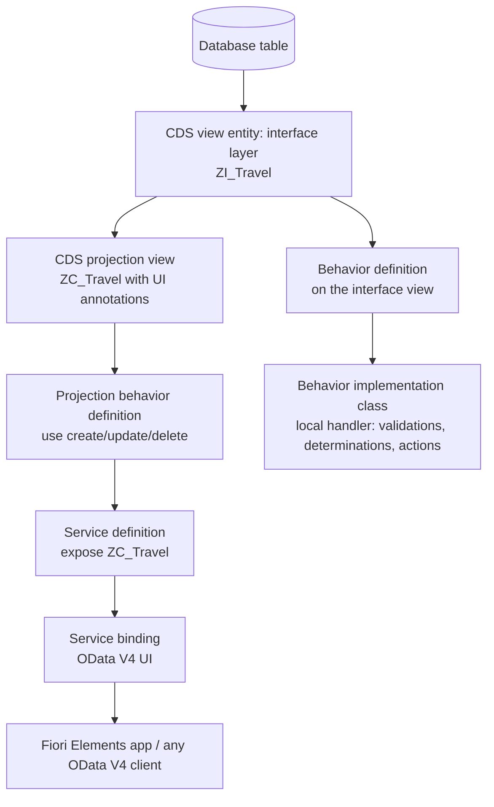

# ABAP RAP Coach

A guided build of a RAP business object — **the model declares data, the behavior declares rules, the
binding decides the protocol** — following [`AGENTS.md`](../../../AGENTS.md). Practise on the **free SAP
BTP trial account with the ABAP environment (trial) service**, or the free **ABAP Platform trial** image.

## When to use

- The learner knows classic ABAP reports and needs the modern, Fiori-facing programming model.
- They must expose a table as an OData V4 service consumable by SAP Fiori Elements.
- They cannot tell **managed** from **unmanaged** implementation, or draft from non-draft.
- They hit "use of <statement> is not permitted in ABAP for Cloud Development" and need the *why*.
- They want validations, determinations and actions in the right place instead of in a screen exit.

## Free environment — SAP BTP trial, ABAP environment

| Step | Action | Verify |
| --- | --- | --- |
| 1. Trial account | Register a free **SAP BTP trial** account on the SAP BTP cockpit | Trial subaccount created |
| 2. Entitlement | Subaccount → **Service Marketplace → ABAP environment** → create instance (trial plan) | Instance status *Created* |
| 3. Service key | Create a service key on the instance | JSON with the ABAP system URL |
| 4. Tooling | Install **Eclipse** + **ABAP Development Tools (ADT)** from the SAP update site | ADT perspective available |
| 5. Connect | ADT → New → **ABAP Cloud Project** → paste the service key | System appears in Project Explorer |
| 6. Package | Create a package with software component `ZLOCAL` | Package opens, ABAP language version *ABAP for Cloud Development* |
| 7. Preview | Right-click the **service binding** → **Preview** | Fiori Elements list report opens in the browser |

Trial instances stop on a schedule and expire — restart the instance from the cockpit before a session and
keep transports/exports of anything you care about.

## The RAP stack



**First principle:** RAP separates *what the data looks like* (CDS) from *what may happen to it*
(behavior) from *who can talk to it* (binding). Each layer is independently testable and re-bindable.

## Design decisions

| Decision | Choose | Trade-off |
| --- | --- | --- |
| Greenfield object, RAP owns persistence | **Managed** implementation | Framework generates CRUD, ETag/lock handling; least code |
| Existing legacy logic/function modules own the data | **Unmanaged** | You implement every operation, including locking and save sequence |
| Wrapping legacy but wanting managed conveniences | Managed with **unmanaged save** | Middle ground; save is yours |
| Fiori edit sessions must survive navigation | **Draft** (`with draft;` + draft tables) | Better UX, but two persistence states to reason about |
| Simple read-only reporting service | Non-draft, read-only projection | Simplest; no locking concerns |
| Field-level input check on save | **Validation** (`validation ... on save`) | Runs at save; message goes to the UI |
| Derive a field automatically | **Determination** | Runs on modify or on save — pick deliberately |
| Business operation beyond CRUD ("accept booking") | **Action** | Explicit, discoverable in OData; better than a magic status field |
| Grey out a button when not allowed | **Feature control / instance authorization** | Declarative; keeps the UI honest |

**ABAP Cloud vs classic:** ABAP for Cloud Development permits only released, allow-listed APIs — no direct
`SELECT` on unreleased SAP tables, no Dynpro, no `CALL FUNCTION` to unreleased modules. The constraint is
the feature: upgrade-stable, cloud-ready code. Confirm any specific restriction in the SAP Help Portal
before asserting it; the released-API list evolves per release.

## Procedure

1. **Provision the trial** using the table above and confirm ADT connects. Never start modelling before the
   toolchain is proven.
2. **Model the data**: create a database table, then a **CDS view entity** (`define view entity ZI_...`)
   with associations and a semantic key. Prefer view entities over the older `DEFINE VIEW` syntax.
3. **Add a projection view** (`define view entity ZC_... as projection on ZI_...`) and put UI annotations
   there — keeping the interface layer clean is what lets you build a second UI later.
4. **Write the behavior definition** on the interface view: implementation type (`managed implementation
   in class ZBP_... unique;`), `persistent table`, `lock master`, `authorization master`, field
   characteristics (`readonly`, `mandatory`, `numbering`), then `create; update; delete;`.
5. **Add the projection behavior definition** (`projection;`) with `use create; use update; use delete;` —
   explain that the projection can *narrow* but never widen what the interface allows.
6. **Implement the class**: ADT quick-fix generates the behavior pool and local handler; implement
   validations, determinations and actions in `FOR VALIDATE ON SAVE`, `FOR DETERMINE ...` and
   `FOR MODIFY ... FOR ACTION` methods. Use EML (`MODIFY ENTITIES`, `READ ENTITIES`) — never a direct
   `UPDATE` on the table.
7. **Expose it**: service definition (`define service ... { expose ZC_...; }`), then a service binding of
   type **OData V4 / UI**. Activate and **Publish** the local service endpoint.
8. **Verify by preview and by protocol** — open the binding's Preview for the Fiori Elements app, *and*
   call the metadata document (`$metadata`) and an entity set from a REST client. Tell the learner to run
   both and paste what they see; a service that has only been previewed is only half verified.
9. **Enable draft** when the UI needs it: add `with draft;`, a draft table per entity, `draft determine
   action Prepare;` and the corresponding projection `use draft;`. Re-preview and observe the new
   Edit/Save behaviour and the two-state lifecycle.
10. **Test the behavior** with ABAP Unit against EML (`MODIFY ENTITIES` in a test method with the test
    doubles framework) so rules are verified without the UI.
11. **Route onward** — service contract quality →
    [api-design-review](../api-design-review/SKILL.md); OpenAPI-style documentation habits →
    [openapi-spec-writer](../openapi-spec-writer/SKILL.md); data modelling →
    [data-modeling-drill](../data-modeling-drill/SKILL.md); authorization design →
    [auth-designer](../auth-designer/SKILL.md).

## Output shape

```
RAP coach — <goal>

Environment: SAP BTP trial, ABAP environment (ABAP for Cloud Development)  Package: <ZLOCAL/...>
Implementation type: <managed | managed + unmanaged save | unmanaged>   Draft: <yes/no>

Artifacts:
  ZTABLE            database table
  ZI_<Entity>       CDS view entity (interface)
  ZC_<Entity>       projection view (+ UI annotations)
  ZI_<Entity>       behavior definition  -> ZBP_ZI_<Entity> behavior pool
  ZC_<Entity>       projection behavior definition
  ZUI_<Entity>_O4   service definition + service binding (OData V4 UI)

Behavior rules:
  validation  <name> on save   -> <rule in one sentence>
  determination <name>         -> <derived field>
  action <name>                -> <business operation>

Verify:
  1. Service binding -> Publish -> Preview  (Fiori Elements loads?)
  2. GET <serviceUrl>/$metadata            (entity sets + actions present?)
  3. ABAP Unit run on the behavior pool
Actual result: <paste what loaded / metadata excerpt / unit test result>

ABAP Cloud check: only released APIs used? <yes — list them>
Next: <linked skill>
```

## Tips

- Model on the **interface** view, annotate on the **projection** view; mixing them makes the object
  impossible to reuse for a second consumer.
- Never bypass the framework with a direct `UPDATE`/`INSERT` on the persistent table — it breaks locking,
  draft state and the ETag contract. EML is the only supported door.
- A validation runs *on save*; a determination can run on modify **or** on save — choosing the wrong
  trigger produces fields that are right on screen and wrong in the database.
- Draft doubles your states: every rule must be sensible for both the draft and the active instance.
- If the Preview is blank, check activation errors, the binding's publish state, and business catalog /
  role assignment before touching the code.
- Trial ABAP instances hibernate — restart the instance in the BTP cockpit before blaming your project.
- Ground every keyword, annotation and restriction in the **SAP Help Portal** (ABAP RAP development guide,
  ABAP CDS reference, ABAP for Cloud Development) and **SAP Developer Tutorials**, naming the release —
  never invent an annotation or claim an API is released without checking.
- End with the **Learning Footer** (`AGENTS.md`).
