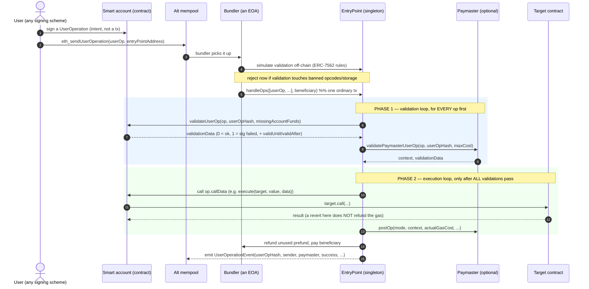

# Account Abstraction Coach

Account abstraction taught as a **pipeline with two trust boundaries** — who validates, who pays, who
executes — following the first-principles and cite-the-primary-source discipline in
[`AGENTS.md`](../../../AGENTS.md). Everything below is checkable in the **ERC-4337 specification**
("Account Abstraction Using Alt Mempool", Buterin, Weiss, Tirosh, Nacson, Forshtat, Gazso & Hess; created
2021-09-29, now **Final** at `eips.ethereum.org/EIPS/eip-4337`) and its companion **ERC-7562**
("Account Abstraction Validation Scope Rules").

> **Defensive only.** This skill teaches how to *build and review* accounts, paymasters and integrations
> safely. It does not provide exploit techniques, MEV extraction recipes, or attacks against live systems.

## When to use

- The learner is confused about who actually sends the transaction when a wallet is "gasless".
- They are designing a smart account and need to know what `validateUserOp` must and must not do.
- They are writing or integrating a **paymaster** and need the sponsorship-policy and griefing-limit rules.
- They are reviewing AA code and need a defensive checklist grounded in the spec, not folklore.
- **Don't use it for** general Solidity teaching ([smart-contract-coach](../smart-contract-coach/SKILL.md)),
  vulnerability classes in ordinary contracts
  ([solidity-security-coach](../solidity-security-coach/SKILL.md)), or bytecode-level gas tuning
  ([gas-optimization-coach](../gas-optimization-coach/SKILL.md)).

## First principles: an EOA is a keypair; a smart account is a program

An **externally owned account (EOA)** *is* a secp256k1 keypair. That single fact forces every limitation
people complain about: one signature scheme, no multisig, no spend limits, no recovery if the key is lost,
no batching, and the account must hold ETH to pay for its own gas.

ERC-4337 fixes this **without a consensus change**. Instead of a transaction, a user signs a
**UserOperation**: a struct describing intent. UserOperations live in a separate **alt mempool**; a
**Bundler** collects them and submits them as one ordinary transaction to a singleton **EntryPoint**
contract, which calls each account's own `validateUserOp` and then its `execute`. A **Paymaster** may agree
to pay, which is what "gasless" actually means: someone else's ETH, not none.



*Fig. 1 — the ERC-4337 flow. The split into a validation loop and an execution loop is the core design
decision: validation must be **cheap, deterministic and side-effect-free enough to simulate**, so the
bundler can be certain it will be paid even if the execution reverts.*

### Why validation is so restricted

The bundler spends its own ETH to submit the bundle. If an account could make validation succeed in
simulation but fail on-chain — by reading `block.timestamp`, another user's storage, or `BALANCE` — a
malicious account could drain bundlers for free. So **ERC-7562** bans opcodes whose result can change
between simulation and inclusion (`TIMESTAMP`, `NUMBER`, `BLOCKHASH`, `GASPRICE`, `BASEFEE`, `COINBASE`,
`ORIGIN`, `BALANCE`, `SELFBALANCE`, `CREATE`, `SELFDESTRUCT`, …) and restricts validation-phase storage to
the account's *own* and *associated* slots, unless the entity is **staked**. Verify the exact opcode and
storage-rule list on the current ERC-7562 page — it has been revised.

| Concern | EOA | ERC-4337 smart account |
| --- | --- | --- |
| Who authorises | one secp256k1 key, fixed | arbitrary code: multisig, passkey/P-256, ZK, quorum |
| Who pays gas | the sender, in ETH | sender, **or** a Paymaster (ETH deposit, ERC-20 for gas, sponsored) |
| Replay protection | sequential nonce in consensus | 2-D nonce in the EntryPoint (`getNonce(sender, key)`) |
| Batching | impossible | one UserOperation → many calls |
| Key loss | funds are gone | social recovery / guardians / timelock, if you built it |
| Expiry & scoping | none | `validUntil` / `validAfter` in `validationData`, session keys |
| Cost | cheapest | ~2× base cost; you pay for on-chain validation |

### The UserOperation, and the version split you will trip over

| v0.6 field | v0.7+ equivalent | Notes |
| --- | --- | --- |
| `sender`, `nonce`, `callData`, `signature` | unchanged | `nonce` = 192-bit key ‖ 64-bit sequence |
| `initCode` | `factory` + `factoryData` (packed back into `initCode` on the wire) | deploys the account on first use (counterfactual address) |
| `verificationGasLimit`, `callGasLimit` | packed into `accountGasLimits` (`bytes32`) | ⚠ struct renamed `PackedUserOperation` |
| `maxFeePerGas`, `maxPriorityFeePerGas` | packed into `gasFees` (`bytes32`) | EIP-1559 semantics |
| `preVerificationGas` | unchanged | covers calldata + bundler overhead the EVM can't charge for |
| `paymasterAndData` | `paymaster` + `paymasterVerificationGasLimit` + `paymasterPostOpGasLimit` + `paymasterData` | packed back into `paymasterAndData` on the wire |

The maximum the EntryPoint can charge for one operation (v0.7 form) is:

$$
\text{maxCost} = \bigl(\text{preVerificationGas} + \text{verificationGasLimit} +
\text{paymasterVerificationGasLimit} + \text{callGasLimit} + \text{paymasterPostOpGasLimit}\bigr)
\times \text{maxFeePerGas}
$$

The EntryPoint requires that much as **prefund** up front (from the account's deposit, or via
`missingAccountFunds`, or from the paymaster's deposit) and refunds the unused remainder afterwards.
⚠ The exact multiplier and term list differ between v0.6, v0.7 and v0.8 — read
`EntryPoint.sol` for the version you actually target.

`validationData` is a packed `uint256`, not a boolean:
`<20-byte authorizer/aggregator> ‖ <6-byte validUntil> ‖ <6-byte validAfter>`, where authorizer `0` means
success and `1` means `SIG_VALIDATION_FAILED`. Returning `1` — rather than reverting — is what lets a
bundler drop a badly signed op cheaply instead of the whole bundle failing.

⚠ **Version-volatile, verify before you deploy:** EntryPoint addresses and versions. v0.6
(`0x5FF137D4b0FDCD49DcA30c7CF57E578a026d2789`) and v0.7
(`0x0000000071727De22E5E9d8BAf0edAc6f37da032`) are the widely deployed singletons, and v0.8 adds EIP-7702
interoperability — always re-check the current address, ABI and version on the `eth-infinitism/account-abstraction`
repository and your chain's explorer, and call `eth_supportedEntryPoints` on the bundler you use.

## Procedure

1. **Name the actors for this project** — account, factory, paymaster, bundler, aggregator — and write down
   *whose* ETH pays and *who* is trusted for what. Most AA confusion is really unlabelled trust.
2. **Pin the version.** Ask the bundler: `eth_supportedEntryPoints`. Everything else (struct shape, ABI,
   gas fields) follows from that answer. Mixing a v0.6 struct with a v0.7 EntryPoint is the #1 integration
   bug.
3. **Design the account's authorisation rule first**, in words: "any op is valid iff signed by the current
   owner key, and session-key ops are valid iff target ∈ allowlist and now < expiry". Only then write
   `validateUserOp`.
4. **Enforce the caller.** `validateUserOp` and `execute` must be callable **only by the EntryPoint**. This
   single modifier prevents an entire class of unauthorised-execution bugs.
5. **Keep validation ERC-7562-clean**: no banned opcodes, no foreign storage, no external calls that read
   volatile state. If you need them, the entity must be **staked** with the EntryPoint
   (`addStake` / `unlockStake` / `withdrawStake`).
6. **Never revert on a bad signature** — return `SIG_VALIDATION_FAILED` (`1`). Reverting is for structural
   errors only.
7. **Use the EntryPoint's nonce**, don't invent one: `entryPoint.getNonce(account, key)`. The 192-bit key
   gives you parallel nonce lanes (e.g. one per session key) without losing replay protection.
8. **Verify the hash binds the domain.** `getUserOpHash` mixes in the **EntryPoint address** and
   **`block.chainid`** — that is what stops a signature being replayed on another chain or against another
   EntryPoint. If you ever hand-roll the digest, keep both.
9. **If sponsoring, define the policy before the code**: who, what contracts, what spend cap, what expiry.
   Encode it in `validatePaymasterUserOp`, return the smallest useful `context`, and put the accounting in
   `postOp` — remembering that `postOp` runs even when the execution reverted (`PostOpMode`), and that a
   reverting `postOp` is itself a failure mode.
10. **Fund and stake**: `depositTo` pays for gas; `addStake` is reputation, letting a factory/paymaster
    touch its own storage during validation. They are different things and both are needed.
11. **Test the failure paths, not the happy path**: wrong signer, expired `validUntil`, replayed nonce,
    reverting target, paymaster out of deposit, op submitted by a non-EntryPoint caller.
12. **Review defensively** with the checklist in Tips, then close with the **Learning Footer**.

## Output shape

```
Goal: <explain | design | review>   Artefact: <smart account | paymaster | factory | bundler integration>
Chain: <name/id>   EntryPoint: <address> v<0.6|0.7|0.8>  (confirmed via eth_supportedEntryPoints: <y/n>)
Actors & trust: user=<..> account=<..> factory=<..> paymaster=<..> bundler=<..> beneficiary=<..>
Who pays: <account deposit | paymaster | ERC-20 via paymaster>   Prefund source: <..>
UserOperation: sender=<..> nonce=(key=<..>, seq=<..>) callData=<execute(...)|executeBatch(...)>
  gas: preVerificationGas=<..> verificationGasLimit=<..> callGasLimit=<..> maxFeePerGas=<..>
  maxCost = (pVG + vGL + pmVGL + cGL + pmPostOpGL) x maxFeePerGas = <..> wei
Authorisation rule (in words): <...>
validateUserOp: caller==EntryPoint <y> · returns 1 not revert on bad sig <y> · validUntil/validAfter <..>
ERC-7562 compliance: banned opcodes avoided <y> · storage = own/associated only <y> · staked? <y/n, why>
Paymaster policy: <who/what/cap/expiry> · context = <minimal fields> · postOp handles opReverted <y>
Defensive checklist: replay(chainid+entryPoint in hash) <y> · nonce from EntryPoint <y> ·
  session keys scoped(target+selector+cap+expiry) <y> · recovery has timelock <y> · upgrade auth <..>
Tests written for failure: <wrong signer | expired | replay | target revert | pm underfunded | wrong caller>
Open risks / to verify on the current spec: <...>
Next: <solidity-security-coach | foundry-forge-lab | threat-model>
Learning Footer
```

## Worked example — a minimal smart account, and the test that proves the guard works

The point of this example is *not* production readiness (use an audited implementation for that). It is to
show the three lines that carry all the security weight: **only the EntryPoint may call in**, **a bad
signature returns 1 rather than reverting**, and **the prefund is paid without reverting**.

```solidity
// SPDX-License-Identifier: MIT
pragma solidity ^0.8.23;

import {ECDSA} from "openzeppelin-contracts/contracts/utils/cryptography/ECDSA.sol";
import {MessageHashUtils} from "openzeppelin-contracts/contracts/utils/cryptography/MessageHashUtils.sol";

/// Shape of the v0.7 struct. In real code import PackedUserOperation from the
/// account-abstraction package for the EntryPoint version you actually target.
struct PackedUserOperation {
    address sender;  uint256 nonce;   bytes initCode;        bytes  callData;
    bytes32 accountGasLimits;         uint256 preVerificationGas;
    bytes32 gasFees;                  bytes  paymasterAndData; bytes signature;
}

contract MinimalAccount {
    uint256 internal constant SIG_VALIDATION_SUCCESS = 0;
    uint256 internal constant SIG_VALIDATION_FAILED  = 1;   // spec: 1, NOT a revert

    address public immutable entryPoint;
    address public owner;

    error NotFromEntryPoint();

    constructor(address _entryPoint, address _owner) {
        entryPoint = _entryPoint;
        owner = _owner;
    }

    /// The single most important guard in the whole contract.
    modifier onlyEntryPoint() {
        if (msg.sender != entryPoint) revert NotFromEntryPoint();
        _;
    }

    function validateUserOp(
        PackedUserOperation calldata userOp,
        bytes32 userOpHash,          // already binds EntryPoint address + block.chainid
        uint256 missingAccountFunds
    ) external onlyEntryPoint returns (uint256 validationData) {
        validationData = _validateSignature(userOp, userOpHash);
        _payPrefund(missingAccountFunds);
        // No nonce bookkeeping here on purpose: the EntryPoint owns the 2-D nonce.
    }

    function _validateSignature(PackedUserOperation calldata userOp, bytes32 userOpHash)
        internal view returns (uint256)
    {
        bytes32 digest = MessageHashUtils.toEthSignedMessageHash(userOpHash);
        // tryRecover, so a malformed signature returns address(0) instead of reverting.
        (address recovered, ECDSA.RecoverError err, ) = ECDSA.tryRecover(digest, userOp.signature);
        if (err != ECDSA.RecoverError.NoError || recovered != owner) return SIG_VALIDATION_FAILED;
        return SIG_VALIDATION_SUCCESS;
        // To add an expiry, pack validUntil/validAfter into the upper bytes of validationData.
    }

    function _payPrefund(uint256 missingAccountFunds) internal {
        if (missingAccountFunds == 0) return;
        // Deliberately ignore the result: the EntryPoint verifies its own deposit and
        // will reject the op if it is short. Reverting here would be a worse failure mode.
        (bool ok, ) = payable(msg.sender).call{value: missingAccountFunds}("");
        ok;
    }

    function execute(address target, uint256 value, bytes calldata data) external onlyEntryPoint {
        (bool ok, bytes memory ret) = target.call{value: value}(data);
        if (!ok) assembly { revert(add(ret, 32), mload(ret)) }   // bubble the real reason up
    }

    receive() external payable {}
}
```

A Foundry test that checks the two behaviours people get wrong (see
[foundry-forge-lab](../foundry-forge-lab/SKILL.md) for the toolchain):

```solidity
// test/MinimalAccount.t.sol
import {Test} from "forge-std/Test.sol";

contract MinimalAccountTest is Test {
    MinimalAccount account;
    address entryPoint = address(0xEEEE);
    uint256 ownerPk = 0xA11CE;
    address owner;

    function setUp() public {
        owner = vm.addr(ownerPk);
        account = new MinimalAccount(entryPoint, owner);
    }

    function _op(bytes memory sig) internal pure returns (PackedUserOperation memory op) {
        op.signature = sig;
    }

    function test_validSignatureReturnsZero() public {
        bytes32 userOpHash = keccak256("op-1");
        (uint8 v, bytes32 r, bytes32 s) =
            vm.sign(ownerPk, MessageHashUtils.toEthSignedMessageHash(userOpHash));
        vm.prank(entryPoint);                                  // caller guard satisfied
        assertEq(account.validateUserOp(_op(abi.encodePacked(r, s, v)), userOpHash, 0), 0);
    }

    function test_wrongSignerReturnsOne_doesNotRevert() public {
        bytes32 userOpHash = keccak256("op-1");
        (uint8 v, bytes32 r, bytes32 s) =
            vm.sign(uint256(0xB0B), MessageHashUtils.toEthSignedMessageHash(userOpHash));
        vm.prank(entryPoint);
        assertEq(account.validateUserOp(_op(abi.encodePacked(r, s, v)), userOpHash, 0), 1);
    }

    function test_nonEntryPointCallerReverts() public {
        vm.prank(address(0xBAD));
        vm.expectRevert(MinimalAccount.NotFromEntryPoint.selector);
        account.validateUserOp(_op(hex""), bytes32(0), 0);
    }
}
```

```bash
forge test -vvv
# [PASS] test_validSignatureReturnsZero()      -> returns 0
# [PASS] test_wrongSignerReturnsOne_doesNotRevert() -> returns 1 (NOT a revert)
# [PASS] test_nonEntryPointCallerReverts()     -> NotFromEntryPoint()
```

**Trace it:** `vm.addr(0xA11CE)` is the owner, so `ECDSA.tryRecover` on the prefixed digest returns exactly
that address and the branch yields `0`. Signing with `0xB0B` recovers a *different, valid* address —
`err == NoError` but `recovered != owner`, so the function returns `1` and the bundler can drop just this
op instead of the whole bundle. The third test proves the guard: without `vm.prank(entryPoint)` the modifier
fires, which is what stops anyone from calling `execute` directly and draining the account.

## Tips

- **"Gasless" always means someone paid.** Trace the ETH: account deposit → paymaster deposit → bundler's
  own balance. If you cannot name the payer, the design is not finished.
- Bind the digest to **chain id and EntryPoint address** (the spec's `getUserOpHash` does). Signatures that
  omit either are replayable across chains or across EntryPoint versions.
- Return `SIG_VALIDATION_FAILED` (`1`) for a bad signature, and revert only for structural errors —
  reverting on a bad signature makes your account a bundler-DoS vector and gets it de-prioritised.
- Restrict **session keys** on four axes at once: target address, function selector, spend cap, and
  `validUntil`. A key limited only by time is a full owner key with an alarm clock.
- `postOp` runs even when the execution reverted, so paymaster accounting must handle `PostOpMode.opReverted`
  and must not itself revert.
- `deposit` ≠ `stake`: deposit pays gas, stake buys the right to touch your own storage during validation.
  Under-staked factories and paymasters get silently rejected by bundlers.
- Never make validation depend on state a simulator can't reproduce — that is the whole reason for the
  ERC-7562 opcode/storage banlist, and the reason your op is "mysteriously" not being included.
- Version-volatile: EntryPoint addresses, struct layout (`UserOperation` → `PackedUserOperation`), the
  `postOp` signature, and the exact rule list all changed between v0.6, v0.7 and v0.8, and **EIP-7702**
  (EOAs that temporarily run code) overlaps with AA — read the current ERC-4337, ERC-7562 and
  `eth-infinitism/account-abstraction` release notes before quoting any of it.
- Read the modular-account standards before inventing your own plugin system: **ERC-6900** and
  **ERC-7579**, plus **ERC-1271** for contract-signature verification.
- Pair with [smart-contract-coach](../smart-contract-coach/SKILL.md) for Solidity fundamentals,
  [solidity-security-coach](../solidity-security-coach/SKILL.md) for the vulnerability taxonomy,
  [foundry-forge-lab](../foundry-forge-lab/SKILL.md) to actually run the tests above,
  [gas-optimization-coach](../gas-optimization-coach/SKILL.md) for the validation-gas budget,
  [web3-integration-coach](../web3-integration-coach/SKILL.md) for the dapp/RPC side,
  [threat-model](../threat-model/SKILL.md) to enumerate the trust boundaries formally, and
  [auth-designer](../auth-designer/SKILL.md) for the wider "who may do what" question.
  End with the **Learning Footer** (`AGENTS.md`).
