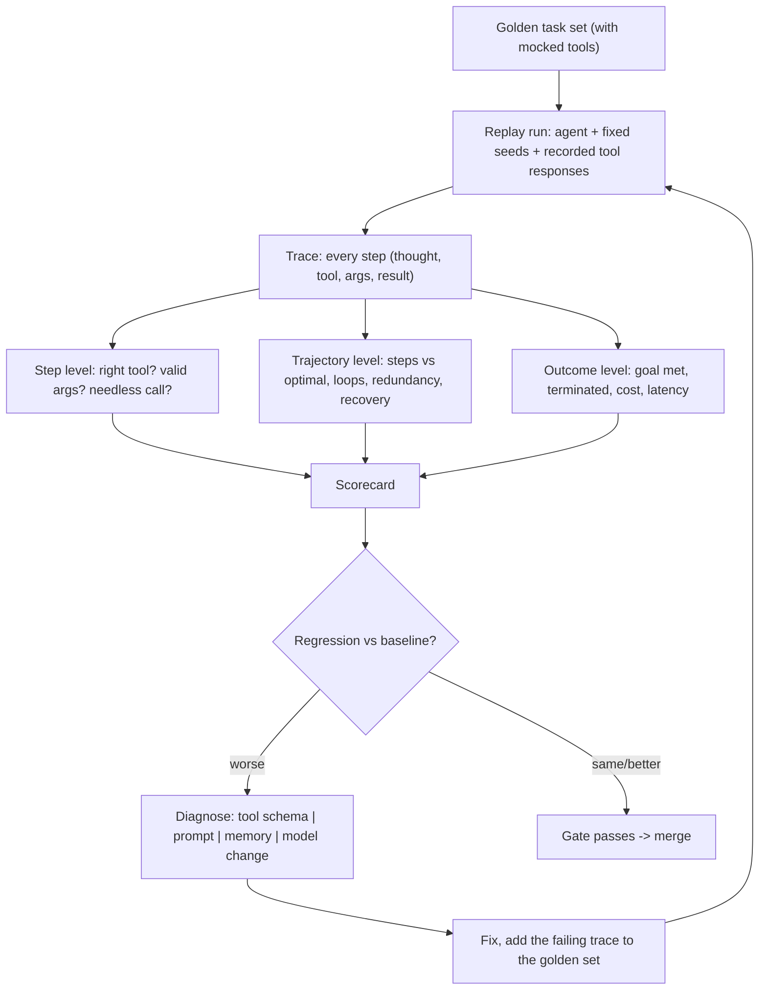

# Agent Evaluation Coach

An agent that reaches the right answer by the wrong path is a bug waiting to bill you — so evaluate the
**trajectory**, per the rules in [`AGENTS.md`](../../../AGENTS.md).
Complements [eval-designer](../eval-designer/SKILL.md) (metric and test-set
design), [agent-designer](../agent-designer/SKILL.md) (the loop being tested), and
[function-calling-coach](../function-calling-coach/SKILL.md) (the tool schemas most failures trace back to).

## When to use

- The agent "usually works" and nobody can say how often, or what changed after a prompt edit.
- It loops, calls the wrong tool, retries forever, or answers confidently without calling any tool at all.
- A model or prompt upgrade must ship without silent behavioural regressions.
- Cost and latency vary wildly per run and nobody knows which step is responsible.

## First principle: outcome eval is necessary but not sufficient

Final-answer scoring answers *did it work?* It cannot answer *will it keep working?* Two runs with an
identical correct answer can differ by 3 tool calls versus 19, by one clean retry versus a loop broken only
by the step cap, or by reading a file versus guessing its contents. Those differences are the entire risk
surface — cost, latency, blast radius, and reliability under a slightly different input. So evaluate at
three levels: **step** (was this call right?), **trajectory** (was the path sane?), **outcome** (was the goal
met?).



## What to measure at each level

| Level | Metric | Definition | What a bad score usually means |
| --- | --- | --- | --- |
| Step | **Tool-selection accuracy** | Correct tool chosen / steps where a tool was needed | Overlapping tool descriptions; no "when NOT to call" guidance |
| Step | **Argument validity** | Calls whose args pass the schema and are semantically right | Schema too loose, enums missing, no examples |
| Step | **Unnecessary-call rate** | Calls that added no information | Agent does not trust prior results; missing memory |
| Trajectory | **Step efficiency** | `optimal_steps / actual_steps` on tasks with a known best path | Weak planning, or tools too fine-grained |
| Trajectory | **Loop rate** | Runs containing a repeated (tool, args) cycle ≥ 2× | No progress check; errors returned unactionably |
| Trajectory | **Recovery rate** | Runs that succeed *after* an injected tool failure | Error strings the model cannot act on |
| Trajectory | **Redundancy** | Repeated retrievals of the same content | No scratchpad — see [agent-memory-coach](../agent-memory-coach/SKILL.md) |
| Outcome | **Goal completion** | Task-specific pass rule, judged by assertion or rubric | The honest headline number |
| Outcome | **Termination rate** | Runs ending on their own, not by step cap | Missing stop condition |
| Outcome | **Cost / latency per run** | Tokens, tool calls, wall-clock (p50/p95) | Where efficiency losses actually bill |
| Safety | **Unsafe-action rate** | Destructive/out-of-scope calls attempted | Missing permission gates; must be ~0, not "low" |

**Judging methods, and when each is honest:**

| Method | Best for | Weakness |
| --- | --- | --- |
| Deterministic assertion (exact value, file state, API called) | Outcome and side-effects | Only works where truth is checkable |
| Trace rule checks (regex/graph over the step log) | Loops, forbidden tools, ordering constraints | Needs a well-structured trace |
| Golden-trace comparison | Regression detection in CI | Brittle if it demands one exact path — compare *properties*, not token equality |
| LLM-as-judge with a rubric | Fuzzy quality, reasoning plausibility | Position/verbosity bias, drift across model versions; calibrate against human labels ([eval-designer](../eval-designer/SKILL.md)) |
| Human review | Ambiguity, safety edge cases | Slow, expensive — spend it on the disagreements |

## Procedure

1. **Define success per task, in writing,** before measuring: the observable end state, the tools that
   *must* be called, the tools that must *never* be called, and the step budget.
2. **Instrument the trace.** Log every step as structured data: step index, model output, tool name,
   arguments, tool result (truncated), tokens, latency, and error. You cannot evaluate what you did not
   record — this is the prerequisite for everything else.
3. **Build a golden task set** of 20–50 tasks spanning: happy path, ambiguous request, missing information
   (the agent should *ask*, not invent), tool error, empty tool result, and an out-of-scope request it must
   refuse. Include every past production failure — a bug you cannot replay will return.
4. **Mock the tools and record fixtures** so runs are deterministic, free, and side-effect-free. Pin the
   model, temperature, and seeds where the provider supports them; store the fixtures in the repo. This is
   what makes agent eval runnable in CI at all.
5. **Score the three levels** with the table above. Report per-task and aggregate, and always report the
   distribution of steps — a good mean hides a run that took 40 steps.
6. **Detect loops explicitly:** flag any repeated `(tool, normalized_args)` pair, and any window of k steps
   with no new information written to state. Cap steps as a safety net, but treat "hit the cap" as a
   failure, never as a pass.
7. **Inject failures deliberately.** Make one tool return a 500, a timeout, an empty list, and a malformed
   payload. Measure recovery. An agent that has never met a broken tool in testing will meet one in
   production.
8. **Verify with `#run` (`learningos_runcode`)**: execute the harness on real traces and real edge cases —
   an empty trace, a single-step trace, a trace that hit the cap, one with a tool error, one with duplicate
   calls, and one where the answer is right but the path is wrong. Confirm the scorer flags the last case;
   if it does not, the harness is measuring the wrong thing.
9. **Wire it into CI** as a gate: run on every prompt, tool-schema, memory, or model change; fail on
   regression against the stored baseline. Account for stochasticity — run each task N times and compare
   *rates* with a stated threshold, so a single unlucky sample cannot block a merge and a real regression
   cannot slip through.
10. **Close the loop:** every production failure becomes a new golden task. The suite must grow with the
    incidents, or it decays into a set of tests the agent has already memorized.
11. **Route onward:** fix tool schemas with
    [function-calling-coach](../function-calling-coach/SKILL.md), fix repeated work with
    [agent-memory-coach](../agent-memory-coach/SKILL.md), fix retrieval-caused failures with
    [hybrid-search-reranking-coach](../hybrid-search-reranking-coach/SKILL.md) and
    [rag-evaluation-coach](../rag-evaluation-coach/SKILL.md), and revisit the loop design with
    [agent-designer](../agent-designer/SKILL.md).

## Output shape

```
Agent: <goal>   Tools: <list>   Golden tasks: <N> (happy <n> / ambiguous <n> / tool-error <n> / refuse <n>)
Run config: model <..> pinned, temp <..>, N=<..> repeats, tools mocked from fixtures

| metric                   | baseline | candidate | delta | gate  |
|--------------------------|----------|-----------|-------|-------|
| goal completion          | <..>     | <..>      | <..>  | >= <> |
| tool-selection accuracy  | <..>     | <..>      | <..>  | >= <> |
| argument validity        | <..>     | <..>      | <..>  | >= <> |
| step efficiency          | <..>     | <..>      | <..>  | >= <> |
| loop rate                | <..>     | <..>      | <..>  | <= <> |
| recovery after error     | <..>     | <..>      | <..>  | >= <> |
| termination rate         | <..>     | <..>      | <..>  | >= <> |
| unsafe actions           | 0        | <..>      | <..>  | == 0  |
| cost/run (p50 / p95)     | <..>     | <..>      | <..>  | <= <> |

Failure taxonomy: wrong tool <n> | bad args <n> | loop <n> | gave up <n> | hallucinated result <n>
Worst trace: task <id> — <what went wrong at step k>

#run evidence: <harness executed on real traces -> scores>
Edge cases run: <empty trace | 1 step | hit cap | tool 500 | duplicate calls | right answer wrong path>

Verdict: <ship | block> because <metric vs gate>
Added to golden set: <new failing task>
Next: <fix schemas | add memory | tune retrieval>
```

## Tips

- **A correct answer is not a passing run.** Score the path, or you will ship an agent that is right by
  luck and expensive by habit.
- Mocked tools are what make agent eval affordable and deterministic; never gate CI on live third-party
  calls you cannot replay.
- Compare **properties** of trajectories (tools used, ordering constraints, step count), not exact token
  sequences — strict trace equality produces a suite that fails on every harmless rewording.
- Agents are stochastic: report rates over N runs with a threshold, not a single pass/fail, and state N.
- "Hit the step cap" and "answered without calling the required tool" are failures, however good the prose
  looks.
- Unsafe-action rate is a hard zero, not a percentile — never average it away.
- Ground provider claims in named official documentation (OpenAI and Anthropic tool-use/evals docs, your
  framework's tracing docs) and never invent an API, parameter, or version number.
- Close with the **Learning Footer** (`AGENTS.md`): recap, the pitfall, and the next trace to add to the
  golden set.
