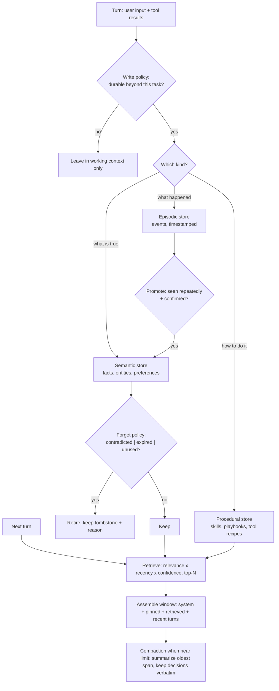

# Agent Memory Coach

Memory is a **policy**, not a database — following the teaching and source-discipline rules in
[`AGENTS.md`](../../../AGENTS.md). Most "my agent forgot" bugs are really write-policy bugs, and most
"my agent is confidently wrong" bugs are really forget-policy bugs. Pairs with
[agent-designer](../agent-designer/SKILL.md) and [rag-designer](../rag-designer/SKILL.md).

## When to use

- The agent repeats questions it already asked, or loses decisions made twenty turns ago.
- Conversations overflow the context window and naive truncation drops the important part.
- The agent keeps acting on a fact that used to be true (a stale preference, a closed ticket, an old path).
- Multiple sub-agents share one blob of context and interfere with each other.
- The learner is about to reach for "just stuff everything into a vector DB" — the most common wrong turn.

## First principle: the context window is not memory

The context window is **working memory** — volatile, expensive, re-sent on every call, and quadratic-ish in
cost (see [transformer-architecture-explainer](../transformer-architecture-explainer/SKILL.md)). Real memory
is a *store outside the model* plus a *policy* that decides three things: what gets **written**, what gets
**retrieved** into the window, and what gets **forgotten**. If you skip the policy you get one of the two
classic failures: a window that overflows with trivia, or a store that grows into a landfill nobody can
retrieve from.



## Memory types and where they belong

| Type | Holds | Storage that fits | Retrieval trigger | Failure if you get it wrong |
| --- | --- | --- | --- | --- |
| **Working context** | Current task, recent turns, active tool output | The prompt itself | Always present | Overflow; important content lost mid-window |
| **Episodic** | "On 12 Mar the user rejected plan A because of cost" | Append-only log with timestamps + run id | Similarity to the current situation, recency-weighted | Agent repeats a rejected approach |
| **Semantic** | "The user's production DB is Postgres 16" | Key-value or vector store with entity keys | Entity or topic match | Stale facts asserted with confidence |
| **Procedural** | "To deploy: run X, then Y, verify Z" | Versioned documents / skill files | Task-type match | Agent re-derives a solved workflow every time |
| **Scratchpad / plan state** | Current TODO list, partial results | External file or task store, re-read each step | Every step of a long run | Long runs drift and lose the goal |
| **Pinned constraints** | Safety rules, hard user preferences | Always in the system prompt, never in retrieval | Always | Compaction silently deletes a safety rule |

**Compaction vs. truncation:** truncation deletes the oldest tokens and destroys decisions; compaction
*summarizes* the oldest span into a dense note, keeps decisions, commitments and open questions **verbatim**,
and records what was dropped. Never compact pinned constraints or unresolved obligations.

## Procedure

1. **Ask what must survive what.** Across turns? across sessions? across users? forever? Each answer implies
   a different store and a different retention rule. "Everything, forever" is never the right answer.
2. **Classify before you store.** Route each candidate memory to episodic / semantic / procedural using the
   table. Mixing them into one undifferentiated vector store is the root cause of most retrieval noise.
3. **Write a real write policy.** Write only what is *durable, reusable, and non-derivable*. A good default:
   decisions, stable user preferences, entity facts, tool recipes that worked, and failures worth not
   repeating. Never write secrets, and never write raw transcripts wholesale.
4. **Attach metadata at write time** — source, timestamp, confidence, run id, and TTL. A memory without
   provenance cannot be audited, contradicted, or expired.
5. **Define promotion.** An episodic observation becomes a semantic fact only after it recurs or is
   confirmed. This single rule prevents one throwaway remark from becoming permanent truth.
6. **Define forgetting explicitly** — the step almost everyone skips. Retire on: contradiction (new value
   supersedes old), expiry (TTL passed), and disuse (never retrieved in N sessions). Keep a tombstone with
   the reason so the agent can explain the change rather than silently flip-flop.
7. **Retrieve, do not dump.** Score by `relevance × recency × confidence`, take a small top-N, and place the
   most important item first — buried context is used less reliably (Liu et al., *Lost in the Middle*,
   arXiv:2307.03172, 2023-07-06). Reuse the retrieval machinery and quality discipline from
   [hybrid-search-reranking-coach](../hybrid-search-reranking-coach/SKILL.md).
8. **Isolate sub-agent context.** Give each sub-agent only the slice it needs and require it to return a
   *structured result*, not its whole transcript. This bounds token cost, prevents cross-task interference,
   and stops one poisoned worker from corrupting the shared store. Only the orchestrator writes to long-term
   memory.
9. **Threat-model the store.** Treat retrieved memory as **untrusted input**: content written during an
   earlier turn can carry injected instructions. Never let retrieved text be interpreted as system
   instructions, and gate memory writes that originate from tool or web content.
10. **Verify with `#run` (`learningos_runcode`)**: implement the write/promote/forget policy and the
    retrieval scorer as real code, and run it on real traces plus edge cases — a contradicting update, an
    expired TTL, an empty store, a memory retrieved by two different queries, a duplicate write, and a
    compaction that must preserve a pinned constraint. Assert the store's contents after each step rather
    than assuming.
11. **Evaluate memory as a component**: recall (needed memory retrieved?), precision (irrelevant memory kept
    out?), staleness (contradicted facts still served?), and token cost per turn. Hand the harness design to
    [eval-designer](../eval-designer/SKILL.md) and the trajectory view to
    [agent-evaluation-coach](../agent-evaluation-coach/SKILL.md).

## Output shape

```
Agent: <goal>   Must remember: <what> across <turns|sessions|users> for <duration>

Memory map:
  working    : <what stays in-window>          budget: <tokens>
  episodic   : <events> -> store <..>          TTL <..>
  semantic   : <facts> -> store <..>           TTL <..>
  procedural : <playbooks> -> store <..>       versioned
  pinned     : <constraints never compacted>

Write policy   : write when <durable AND reusable AND not derivable>; never write <secrets|raw transcripts>
Promote policy : episodic -> semantic after <N confirmations>
Forget policy  : contradicted | TTL expired | unused for <N> sessions -> retire + tombstone
Retrieval      : score = relevance x recency x confidence, top-<N>, most important first
Compaction     : at <threshold> summarize oldest span; keep decisions + open items verbatim
Sub-agents     : <slice given> -> returns <structured result>; only orchestrator writes

#run evidence: <policy code executed on real traces -> store state asserted>
Edge cases run: <contradiction | TTL expiry | empty store | duplicate write | compaction with pinned rule>

Eval: recall <..> | precision <..> | staleness <..> | tokens/turn <..>
Risks: memory poisoning via <path> -> mitigation <..>
Next: <agent-evaluation-coach | eval-designer | retrieval tuning>
```

## Tips

- **Forgetting is a feature.** A store that only grows becomes slower, noisier, and more confidently wrong;
  design the delete path on day one.
- Never write a memory without provenance and a timestamp — you cannot resolve a contradiction between two
  anonymous facts.
- Summarize, do not truncate; and never let compaction touch pinned safety constraints or unresolved
  commitments.
- Treat every retrieved memory as untrusted content, not as instructions — this is the memory-poisoning
  attack surface and it is easy to close early, painful to close late.
- Sub-agent isolation is a memory design decision, not just an architecture one: pass slices, return
  structured results, and keep transcripts out of the shared store.
- Measure token cost per turn as a first-class metric; memory that doubles context cost must earn it.
- Ground provider-specific claims in named official documentation (OpenAI, Anthropic, and your framework's
  memory APIs) and never invent an API, parameter, or version.
- Close with the **Learning Footer** (`AGENTS.md`): recap, the pitfall, and one policy to implement next.
