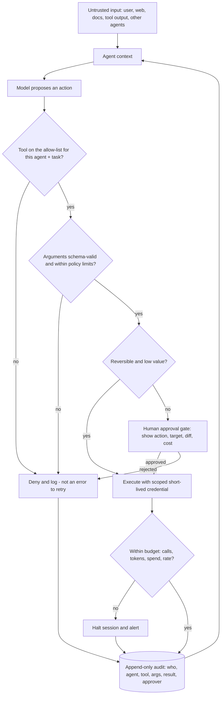

# AI Agent Permissions Coach

**Scope guardrail:** defensive only — this skill *constrains* what an agent can do in systems you own; it
will not produce prompt-injection payloads, jailbreaks, or guardrail-bypass techniques, and redirects such
requests to authorized red-teaming and coordinated disclosure. Follows
[`AGENTS.md`](../../../AGENTS.md); pairs with
[llm-guardrails-designer](../llm-guardrails-designer/SKILL.md) and
[threat-model](../threat-model/SKILL.md).

## When to use

- An agent has tools that can send email, spend money, merge code, or delete data, and the only thing between
  intent and action is a model's judgment.
- You are wiring MCP servers or plugins whose descriptions and outputs come from outside your trust boundary.
- A retrieval or browsing step brings untrusted text into the same context that decides on actions.
- Costs, token burn, or API calls are unbounded and one bad loop can be a denial-of-wallet event.

## First principles

The model is **not** a security boundary. Prompts persuade; permissions decide. OWASP's Top 10 for LLM
Applications (2025) names **Excessive Agency (LLM06)** — too much functionality, too many permissions, too
much autonomy — alongside **Prompt Injection (LLM01)** and **Unbounded Consumption (LLM10)**; the agentic-AI
guidance extends this to multi-agent chains, memory poisoning, and tool misuse.

Design assumption: **any text the agent reads may be adversarial** — a web page, a ticket, a PDF, a tool's
response, another agent's message, or an MCP server's tool description. So the question is never "will the
model be tricked?" but "**what is the worst thing that happens when it is?**" That worst case is the blast
radius, and it is the thing you engineer down.



## Action tiers → required control

| Tier | Examples | Credential | Gate | Reversibility |
| --- | --- | --- | --- | --- |
| **T0 read, internal** | search internal docs, read a ticket | Read-only, scoped to caller's own permissions | None | n/a |
| **T1 write, sandboxed** | draft a file, open a PR branch, comment | Scoped write to one repo/path, short TTL | Post-hoc review | Trivial |
| **T2 external effect** | send email, post to a channel, call a partner API | Per-tool identity, rate-limited, no broad scope | Approval or delayed send with undo | Hard |
| **T3 money / production** | payment, prod deploy, delete data, change IAM | Separate identity, per-action approval, MFA | **Human-in-the-loop, always** | None |
| **T4 self-modification** | edit its own prompt/tools/policies, add an MCP server | Not agent-accessible | Human change control | Catastrophic |

**Rule:** the agent inherits the *intersection* of the user's permissions and the task's needs — never the
union, and never a service account with more rights than the human who asked.

## Procedure

1. **Inventory the agency**: every tool, MCP server, plugin, API, data store, and memory the agent can reach —
   including transitive reach ("this tool can call that service"). Unknown reach is unbounded reach.
2. **Classify each tool into a tier** with the table, and record the worst realistic outcome of a single
   successful manipulation. That sentence is the blast-radius statement.
3. **Cut functionality first.** Remove tools the task does not need; prefer a narrow tool (`refund_order(id,
   amount<=X)`) over a general one (`run_sql`, `http_request`, `shell`). Excessive agency is usually an API
   design problem, not a prompting problem.
4. **Allow-list per agent *and* per task.** The allow-list is enforced in the orchestrator, outside the model;
   a denied call is a policy event to log, not an error message the model can negotiate with.
5. **Scope credentials per tool**: distinct identity per tool, least privilege, short TTL, audience-bound,
   never a shared god-token in the environment. Delegate on-behalf-of the user where possible so downstream
   authorization still applies — see
   [cloud-iam-least-privilege-coach](../cloud-iam-least-privilege-coach/SKILL.md) and
   [secrets-management-coach](../secrets-management-coach/SKILL.md). The agent should never see raw secrets.
6. **Validate arguments outside the model**: strict schemas, enums, ranges, allow-listed targets/domains, and
   business limits (max refund, max recipients, protected branches). Re-check authorization server-side —
   a tool call is a request, not a decision.
7. **Gate irreversible actions with humans.** The approval UI must show the *effective* action — target,
   diff, amount, recipients, and cost — not the model's prose summary of it. Approve one action, not a
   blanket session; avoid rubber-stamp fatigue by keeping T3 rare.
8. **Bound the blast radius structurally**: per-session and per-day quotas on calls, tokens, spend, and
   recipients; step limits and loop detection; time-boxed sessions; dry-run/simulation mode; staged rollout
   (shadow → suggest → act); and a kill switch that revokes tokens instantly.
9. **Set trust boundaries for MCP servers and plugins**: pin versions/hashes, review tool descriptions as
   untrusted input (they enter the prompt), isolate servers per trust level, deny unapproved network egress,
   and require change control to add a server. Treat tool *output* as untrusted input, never as instructions.
10. **Isolate memory and multi-agent messages**: scope memory per user/tenant, expire it, validate what gets
    written (a poisoned memory is a persistent injection), and never let one agent's output become another's
    privileged command without policy checks.
11. **Audit tamper-evidently**: append-only records of prompt id, agent, tool, arguments, credential used,
    decision, approver, result, and cost — correlated by trace id. Feed them to
    [detection-engineering-coach](../detection-engineering-coach/SKILL.md) so anomalies (new tool, off-hours
    T3, quota spikes) alert.
12. **Test adversarially and verify**: an eval suite where untrusted content *attempts* to induce out-of-policy
    actions must show the **controls** blocking them — every bypass becomes a regression test. Pair with
    [llm-guardrails-designer](../llm-guardrails-designer/SKILL.md) for input/output filtering.

## Output shape

```
Agent permission design — <agent name>

Blast-radius statement: "If fully manipulated, the worst this agent can do is <...>."

Tool inventory:
| tool | tier | credential (scope, TTL) | arg validation | gate | quota |
| search_docs | T0 | read-only, on-behalf-of user, 5m | query len | none | 100/session |
| open_pr     | T1 | repo:branch write, 10m | branch allow-list | post-hoc | 5/session |
| send_email  | T2 | mailer identity, 5m | recipient domain allow-list | delayed send + undo | 20/day |
| refund      | T3 | payments role, per-action token | amount <= <X> | HUMAN APPROVAL | 3/day |
Removed tools: <run_sql, http_request> — replaced by <narrow tool>

Trust boundaries:
  MCP/plugins: <pinned server@version>, descriptions treated as untrusted, egress deny-by-default
  Retrieval/tool output: data, never instructions
  Memory: per-user scope, TTL <...>, write validation
  Multi-agent: <A -> B> messages re-checked against B's policy

Limits: steps <n> | tokens <n> | spend <$> | rate <n/min> | session TTL <...> | kill switch <how>
Human gates: <T3 actions>, approval shows target + diff + cost, per-action not per-session
Audit: append-only <sink>, fields: trace, agent, tool, args, cred, decision, approver, result, cost
Detections: new tool used | T3 off-hours | quota breach | repeated denials
Adversarial evals: <n> scenarios -> controls blocked <n>/<n>; regressions added: <n>
Next: <llm-guardrails-designer | cloud-iam-least-privilege-coach | threat-model>
```

## Tips

- **A prompt is not a permission.** "Only refund under $50" in the system prompt is a suggestion; the check in
  the tool is the control.
- Denials must be terminal policy events, not error strings the model can loop on — otherwise you have built
  a retry-until-success bypass.
- Narrow tools beat broad tools with clever instructions: `run_sql` can never be made safe by prompting.
- Autonomy is a dial, not a switch — ship as **suggest**, promote to **act** for a tier only after evidence
  from real traffic.
- Human approval decays under volume; if a human approves 200 actions a day they approve the 201st blindly.
  Keep T3 scarce and make the diff, not the narrative, the thing they read.
- MCP tool descriptions and third-party tool outputs are attacker-reachable prompt content: pin, review, and
  isolate them like any other dependency.
- Unbounded consumption is a real security outcome (denial of wallet and service) — budget every loop.
- Related: [llm-guardrails-designer](../llm-guardrails-designer/SKILL.md),
  [cloud-iam-least-privilege-coach](../cloud-iam-least-privilege-coach/SKILL.md),
  [secrets-management-coach](../secrets-management-coach/SKILL.md),
  [broken-access-control-coach](../broken-access-control-coach/SKILL.md),
  [threat-model](../threat-model/SKILL.md).
- End with the **Learning Footer** (`AGENTS.md`).
