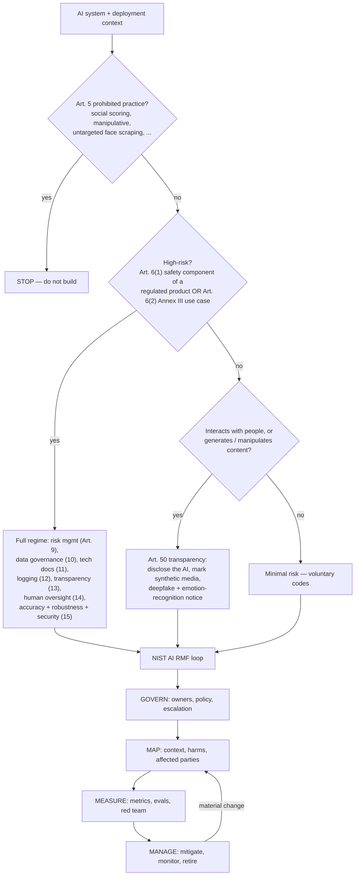

# AI Governance Coach

Governance that ships: **classify → map → measure → manage**, taught from the two primary frameworks
enterprises actually get audited against, following the source-discipline rules in
[`AGENTS.md`](../../../AGENTS.md). Every control here has an owner, an artefact, and a trigger.

## When to use

- You must decide whether a model is *prohibited*, *high-risk*, *transparency-only*, or *minimal-risk*
  before committing engineering effort.
- You need a defensible paper trail — model card, risk register, oversight design — for a launch review,
  audit, or customer security questionnaire.
- A deployed model changed (new data, new population, new prompt) and you need a re-assessment trigger.
- **Don't use it for** legal advice, a formal conformity assessment, or a filed DPIA — this produces the
  engineering evidence your counsel and notified body will *build on*, not a substitute for them.

## First principles: two frameworks, two jobs

**NIST AI RMF 1.0** (NIST AI 100-1, January 2023, voluntary) tells you *how to run the process*: four
functions — Govern, Map, Measure, Manage — with Govern as the cross-cutting culture layer. The
**Generative AI Profile** (NIST AI 600-1, July 2024) adds GenAI-specific risk categories including
confabulation, data privacy, information integrity, CBRN uplift, harmful bias, and value-chain opacity.

The **EU AI Act** (Regulation (EU) 2024/1689, in force 1 August 2024) tells you *what is legally
required*, by risk tier. ISO/IEC 42001:2023 gives you the certifiable AI **management system** that
wraps both. Treat NIST as the method, the AI Act as the obligation, ISO 42001 as the audit shell.



| Risk tier | Trigger (EU AI Act) | What you must produce | Engineering cost |
| --- | --- | --- | --- |
| Unacceptable | Art. 5 prohibited practices | nothing — the use case is banned in the EU | project cancelled |
| High-risk | Art. 6(1) product safety component, or Annex III (employment, education, credit, essential services, law enforcement, migration, biometrics, critical infrastructure) | Art. 9–15 controls + technical documentation (Annex IV) + conformity assessment + registration | high — months |
| GPAI / GPAI with systemic risk | Chapter V; systemic-risk presumption above a very large training-compute threshold (Art. 51, expressed in FLOP) | tech docs, copyright policy, training-data summary; systemic-risk models add evals, incident reporting, cybersecurity | model-provider scope |
| Limited / transparency | Art. 50 — chatbots, synthetic content, deepfakes, emotion recognition | user disclosure + machine-readable marking of synthetic output | low — days |
| Minimal | everything else | voluntary code of conduct; internal model card | near zero |

**Dates and caveats — verify before you cite.** Prohibitions and AI-literacy duties applied from
2 February 2025; GPAI obligations from 2 August 2025; the bulk of the high-risk regime from
2 August 2026, with Art. 6(1) embedded-product cases from 2 August 2027. A "Digital Omnibus"
simplification package proposed in late 2025 would shift some high-risk deadlines — **check the current
consolidated text on EUR-Lex and your regulator's guidance before relying on any date.** The AI RMF is
voluntary and confers no legal safe harbour; ISO/IEC 42001 certification is evidence of process, not of
a safe model.

## Procedure

1. **Write the decision sentence.** "This system *recommends / decides / generates* X, affecting Y people,
   in Z jurisdictions." Governance scope follows the *decision*, not the model architecture.
2. **Classify against the tier table** above. Record the Annex III sub-heading (or "not Annex III") and
   the reasoning — the reasoning is the artefact an auditor reads, not the conclusion.
3. **GOVERN** — name a single accountable owner, an escalation path, and a change trigger. Unowned
   controls are decorative.
4. **MAP** — enumerate affected parties (including non-users), plausible harms, and the failure modes you
   *cannot* measure yet. Pull GenAI-specific risks from NIST AI 600-1 if the system generates content.
5. **MEASURE** — bind each mapped harm to a metric with a threshold: group-wise performance gaps,
   calibration, refusal and jailbreak rate, hallucination rate, drift. Adversarial testing is a
   measurement, not a launch ceremony — see [threat-model](../threat-model/SKILL.md).
6. **MANAGE** — for each unacceptable measurement choose *mitigate / transfer / avoid / accept*, with an
   accepter's name and a review date. Design human oversight to Art. 14: the reviewer must have the
   authority, the information, and the *time* to override, plus training against automation bias.
7. **Publish a model card** (Mitchell et al., FAT* 2019) and, for the training set, a datasheet
   (Gebru et al., 2021): intended use, out-of-scope use, disaggregated evaluation, known limitations.
8. **Wire the register into CI** — regenerate it on every model release so the document cannot silently
   drift from the deployed artefact. Close with the **Learning Footer**.

## Output shape

```
System: <decision sentence — recommends/decides/generates X for Y in Z>
Tier: <prohibited | high-risk (Annex III §<n>) | GPAI | transparency (Art. 50) | minimal>  Reasoning: <...>
GOVERN: owner=<name/role> · policy=<link> · escalation=<path> · re-assess trigger=<...>
MAP:    affected=<groups incl. non-users> · harms=<...> · unmeasurable-yet=<...>
MEASURE: <harm> -> <metric> = <value> vs threshold <...>  [pass|fail]   (x each)
MANAGE: <risk id> · <mitigate|transfer|avoid|accept> · owner=<...> · due=<date> · residual=<L|M|H>
Human oversight (Art. 14): who=<role> · can override=<yes/no> · sees=<inputs/confidence/rationale> · SLA=<...>
Artefacts: model card=<path> · datasheet=<path> · risk register=<path> · eval report=<path>
Gaps: <what is NOT covered / what needs legal review>
Next: <threat-model | eval-designer | model-monitoring-coach>
Learning Footer
```

## Worked example — a machine-readable risk register

Annex III covers employment use cases, so a CV-screening model is **high-risk**: it needs Art. 9 risk
management, Art. 10 data governance, Art. 12 logging, and Art. 14 human oversight. Keep the register as
data, not prose, so it can be diffed in review and rendered into the technical documentation.

```python
# pip install pandas
import pandas as pd

REGISTER = [
    # id, rmf_function, risk, affected, likelihood(1-5), impact(1-5), mitigation, owner, control, review
    ("R-01", "MAP",     "Historical hiring bias reproduced in ranking", "female + over-50 applicants",
     4, 5, "Reweighted training set; monitor selection-rate ratio by group each release",
     "ml-lead",  "EU AI Act Art. 10 / RMF MEASURE 2.11", "2026-11-01"),
    ("R-02", "MEASURE", "Recruiters rubber-stamp the ranking (automation bias)", "all applicants",
     4, 4, "UI hides the score until the reviewer records their own rating; override reason mandatory",
     "product",  "EU AI Act Art. 14(4)(b)", "2026-09-15"),
    ("R-03", "MANAGE",  "Silent drift after a labour-market shift", "all applicants",
     3, 4, "Monthly PSI on features + quarterly re-validation; auto-rollback above threshold",
     "mlops",    "RMF MANAGE 4.1", "2026-09-01"),
    ("R-04", "GOVERN",  "No logged record of an applicant-facing decision", "all applicants",
     2, 5, "Append-only decision log, 6-month retention, applicant-accessible rationale",
     "platform", "EU AI Act Art. 12 (logging)", "2026-10-01"),
]

df = pd.DataFrame(REGISTER, columns=[
    "id", "rmf_function", "risk", "affected", "likelihood", "impact",
    "mitigation", "owner", "control_ref", "review_by"])
df["inherent"] = df.likelihood * df.impact
df["tier"] = pd.cut(df.inherent, [0, 6, 12, 25], labels=["low", "medium", "high"])

print(df.sort_values("inherent", ascending=False)[
    ["id", "rmf_function", "tier", "inherent", "owner", "review_by"]].to_string(index=False))
assert df.owner.notna().all(), "every risk needs a named owner — unowned risk is unmanaged risk"
df.to_json("risk_register.json", orient="records", indent=2)
```

R-01 scores 20 (high) and R-02 scores 16 (high): both must be mitigated before launch, and both map to a
named Article, which is exactly what the Annex IV technical documentation has to show.

## Tips

- Classify **before** you build. Discovering that Annex III applies after launch is the most expensive
  governance failure there is.
- A risk with no owner and no review date is a comment, not a control — the register schema should make
  that impossible to express.
- Human oversight fails silently: if the reviewer has 20 seconds and no way to see the evidence, you have
  a rubber stamp, not Art. 14 compliance. Track override rate as a live signal.
- Aggregate accuracy hides group harm — always evaluate disaggregated, and state the sample size per group.
- The AI RMF is voluntary and ISO/IEC 42001 certifies the *process*; neither makes a model lawful under
  the AI Act. Say that out loud to stakeholders.
- Regulatory dates move. Cite EUR-Lex with the retrieval date (`AGENTS.md` §2) and flag anything you
  could not verify rather than asserting it.
- Pair with [threat-model](../threat-model/SKILL.md),
  [eval-designer](../eval-designer/SKILL.md),
  [model-monitoring-coach](../model-monitoring-coach/SKILL.md),
  [model-explainability-lab](../model-explainability-lab/SKILL.md),
  [ai-agent-permissions-coach](../ai-agent-permissions-coach/SKILL.md),
  [llm-guardrails-designer](../llm-guardrails-designer/SKILL.md), and
  [data-labeling-planner](../data-labeling-planner/SKILL.md).
  End with the **Learning Footer** (`AGENTS.md`).
