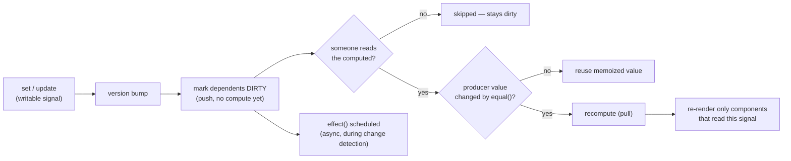

# Angular Signals Lab

A runnable lab that teaches Angular's reactive primitive from the graph upward: **signal → computed →
effect → render**, then removes Zone.js entirely. Follows the teach-from-first-principles and
verify-before-you-teach rules in [`AGENTS.md`](../../../AGENTS.md).

## When to use

- You are learning Angular signals, or migrating a component from `BehaviorSubject` + `async` pipe.
- Your `effect()` fires more often than expected, or you are unsure when to use `computed` vs `effect`.
- You want to turn on zoneless change detection and need to know exactly what breaks.
- **Don't use it for** general Angular structure, routing, or DI basics — start with
  [angular-basics-lab](../angular-basics-lab/SKILL.md) and come back here.

## First principles: a push-then-pull reactive graph

Per the official Angular signals guide, a signal is a *value with a dependency graph attached*. Writes
**push** a "dirty" mark down the graph; reads **pull** a recomputation only if a producer actually changed.
That is why `computed()` is lazy and memoized, and why the framework never re-runs work nobody reads.



| Primitive | Import from | Tracks deps | Writable | Runs when | Use it for |
| --- | --- | --- | --- | --- | --- |
| `signal(v)` | `@angular/core` | — | yes (`set`/`update`) | never (it *is* the value) | source of truth |
| `computed(fn)` | `@angular/core` | yes | no | lazily, on read, if dirty | derived view model |
| `effect(fn)` | `@angular/core` | yes | discouraged | async, during change detection | sync to the outside world |
| `linkedSignal(fn)` | `@angular/core` | yes | yes | resets when its source changes | writable-but-derived state |
| `input()` / `input.required()` | `@angular/core` | — | no (read-only) | on parent binding change | component inputs |
| `model()` | `@angular/core` | — | yes | two-way `[(x)]` | banana-in-a-box state |
| `toSignal(obs$)` | `@angular/core/rxjs-interop` | — | no | on emission | RxJS → signal |
| `toObservable(sig)` | `@angular/core/rxjs-interop` | yes | no | on signal change | signal → RxJS |

**Trade-off to say out loud:** Zone.js patches every async browser API and then dirty-checks *the whole
component tree*; signals mark only the components that actually read the changed value. Zoneless is faster
and far easier to debug — but code that mutated state inside a `setTimeout` without a signal silently stops
updating, which is exactly the failure mode step 6 makes you reproduce.

## Procedure

1. **Scaffold** a fresh app with the Angular CLI, and record the version you are teaching against:

   ```bash
   npm i -g @angular/cli
   ng new signals-lab --standalone --style=css --ssr=false
   cd signals-lab && ng version && ng serve
   ```

2. **Start with state, not effects.** Every source of truth becomes a `signal()`; every derivation becomes
   a `computed()`. Reach for `effect()` only at the *boundary* — logging, `localStorage`, `document.title`,
   a non-Angular chart library.
3. **Type your inputs as signals.** `input()` returns a read-only `InputSignal`; `input.required<T>()` has
   no initial value and is enforced at compile time. Two-way binding uses `model()`, which pairs a writable
   signal with an auto-generated `xChange` output; events use `output<T>()`.
4. **Go zoneless.** Add `provideZonelessChangeDetection()` to `bootstrapApplication` and delete the
   `zone.js` polyfill entry from `angular.json`. This provider is stable from Angular 20; on v18/19 it is
   named `provideExperimentalZonelessChangeDetection()` — check your installed version before copying.
5. **Bridge RxJS only at the edges.** `toSignal(obs$, { initialValue })` for reads; `toObservable(sig)` when
   you genuinely need operators (`debounceTime`, `switchMap`, retry). Both require an injection context, or
   an explicit `{ injector }` if you call them outside a constructor/field initialiser.
6. **Break it on purpose:** write to a signal *inside* an `effect()` and read the resulting warning; then
   mutate an array in place and watch the UI not update. Fix each with `untracked()`, a `computed`, or an
   immutable `update()`.
7. **Verify** with `ng test`, then confirm zoneless works by mutating a signal from a `setTimeout`.
8. Close with the **Learning Footer**.

## Output shape

```
Goal: <what the component must do>            Angular: <version>   Zoneless: <yes|no>
Graph:  sources -> <signal(...)>   derived -> <computed(...)>   boundary -> <effect(...)>
Inputs: <input() | input.required<T>() | model()>        Outputs: <output<T>()>
Interop: <toSignal(obs$, {initialValue}) | toObservable(sig) | none>
Code: <runnable standalone component + bootstrapApplication>
Pitfall reproduced: <effect write-loop | in-place mutation | missing initialValue> -> Fix: <...>
Verify: ng test  ·  ng serve + mutate a signal from setTimeout under zoneless
Next: <angular-basics-lab | state-management-coach | inp-optimization-lab>
Learning Footer
```

## Worked example — a zoneless cart with derived totals

Paste over `src/main.ts`, then `ng serve` and open the browser:

```ts
import { bootstrapApplication } from '@angular/platform-browser';
import { NgFor } from '@angular/common';
import { Component, signal, computed, effect, input, model, output, linkedSignal,
         untracked, ChangeDetectionStrategy, provideZonelessChangeDetection } from '@angular/core';

@Component({
  selector: 'cart-line', standalone: true,
  changeDetection: ChangeDetectionStrategy.OnPush,
  template: `
    <span>{{ name() }} — {{ unitPrice() }}
      <button (click)="qty.set(qty() - 1)" [disabled]="qty() <= 0">−</button>
      {{ qty() }}
      <button (click)="qty.set(qty() + 1)">+</button>
      <button (click)="remove.emit(name())">remove</button>
    </span>`,
})
export class CartLine {
  name = input.required<string>();   // read-only InputSignal, required at compile time
  unitPrice = input(0);              // read-only InputSignal with a default
  qty = model(1);                    // two-way: parent binds [(qty)]
  remove = output<string>();         // signal-era replacement for @Output EventEmitter
}

@Component({
  selector: 'app-root', standalone: true, imports: [CartLine, NgFor],
  changeDetection: ChangeDetectionStrategy.OnPush,
  template: `
    <ul><li *ngFor="let l of lines(); trackBy: byName">
      <cart-line [name]="l.name" [unitPrice]="l.price"
                 [(qty)]="l.qty" (remove)="drop($event)" />
    </li></ul>
    <p>Subtotal {{ subtotal() }} · VAT {{ vatRate() * 100 }}% · Total {{ total().toFixed(2) }}</p>
    <button (click)="vatRate.set(0.05)">Apply reduced VAT (local override)</button>
    <button (click)="countryVat.set(0.19)">Move to DE (resets the override)</button>`,
})
export class App {
  readonly lines = signal([
    { name: 'Keyboard', price: 89,  qty: signal(1) },
    { name: 'Monitor',  price: 240, qty: signal(2) },
  ]);
  readonly countryVat = signal(0.20);
  // linkedSignal = writable, but RE-SEEDED whenever its source changes.
  readonly vatRate = linkedSignal(() => this.countryVat());

  readonly subtotal = computed(() =>
    this.lines().reduce((sum, l) => sum + l.price * l.qty(), 0));
  readonly total = computed(() => this.subtotal() * (1 + this.vatRate()));

  constructor() {
    // Boundary work only. total() is tracked; lines() is read untracked, so ADDING a line
    // does not re-fire this effect — only a price, qty or VAT change does.
    effect(() => {
      const t = this.total();
      document.title = `Cart (${untracked(() => this.lines().length)}) — ${t.toFixed(2)}`;
    });
  }
  byName = (_: number, l: { name: string }) => l.name;
  drop(name: string) { this.lines.update(ls => ls.filter(l => l.name !== name)); }
}

bootstrapApplication(App, { providers: [provideZonelessChangeDetection()] });
```

Reason it through: clicking `+` writes `qty`, which marks `subtotal` and then `total` dirty. Only the `<p>`
binding and the title effect pull new values — `lines()` never changed, so `*ngFor` is not rebuilt. Clicking
*Move to DE* re-seeds `vatRate` because `linkedSignal` recomputes from its source; a plain `signal` would
have kept the stale 5 % override, and a `computed` would have rejected the local write outright.

## Tips

- **`computed` for values, `effect` for side effects.** An `effect` that assigns to another signal is a
  smell — Angular warns about write-after-read loops. Promote it to a `computed` or a `linkedSignal`.
- Effects run **asynchronously during change detection**, not synchronously on `set()`. In tests call
  `TestBed.tick()` / `fixture.detectChanges()` before asserting on the DOM.
- Signals compare with `Object.is` by default, so `arr.push(x)` will *not* notify. Use
  `update(xs => [...xs, x])` or supply a custom `equal`.
- `toSignal()` without `initialValue` widens the type to `T | undefined` — that `undefined` is real, not
  ceremony. Use `{ requireSync: true }` only for genuinely synchronous sources such as `BehaviorSubject`.
- Zoneless removes the safety net: state changed in a WebSocket callback or third-party callback must land
  in a signal (or call `ChangeDetectorRef.markForCheck()`).
- Measure the DOM in `afterRenderEffect()` / `afterNextRender()`, never in `effect()` — layout reads in the
  wrong phase cost you interaction latency; see [inp-optimization-lab](../inp-optimization-lab/SKILL.md)
  and [web-perf-audit](../web-perf-audit/SKILL.md).
- Compare mental models with [svelte-runes-lab](../svelte-runes-lab/SKILL.md) and
  [react-hooks-lab](../react-hooks-lab/SKILL.md); for app-wide stores see
  [state-management-coach](../state-management-coach/SKILL.md); for framework-free encapsulation see
  [web-components-lab](../web-components-lab/SKILL.md) and
  [component-designer](../component-designer/SKILL.md). Verify every API against the Angular docs for
  *your* version (`AGENTS.md` §2), then end with the **Learning Footer** (`AGENTS.md`).
