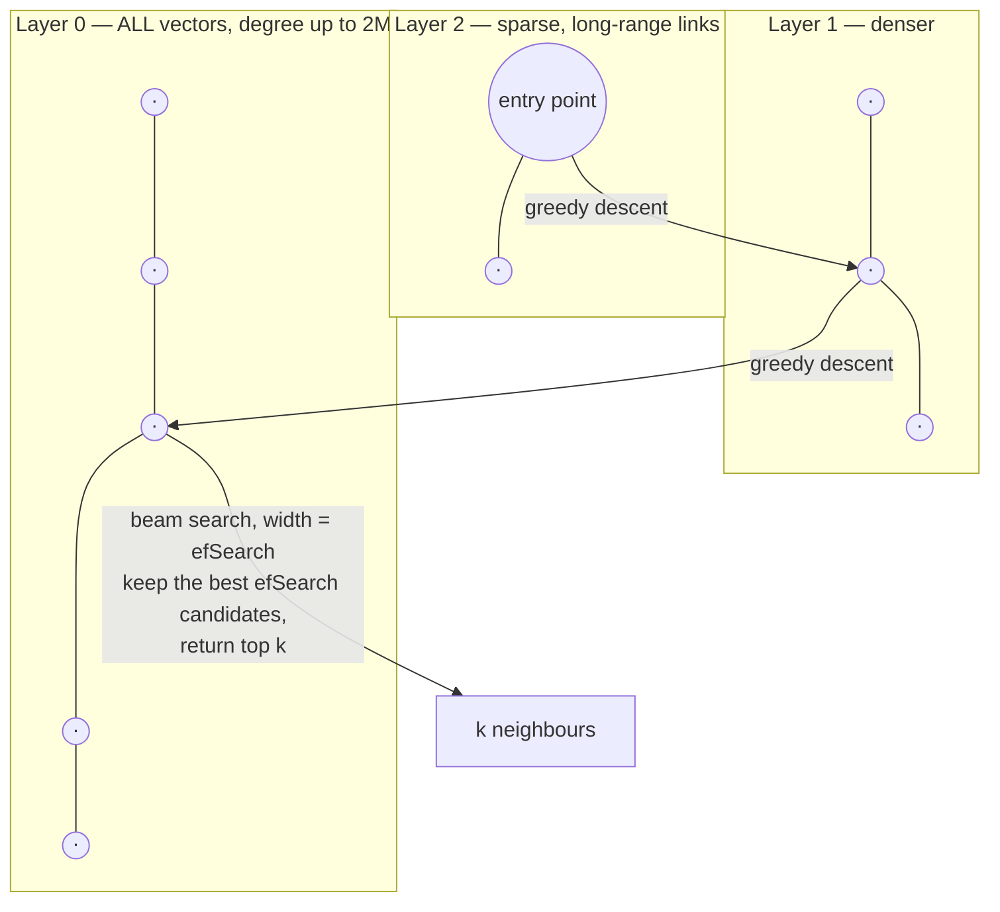

# ANN Index Tuning Coach

An approximate index has exactly three currencies — **recall, latency, memory** — and every knob spends one to
buy another. This skill makes you measure recall before tuning anything, then moves along the curve
deliberately rather than by superstition, in the verify-before-you-teach spirit of
[`AGENTS.md`](../../../AGENTS.md).

## When to use

- Vector search is "fast but the answers got worse" (or the reverse) and nobody has measured recall.
- Choosing between HNSW and IVF/IVF-PQ, or sizing `lists`/`nlist` and `nprobe`.
- The index does not fit in RAM, or the build takes hours.
- Filtered searches (`WHERE tenant_id = …`) return fewer rows than the `LIMIT`.
- **Don't use it for** choosing a vector store product — that's
  [vector-db-selector](../vector-db-selector/SKILL.md); for embedding-model quality —
  [embeddings-explainer](../embeddings-explainer/SKILL.md); or for end-to-end retrieval quality —
  [rag-evaluation-coach](../rag-evaluation-coach/SKILL.md).

## First principles: you are buying recall with distance computations

Exact search computes $N$ distances. Approximate search computes far fewer and therefore may miss true
neighbours. The quality metric is **recall@k**:

$$\text{recall@}k = \frac{1}{Q}\sum_{q=1}^{Q}\frac{\lvert R_q^{\text{ANN}} \cap R_q^{\text{exact}} \rvert}{k}$$

where $R^{\text{exact}}$ comes from a brute-force run over the *same* data and metric. **Without a ground
truth you are not tuning, you are guessing** — this is the step that gets skipped.

### HNSW — a navigable small-world graph in layers

Malkov & Yashunin, *"Efficient and robust approximate nearest neighbor search using Hierarchical Navigable
Small World graphs"* (arXiv 2016; IEEE TPAMI 2020).



*Coarse-to-fine: the upper layers are a highway network that gets you near the answer in $O(\log N)$ hops; all
the accuracy is decided by the beam width `efSearch` at layer 0.*

| Knob | Phase | Raises | Costs | Practical note |
| --- | --- | --- | --- | --- |
| `M` (links per node; layer 0 gets up to `2M`) | build | recall ceiling, robustness in high dim | **memory** and build time | pgvector default **16**; raise for high-dimensional or hard data |
| `efConstruction` | build | graph quality ⇒ recall at every `efSearch` | build time only (**not** query time, **not** memory) | pgvector default **64**; the cheapest quality knob you have |
| `efSearch` / `hnsw.ef_search` | **query** | recall | latency, linearly-ish | pgvector default **40**; must be ≥ `k`, and it is the knob you tune per workload |

Memory, using the FAISS wiki's HNSW estimate of $d \times 4 + M \times 2 \times 4$ bytes per vector (float32
vectors plus the layer-0 neighbour lists):

$$\text{bytes/vector} = 4d + 8M$$

### IVF — partition, then probe

Cluster the vectors into `nlist` Voronoi cells with k-means; at query time compare against the `nlist`
centroids and search only the `nprobe` nearest cells:

$$\text{distance computations} \approx \underbrace{n_{\text{list}}}_{\text{coarse}} + \underbrace{\frac{n_{\text{probe}}}{n_{\text{list}}}\times N}_{\text{fine}}
\qquad
\text{speedup} \approx \frac{N}{n_{\text{list}} + \frac{n_{\text{probe}}}{n_{\text{list}}}N}$$

FAISS guidance: `nlist` around $4\sqrt{N}$ to $16\sqrt{N}$, and enough training data — FAISS emits
`WARNING clustering N points to K centroids: please provide at least 39*K training points` when you starve
k-means. pgvector's README suggests `lists = rows / 1000` up to 1 M rows (and $\sqrt{rows}$ above that), with
`probes` ≈ $\sqrt{lists}$ as a starting point.

**IVF-PQ** adds product quantization (Jégou, Douze & Schmid, *"Product Quantization for Nearest Neighbor
Search"*, IEEE TPAMI 2011): split each vector into `m` sub-vectors, quantize each to `nbits` (usually 8), and
store only the codes:

$$\text{bytes/vector} = \frac{m \times n_{\text{bits}}}{8} \;(+\,\text{small overhead}) \qquad\text{vs}\qquad 4d \text{ for float32}$$

Compression of 20–60× is routine, at a real recall cost — recover most of it by **re-ranking** the top
candidates against the exact vectors (`IndexRefineFlat` in FAISS, or a second exact pass in SQL).

| Family | Memory | Build time | Query latency | Recall ceiling | Pick it when |
| --- | --- | --- | --- | --- | --- |
| Flat (exact) | $4dN$ | none | $O(N)$ | 1.0 | N ≲ 100 k, or you need a ground truth |
| **HNSW** | $4dN + 8MN$ | slow | best at high recall | very high | latency-critical, memory available, few deletes |
| **IVF-Flat** | $4dN$ + centroids | medium (k-means) | tunable by `nprobe` | high | large N, want a single dial |
| **IVF-PQ** | $\approx mN$ | medium | fastest | **capped** by quantization | billions of vectors / RAM-bound; add re-ranking |

⚠ Defaults and index options move between releases (pgvector's iterative-scan behaviour for filtered queries,
FAISS index-factory strings, HNSW build parallelism). **Verify on the current pgvector README / FAISS wiki
page before quoting a default in a design doc.**

## Procedure

1. **State the target as a triple**: recall@k ≥ *X*, p95 latency ≤ *Y* ms, memory ≤ *Z* GB. Two of three are
   always achievable; the third tells you which index family to use.
2. **Build a ground truth** with exact search over a held-out query set (500–1000 real queries beats 10 000
   synthetic ones):
   ```python
   import faiss, numpy as np
   xb = np.load("vectors.npy").astype("float32")        # (N, d)
   xq = np.load("queries.npy").astype("float32")        # (Q, d)
   flat = faiss.IndexFlatL2(xb.shape[1]); flat.add(xb)
   _, gt = flat.search(xq, 10)                          # ground-truth top-10
   ```
   In pgvector, get the same by disabling the index for one run:
   ```sql
   SET enable_indexscan = off; SET enable_bitmapscan = off;   -- forces the exact sequential scan
   SELECT id FROM items ORDER BY embedding <=> :q LIMIT 10;
   ```
3. **Match the metric to the operator class.** In pgvector the index is only used when the query operator
   matches: `vector_l2_ops` ↔ `<->`, `vector_cosine_ops` ↔ `<=>`, `vector_ip_ops` ↔ `<#>`. A cosine index with
   an `<->` query silently sequential-scans.
4. **Build the index with generous build-time parameters** (they cost you once):
   ```sql
   SET maintenance_work_mem = '8GB';   -- an HNSW build that spills to disk is dramatically slower
   CREATE INDEX ON items USING hnsw (embedding vector_cosine_ops) WITH (m = 16, ef_construction = 200);
   -- IVF alternative: build AFTER the table has representative data, never on an empty table
   CREATE INDEX ON items USING ivfflat (embedding vector_cosine_ops) WITH (lists = 1000);
   ```
   ```python
   index = faiss.index_factory(768, "IVF4096,PQ96", faiss.METRIC_L2)
   index.train(xb)          # k-means over the training sample
   index.add(xb)
   index.nprobe = 32
   ```
5. **Sweep the query-time knob only** — `efSearch` / `nprobe` — and record recall *and* p95 latency at each
   point. One knob, one curve, no confounds:
   ```sql
   SET hnsw.ef_search = 40;      -- HNSW
   SET ivfflat.probes = 10;      -- IVF
   EXPLAIN (ANALYZE, BUFFERS) SELECT id FROM items ORDER BY embedding <=> :q LIMIT 10;
   ```
   Confirm the plan says `Index Scan using …_hnsw_idx`; a `Seq Scan` means step 3 or the `ORDER BY … LIMIT`
   form is wrong.
6. **Choose the knee of the curve**, not the maximum: the point past which extra latency buys < 1 % recall.
7. **If the knee misses the target**, change a *build* parameter and re-sweep: raise `efConstruction` first
   (free at query time), then `M` (costs memory), then reconsider the family.
8. **Handle filtered search explicitly.** Post-filtering an ANN result can return fewer than `k` rows when the
   filter is selective; the fixes are per-tenant/partitioned indexes, pre-filtering with a bitmap the engine can
   push down, over-fetching (`LIMIT k × 10` then filter), or the engine's iterative-scan option. Measure recall
   *with the filter applied* — it is a different number.
9. **Re-measure after data changes.** HNSW graphs degrade with heavy deletes/updates, and IVF centroids drift
   as the distribution moves; schedule a rebuild and a recall regression check in CI.
10. Publish the curve and the chosen operating point, then close with the **Learning Footer**.

## Output shape

```
Corpus: N=<vectors> d=<dims> metric=<cosine|L2|IP>   Queries: <Q real queries>   k=<10>
Targets: recall@k ≥ <..> · p95 ≤ <..ms> · memory ≤ <..GB>
Ground truth: <exact flat search | enable_indexscan=off> over <Q> queries — stored at <path>
Index: <HNSW m=<..> ef_construction=<..> | IVFFlat lists=<..> | IVF<nlist>,PQ<m>>
Memory model: <4d + 8M = ..B/vec × N = ..GB>  measured: <..GB>   Build time: <..>
Sweep (one knob only):
  efSearch/nprobe=<..> → recall@10=<..> p95=<..ms>
  efSearch/nprobe=<..> → recall@10=<..> p95=<..ms>   ← knee
Chosen operating point: <knob=value> giving recall=<..> p95=<..ms>
Plan check: <Index Scan using ..._idx | Seq Scan ❌>   Opclass matches operator: <yes/no>
Filtered recall: with <predicate> selectivity <..%> ⇒ recall=<..>, rows returned <n/k>  mitigation=<..>
Rebuild policy: <after X% churn | nightly>   CI recall regression test: <path>
Next: <hybrid-search-reranking-coach | rag-evaluation-coach | vector-db-selector>
Learning Footer
```

## Worked example — 1 M × 768-dim, recomputed end to end

**Memory first, because it decides the family.**

| Index | Formula | Bytes/vector | Total for 1 M |
| --- | --- | --- | --- |
| Flat float32 | $4d = 4\times768$ | 3 072 | **3.07 GB** |
| HNSW, `M = 16` | $4d + 8M = 3072 + 128$ | 3 200 | **3.20 GB** (+4 % over flat) |
| HNSW, `M = 64` | $3072 + 512$ | 3 584 | **3.58 GB** (+17 %) |
| IVF-PQ, `m = 96`, 8 bits | $96 \times 8/8 = 96$ | 96 | **0.096 GB** (32× smaller) |

So on a 4 GB budget HNSW fits comfortably; on a 500 MB budget only PQ does, and you must accept a recall
ceiling plus a re-ranking pass.

**IVF work per query.** With $N = 10^6$, FAISS guidance gives $4\sqrt{N} = 4000$ ⇒ take `nlist = 4096`, so each
cell holds $10^6 / 4096 \approx 244$ vectors:

| `nprobe` | Distance computations $= 4096 + \frac{n_{probe}}{4096}\times 10^6$ | Speedup vs 1 000 000 |
| --- | --- | --- |
| 1 | $4096 + 244 = 4\,340$ | **230×** |
| 8 | $4096 + 1\,953 = 6\,049$ | 165× |
| 32 | $4096 + 7\,813 = 11\,909$ | 84× |
| 128 | $4096 + 31\,250 = 35\,346$ | 28× |

Note what this shows: going from `nprobe` 1 → 32 costs only 2.7× more work (not 32×), because the fixed 4 096
centroid comparisons dominate at low `nprobe`. **Cheap recall is available at the bottom of this curve** — which
is why `nprobe = 1` (pgvector's `ivfflat.probes` default) is almost always the wrong place to stay.

**Now the measured sweep** (numbers from one 1 M/768-dim corpus — *your* numbers will differ; the point is the
shape, so run the sweep yourself):

| Knob | Recall@10 | p95 latency | Δrecall per Δms |
| --- | --- | --- | --- |
| HNSW `ef_search = 10` | 0.81 | 1.2 ms | — |
| HNSW `ef_search = 40` (default) | 0.95 | 2.4 ms | +0.117 / ms |
| HNSW `ef_search = 100` | 0.983 | 4.9 ms | +0.013 / ms ← **knee** |
| HNSW `ef_search = 200` | 0.991 | 9.1 ms | +0.002 / ms |
| IVF `nprobe = 32` | 0.94 | 3.1 ms | — |
| IVF-PQ96 `nprobe = 32`, no re-rank | 0.79 | 1.1 ms | — |
| IVF-PQ96 `nprobe = 32` + re-rank top 100 exact | 0.93 | 1.9 ms | — |

Check the marginal column, since that is the actual decision rule:
$(0.983 - 0.95)/(4.9 - 2.4) = 0.033/2.5 = 0.0132$ recall per ms, versus
$(0.991 - 0.983)/(9.1 - 4.9) = 0.008/4.2 = 0.0019$ — a **7×** drop in value per millisecond. If the budget is
p95 ≤ 5 ms, `ef_search = 100` is the answer; going to 200 quadruples the marginal cost for 0.8 points of recall.

And verify the recall figure itself on one query rather than trusting the harness: if the exact top-10 ids are
`{4,17,23,31,42,55,61,78,90,99}` and the index returns `{4,17,23,31,42,55,61,78,90,**101**}`, then
$|{\cap}| = 9$ and recall@10 $= 9/10 = 0.9$ for that query. Average over all $Q$ queries — never report the
best query, and never report recall from the same vectors you tuned on.

**The filtered-search trap, quantified.** Add `WHERE tenant_id = 42` where tenant 42 owns 0.1 % of rows. An ANN
scan that examines ~2 000 candidates hits roughly $2000 \times 0.001 = 2$ matching rows — so a `LIMIT 10`
returns **2 rows, not 10**, and it looks like missing data rather than low recall. Mitigations in order of
preference: a partitioned/per-tenant index (each index contains only that tenant), a pre-filter the engine can
push into the scan, over-fetching then filtering, or the engine's iterative-scan mode. Always re-measure recall
*with* the filter — the unfiltered number does not transfer.

## Tips

- Measure recall before touching a knob. "Faster" without a recall number is not an improvement, it is a
  different product.
- `efConstruction` is the free lunch: it improves recall at every `efSearch` and costs only build time. Raise it
  before raising `M`.
- `efSearch` below `k` cannot work — the beam cannot hold `k` good candidates. Start at `efSearch ≈ 2k` and sweep.
- `nprobe = 1` and `lists` chosen for an empty table are the two most common pgvector misconfigurations; build
  IVF indexes only after representative data is loaded.
- Tune one knob at a time and plot the curve; simultaneous changes make the knee unfindable.
- PQ trades recall for memory, and re-ranking buys most of it back for very little latency — always test
  `PQ + refine` before rejecting PQ outright.
- Filtered vector search is a different problem with different recall; partition per tenant when the filter is
  both selective and frequent ([multi-tenancy-data-coach](../multi-tenancy-data-coach/SKILL.md)).
- Practise on free local stores: [pgvector-local-lab](../pgvector-local-lab/SKILL.md),
  [qdrant-local-lab](../qdrant-local-lab/SKILL.md),
  [chroma-vector-local-lab](../chroma-vector-local-lab/SKILL.md),
  [weaviate-local-lab](../weaviate-local-lab/SKILL.md); then improve end-to-end quality with
  [hybrid-search-reranking-coach](../hybrid-search-reranking-coach/SKILL.md),
  [rag-designer](../rag-designer/SKILL.md) and
  [rag-evaluation-coach](../rag-evaluation-coach/SKILL.md). Cite the HNSW (TPAMI 2020) and PQ (TPAMI 2011)
  papers when you teach this, and end with the **Learning Footer** (`AGENTS.md`).
