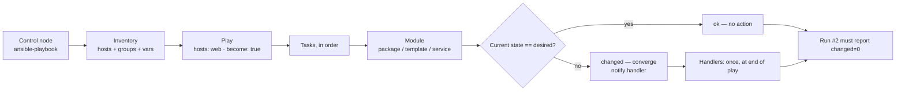

# Ansible Automation Lab

Configuration management taught as **desired state, not a script**: inventory → play → idempotent module →
converged host, verified by a second run that changes nothing. Built to be run locally and free, following
the learn-by-doing contract in [`AGENTS.md`](../../../AGENTS.md).

## When to use

- The learner is writing their first playbook, or has a playbook that reports `changed` on every run and
  doesn't know why that is a bug rather than cosmetic noise.
- They need to factor a sprawling 300-line playbook into reusable **roles**, or stop committing plaintext
  credentials and move to **Ansible Vault**.
- They want a safe target: `localhost` and disposable containers, so nothing production is touched.
- **Don't use it for** provisioning cloud infrastructure from nothing — that is declarative-IaC territory;
  use [terraform-basics-lab](../terraform-basics-lab/SKILL.md) and hand the built hosts to Ansible.

## First principles: push-based desired state

Ansible is **agentless and push-based**: a control node connects over SSH (or a local/container connection
plugin), copies a module, executes it, and removes it (Ansible documentation, *Getting started with Ansible*
and *How Ansible works*, docs.ansible.com, 2025). The unit of correctness is the **module**, and the
contract every well-written module honours is: *inspect current state, act only if it differs, report
`changed` truthfully*.



| Concept | What it is | Where it lives | Failure smell |
| --- | --- | --- | --- |
| Inventory | hosts, groups, group/host vars | `inventory.yml` (INI or YAML) | hard-coded IPs inside tasks |
| Play | maps hosts → tasks, sets `become` | `site.yml` | one giant play doing everything |
| Module | the idempotent unit of work | `ansible.builtin.*` (FQCN) | `command`/`shell` for everything |
| Handler | runs once at end, only if notified | `handlers/main.yml` | restarting a service every run |
| Role | reusable bundle of the above | `roles/<name>/` | copy-pasted task blocks |
| Vault | AES-encrypted vars file | `group_vars/*/vault.yml` | secrets in plaintext in git |
| Facts | discovered host data | `ansible_facts` | guessing the OS family |

**The idempotence rule:** `ansible.builtin.command` and `.shell` are *not* idempotent — they run every time
and report `changed` every time. Either replace them with a real module (`package`, `template`, `service`,
`file`, `lineinfile`, `user`) or constrain them with `creates:`, `removes:`, or an explicit `changed_when:`
(Ansible documentation, *Desired state and idempotency*, docs.ansible.com, 2025).

## Procedure

1. **Install into a virtualenv** (no root, no system packages):
   `python -m venv .venv && .venv/bin/pip install ansible ansible-lint`, then `ansible --version`.
2. **Write the inventory** and prove connectivity to the safest target you have:
   `ansible -i inventory.yml all -m ansible.builtin.ping`. For a container target, start
   `docker run -d --name web1 rockylinux:9 sleep infinity` and set
   `ansible_connection=community.docker.docker`.
3. **Write one play** using fully-qualified module names, `become: true`, and a handler for the restart.
4. **Dry-run first**: `ansible-playbook -i inventory.yml site.yml --check --diff`. `--check` predicts,
   `--diff` shows the exact file delta — read it before you converge anything.
5. **Converge**: `ansible-playbook -i inventory.yml site.yml`. Note the `changed=N` recap.
6. **Prove idempotence — the whole point**: run the identical command a second time and require
   `changed=0`. Any task still reporting `changed` is the task to fix.
7. **Factor into a role**: `ansible-galaxy init roles/webserver`, move tasks/handlers/templates/defaults
   into it, and reduce `site.yml` to a `roles:` list. Defaults go in `defaults/main.yml` (lowest
   precedence, meant to be overridden); invariants go in `vars/main.yml`.
8. **Encrypt the secrets**: `ansible-vault create group_vars/web/vault.yml`, reference the variables
   normally, and run with `--vault-password-file .vault-pass` (git-ignored). Add `no_log: true` to any
   task that would echo a secret.
9. **Lint and gate**: `ansible-lint site.yml` — it catches missing FQCNs, bare `shell`, and unnamed tasks.
   Wire it into CI with [ci-pipeline-builder](../ci-pipeline-builder/SKILL.md), then close with the
   **Learning Footer**.

## Output shape

```
Goal: <desired host state in one sentence>
Target: localhost | docker container | vagrant   Connection: local | docker | ssh
Inventory: <groups> → <hosts>   Vars: group_vars/<group>/{main,vault}.yml
Play: hosts=<group> become=<true|false>   Modules: package · template · service · file
Idempotence: run1 changed=<N>  →  run2 changed=0     (any non-zero = the bug)
Non-idempotent offenders: <task> → fixed with <real module | creates: | changed_when:>
Role: roles/<name>/{tasks,handlers,templates,defaults,meta}   Overridden defaults: <vars>
Secrets: ansible-vault (AES256) · no_log on <tasks> · password file git-ignored
Checks: ansible-playbook --check --diff · ansible-lint <result>
Next: <terraform-basics-lab | secrets-management-coach | ci-pipeline-builder>
Learning Footer
```

## Worked example — idempotent web server, then the same thing as a role

`inventory.yml` — two safe targets, no production hosts:

```yaml
all:
  children:
    web:
      hosts:
        localhost:
          ansible_connection: local
        web1:
          ansible_connection: community.docker.docker
      vars:
        nginx_port: 8080
```

`site.yml` — every task uses a *stateful* module, so the second run is a no-op:

```yaml
- name: Converge web servers
  hosts: web
  become: true
  vars_files: [group_vars/web/vault.yml]
  tasks:
    - name: Install nginx
      ansible.builtin.package:
        name: nginx
        state: present

    - name: Template the site config
      ansible.builtin.template:
        src: templates/site.conf.j2
        dest: /etc/nginx/conf.d/site.conf
        owner: root
        group: root
        mode: "0644"
      notify: Restart nginx

    - name: Ensure nginx is running and enabled
      ansible.builtin.service:
        name: nginx
        state: started
        enabled: true

    - name: Write the API token (never logged)
      ansible.builtin.copy:
        content: "{{ vault_api_token }}"
        dest: /etc/nginx/.api_token
        mode: "0600"
      no_log: true

  handlers:
    - name: Restart nginx
      ansible.builtin.service:
        name: nginx
        state: restarted
```

Run it, then run it again — the second recap is the grade:

```bash
ansible-playbook -i inventory.yml site.yml --check --diff
ansible-playbook -i inventory.yml site.yml            # run 1: changed=4
ansible-playbook -i inventory.yml site.yml            # run 2: changed=0  ← pass
```

The handler fires only on run 1, because only run 1 changed the template. That is the difference between
configuration management and a shell script that restarts nginx forever.

## Tips

- `changed` is a *claim about the world*, not a log level — a truthful `changed` is what makes `--check`,
  handlers, and drift detection work at all.
- Always use FQCNs (`ansible.builtin.copy`, not `copy`); short names resolve differently once collections
  are installed, and `ansible-lint` will fail you.
- `defaults/main.yml` is overridable, `vars/main.yml` is not — put the knobs in defaults or your role
  becomes un-reusable.
- Vault encrypts *at rest only*: the decrypted value still reaches the host, so pair with
  [secrets-management-coach](../secrets-management-coach/SKILL.md) and
  [vault-local-lab](../vault-local-lab/SKILL.md).
- `--check` can be wrong for tasks that depend on an earlier task's side effects; say so instead of
  trusting the dry run blindly.
- Ansible converges *existing* hosts; it does not create them — sequence it after
  [terraform-modules-lab](../terraform-modules-lab/SKILL.md), and for services see
  [linux-systemd-lab](../linux-systemd-lab/SKILL.md).
- Related: [docker-compose-lab](../docker-compose-lab/SKILL.md),
  [pre-commit-lab](../pre-commit-lab/SKILL.md), [gitops-coach](../gitops-coach/SKILL.md), and
  [dora-metrics-coach](../dora-metrics-coach/SKILL.md) to check the automation actually made delivery
  faster. End with the **Learning Footer** (`AGENTS.md`).
