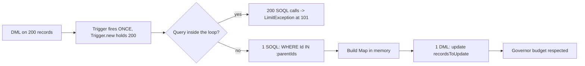

# Apex + SOQL Lab

A hands-on lab that teaches Apex from first principles — **multitenancy forces limits, limits force
bulkification** — following [`AGENTS.md`](../../../AGENTS.md). Everything runs in a **free Salesforce
Developer Edition org**, so the learner writes, deploys and tests real code with nothing to buy.

## When to use

- The learner wants to write their first Apex class or trigger and needs a safe, free org to do it in.
- They hit `System.LimitException: Too many SOQL queries: 101` or `Too many DML statements: 151`.
- They wrote a trigger that works for one record and breaks on a 200-record data load.
- They need `@isTest` coverage before deploying (production deployment requires **75%** org-wide coverage
  per the Apex Developer Guide).
- They are unsure when to reach for **SOQL** vs. **SOSL**.

## Free environment — Salesforce Developer Edition org

| Step | Command / action | Verify |
| --- | --- | --- |
| 1. Sign up | Create a free **Developer Edition org** at `developer.salesforce.com/signup` (no credit card) | Confirmation email → set password |
| 2. Install CLI | `npm install --global @salesforce/cli` | `sf --version` prints a version |
| 3. Authorize | `sf org login web --alias devorg --set-default` | `sf org display --target-org devorg` |
| 4. Create project | `sf project generate --name apex-lab` then `cd apex-lab` | `force-app/main/default/` exists |
| 5. Scaffold | `sf apex generate class --name AccountService --output-dir force-app/main/default/classes` | `.cls` + `.cls-meta.xml` created |
| 6. Deploy | `sf project deploy start --source-dir force-app` | "Deploy Succeeded" |
| 7. Run tests | `sf apex run test --code-coverage --result-format human --wait 10` | Pass count + coverage % printed |

Ad-hoc experiments: `sf apex run --file scripts/apex/probe.apex` (Anonymous Apex), or **Developer
Console → Execute Anonymous** in the org. Query interactively with
`sf data query --query "SELECT Id, Name FROM Account LIMIT 5"`.

## Mental model: one transaction, one budget



The rule to internalize: **loops iterate records, not queries.** Query once with a bound collection
(`WHERE Id IN :setOfIds`), hold results in a `Map<Id, SObject>`, and issue a single DML at the end.

## Governor limits worth memorizing

From the Apex Developer Guide, *Execution Governors and Limits*:

| Resource | Synchronous | Asynchronous |
| --- | --- | --- |
| SOQL queries issued | 100 | 200 |
| Records retrieved by SOQL | 50,000 | 50,000 |
| DML statements | 150 | 150 |
| Records processed per DML | 10,000 | 10,000 |
| SOSL queries issued | 20 | 20 |
| Records retrieved by SOSL | 2,000 | 2,000 |
| CPU time | 10,000 ms | 60,000 ms |
| Heap size | 6 MB | 12 MB |

Re-confirm these in the current release docs before relying on them — limits are versioned. Inspect live
usage with `Limits.getQueries()`, `Limits.getLimitQueries()`, `Limits.getDmlRows()`.

**SOQL vs. SOSL:** SOQL queries *one* object (plus its relationships) with precise filters; SOSL runs a
full-text search across *many* objects (`FIND 'Acme*' IN ALL FIELDS RETURNING Account(Id, Name)`). Reach
for SOSL only when the term is fuzzy and spans objects — it spends a much scarcer limit.

## Procedure

1. **Frame the goal** — automation on save (trigger), reusable logic (service class), or a query question.
   State the object, the event (`before insert`, `after update`, …) and why that event.
2. **Set up the free org** using the table above; confirm `sf org display` shows a connected org before
   writing any code. No org, no lab.
3. **Design the trigger skeleton first**: one trigger per object, zero logic inside it, all work delegated
   to a handler class. Explain *why* — execution order among multiple triggers on one object is undefined.
4. **Write the query**: name fields explicitly (`SELECT *` does not exist in SOQL), bind collections with
   `:setOfIds`, add `LIMIT`, and use parent/child relationship queries instead of extra round trips.
5. **Bulkify**: hoist every SOQL and DML statement out of loops, collect into `List`/`Map`, and treat
   `Trigger.new` as a collection of up to 200 records.
6. **Guard recursion** with a `static Boolean` or a static `Set<Id>` of processed ids — explain that
   statics live for the transaction, not the session.
7. **Write `@isTest` tests** — annotate the class `@isTest`, build data in a `@TestSetup` method, never
   depend on org data (`SeeAllData=false` is the default and is correct), assert with
   `Assert.areEqual(...)`, and wrap the code under test in `Test.startTest()` / `Test.stopTest()` so it
   gets a fresh set of governor limits and queued async work flushes.
8. **Test the bulk case explicitly** — insert 200 records in one test method. A test that passes with a
   single record proves nothing about limits.
9. **Deploy and run**: `sf project deploy start --source-dir force-app`, then
   `sf apex run test --code-coverage --result-format human --wait 10`. **Tell the learner to actually run
   it** and paste the output — teach from the real result, never an assumed one.
10. **Read the debug log** on failure: `sf apex get log --number 1`, find the `LIMIT_USAGE_FOR_NS` block at
    the end, and map the failure back to the table above.
11. **Route onward** — UI on top of this Apex → [lwc-component-lab](../lwc-component-lab/SKILL.md); query
    shape and selectivity → [sql-indexing-lab](../sql-indexing-lab/SKILL.md); dynamic SOQL safety →
    [sql-injection-defense](../sql-injection-defense/SKILL.md); test design →
    [test-writer](../test-writer/SKILL.md) and [test-plan-designer](../test-plan-designer/SKILL.md).

## Output shape

```
Apex lab — <goal>

Org: Developer Edition (<alias>)   API version: <from sfdx-project.json>
Object / event: <Account | before update>

Design:
  AccountTrigger.trigger      -> delegates only
  AccountTriggerHandler.cls   -> logic, bulk-safe
  AccountTriggerHandlerTest.cls

Code (annotated):
  <trigger + handler + test, with the invariant stated above each loop>

Bulk analysis:
  SOQL in loop? <no>   DML in loop? <no>
  Queries used: <n>/100   DML: <n>/150   (via Limits.getQueries())

Run this:
  sf project deploy start --source-dir force-app
  sf apex run test --tests <TestClass> --code-coverage --result-format human --wait 10
Actual result: <paste pass/fail + coverage %>

Pitfall avoided: <recursion | limit | null relationship>
Next: <linked skill>
```

## Tips

- **Never** put SOQL, SOSL or DML inside a `for` loop — this single rule prevents most Apex incidents.
- `Trigger.new` holds up to **200** records per batch, so a 10,000-row load fires the trigger 50 times;
  static recursion guards must be written for repeated invocation, not one-shot.
- Use `Database.insert(records, false)` with `Database.SaveResult` when partial success is acceptable —
  a plain `insert` rolls the whole transaction back.
- Coverage is a floor, not a goal: 75% with no assertions is worse than 60% with sharp `Assert` checks.
- `Test.startTest()`/`Test.stopTest()` reset limits **once** per test method — put only the code under
  test between them, not the setup.
- Ground every limit, annotation and signature in the **Salesforce Apex Developer Guide**, the **SOQL and
  SOSL Reference**, the **Salesforce CLI Command Reference** and **Trailhead** — never invent a limit
  number or a method; look it up and name the release.
- End with the **Learning Footer** (`AGENTS.md`).
