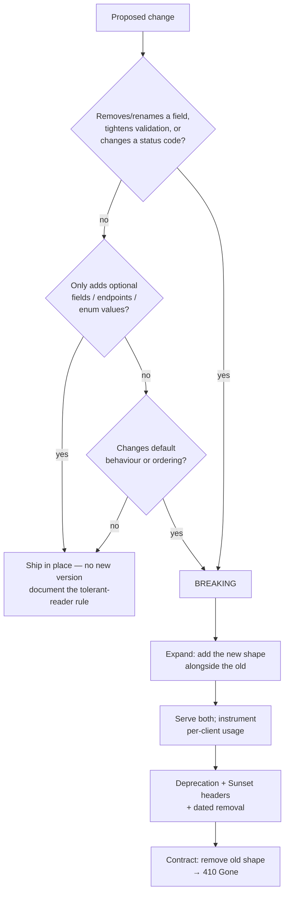

# API Versioning Coach

Versioning is a **compatibility contract**, not a URL cosmetic. This skill teaches the classification first
(breaking vs additive), then the transport (path, header, media type), then the exit ramp — following the
teach-the-trade-offs mandate in [`AGENTS.md`](../../../AGENTS.md).

## When to use

- A change is queued and nobody can say confidently whether it breaks existing clients.
- The team is arguing `/v2/orders` vs `Accept: application/vnd.acme.v2+json` vs a version header.
- An endpoint must die and you need a runway clients can automate against (headers, dates, comms).
- **Don't use it for** database or event-payload schemas — that's
  [schema-evolution-coach](../schema-evolution-coach/SKILL.md); or for writing the spec document itself —
  that's [openapi-spec-writer](../openapi-spec-writer/SKILL.md).

## First principles: version only when compatibility actually breaks

A new version is the *cost of failure* to evolve compatibly. Google's API Improvement Proposals (AIP-180,
"Backwards compatibility", and AIP-185, "Versioning") and Roy Fielding's REST writing push the same point:
additive, tolerantly-read changes need no version at all. The **robustness principle** (Postel, codified in
RFC 1122 §1.2.2) is what makes that possible on the client side — ignore unknown fields.



| Strategy | Where the version lives | Cacheable / greppable | Cost | Best for |
| --- | --- | --- | --- | --- |
| URI path (`/v1/orders`) | path segment | trivially — distinct URLs | duplicated routes, ugly at v3 | public APIs, fast rollback |
| Custom header (`X-Api-Version: 2026-01-15`) | request header | needs `Vary`; invisible in logs by default | date pinning is powerful | pinned-per-tenant APIs |
| Media type (`Accept: application/vnd.acme.v2+json`) | content negotiation (RFC 9110 §12) | correct HTTP semantics | clients rarely set `Accept` well | hypermedia / strict-REST shops |
| Query param (`?version=2`) | query string | cache keys leak, easy to forget | weakest discipline | quick internal spikes only |
| Additive-only (no version) | nowhere | n/a | requires tolerant readers + strong governance | GraphQL, internal APIs |

**Named practice:** GitHub's REST API pins a date via `X-GitHub-Api-Version: 2022-11-28`; Stripe pins a
dated version per account and lets callers override per request. Both prove the same rule — *dates beat
integers*, because `v2` tells a client nothing about when it was frozen or what changed.

## Deprecation mechanics clients can automate

| Signal | Source | Meaning |
| --- | --- | --- |
| `Sunset: Wed, 30 Sep 2026 23:59:59 GMT` | **RFC 8594**, "The Sunset HTTP Header Field" | the resource is expected to become unresponsive after this HTTP-date |
| `Link: <https://docs.acme.dev/deprecations/orders-v1>; rel="sunset"` | RFC 8594 + RFC 8288 (Web Linking) | machine-readable "why / what next" |
| `Deprecation: @1767225600` | RFC 9745, "The Deprecation HTTP Header Field" | signals deprecation, optionally dated — **confirm the current status and syntax on rfc-editor.org before shipping**; if unsure, ship `Sunset` alone |
| `410 Gone` (not `404`) | RFC 9110 §15.5.11 | the resource existed and was intentionally removed |

Do **not** use the `Warning` header — RFC 9111 obsoleted it. Semantic Versioning 2.0.0 (semver.org) governs
your *SDK artifacts*, not your HTTP surface; keep the two numbering schemes separate and mapped in docs.

## Procedure

1. **Classify the change** with the flowchart. Write one line: `BREAKING | ADDITIVE — because <rule>`.
2. **Try to make it additive first.** Add a new field, keep the old one populated, dual-write. Most
   "breaking" changes are a rename in disguise — see expand/contract (Fowler's bliki, *ParallelChange*).
3. **Pick the transport** from the table and record the decision, including the rejected option and why.
4. **Instrument before you deprecate.** You cannot retire what you cannot measure:
   ```bash
   # per-client usage of the doomed surface, from access logs
   grep -F ' /v1/orders' access.log | awk '{print $NF}' | sort | uniq -c | sort -rn | head
   ```
5. **Announce with headers on every response** of that surface, from day 1 of the runway:
   ```bash
   curl -sS -D - -o /dev/null https://api.acme.dev/v1/orders
   # HTTP/1.1 200 OK
   # Sunset: Wed, 30 Sep 2026 23:59:59 GMT
   # Link: <https://docs.acme.dev/deprecations/orders-v1>; rel="sunset"
   # Vary: X-Api-Version
   ```
6. **Set a runway proportional to the audience**: internal ~1 sprint, partner ~1–2 quarters, public ≥ 6–12
   months. State the date in the response, the docs, and the changelog — all three, identical.
7. **Prove compatibility in CI**, not in review: diff the spec and fail the build on breaking edits.
   ```bash
   npx @redocly/cli lint openapi.yaml
   docker run --rm -v "$PWD:/spec" openapitools/openapi-diff:latest \
     /spec/openapi-v1.yaml /spec/openapi-head.yaml --fail-on-incompatible
   ```
8. **Contract**: remove the old surface on the Sunset date, return `410 Gone` with the Link header for at
   least one more runway, then close with the **Learning Footer**.

## Output shape

```
Change: <one sentence>
Classification: BREAKING | ADDITIVE — rule: <removed field | tightened validation | added optional field | ...>
Can it be additive? <yes → expand/contract plan | no → why not>
Strategy: <URI path | version header | media type | additive-only>   Rejected: <option> because <...>
Version identifier: <v2 | 2026-01-15>   Pinning: <per-request | per-tenant default>
Runway: announce <date> → Sunset <HTTP-date> → 410 Gone <date>   Audience: <internal|partner|public>
Headers on the old surface: Sunset: <...> · Link: <...>; rel="sunset" · Vary: <...>
Migration for clients: <2–4 concrete steps>
CI guard: <openapi-diff | contract tests | consumer pact>
Next: <schema-evolution-coach | openapi-spec-writer | contract-testing-coach>
Learning Footer
```

## Worked example — splitting `name` into `given_name` + `family_name`

`GET /v1/customers/c_1` returns `{"id":"c_1","name":"Ada Lovelace"}`. Product wants structured names.

Removing `name` is **breaking** (rule: field removal). Expand/contract instead, across three releases:

| Phase | Server behaviour | Client impact | Headers |
| --- | --- | --- | --- |
| 1 · Expand | return `name` **and** `given_name`/`family_name`; accept either on write | none — tolerant readers ignore new fields | — |
| 2 · Deprecate | `name` still populated; new clients told to stop reading it | opt-in migration | `Sunset` + `Link rel="sunset"` on `/v1` |
| 3 · Contract | `/v2/customers` omits `name`; `/v1` → `410 Gone` | must be on `/v2` by the date | `410` + `Link` |

```http
GET /v1/customers/c_1 HTTP/1.1
Host: api.acme.dev

HTTP/1.1 200 OK
Content-Type: application/json
Sunset: Wed, 30 Sep 2026 23:59:59 GMT
Link: <https://docs.acme.dev/deprecations/customer-name>; rel="sunset"

{"id":"c_1","name":"Ada Lovelace","given_name":"Ada","family_name":"Lovelace"}
```

Only phase 3 needs a version number — phases 1 and 2 are pure addition. That is the whole lesson: a good
versioning strategy is mostly a strategy for *not* needing one.

## Tips

- Version the **representation**, not the service. One `/v2` for a single changed field taxes every other
  endpoint; per-resource media types keep the blast radius honest.
- If you version by header, always send `Vary: X-Api-Version`, or shared caches will poison clients.
- "We'll support v1 forever" means two behaviours maintained forever — put the removal date in the same PR
  as the new version, or it will never happen.
- Adding an **enum value** is breaking for clients that switch exhaustively; document the "unknown → default"
  rule up front, exactly as [schema-evolution-coach](../schema-evolution-coach/SKILL.md) does for Protobuf.
- GraphQL replaces versions with `@deprecated` field directives plus usage telemetry — see
  [graphql-schema-coach](../graphql-schema-coach/SKILL.md); gRPC uses package-level versions, see
  [grpc-coach](../grpc-coach/SKILL.md).
- Pair with [api-design-review](../api-design-review/SKILL.md),
  [api-pagination-coach](../api-pagination-coach/SKILL.md),
  [contract-testing-coach](../contract-testing-coach/SKILL.md),
  [idempotency-coach](../idempotency-coach/SKILL.md), and
  [data-contract-designer](../data-contract-designer/SKILL.md).
  Verify every RFC number against rfc-editor.org before quoting it (`AGENTS.md` §2), and end with the
  **Learning Footer** (`AGENTS.md`).
