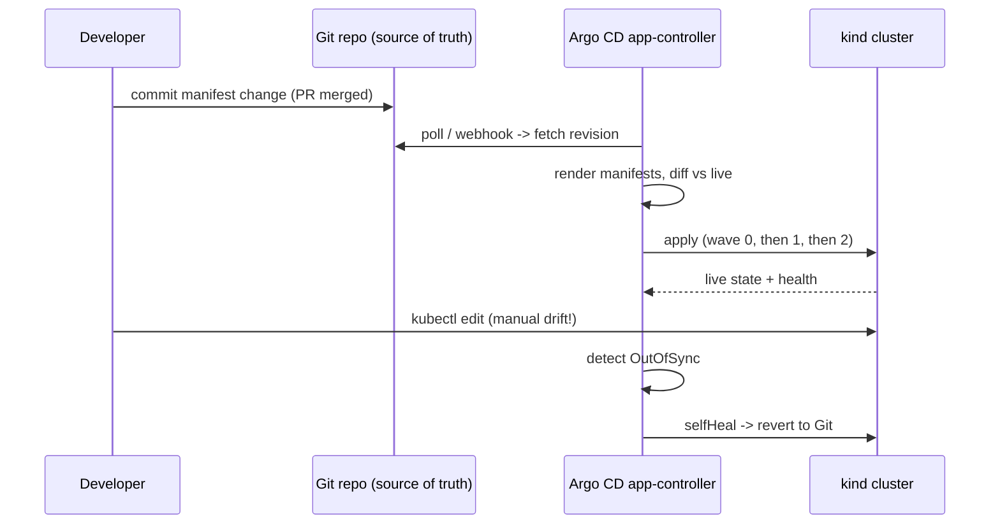

# Argo CD Local Lab

GitOps means the **cluster is a projection of Git**, and a controller — not a human — closes the gap. Learn it
by drifting a cluster and watching Argo CD undo you, per [`AGENTS.md`](../../../AGENTS.md). Everything runs on
a **free local cluster** (kind or k3d); verify each step against your own `argocd`/`kubectl` output.

## When to use

- Moving from `kubectl apply` in CI (push) to a pull-based GitOps controller.
- The learner needs to see reconciliation, drift repair and pruning *actually happen*.
- Scaling from one app to dozens without hand-writing an Application per environment.

## First principles

Argo CD runs **in** the cluster, watches a Git revision, renders manifests (plain YAML, Kustomize, Helm) and
compares the rendered desired state to live state. `OutOfSync` is a *diff*, `Degraded` is a *health* verdict —
two independent axes. Reconciliation is a loop, so any change you make by hand is, by definition, drift.



| Setting | What it does | Turn it on when | Risk if on |
| --- | --- | --- | --- |
| `syncPolicy.automated` | Syncs without a human clicking Sync | You trust CI + review on the repo | A bad merge deploys itself |
| `automated.prune: true` | Deletes resources removed from Git | Git is truly authoritative | A path/rename mistake deletes live objects |
| `automated.selfHeal: true` | Reverts manual cluster edits | Drift must not persist | Breaks emergency `kubectl edit` fixes |
| `syncOptions: CreateNamespace=true` | Creates the destination namespace | Namespace lives with the app | Namespace not managed as a separate object |
| `argocd.argoproj.io/sync-wave: "N"` | Orders resources low→high within a sync | CRDs/DBs before workloads | Deadlock if a wave never becomes healthy |
| `ignoreDifferences` | Excludes fields (e.g. HPA-managed `replicas`) from the diff | Another controller owns the field | Real drift can hide behind the exclusion |

## Procedure

1. **Cluster**: `kind create cluster --name gitops` (or `k3d cluster create gitops`); check `kubectl get nodes`.
2. **Install Argo CD** (Argo CD docs, *Getting Started*, argo-cd.readthedocs.io):
   `kubectl create namespace argocd` then
   `kubectl apply -n argocd -f https://raw.githubusercontent.com/argoproj/argo-cd/stable/manifests/install.yaml`.
   Wait: `kubectl -n argocd rollout status deploy/argocd-server`.
3. **Reach the UI/API**: `kubectl port-forward svc/argocd-server -n argocd 8080:443`, get the bootstrap
   password with
   `kubectl -n argocd get secret argocd-initial-admin-secret -o jsonpath="{.data.password}"` (base64-decode it),
   then `argocd login localhost:8080 --username admin --insecure`.
4. **Declare an Application as a CR** (`argoproj.io/v1alpha1`, kind `Application`, namespace `argocd`) with
   `spec.source` (`repoURL`, `path`, `targetRevision`), `spec.destination` (`server:
   https://kubernetes.default.svc`, `namespace`), and `spec.project: default`. Apply it with `kubectl apply -f`
   — declaring Argo CD's own config in Git is the point.
5. **Sync manually once** to see the diff first: `argocd app diff <app>`, then `argocd app sync <app>`,
   then `argocd app get <app>` → expect `Synced` / `Healthy`.
6. **Enable automation**: add `syncPolicy.automated.prune: true`, `selfHeal: true` and
   `syncOptions: [CreateNamespace=true]`; re-apply the Application.
7. **Drift drill (the core lesson)**: `kubectl -n <ns> scale deploy/<name> --replicas=7`, then watch
   `argocd app get <app> --refresh` go `OutOfSync` and self-heal back to the Git value. Then delete a
   resource from Git, commit, and watch `prune` remove it from the cluster.
8. **Order the rollout with sync waves**: annotate resources with
   `argocd.argoproj.io/sync-wave: "-1"` (CRDs, namespaces), `"0"` (config), `"1"` (workloads). Re-sync and
   read the order in `argocd app get <app>`.
9. **Scale out**: create an *app-of-apps* — one Application whose `path` contains other Application manifests —
   then replace it with an `ApplicationSet` (kind `ApplicationSet`, `argoproj.io/v1alpha1`) using a `list` or
   `git` generator to template one Application per environment.
10. **Verification step**: `argocd app list` shows every app `Synced`+`Healthy`; a manual `kubectl edit` is
    reverted within the reconcile interval; a resource deleted in Git disappears from the cluster.
11. **Clean up**: `argocd app delete <app>` (note the cascading delete of live resources), then
    `kind delete cluster --name gitops`.

## Output shape

```
GitOps setup — <app>  | cluster: kind/k3d  | Argo CD ns: argocd

Application (argoproj.io/v1alpha1):
  source: repoURL=<...> path=<...> targetRevision=<branch/tag>
  destination: server=https://kubernetes.default.svc namespace=<ns>
  syncPolicy: automated{prune: true, selfHeal: true} syncOptions=[CreateNamespace=true]
  sync-waves: -1 CRDs | 0 config | 1 workloads

Verification:
  argocd app get <app>  -> Synced / Healthy
  drift drill: scale to 7 -> OutOfSync -> selfHeal -> replicas back to <n>  ✔
  prune drill: removed <kind>/<name> from Git -> deleted from cluster       ✔
Scale-out: app-of-apps | ApplicationSet generator=<list|git|cluster>
Risks accepted: <prune blast radius, secrets handling>
```

## Tips

- Never commit plain Secrets to Git — use a sealed/external secrets operator; GitOps makes leaks permanent.
- `prune` plus a wrong `path` is the classic outage; rehearse it locally before enabling it anywhere real.
- `selfHeal` fights humans by design — agree with the team that emergency fixes go through Git, or you get
  a revert loop mid-incident.
- Pin `targetRevision` to a tag or commit for production; tracking `HEAD` means deploys happen on merge.
- Use `ignoreDifferences` for fields owned by other controllers (HPA replicas) — but review it periodically,
  since it also hides genuine drift.
- Theory and repo layout live in [gitops-coach](../gitops-coach/SKILL.md); manifest quality in
  [kubernetes-manifest-coach](../kubernetes-manifest-coach/SKILL.md); scope the controller's permissions with
  [k8s-rbac-lab](../k8s-rbac-lab/SKILL.md); gate what it may deploy with
  [k8s-admission-policy-lab](../k8s-admission-policy-lab/SKILL.md); then add canaries via
  [progressive-delivery-lab](../progressive-delivery-lab/SKILL.md).
- End with the **Learning Footer** (`AGENTS.md`) — one drift the learner should cause and watch heal.
