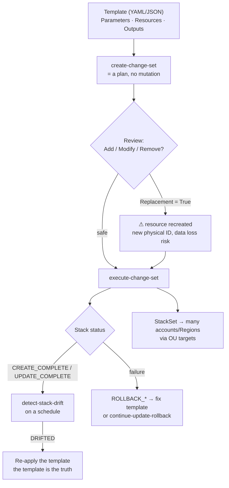

# AWS CloudFormation Lab

Learn AWS's native IaC engine by building a stack you can break on purpose — **template → change set →
stack → drift → StackSet** — following the teach-from-first-principles contract in
[`AGENTS.md`](../../../AGENTS.md). The lesson is the *state machine*, not the YAML syntax.

## When to use

- The learner needs deterministic, reviewable infrastructure and keeps clicking through the console.
- A stack update failed and they don't understand `UPDATE_ROLLBACK_FAILED` or why drift appeared.
- They must choose between CloudFormation, CDK, and Terraform and want the trade-offs, not a slogan.
- **Don't** use it for one-off exploration or data migrations — IaC pays back on repeated, reviewed change.

## First principles: a stack is a reconciled state machine

CloudFormation is a *declarative desired-state* service: you submit a template, it computes a change set
against the stack's recorded state, then executes that plan resource-by-resource with automatic rollback
on failure (AWS CloudFormation User Guide, *Stacks* and *Using change sets*). Every claim below maps to a
documented lifecycle status you can observe in `describe-stack-events`.



| Concern | CloudFormation | AWS CDK | Terraform (HashiCorp) |
| --- | --- | --- | --- |
| Language | YAML/JSON declarative | TypeScript/Python/Java/Go/C# → synthesizes CFN | HCL declarative |
| State store | AWS-managed, in-service | AWS-managed (it *is* CloudFormation) | your backend (S3 + lock) |
| Plan step | change set | `cdk diff` (a change set) | `terraform plan` |
| Multi-cloud | AWS only | AWS only (CDKTF is separate) | many providers |
| Drift detection | built in (`detect-stack-drift`) | inherits CFN | `plan` shows drift |
| Multi-account rollout | **StackSets** + OU targets | CDK Pipelines / StackSets | workspaces + CI |
| Cost | free; you pay for resources | free | OSS free; HCP Terraform priced |
| Best when | you want zero extra state to babysit | you want loops, types, constructs | you span AWS + SaaS providers |

**Trade-off to say out loud:** CDK is not an alternative *engine* — it emits CloudFormation, so it inherits
change sets, rollback, and drift. The genuine fork is CloudFormation/CDK (AWS-managed state, no lock file
to lose) versus Terraform (own state file, broader provider surface, an explicit plan you must store).

## Procedure

1. **Scope one stack.** One lifecycle = one stack. Networking, data, and app change at different speeds, so
   split them and wire the seams with `Outputs` + `Fn::ImportValue` or SSM parameters.
2. **Write the template** with `Parameters` (inputs), `Resources` (the only required section), `Outputs`,
   and `Conditions` for env differences. Validate first — it costs nothing:

   ```bash
   aws cloudformation validate-template --template-body file://net.yaml
   ```

3. **Lint it.** `pip install cfn-lint && cfn-lint net.yaml` catches bad resource properties that
   `validate-template` (syntax only) will happily pass.
4. **Create a change set — never a blind update.** This is the plan step and it mutates nothing:

   ```bash
   aws cloudformation create-change-set --stack-name learn-net --change-set-name cs1 \
     --template-body file://net.yaml --parameters ParameterKey=EnvName,ParameterValue=lab \
     --capabilities CAPABILITY_NAMED_IAM
   aws cloudformation describe-change-set --stack-name learn-net --change-set-name cs1 \
     --query 'Changes[].ResourceChange.[Action,LogicalResourceId,Replacement]' --output table
   ```

5. **Read `Replacement`.** `True` means the resource is destroyed and recreated with a new physical ID —
   for an RDS instance or an EBS volume that is a data event, not a config change.
6. **Execute and watch:** `aws cloudformation execute-change-set --stack-name learn-net --change-set-name cs1`
   then `aws cloudformation describe-stack-events --stack-name learn-net --max-items 20`.
7. **Protect what matters.** Add `DeletionPolicy: Retain` / `UpdateReplacePolicy: Retain` to stateful
   resources, and turn on termination protection:
   `aws cloudformation update-termination-protection --enable-termination-protection --stack-name learn-net`.
8. **Break it on purpose,** then reconcile — edit a property in the console and detect the drift:

   ```bash
   ID=$(aws cloudformation detect-stack-drift --stack-name learn-net --query StackDriftDetectionId --output text)
   aws cloudformation describe-stack-drift-detection-status --stack-drift-detection-id "$ID"
   aws cloudformation describe-stack-resource-drifts --stack-name learn-net --output table
   ```

9. **Scale out with StackSets** when the same guardrail must exist in many accounts. Service-managed
   permissions target Organizations OUs directly; self-managed needs the
   `AWSCloudFormationStackSetAdministrationRole` / `...ExecutionRole` pair.
10. **Clean up:** `aws cloudformation delete-stack --stack-name learn-net`, then confirm `DELETE_COMPLETE`.
    CloudFormation is free — the NAT gateways, VPC endpoints, and RDS instances inside it are not.

## Output shape

```
Stack: <name> | Region: <us-east-1> | Account model: <single | StackSet over OU ou-xxxx>
Template: <file> | validate: pass | cfn-lint: <n findings>
Change set: <name> → Add <n> · Modify <n> · Remove <n> · Replacement=True on: <logical IDs | none>
Guardrails: DeletionPolicy=Retain on <resources> | termination protection: on
Deploy: execute-change-set → <CREATE_COMPLETE|UPDATE_COMPLETE> in <n>s
Drift: <IN_SYNC | DRIFTED: property → expected vs actual>
Rollout: StackSet <name> → OUs <...> × Regions <...>, max concurrent <n>, failure tolerance <n>
Engine choice: CloudFormation | CDK | Terraform — because <one honest reason>
Cost: CFN free; resources ≈ $<x>/day  ⚠ delete NAT/RDS first
Next: <terraform-basics-lab | azure-bicep-lab | aws-well-architected-review>
Learning Footer
```

## Worked example — a drift-detectable stack with a retained bucket

```yaml
AWSTemplateFormatVersion: '2010-09-09'
Description: Minimal, drift-detectable lab stack.
Parameters:
  EnvName:
    Type: String
    AllowedValues: [lab, prod]
    Default: lab
Conditions:
  IsProd: !Equals [!Ref EnvName, prod]
Resources:
  Logs:
    Type: AWS::S3::Bucket
    DeletionPolicy: Retain
    UpdateReplacePolicy: Retain
    Properties:
      BucketEncryption:
        ServerSideEncryptionConfiguration:
          - ServerSideEncryptionByDefault: { SSEAlgorithm: AES256 }
      PublicAccessBlockConfiguration:
        BlockPublicAcls: true
        BlockPublicPolicy: true
        IgnorePublicAcls: true
        RestrictPublicBuckets: true
      VersioningConfiguration:
        Status: !If [IsProd, Enabled, Suspended]
Outputs:
  BucketName:
    Value: !Ref Logs
    Export:
      Name: !Sub '${AWS::StackName}-bucket'
```

Deploy with the higher-level wrapper — it creates *and* executes a change set for you:

```bash
aws cloudformation deploy --template-file lab.yaml --stack-name learn-lab \
  --parameter-overrides EnvName=lab --no-execute-changeset   # drop the flag to actually apply
```

Now toggle versioning in the console and re-run step 8: `describe-stack-resource-drifts` reports `MODIFIED`
with expected vs actual for `VersioningConfiguration`. The template is the truth; the console edit is the bug.

## Tips

- A change set is a *plan*: reviewing `Replacement=True` is the one habit that prevents accidental data loss
  during an "innocent" update.
- `UPDATE_ROLLBACK_FAILED` is not fatal — use `continue-update-rollback --resources-to-skip`, then fix the
  underlying resource by hand.
- Cross-stack `Export`/`ImportValue` creates a hard dependency you cannot delete around; prefer SSM Parameter
  Store for loose coupling between stacks.
- Console edits are how drift is born — schedule drift detection and treat `DRIFTED` as an incident.
- Pair with [terraform-basics-lab](../terraform-basics-lab/SKILL.md),
  [terraform-state-lab](../terraform-state-lab/SKILL.md),
  [azure-bicep-lab](../azure-bicep-lab/SKILL.md),
  [aws-organizations-scp-lab](../aws-organizations-scp-lab/SKILL.md),
  [aws-vpc-lab](../aws-vpc-lab/SKILL.md), and
  [aws-well-architected-review](../aws-well-architected-review/SKILL.md).
  Close with the **Learning Footer** (`AGENTS.md`): one drift to reconcile, one `Replacement=True` to avoid.
