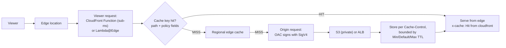

# AWS CloudFront Lab

Learn the CDN by measuring it: **origin lock-down → cache key → TTL → invalidation → edge compute**, taught
from first principles per [`AGENTS.md`](../../../AGENTS.md). The goal is a *provable* cache hit ratio, not a
distribution that merely exists.

## When to use

- The learner is serving a static site or API and wants latency, egress cost, and TLS handled at the edge.
- Their bucket is public "because CloudFront needs it" — the classic Origin Access Control lesson.
- Cache hit ratio is low, or they invalidate `/*` on every deploy and then wonder about the bill.
- **Don't** use it for internal east-west traffic; that is a load balancer or PrivateLink problem.

## First principles: the cache key decides everything

CloudFront caches an object under a **cache key** derived from the origin, the path, and exactly the headers,
cookies, and query strings your **cache policy** includes (Amazon CloudFront Developer Guide, *Control the
cache key with a policy*). Every value you add multiplies stored variants, so the hit ratio falls. The
**origin request policy** is a separate control: what is *forwarded* to the origin without joining the key.



| Control | Where it applies | What it changes | Pitfall |
| --- | --- | --- | --- |
| Cache policy | edge | the **cache key** + TTL bounds | adding `Accept-Language` can 10× your variants |
| Origin request policy | origin fetch | headers/cookies/query sent onward | not in the key — origin may still vary |
| Response headers policy | response | CORS, HSTS, CSP without touching the app | forgetting `Vary` semantics |
| `Cache-Control: max-age` | origin | authoritative TTL between Min and Max | ignored if Min TTL is higher |
| Invalidation | on demand | evicts paths early | first 1,000 paths/month free, then billed |
| Versioned filenames | build step | *no* invalidation needed | requires a hashing build pipeline |
| OAC (SigV4) | origin auth | bucket stays private | replaces legacy OAI — use OAC for new work |
| Signed URL / cookie | viewer auth | time-boxed private access | needs a key group + public key |

**Trade-off to say out loud:** invalidation is a *fix*; versioned object names (`app.9f3c1.js`) are a
*design*. Immutable, content-hashed assets with `Cache-Control: max-age=31536000, immutable` reach a
near-100 % hit ratio and never need an invalidation — only the tiny `index.html` takes a short TTL.

| Edge compute | CloudFront Functions | Lambda@Edge |
| --- | --- | --- |
| Triggers | viewer request, viewer response | viewer **and origin** request/response |
| Runtime | JavaScript (`cloudfront-js-2.0`) | Node.js / Python |
| Duration | sub-millisecond | up to 5 s (viewer) / 30 s (origin) |
| Network / filesystem access | none | yes |
| Request body access | no | yes (origin triggers) |
| Cost | a fraction of Lambda@Edge per request | higher, plus compute duration |
| Use for | header rewrite, URL normalization, redirects | auth callouts, image resize, origin selection |

## Procedure

1. **Create a private origin.** Block all public access on the bucket; CloudFront authenticates to it.
2. **Create an Origin Access Control** — the modern SigV4 replacement for OAI:

   ```bash
   aws cloudfront create-origin-access-control --origin-access-control-config \
     'Name=lab-oac,Description=lab,SigningProtocol=sigv4,SigningBehavior=always,OriginAccessControlOriginType=s3'
   ```

3. **Attach the OAC to the distribution origin**, then apply the bucket policy CloudFront generates. It
   grants `s3:GetObject` to the service principal, scoped to *your* distribution:

   ```json
   {
     "Version": "2012-10-17",
     "Statement": [{
       "Sid": "AllowCloudFrontServicePrincipalReadOnly",
       "Effect": "Allow",
       "Principal": { "Service": "cloudfront.amazonaws.com" },
       "Action": "s3:GetObject",
       "Resource": "arn:aws:s3:::lab-site-bucket/*",
       "Condition": { "StringEquals": {
         "AWS:SourceArn": "arn:aws:cloudfront::111122223333:distribution/E1EXAMPLE123"
       }}
     }]
   }
   ```

4. **Pick a managed cache policy** rather than hand-rolling one, and read the real IDs from the API instead
   of a blog post:

   ```bash
   aws cloudfront list-cache-policies --type managed \
     --query 'CachePolicyList.Items[].{name:CachePolicy.CachePolicyConfig.Name,id:CachePolicy.Id}' --output table
   ```

   `CachingOptimized` (`658327ea-f89d-4fab-a63d-7e88639e58f6`) enables compression and keys on path only.
5. **Set TTLs at the origin,** not in the console: immutable assets `max-age=31536000, immutable`;
   `index.html` `max-age=0, s-maxage=60, must-revalidate`.
6. **Measure before tuning.** CloudFront publishes `CacheHitRate` in CloudWatch (namespace `AWS/CloudFront`,
   Region **us-east-1**). Record a baseline, change one policy field, re-measure.
7. **Invalidate only the mutable paths** on deploy:
   `aws cloudfront create-invalidation --distribution-id E1EXAMPLE123 --paths /index.html /`.
   ⚠ `/*` counts as one path but drops the whole cache; 1,000 paths per month are free.
8. **Restrict private content** with a key group: upload a public key, create the key group, attach it to
   the behaviour, then sign URLs or cookies with the matching private key and a short expiry.
9. **Add edge logic** with a CloudFront Function first; escalate to Lambda@Edge only when you need the
   network, the request body, or an origin trigger.
10. **Clean up:** disable the distribution, wait for status `Deployed`, then delete it. The CloudFront free
    tier covers 1 TB out and 10 M requests per month; Lambda@Edge and extra invalidations bill separately.

## Output shape

```
Distribution: <id> | Origin: <S3 bucket | ALB DNS> | Origin auth: OAC (sigv4, always)
Behaviours: <path pattern> → cache policy <name/id> · origin request policy <name> · compress: on
Cache key: path <+ query? + headers? + cookies?>   Variants estimated: <n>
TTL: immutable max-age=31536000 | html s-maxage=60   Min/Default/Max: <n/n/n>
Measured: CacheHitRate before <x%> → after <y%>  (CloudWatch AWS/CloudFront, us-east-1)
Invalidation policy: <versioned filenames | paths: /index.html>   ⚠ 1,000 paths/month free
Private content: <none | signed URLs via key group <id>, expiry <n> min>
Edge compute: <none | CloudFront Function: <purpose> | Lambda@Edge: <trigger + why>>
Cleanup: disable → wait Deployed → delete
Next: <aws-s3-lab | aws-apigateway-lab | web-perf-audit>
Learning Footer
```

## Worked example — a viewer-request Function that normalizes the cache key

Strip marketing query strings so `?utm_source=x` cannot fragment the cache, and rewrite a directory URL to
its index document (a real `cloudfront-js-2.0` handler):

```javascript
function handler(event) {
    var request = event.request;
    // Tracking params never change the response, so keep them out of the cache key.
    ['utm_source', 'utm_medium', 'utm_campaign', 'gclid', 'fbclid'].forEach(function (k) {
        delete request.querystring[k];
    });
    if (request.uri.endsWith('/')) {
        request.uri += 'index.html';
    } else if (request.uri.indexOf('.') === -1) {
        request.uri += '/index.html';
    }
    return request;
}
```

```bash
aws cloudfront create-function --name normalize-key \
  --function-config 'Comment=strip utm + index rewrite,Runtime=cloudfront-js-2.0' \
  --function-code fileb://normalize.js
aws cloudfront test-function --name normalize-key --if-match <ETag> --stage DEVELOPMENT \
  --event-object fileb://event.json     # test before publishing — instant and free
```

Publish it, associate it with the default behaviour on **viewer request**, then re-measure `CacheHitRate`.

## Tips

- OAI is legacy; **OAC** is the current mechanism and the only one supporting SSE-KMS origins in all
  Regions — say so when reviewing old templates.
- Every field added to the cache key is a multiplier on stored variants. Justify each one out loud.
- `x-cache: Hit from cloudfront` in the response headers is your instant feedback loop while tuning.
- An ACM certificate for a distribution must live in **us-east-1**, whatever Region the origin is in.
- Signed URLs cannot be individually revoked, but access can be cut off by removing the public key from the key group (or detaching the key group from the behaviour) — keep expiries short and rotate keys.
- Pair with [aws-s3-lab](../aws-s3-lab/SKILL.md),
  [aws-apigateway-lab](../aws-apigateway-lab/SKILL.md),
  [aws-cloudwatch-lab](../aws-cloudwatch-lab/SKILL.md),
  [aws-kms-envelope-encryption-lab](../aws-kms-envelope-encryption-lab/SKILL.md),
  [caching-strategy-coach](../caching-strategy-coach/SKILL.md), and
  [web-perf-audit](../web-perf-audit/SKILL.md).
  Finish with the **Learning Footer** (`AGENTS.md`): one cache-key field to drop, one TTL to set at origin.
