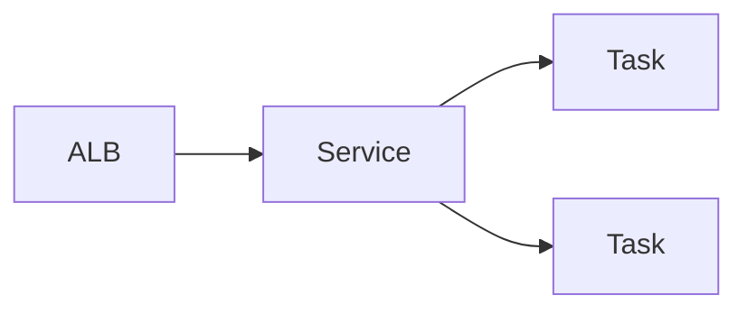

# AWS ECS Lab

Learn ECS by running one container properly — define the task, pick the launch type, then scale it behind
a load balancer — per [`AGENTS.md`](../../../AGENTS.md). Pairs with [serverless-designer](../serverless-designer/SKILL.md) and [aws-vpc-lab](../aws-vpc-lab/SKILL.md).

## When to use

- The learner wants a running, load-balanced container, not just orchestration theory.
- Reinforcing containerized delivery for a **cloud/DevOps/backend** role-agent.

## Anatomy



## Procedure

1. **Write the task definition:** image, CPU/memory, ports, and log config; set an **execution role** (pull
   image, write logs) separate from the **task role** (app permissions).
2. **Pick the launch type:** **Fargate** = no servers, pay per task (great for the lab); **EC2** = you run
   the instances, denser and cheaper at steady scale (Amazon ECS Developer Guide, *Launch types*).
3. **Create a service:** set a desired count so ECS restarts failed tasks and does rolling deployments —
   don't run bare tasks for anything long-lived.
4. **Load balance:** attach an Application Load Balancer + target group; Fargate uses `awsvpc` networking,
   so each task gets its own ENI in your [VPC](../aws-vpc-lab/SKILL.md).
5. **Secrets & config:** inject secrets from Secrets Manager/SSM via the task definition — never bake them
   into the image.
6. ⚠ **Verify & clean up:** hit the ALB DNS, watch tasks stay healthy, then delete the service, ALB, and
   cluster — running tasks and the ALB bill by the hour.

## Output shape

```
Workload: <what runs> | Image: <repo:tag>
Task def: <cpu/mem> | exec role (pull/logs) + task role (app)
Launch: Fargate (lab) | EC2 (steady scale) — because …
Service: desired=<N>, rolling deploy | ALB → target group
Verify: ALB DNS responds | unhealthy task replaced
Cleanup: service → ALB → cluster  [⚠ tasks + ALB bill hourly]
```

## Tips

- Keep the two roles straight: execution role pulls the image; task role is what your app may call.
- Fargate is fastest to learn; move to EC2 only when density or cost at scale justifies the ops.
- End with the **Learning Footer** (`AGENTS.md`) — one role to scope down + the Fargate/EC2 break-even to estimate yourself.
