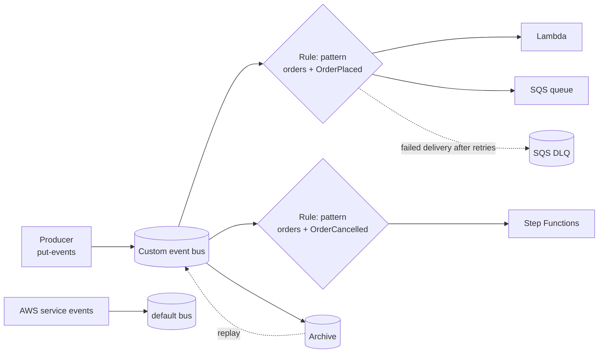

# AWS EventBridge Lab

Learn EventBridge by wiring a real event flow — publish, match, fan out, fail safely, then replay — per
[`AGENTS.md`](../../../AGENTS.md). Neighbours worth doing too: [aws-sns-lab](../aws-sns-lab/SKILL.md),
[aws-sqs-lab](../aws-sqs-lab/SKILL.md), [aws-stepfunctions-lab](../aws-stepfunctions-lab/SKILL.md).

## When to use

- The learner wants producers and consumers decoupled *without* the producer knowing who listens.
- They must choose between **EventBridge, SNS, and SQS** and keep guessing.
- Reinforcing event-driven architecture for a **cloud / backend / integration** role-agent.

## Mental model

An event is a **fact that already happened**, published to a **bus**. **Rules** match events by *pattern*
(content-based filtering on `source`, `detail-type`, and any field inside `detail`) and push a copy to each
**target** (Amazon EventBridge User Guide, *Events and event patterns*). The producer never learns who
consumed it — that is the whole decoupling win.



## EventBridge vs SNS vs SQS

| Dimension | **EventBridge** | **SNS** | **SQS** |
| --- | --- | --- | --- |
| Shape | Bus + rules, many-to-many | Topic pub/sub, one-to-many | Queue, point-to-point |
| Filtering | Rich **event patterns** on any `detail` field | Message **attribute** (and payload) filter policies | None — consumer filters after receive |
| Consumers | Many AWS service targets, SaaS partners, API destinations | Subscribers (SQS, Lambda, HTTP, email, SMS) | Pollers you write |
| Buffering | No queue of its own — add SQS as a target | No | **Yes** — the buffer/back-pressure primitive |
| Ordering | Not ordered | FIFO topics available | FIFO queues available |
| Reach for it when | Routing by content to many different consumers | Simple broadcast / notification fan-out | Smoothing bursts, retries, back-pressure |

The mature pattern is **EventBridge rule → SQS queue → consumer**: EventBridge does the routing, SQS does
the buffering and retry, and the consumer stays boring.

## Procedure

1. **Set context.** Cost note: AWS-service events on the default bus are free to receive; **custom events
   you publish are billed per million** and archive storage plus replay are billed separately — check the
   official Amazon EventBridge pricing page before flooding a bus in a loop.
   ```bash
   export AWS_REGION=us-east-1
   aws events create-event-bus --name lab-bus
   ```
2. **Create a rule with a real event pattern** — patterns match *subsets*; unmentioned fields are ignored:
   ```bash
   aws events put-rule --name order-placed --event-bus-name lab-bus \
     --event-pattern '{"source":["lab.orders"],"detail-type":["OrderPlaced"],"detail":{"amount":[{"numeric":[">",100]}]}}'
   ```
3. **Add targets, a DLQ, and a retry policy.** A target without a DLQ silently drops events after the
   retry window (default: up to 24 hours / 185 attempts with exponential backoff, per the EventBridge User
   Guide) — always attach one:
   ```bash
   aws events put-targets --rule order-placed --event-bus-name lab-bus --targets \
     'Id=q1,Arn=<SQS_TARGET_ARN>,DeadLetterConfig={Arn=<SQS_DLQ_ARN>},RetryPolicy={MaximumRetryAttempts=3,MaximumEventAgeInSeconds=3600}'
   ```
   Grant EventBridge permission to write to the queue via the SQS **resource policy**
   (`events.amazonaws.com`) — missing that is the classic "rule matched but nothing arrived".
4. **Reshape the payload with an input transformer** so consumers get only what they need:
   wrap both inside the target's `InputTransformer` (they are **not** top-level target keys):
   `InputTransformer={InputPathsMap={id=$.detail.orderId,amt=$.detail.amount},InputTemplate='{"order":"<id>","total":<amt>}'}`.
5. **Publish and verify** — the verification step, not optional:
   ```bash
   aws events put-events --entries \
     'Source=lab.orders,DetailType=OrderPlaced,EventBusName=lab-bus,Detail="{\"orderId\":\"A-1\",\"amount\":150}"'
   aws sqs receive-message --queue-url <SQS_TARGET_URL> --wait-time-seconds 10
   ```
   Expect `FailedEntryCount: 0` from `put-events` **and** the transformed message in the queue. Then publish
   `amount: 10` and confirm it does **not** arrive — proving the pattern, not just the plumbing.
6. **Schedule work.** A rule on the **default** bus can use `--schedule-expression 'rate(5 minutes)'` or
   `cron(0 12 * * ? *)` (UTC). For anything real, prefer **Amazon EventBridge Scheduler**, which adds
   time zones, one-time schedules, and flexible time windows:
   ```bash
   aws scheduler create-schedule --name nightly-lab \
     --schedule-expression 'cron(0 2 * * ? *)' --schedule-expression-timezone 'Asia/Kolkata' \
     --flexible-time-window '{"Mode":"OFF"}' --target '{"Arn":"<TARGET_ARN>","RoleArn":"<ROLE_ARN>"}'
   ```
7. **Archive and replay** — the "reprocess the last outage" superpower:
   ```bash
   aws events create-archive --archive-name lab-archive --event-source-arn <BUS_ARN> --retention-days 1
   aws events start-replay --replay-name lab-replay --event-source-arn <ARCHIVE_ARN> \
     --event-start-time <ISO8601> --event-end-time <ISO8601> \
     --destination '{"Arn":"<BUS_ARN>","FilterArns":["<RULE_ARN>"]}'
   ```
   Replay re-delivers events, so consumers **must be idempotent** — verify with a duplicate-safe key.
8. ⚠ **Clean up:** `aws events remove-targets`, `delete-rule`, `delete-archive`, `delete-event-bus`, then
   `aws scheduler delete-schedule` and the queues.

## Output shape

```
Flow: <producer> -> lab-bus -> <consumers>
Rule: <name>  Pattern: {"source":[...],"detail-type":[...],"detail":{...}}
Targets: <n>  Transformer: InputTransformer{InputPathsMap,InputTemplate} -> <slim payload>
Reliability: RetryPolicy{attempts=<3>, maxAge=<3600s>} + DLQ=<SQS ARN>
Schedule: rule cron(UTC) | EventBridge Scheduler <tz> <expression>
Verify: put-events FailedEntryCount=0 | matching event received | non-matching event NOT received
Archive/replay: retention=<days> -> replay <window> -> consumer idempotent? <yes/no>
Choice: EventBridge (routing) vs SNS (broadcast) vs SQS (buffer)  Picked: <...> because <...>
Cleanup: remove-targets -> delete-rule -> delete-archive -> delete-event-bus  [⚠ stops charges]
```

## Tips

- **A pattern is a subset match.** Fields you omit are wildcards; fields you list must all match. Test
  patterns in the console's *Sandbox* before blaming the target.
- **No DLQ = silent data loss.** Retries end; the DLQ is where you find out what your consumer rejected.
- **Permissions are the usual culprit.** EventBridge needs an IAM role (Lambda/Step Functions targets) or a
  resource policy (SQS/SNS targets) — see [aws-iam-lab](../aws-iam-lab/SKILL.md).
- **At-least-once delivery.** Duplicates happen, and replay guarantees them — make handlers idempotent.
- **Prefer Scheduler over scheduled rules** for new work: time zones, one-off schedules, and no default-bus
  restriction.
- **Do not build a workflow out of rules.** Chained events with no state machine is an unobservable
  distributed monolith — use [aws-stepfunctions-lab](../aws-stepfunctions-lab/SKILL.md) for orchestration
  and EventBridge for choreography.
- End with the **Learning Footer** (`AGENTS.md`) — one pattern to tighten + one DLQ to drain yourself.
