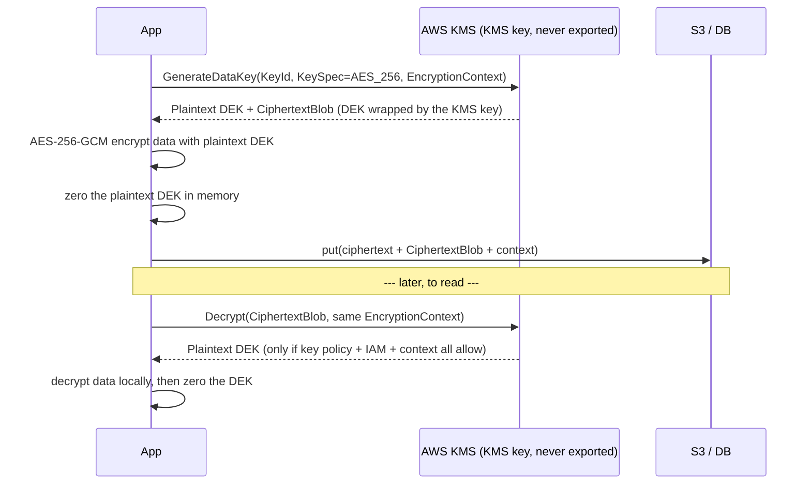

# AWS KMS Envelope Encryption Lab

Learn KMS by running the envelope chain yourself: **KMS key → data key → local encrypt → wrapped key stored
with the ciphertext**, taught from fundamentals per [`AGENTS.md`](../../../AGENTS.md). The lesson is *why*
your bulk data never travels to KMS.

## When to use

- The learner says "S3 is encrypted" but cannot explain who holds which key or what a DEK is.
- They must justify a customer-managed key (CMK) versus the free AWS-managed key in a design review.
- Cross-account or cross-Region decryption is failing and the error mentions the key policy or grants.
- **Don't** use it for secret *storage* — that is Secrets Manager or Parameter Store (which use KMS beneath).

## First principles: two keys, one round trip

A KMS key never leaves the HSM boundary and KMS will only encrypt payloads up to 4 KB directly. So real
systems use **envelope encryption**: ask KMS once for a data key, get back the same key twice — plaintext
and wrapped — encrypt locally with the plaintext copy, then destroy it from memory and persist only the
wrapped copy (AWS KMS Developer Guide, *Envelope encryption* and the `GenerateDataKey` API reference).



| Key type | Who owns the policy | Rotation | Cross-account | Cost | Choose when |
| --- | --- | --- | --- | --- | --- |
| **Customer managed** (CMK) | you (key policy + IAM) | automatic, configurable period; plus on-demand | yes, via key policy | ~$1/key/month + request charges | audit, cross-account, custom rotation, deny-on-demand |
| **AWS managed** (`aws/s3`, `aws/rds`) | AWS; you cannot edit | automatic, yearly | no | no monthly charge | default at-rest encryption in one account |
| **AWS owned** | AWS; invisible to you | AWS-defined | no | free | you have no compliance requirement at all |
| **Multi-Region key** (`mrk-…`) | you; replicas share key material | rotation replicates | yes | per-replica monthly charge | one ciphertext decryptable in several Regions |

Two independent authorization layers must **both** allow a call: the **key policy** on the KMS key (the
resource policy — a KMS key is not accessible by default just because you are the account admin) and the
**IAM policy** on the caller. Grants add a third, temporary path used by AWS services on your behalf.

**Encryption context** is additional authenticated data (AAD): non-secret key/value pairs that are bound
into the ciphertext, logged in CloudTrail, and usable in `kms:EncryptionContext:<key>` policy conditions.
Decrypt fails if the context does not match exactly — a cheap, powerful integrity control.

## Procedure

1. **Create a customer-managed symmetric key** (default spec `SYMMETRIC_DEFAULT` = AES-256):

   ```bash
   KEY=$(aws kms create-key --description "lab envelope key" --key-usage ENCRYPT_DECRYPT \
     --query KeyMetadata.KeyId --output text)
   aws kms create-alias --alias-name alias/lab-envelope --target-key-id "$KEY"
   ```

   ⚠ A CMK costs about **$1/month**; the free tier includes 20,000 requests/month. Schedule deletion when done.
2. **Read the default key policy** and understand it before editing:
   `aws kms get-key-policy --key-id "$KEY" --policy-name default --query Policy --output text | jq .`
   The default statement delegates to IAM in the owning account — removing it can lock you out permanently.
3. **Get a data key** and observe that you receive the *same* key twice:

   ```bash
   aws kms generate-data-key --key-id alias/lab-envelope --key-spec AES_256 \
     --encryption-context tenant=acme,purpose=lab \
     --query '{plain:Plaintext,wrapped:CiphertextBlob}' --output json > dek.json
   ```

4. **Encrypt locally** with the plaintext DEK (OpenSSL, the AWS Encryption SDK, or your language's AEAD
   library), then **discard the plaintext DEK** and store only `CiphertextBlob` with the ciphertext.
5. **Decrypt** — and prove the context is enforced by changing one character:

   ```bash
   jq -r .wrapped dek.json | base64 -d > dek.bin   # extract the wrapped DEK written in step 3
   aws kms decrypt --ciphertext-blob fileb://dek.bin \
     --encryption-context tenant=acme,purpose=lab --query Plaintext --output text | base64 -d > dek.key
   ```

   A mismatched context returns `InvalidCiphertextException`. That failure is the lesson.
6. **Turn on rotation and inspect it.** Automatic rotation creates new backing material while old ciphertexts
   stay decryptable, because the key ID does not change:

   ```bash
   aws kms enable-key-rotation --key-id "$KEY" --rotation-period-in-days 180
   aws kms get-key-rotation-status --key-id "$KEY"
   aws kms rotate-key-on-demand --key-id "$KEY"     # immediate rotation, e.g. after an incident
   ```

7. **Scope access with a condition,** not a wildcard — grant `kms:Decrypt` only for the right context and
   only via the right service (`kms:ViaService`, `kms:EncryptionContext:tenant`).
8. **Go multi-Region only if the ciphertext must move.** Create the primary with
   `aws kms create-key --multi-region`, then `aws kms replicate-key --key-id mrk-… --replica-region eu-west-1`.
   Replicas share key material and key ID, so a blob encrypted in one Region decrypts in the other.
9. **Verify in CloudTrail:** every `GenerateDataKey`/`Decrypt` is logged with the caller and the encryption
   context — that log *is* your audit evidence.
10. **Clean up:** `aws kms schedule-key-deletion --key-id "$KEY" --pending-window-in-days 7` (7–30 days;
    deletion is irreversible and any ciphertext under it becomes permanently unreadable).

## Output shape

```
Data: <what is protected> | Region(s): <...> | Key: alias/<name> (<CMK | AWS managed | multi-Region mrk-…>)
Why this key type: <audit / cross-account / rotation control / cost>
Envelope: GenerateDataKey(AES_256) → plaintext DEK (in memory only) + CiphertextBlob (stored with data)
Encryption context: {<k=v>, …}  → enforced in policy via kms:EncryptionContext:<k>
Key policy: <principals> | IAM: <policy> | Grants: <none | service grant for …>
Rotation: automatic every <n> days | last on-demand: <date> | old ciphertext still readable: yes
Cross-Region: <none | replica in <region>, same key ID>
Audit: CloudTrail events <GenerateDataKey|Decrypt> with context recorded
Cost: ~$1/key/month + $0.03 per 10k requests (check current KMS pricing) ⚠ schedule-key-deletion to stop
Next: <cloud-iam-least-privilege-coach | aws-s3-lab | secrets-management-coach>
Learning Footer
```

## Worked example — a key policy that only permits decrypt for one tenant

```json
{
  "Version": "2012-10-17",
  "Id": "lab-envelope-key-policy",
  "Statement": [
    {
      "Sid": "EnableIAMUserPermissions",
      "Effect": "Allow",
      "Principal": { "AWS": "arn:aws:iam::111122223333:root" },
      "Action": "kms:*",
      "Resource": "*"
    },
    {
      "Sid": "AppMayEncryptAndDecryptForAcmeOnly",
      "Effect": "Allow",
      "Principal": { "AWS": "arn:aws:iam::111122223333:role/app-runtime" },
      "Action": ["kms:GenerateDataKey", "kms:Decrypt", "kms:DescribeKey"],
      "Resource": "*",
      "Condition": {
        "StringEquals": {
          "kms:EncryptionContext:tenant": "acme",
          "kms:ViaService": "s3.us-east-1.amazonaws.com"
        }
      }
    }
  ]
}
```

`Resource: "*"` inside a key policy means "this key" — it is not a wildcard over your account. The
`root` statement is the delegation to IAM: keep it, or you can lock yourself out with no recovery path.

## Tips

- KMS encrypts **keys**, not payloads: anything over 4 KB must go through envelope encryption.
- The plaintext DEK is the crown jewel — never log it, never persist it, zero it as soon as you are done.
- Key policy **and** IAM must both allow the call. "Access denied" on a KMS key is usually the key policy.
- Rotation changes backing material, not the key ID or the ARN — old ciphertexts keep working, so rotation
  is not a re-encryption event.
- `kms:ViaService` plus an encryption context condition is how you stop a broadly-scoped role from
  decrypting another tenant's data.
- Pair with [cloud-iam-least-privilege-coach](../cloud-iam-least-privilege-coach/SKILL.md),
  [aws-iam-lab](../aws-iam-lab/SKILL.md),
  [aws-s3-lab](../aws-s3-lab/SKILL.md),
  [azure-keyvault-lab](../azure-keyvault-lab/SKILL.md),
  [aws-organizations-scp-lab](../aws-organizations-scp-lab/SKILL.md), and
  [threat-model](../threat-model/SKILL.md).
  End with the **Learning Footer** (`AGENTS.md`): one context condition to add, one grant to remove.
