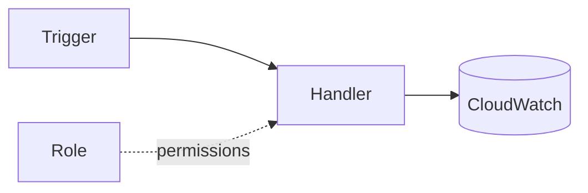

# AWS Lambda Lab

Learn Lambda by building one — write it, wire a trigger, scope its role, then observe and tune — per
[`AGENTS.md`](../../../AGENTS.md). Pairs with [serverless-designer](../serverless-designer/SKILL.md) and [aws-iam-lab](../aws-iam-lab/SKILL.md).

## When to use

- The learner wants a guided, runnable Lambda from scratch, not just theory.
- Reinforcing event-driven, pay-per-use compute for a **cloud/backend** role-agent.

## Anatomy



A function = handler code + an execution role + a trigger; it scales out one instance per concurrent event.

## Procedure

1. **Write the handler:** one job, `handler(event, context)`; return fast and stay stateless (AWS Lambda
   Developer Guide, *Lambda function handler*).
2. **Create the execution role:** start from `AWSLambdaBasicExecutionRole` (logs only), then add only the
   actions the code calls — least privilege ([aws-iam-lab](../aws-iam-lab/SKILL.md)).
3. **Add a trigger:** API Gateway (HTTP), an S3 event, or an EventBridge schedule; let the event shape the input.
4. **Config via env vars:** put table names/endpoints in environment variables and secrets in Secrets
   Manager or SSM — never hard-code them.
5. **Verify:** invoke with a test event, read the CloudWatch log stream, and check duration/errors/throttles.
6. ⚠ **Tame cold starts & clean up:** trim deps, size memory, add provisioned concurrency only if latency
   demands it; delete the function, role, and log group afterward to stop lingering cost.

## Output shape

```
Goal: <what the function does> | Runtime: <e.g., python3.12>
Trigger: <API GW|S3|EventBridge> | Handler: <file.handler>
Role: AWSLambdaBasicExecutionRole + <scoped actions>
Config: env vars <…> | secrets in Secrets Manager/SSM
Verify: test event → log stream → duration/errors
Cleanup: delete fn + role + log group  [⚠ avoids idle cost]
```

## Tips

- Right-size memory first — it also scales CPU, so more memory can be both faster and cheaper.
- Idempotency matters: most triggers are at-least-once, so an invocation can repeat.
- End with the **Learning Footer** (`AGENTS.md`) — one action to drop from the role + one cold start to measure yourself.
