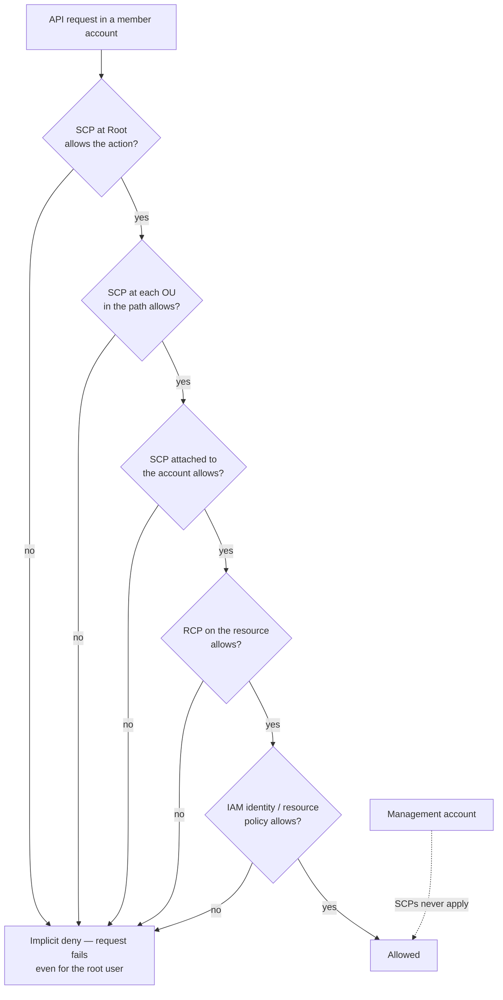

# AWS Organizations SCP Lab

Learn multi-account guardrails by evaluating them like the policy engine does: **SCP ∩ RCP ∩ IAM = effective
permission**, taught from fundamentals per [`AGENTS.md`](../../../AGENTS.md). An SCP never grants anything —
internalising that one sentence prevents most Organizations outages.

## When to use

- The learner has more than one AWS account and is trying to prevent whole classes of mistakes centrally.
- An SCP was attached and "nothing works" — or was attached and nothing was actually blocked.
- They need to choose between Control Tower's managed controls and hand-written SCPs.
- **Don't** use it to grant access; SCPs cannot grant, and they never apply to the management account.

## First principles: a ceiling, not a floor

Organizations applies SCPs to every IAM principal in a *member* account, including the account root user.
A request must be allowed by an identity-based (or resource-based) policy **and** not be excluded by any SCP
at any level from the root down to the account (AWS Organizations User Guide, *SCP evaluation* and
*Effects on permissions*). Resource control policies (RCPs) add a parallel ceiling on *resources*.



| Policy type | Attaches to | Effect | Applies to management account | Typical use |
| --- | --- | --- | --- | --- |
| **SCP** | root, OU, account | ceiling on **principals** | no | block Regions, deny root user, protect trails |
| **RCP** | root, OU, account | ceiling on **resources** | no | stop cross-org S3/KMS sharing |
| **IAM identity policy** | user, group, role | grants | yes | day-to-day permissions |
| **Permission boundary** | a role/user | ceiling on that one principal | yes | safe delegated role creation |
| **Control Tower control** | OU | packaged SCP / Config rule / hook | no | preventive + detective baselines |

| Strategy | How it works | Pros | Cons |
| --- | --- | --- | --- |
| **Deny-list** (keep `FullAWSAccess`, add `Deny` statements) | ceiling stays wide; you carve out exceptions | low blast radius, easy to start | new risky services are allowed by default |
| **Allow-list** (detach `FullAWSAccess`, `Allow` only named services) | ceiling is explicitly enumerated | strongest control, regulated environments | breaks on every new service; high maintenance |

`FullAWSAccess` is attached by default at every node. Detaching it *anywhere* in the path converts that
branch to allow-list semantics — the single most common way to break an entire OU by accident.

## Procedure

1. **Design the OU tree before any policy.** A workable baseline mirrors AWS's multi-account guidance:
   `Security` (log archive, audit), `Infrastructure` (network, shared services), `Workloads`
   (`Prod`, `NonProd`), `Sandbox`, `Suspended`.
2. **Enable the policy type** (once, from the management account):

   ```bash
   ROOT=$(aws organizations list-roots --query 'Roots[0].Id' --output text)
   aws organizations enable-policy-type --root-id "$ROOT" --policy-type SERVICE_CONTROL_POLICY
   ```

3. **Create the OU and move a throwaway account into it:**

   ```bash
   OU=$(aws organizations create-organizational-unit --parent-id "$ROOT" --name Sandbox \
        --query OrganizationalUnit.Id --output text)
   aws organizations move-account --account-id 222233334444 --source-parent-id "$ROOT" --destination-parent-id "$OU"
   ```

4. **Write a deny-list SCP** (see the worked example) and create it:
   `aws organizations create-policy --name lab-guardrails --type SERVICE_CONTROL_POLICY --content file://scp.json --description "region + root guardrails"`.
5. **Attach to the OU, never to the root, on the first attempt:**
   `aws organizations attach-policy --policy-id p-xxxxxxxx --target-id "$OU"`.
6. **Test from inside the member account.** Assume a role there and try the blocked call — you should get
   `AccessDenied` with `explicit deny in a service control policy`. Verify from the *outside* too:

   ```bash
   aws organizations describe-effective-policy --policy-type SERVICE_CONTROL_POLICY --target-id 222233334444
   ```

7. **Simulate before widening scope:** `aws iam simulate-principal-policy` evaluates IAM, so pair it with the
   effective-policy output above; treat any disagreement as a finding, not a nuisance.
8. **Layer Control Tower** if you want packaged, versioned controls: enable a landing zone, then apply
   preventive (SCP-backed) and detective (AWS Config-backed) controls per OU rather than writing your own.
9. **Give humans access through IAM Identity Center**, not IAM users: create permission sets, assign them to
   groups × accounts, and let the SCP ceiling constrain even an over-broad permission set.
10. **Clean up:** detach the policy (`detach-policy`), delete it, move the account back, then delete the OU.
    Organizations, SCPs, and Identity Center have **no additional charge**; Control Tower's landing zone
    incurs cost from the resources it deploys (Config, CloudTrail, S3).

## Output shape

```
Org: <management account> | Root: r-xxxx | Policy types enabled: SERVICE_CONTROL_POLICY <, RESOURCE_CONTROL_POLICY>
OU tree: Root → Security | Infrastructure | Workloads(Prod, NonProd) | Sandbox | Suspended
Strategy: <deny-list (FullAWSAccess kept) | allow-list (FullAWSAccess detached — justify)>
SCP: <name> attached to <OU/account>
  Statement: Deny <actions> unless <condition>  → intent: <...>
Evaluation check: SCP allows? <y/n> ∩ RCP allows? <y/n> ∩ IAM allows? <y/n> = <ALLOW|DENY>
Tested: <role> ran <api> in <account> → <AccessDenied: explicit deny in SCP | success>
Exemptions: management account (SCPs never apply) | service-linked roles
Human access: IAM Identity Center permission set <name> → group <...> × accounts <...>
Cost: Organizations/SCP/Identity Center = $0; Control Tower deploys billable Config + CloudTrail
Next: <cloud-iam-least-privilege-coach | azure-landing-zone-coach | aws-cloudformation-lab>
Learning Footer
```

## Worked example — region lock + root-user lock, without locking yourself out

```json
{
  "Version": "2012-10-17",
  "Statement": [
    {
      "Sid": "DenyOutsideApprovedRegions",
      "Effect": "Deny",
      "NotAction": [
        "iam:*", "organizations:*", "sts:*", "cloudfront:*", "route53:*",
        "support:*", "budgets:*", "waf:*", "health:*"
      ],
      "Resource": "*",
      "Condition": {
        "StringNotEquals": { "aws:RequestedRegion": ["us-east-1", "eu-west-1"] }
      }
    },
    {
      "Sid": "DenyRootUserActions",
      "Effect": "Deny",
      "Action": "*",
      "Resource": "*",
      "Condition": { "StringLike": { "aws:PrincipalArn": "arn:aws:iam::*:root" } }
    },
    {
      "Sid": "ProtectSecurityBaseline",
      "Effect": "Deny",
      "Action": ["cloudtrail:StopLogging", "cloudtrail:DeleteTrail", "config:DeleteConfigurationRecorder"],
      "Resource": "*"
    }
  ]
}
```

The `NotAction` list is the part learners get wrong: IAM, STS, Organizations, CloudFront, and Route 53 are
**global** services whose endpoints report `us-east-1`. Denying them by Region bricks the account. Test this
policy on a sandbox OU containing one disposable account before it goes anywhere near `Workloads`.

## Tips

- SCPs filter; IAM grants. If nothing in IAM allows the action, an SCP that "allows" it changes nothing.
- Never attach an untested SCP to the root — the management account is exempt, so you may not notice the
  damage until a workload account pages you.
- Detaching `FullAWSAccess` flips a branch to allow-list semantics; do it deliberately, never by accident.
- `aws:RequestedRegion` guardrails must exempt global services, or `sts:AssumeRole` itself starts failing.
- Control Tower controls are versioned and tested SCPs — prefer them over bespoke JSON when they fit.
- Pair with [cloud-iam-least-privilege-coach](../cloud-iam-least-privilege-coach/SKILL.md),
  [aws-iam-lab](../aws-iam-lab/SKILL.md),
  [azure-landing-zone-coach](../azure-landing-zone-coach/SKILL.md),
  [gcp-project-structure-coach](../gcp-project-structure-coach/SKILL.md),
  [aws-cloudformation-lab](../aws-cloudformation-lab/SKILL.md), and
  [aws-well-architected-review](../aws-well-architected-review/SKILL.md).
  Close with the **Learning Footer** (`AGENTS.md`): one guardrail to add, one exemption to justify.
