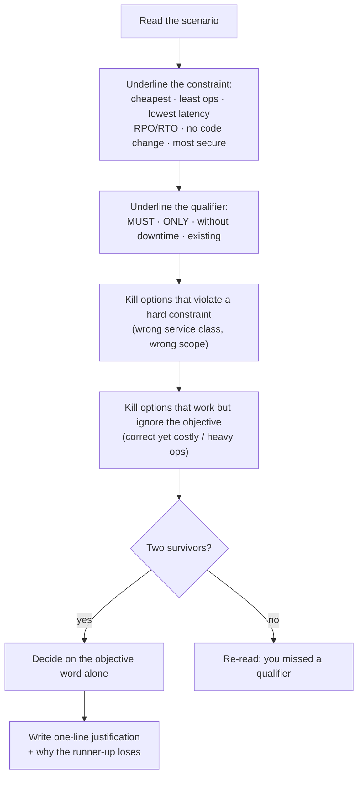

# AWS SAA Exam Drill

Scenario reps for the AWS Solutions Architect – Associate, weighted to the real blueprint and marked with a
reasoning trace, not just a letter — per [`AGENTS.md`](../../../AGENTS.md). The transferable skill is
**constraint spotting plus elimination**, which is what the exam actually measures.

> ⚠ **Confirm the live exam guide before you study.** AWS revises blueprints and retires exam versions.
> Open the official certification page for *AWS Certified Solutions Architect – Associate*, download the
> current exam guide PDF, and check the version code (SAA-C03 or its successor), the domain percentages,
> and the in-scope service list. If the guide disagrees with anything here, the guide wins.

## When to use

- The learner has studied services and now needs scenario judgement under time pressure.
- They keep landing on "the answer that works" instead of "the answer that satisfies every constraint".
- They want a readiness signal by domain before booking a $150 exam slot.
- **Don't** use it as a first pass over unlearned services — drill after the labs, not instead of them.

## First principles: the exam scores constraint-matching, not recall

Every scored question is a short scenario with a hidden objective function. Two options are usually
*technically functional*; only one satisfies the stated constraint (cost, RPO/RTO, latency, "no code
changes", "least operational overhead"). Domain weights below are the published SAA-C03 figures — verify
them against the current guide before planning study time.



| Domain (SAA-C03) | Weight | Question sampling | Highest-yield anchors |
| --- | --- | --- | --- |
| 1 · Design Secure Architectures | 30 % | 3 of every 10 | IAM roles vs keys, SCPs, KMS, security groups vs NACLs, private subnets, VPC endpoints |
| 2 · Design Resilient Architectures | 26 % | ~2–3 of 10 | Multi-AZ vs multi-Region, RTO/RPO, ASG + ELB, SQS decoupling, Route 53 failover |
| 3 · Design High-Performing Architectures | 24 % | ~2–3 of 10 | Storage class fit, ElastiCache, read replicas, CloudFront, Global Accelerator |
| 4 · Design Cost-Optimized Architectures | 20 % | 2 of every 10 | S3 lifecycle/Intelligent-Tiering, Spot vs Savings Plans, NAT vs gateway endpoints |

Format facts to confirm on the live guide: multiple choice **and** multiple response, 65 questions
(50 scored, 15 unscored), 130 minutes, scaled score **720/1000** to pass, no penalty for guessing —
so never leave a question blank.

| Trigger phrase in the stem | It is pointing at | Common distractor it kills |
| --- | --- | --- |
| "least operational overhead" / "managed" | serverless or managed service | anything self-managed on EC2 |
| "cannot change the application code" | infrastructure-layer fix | "refactor to use the SDK" |
| "must be private / never traverse the internet" | VPC endpoint / PrivateLink | NAT gateway, public endpoint + TLS |
| "RPO near zero, RTO minutes" | Multi-AZ / Aurora Global | nightly snapshots |
| "most cost-effective" + "infrequent, unpredictable" | S3 Intelligent-Tiering | Glacier Deep Archive (retrieval time) |
| "rotate credentials automatically" | Secrets Manager / IAM roles | Parameter Store SecureString + cron |
| "decouple / absorb spikes" | SQS (+ ASG on queue depth) | bigger instances |
| "single-digit millisecond at scale" | DynamoDB / DAX / ElastiCache | RDS with read replicas |

## Procedure

1. **Set the mix.** Default is 10 questions weighted 3/3/2/2 (secure/resilient/performing/cost). For a full
   mock, use 65 questions in 130 minutes to rehearse the real pacing (~2 minutes per question).
2. **Present one question at a time** — realistic stem, 4–5 options, at least two plausible distractors,
   and no hints. Multi-response questions must say "Choose TWO".
3. **Require the learner's reasoning**, not just a letter: constraint keyword → eliminated options → choice.
4. **Mark against the elimination trace,** and mark a *lucky* right answer as a miss when the reasoning was
   wrong. That is the honest signal.
5. **Explain every option:** why the key is right, and for each distractor the specific constraint it
   violates. Cite the service's official documentation page by name so the learner can verify.
6. **Track a per-domain scoreboard** across the session and surface the weakest domain immediately.
7. **Flag guesses.** Any question answered with low confidence goes on a re-drill list even if correct.
8. **Convert misses into labs,** not flashcards — a networking miss becomes [aws-vpc-lab](../aws-vpc-lab/SKILL.md),
   a KMS miss becomes [aws-kms-envelope-encryption-lab](../aws-kms-envelope-encryption-lab/SKILL.md).
9. **Verify the blueprint** at the end of the session: have the learner state today's official domain
   percentages from the AWS page — a 30-second habit that catches an exam-version change.
10. **Call readiness honestly:** ≥ 80 % on a full-length timed mock with sound reasoning, or "not yet".

## Output shape

```
Drill: AWS SAA | Mode: <timed 130 min | untimed> | Mix: secure <n> · resilient <n> · performing <n> · cost <n>
Blueprint checked: <SAA-C03 30/26/24/20 — confirmed on aws.amazon.com/certification on <date>>

Q<n> [Domain <1-4>] <scenario stem>
  A) … B) … C) … D) …
> Your answer + reasoning: <constraint keyword → eliminations → choice>
Verdict: <correct | correct-but-lucky | incorrect>
Key: <letter> — <why it satisfies the constraint>  (docs: <service> User Guide, <page>)
Distractors: A ✗ <violates …> · C ✗ <works but costs more> · D ✗ <wrong scope>
Trap: <the phrase in the stem that decided it>

Scoreboard: secure <x/y> · resilient <x/y> · performing <x/y> · cost <x/y>  → overall <z%>
Weakest domain: <n> — <specific concept>
Re-drill list: <flagged question IDs / concepts>
Readiness: <ready | not yet — <gap>>   Next lab: <aws-vpc-lab | aws-s3-lab | aws-organizations-scp-lab>
Learning Footer
```

## Worked example — one question, fully marked

> A company runs a reporting application on EC2 instances in a private subnet. The application downloads
> roughly 8 TB of objects per month from an Amazon S3 bucket in the same Region. Traffic currently egresses
> through a NAT gateway. The team must reduce cost **without changing the application code**, and the data
> must not traverse the public internet.
>
> A. Move the instances to a public subnet with public IPs.
> B. Create a **gateway VPC endpoint** for Amazon S3 and add it to the private subnet's route table.
> C. Create an interface VPC endpoint (PrivateLink) for Amazon S3.
> D. Enable S3 Transfer Acceleration on the bucket.

**Elimination trace.** Constraints: cheaper, no code change, private path. **A** puts the workload on the
public internet — violates the privacy constraint outright, kill it. **D** is an *upload* accelerator that
adds a per-GB charge and needs an endpoint change in the app — violates both cost and "no code change".
Two survivors: **B** and **C** are both private. Gateway endpoints for S3 and DynamoDB have **no hourly or
per-GB charge** and are wired via route tables (no app change); interface endpoints bill per hour *and*
per GB. The objective word is *cost*, so **B** wins. **C** is the classic near-miss — correct technology,
wrong economics — and it becomes the right answer only if the stem adds on-premises access over
Direct Connect, which a gateway endpoint cannot serve.

## Tips

- Read the **last sentence first**: it holds the objective function that decides between working answers.
- "Most secure" and "most cost-effective" rarely point to the same option — pick the one the stem names.
- Multi-response questions ("Choose TWO") are all-or-nothing; eliminate to exactly two before committing.
- There is no penalty for a wrong answer — never leave a question unanswered, and flag it for review.
- Track a per-domain score, not one number; a 78 % overall hiding a 55 % in Domain 1 is a fail waiting.
- Pair with [exam-blueprint](../exam-blueprint/SKILL.md),
  [mock-exam](../mock-exam/SKILL.md),
  [exam-strategy-coach](../exam-strategy-coach/SKILL.md),
  [cloud-cert-roadmap-coach](../cloud-cert-roadmap-coach/SKILL.md),
  [aws-well-architected-review](../aws-well-architected-review/SKILL.md), and
  [aws-vpc-lab](../aws-vpc-lab/SKILL.md).
  End with the **Learning Footer** (`AGENTS.md`): weakest domain + the single next lab to run.
