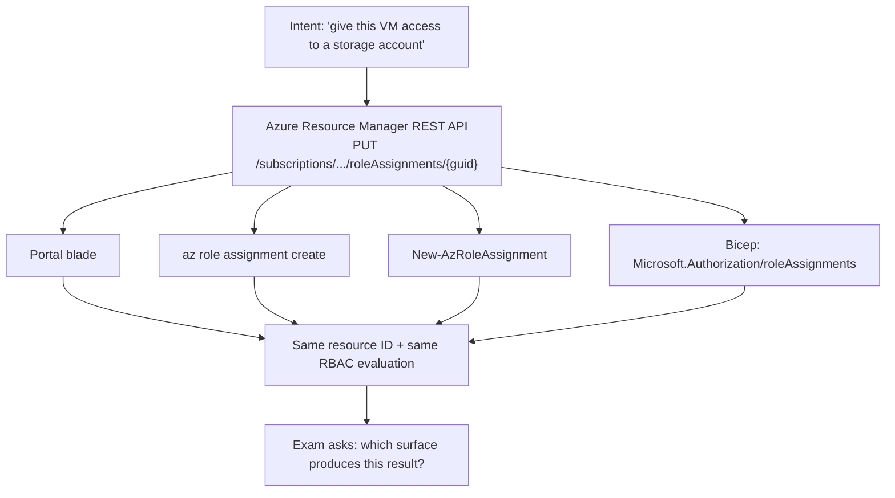

# AZ-104 Exam Drill

Reps for the Azure Administrator exam that build a *portable* mental model: every task is answered in the
portal, the CLI, PowerShell, **and** Bicep, per [`AGENTS.md`](../../../AGENTS.md). AZ-104 asks what you would
do, not which blade you would click.

> ⚠ **Confirm the live study guide first.** Microsoft revises "Skills measured" on a dated cadence. Open
> *Study guide for Exam AZ-104: Microsoft Azure Administrator* on Microsoft Learn, note the "Skills measured
> as of <date>" banner and the change log, and use those weights. The weights below reflect the outline
> current at the time of writing (skills measured as of 17 April 2026) — re-verify before you plan study time.

## When to use

- The learner knows Azure services individually and needs administrator judgement across them.
- They can do a task in the portal but freeze when a question is phrased as a CLI or PowerShell cmdlet.
- They need a per-domain readiness signal before booking the exam.
- **Don't** use it as a first exposure to a service — run the lab first, then drill.

## First principles: one operation, four surfaces

Every Azure control-plane action is an ARM REST call against a resource ID. The portal, `az`, `Az` PowerShell,
and Bicep/ARM templates are four clients for the same API — so learn the *operation* and the syntax follows
(Azure Resource Manager documentation, *Resource Manager overview*; Azure CLI and Az PowerShell references).



| Domain (skills measured as of 17 Apr 2026) | Weight | Sampling per 10 | Highest-yield anchors |
| --- | --- | --- | --- |
| Manage Azure identities and governance | 20–25 % | 2–3 | Entra ID users/groups, RBAC scope inheritance, custom roles, Azure Policy, locks, tags |
| Implement and manage storage | 15–20 % | 2 | account/blob access tiers, lifecycle rules, SAS vs RBAC, Azure Files + File Sync, redundancy |
| Deploy and manage Azure compute resources | 20–25 % | 2–3 | VM sizing/availability sets vs zones, VMSS, ARM/Bicep deployment, Container Instances, App Service |
| Implement and manage virtual networking | 15–20 % | 2 | VNet/subnets, NSG + ASG, peering, Load Balancer vs Application Gateway, private endpoints, DNS |
| Monitor and maintain Azure resources | 10–15 % | 1–2 | Azure Monitor metrics/alerts, Log Analytics + KQL, Backup vs Site Recovery, Network Watcher |

| Trigger phrase in the stem | Points at | Distractor it kills |
| --- | --- | --- |
| "least privilege" + "one resource group" | RBAC assignment scoped to the RG | Owner at subscription scope |
| "enforce a naming/tag standard" | **Azure Policy** (deny/modify effect) | RBAC (it controls *who*, not *what*) |
| "prevent accidental deletion" | resource **lock** (CanNotDelete) | Policy audit, RBAC Reader |
| "temporary, scoped access to one blob" | user-delegation **SAS** | account key, public container |
| "survive a datacenter failure in-region" | **availability zones** / ZRS | availability set (rack-level only) |
| "on-premises file share, cached locally" | Azure File Sync | blob storage + AzCopy |
| "no public IP, private path to PaaS" | **private endpoint** + private DNS zone | service endpoint (still Azure backbone, public IP) |
| "query logs across resources" | Log Analytics workspace + KQL | Metrics explorer |
| "protect a VM's data with point-in-time restore" | Azure Backup | Site Recovery (that is DR/failover) |

## Procedure

1. **Set the mix** from the live outline — default 10 questions as 3 identity/governance, 2 storage,
   3 compute, 1 networking, 1 monitoring — rotate the extra networking/monitoring slot in on the next
   block of 10. A full mock is ~40–60 questions in 100 minutes.
2. **Ask one question at a time,** in exam-shaped formats: single-answer multiple choice, "select all that
   apply", drag-and-drop ordering, and the yes/no *series* pattern where each item is scored independently.
3. **Demand the reasoning first** — scope, then effect, then surface: "RBAC at RG scope, Reader role,
   assigned with `az role assignment create`".
4. **Then demand the equivalence.** For each correct answer the learner must produce the CLI *and* one of
   PowerShell or Bicep. This is the exercise that transfers to the job:

   ```bash
   az role assignment create --assignee <objectId> --role "Storage Blob Data Reader" \
     --scope /subscriptions/<sub>/resourceGroups/rg-lab/providers/Microsoft.Storage/storageAccounts/stlab001
   ```

   ```powershell
   New-AzRoleAssignment -ObjectId <objectId> -RoleDefinitionName "Storage Blob Data Reader" `
     -Scope "/subscriptions/<sub>/resourceGroups/rg-lab/providers/Microsoft.Storage/storageAccounts/stlab001"
   ```

5. **Mark strictly:** a right answer with wrong reasoning is a miss, and so is a right answer the learner
   cannot express in any non-portal surface.
6. **Cite Microsoft Learn by page name** for every key, so the learner can verify rather than trust.
7. **Score per domain** and name the weakest one after every 10 questions.
8. **Turn misses into labs** — networking → [azure-vnet-hub-spoke-lab](../azure-vnet-hub-spoke-lab/SKILL.md),
   storage → [azure-storage-lab](../azure-storage-lab/SKILL.md),
   monitoring → [azure-monitor-kql-lab](../azure-monitor-kql-lab/SKILL.md).
9. **Practise the interface,** not just the content: flag-and-review, and read every "select all that apply"
   stem twice — partial credit does not exist.
10. **Call readiness honestly:** ≥ 80 % on a timed full mock with clean reasoning. Passing is **700/1000**
    scaled (confirm on the exam page); guessing is never penalised, so answer everything.

## Output shape

```
Drill: AZ-104 | Outline: skills measured as of <date, confirmed on Microsoft Learn>
Mix: identity/gov <n> · storage <n> · compute <n> · networking <n> · monitoring <n> | Mode: <timed|untimed>

Q<n> [<domain>] <scenario> (format: <single | multi-select | ordering | yes-no series>)
> Your answer + reasoning: <scope → effect → surface>
Verdict: <correct | correct-but-lucky | incorrect>
Key: <answer> — <why>  (Microsoft Learn: <article title>)
Distractors: <option> ✗ <the constraint it violates> …
Equivalence:  portal: <blade path>
              az:      <command>
              Az PS:   <cmdlet>
              Bicep:   <resource type + key property>

Scoreboard: identity <x/y> · storage <x/y> · compute <x/y> · network <x/y> · monitor <x/y> → <z%>
Weakest domain: <name> — <concept>
Readiness: <ready | not yet — <gap>>  Pass mark: 700/1000 (verify on the exam page)
Next lab: <azure-vnet-hub-spoke-lab | azure-storage-lab | azure-entra-id-lab>
Learning Footer
```

## Worked example — one question, marked with equivalence

> An auditor needs to read blob data in the storage account `stlab001` (resource group `rg-lab`) for 90 days.
> They must not be able to change data, and must not have access to any other resource. What do you do?
>
> A. Add the auditor to the **Owner** role at the subscription.
> B. Assign the built-in **Storage Blob Data Reader** role at the storage-account scope.
> C. Send the auditor the storage **account key**.
> D. Assign **Reader** at the resource-group scope.

**Elimination trace.** Constraints: read blob *data*, one account only, time-boxed. **A** grants write over
everything — kill on least privilege. **C** shares a shared secret with full data-plane read *and write*,
cannot be scoped, and is the classic Azure anti-pattern — kill it. Two survivors: **B** and **D**, and this
is the pair that separates administrators. **Reader** is a *control-plane* role: it lets you see that the
account exists but returns `AuthorizationPermissionMismatch` on a blob read, because Azure Storage data-plane
access needs a data role. **B** is correct, scoped at the account. For the 90-day limit, add an Entra ID
Privileged Identity Management time-bound assignment or an expiring group membership — RBAC assignments
themselves do not expire by default.

```bash
az role assignment create --assignee-object-id <oid> --assignee-principal-type User \
  --role "Storage Blob Data Reader" \
  --scope $(az storage account show -g rg-lab -n stlab001 --query id -o tsv)
```

## Tips

- Azure Storage has **two planes**: control (Reader/Contributor) and data (Storage Blob Data *). Mixing
  them up is the most reliably tested trap in the storage domain.
- Availability **set** = rack/update-domain protection; availability **zone** = datacenter protection. The
  stem's failure scope tells you which.
- Azure Policy decides *what* may exist; RBAC decides *who* may act; locks decide *what may be deleted*.
  Nearly every governance question is one of those three.
- Service endpoint ≠ private endpoint: only the private endpoint gives the resource a private IP in your
  VNet — see [cloud-private-connectivity-coach](../cloud-private-connectivity-coach/SKILL.md).
- Pair with [exam-blueprint](../exam-blueprint/SKILL.md),
  [mock-exam](../mock-exam/SKILL.md),
  [exam-strategy-coach](../exam-strategy-coach/SKILL.md),
  [azure-bicep-lab](../azure-bicep-lab/SKILL.md),
  [azure-entra-id-lab](../azure-entra-id-lab/SKILL.md), and
  [cloud-cert-roadmap-coach](../cloud-cert-roadmap-coach/SKILL.md).
  Finish with the **Learning Footer** (`AGENTS.md`): weakest domain + one CLI command to memorise.
