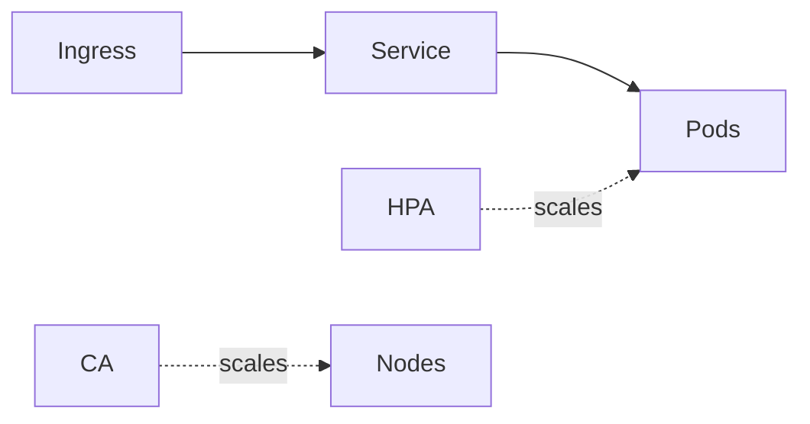

# Azure AKS Lab

Learn AKS by shipping a workload — cluster, deploy, expose, then scale it yourself — per
[`AGENTS.md`](../../../AGENTS.md). Pairs with [azure-landing-zone-coach](../azure-landing-zone-coach/SKILL.md) and [cloud-cost-optimizer](../cloud-cost-optimizer/SKILL.md).

## When to use

- The learner wants a guided, running app on managed Kubernetes, not slideware.
- Reinforcing container orchestration and scaling for a **DevOps** or cloud role-agent.

## Anatomy



AKS runs the **control plane** for free; you pay for **node pools**. A Deployment runs Pods, a Service adds
a stable address, and Ingress routes HTTP in (Microsoft Learn, *Ingress in AKS*, 2024).

## Procedure

1. **Create the cluster:** one node pool with **Entra + Azure RBAC** and a **managed identity**; small VMs
   suffice for the lab.
2. **Deploy the workload:** `kubectl apply` a Deployment with a **pinned** image, resource requests/limits,
   and matching label selectors.
3. **Expose it:** a `ClusterIP` Service, then the **application routing add-on** (managed NGINX) for HTTP
   ingress with a host rule.
4. **Scale:** a **HorizontalPodAutoscaler** (pods) plus the **cluster autoscaler** (nodes), or KEDA for
   event-driven load (Microsoft Learn, *Scaling options for AKS*, 2024).
5. **Verify:** `kubectl get deploy,svc,ingress,hpa`, curl the ingress host, and watch pods scale under load.
6. ⚠ **Secure & clean up:** least-privilege RBAC in a scratch namespace, then `az aks delete` / delete the
   resource group — idle nodes bill 24/7.

## Output shape

```
Workload: <name> | Image: <repo:tag pinned> | Node pool: <VM x N>
Deploy: kubectl apply → get deploy,rs,pods | requests/limits set
Expose: ClusterIP Service → app-routing NGINX ingress (host rule)
Scale: HPA (pods) + cluster autoscaler (nodes) | KEDA if event-driven
Secure+clean: Entra/Azure RBAC, scratch ns → az aks delete  [⚠ nodes bill 24/7]
```

## Tips

- The control plane is free but **nodes bill continuously** — scale down or delete when idle.
- Provision the cluster as code ([terraform-module-coach](../terraform-module-coach/SKILL.md)) so it's reproducible and reviewable.
- End with the **Learning Footer** (`AGENTS.md`) — one HPA target to set + one rollout to scale yourself.
