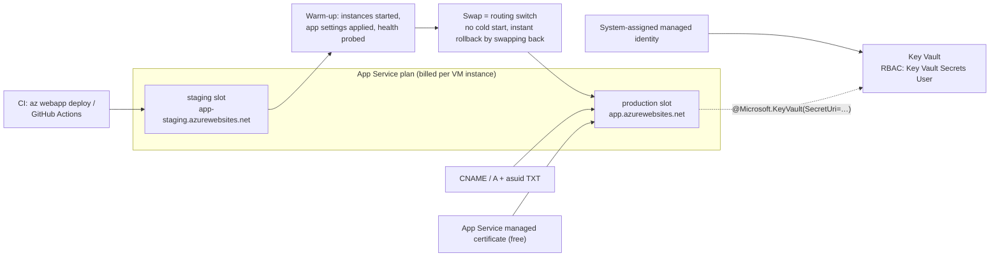

# Azure App Service Lab

Deploy once, then operate: **plan tier → slot → swap → domain + TLS → Key Vault reference**, taught from
fundamentals per [`AGENTS.md`](../../../AGENTS.md). The transferable lesson is that a slot swap is a *warm
routing change*, and that a secret in an app setting is a secret you have already leaked.

## When to use

- The learner wants PaaS hosting without managing VMs and needs the tier decision explained, not guessed.
- Deploys cause cold starts or downtime, or a rollback means "redeploy and pray".
- Connection strings and API keys are sitting in app settings or, worse, in the repo.
- **Don't** use it for event-driven or per-request-billed workloads — that is Azure Functions.

## First principles: the plan is the machine, the app is a tenant

An **App Service plan** is the set of VM instances you rent; every app in the plan shares that compute, and
you are billed per instance regardless of app count (Azure App Service documentation, *What are Azure App
Service plans?*). Features — TLS bindings, slots, autoscale — are unlocked by the tier, so tier selection is
a *requirements* decision, not a performance one.



| Tier | Compute | Slots | Custom domain + TLS binding | Autoscale | Use it for |
| --- | --- | --- | --- | --- | --- |
| Free (F1) / Shared | shared VM, CPU quota | none | no TLS binding | no | throwaway demos only |
| Basic (B1–B3) | dedicated VM | none | yes (Basic and above) | manual scale only | dev/test with a real domain |
| Standard (S1–S3) | dedicated VM | yes (5) | yes | yes | small production |
| PremiumV3 / PremiumV4 | faster VMs, more memory | yes (20) | yes | yes + zone redundancy | production, VNet integration |
| IsolatedV2 (ASE v3) | dedicated VMs in your VNet | yes (20) | yes | yes | network isolation / compliance |

⚠ Slot and instance limits change as tiers evolve — confirm today's numbers on the *App Service limits* page
in Azure subscription limits before you design around them. Note the two hard rules that rarely change:
**custom TLS bindings require Basic or higher**, and **deployment slots require Standard or higher**.

| Secret handling | Mechanism | Rotation | Verdict |
| --- | --- | --- | --- |
| Value pasted into an app setting | plain config | manual, per app | ✗ leaked to anyone with Contributor |
| Key Vault **reference** in an app setting | `@Microsoft.KeyVault(...)` resolved by the platform | change the secret in the vault | ✓ default choice |
| SDK call to Key Vault at runtime | `DefaultAzureCredential` + client | live, cacheable | ✓ when you need per-request logic |
| Managed identity to the resource itself | no secret exists at all | n/a | ✓✓ best — e.g. SQL/Storage with Entra auth |

## Procedure

1. **Create the plan and app.** Start on B1 for a lab (a few cents per hour), or F1 for free if you do not
   need TLS or slots:

   ```bash
   az group create -n rg-lab -l westeurope
   az appservice plan create -g rg-lab -n plan-lab --sku B1 --is-linux
   az webapp create -g rg-lab -p plan-lab -n app-lab-001 --runtime "PYTHON:3.12"
   ```

2. **Deploy the code** with the modern one-shot command (it supersedes the deprecated
   `az webapp deployment source config-zip` for packaged artifacts; `az webapp up` remains available for
   create-and-deploy from source): `az webapp deploy -g rg-lab -n app-lab-001 --src-path app.zip --type zip`.
3. **Scale to Standard to unlock slots,** then create staging:

   ```bash
   az appservice plan update -g rg-lab -n plan-lab --sku S1
   az webapp deployment slot create -g rg-lab -n app-lab-001 --slot staging
   ```

4. **Understand sticky settings before you swap.** Settings marked as *slot settings* stay with the slot;
   everything else travels with the code. Environment names and instrumentation keys must be sticky:

   ```bash
   az webapp config appsettings set -g rg-lab -n app-lab-001 --slot staging \
     --slot-settings ENVIRONMENT=staging
   ```

5. **Swap with preview** so you can validate the *production* configuration against staging code before
   committing: `az webapp deployment slot swap -g rg-lab -n app-lab-001 --slot staging --action preview`,
   then `--action swap`. Roll back by swapping again — it is a routing change, so it is near-instant.
6. **Bind a custom domain.** Prove ownership with a TXT record at `asuid.<subdomain>` plus a CNAME (or an
   A record + `asuid` TXT for an apex), then:

   ```bash
   az webapp config hostname add -g rg-lab --webapp-name app-lab-001 --hostname www.contoso.com
   az webapp config ssl create -g rg-lab --name app-lab-001 --hostname www.contoso.com   # free managed cert
   az webapp config ssl bind -g rg-lab -n app-lab-001 --certificate-thumbprint <thumb> --ssl-type SNI
   az webapp update -g rg-lab -n app-lab-001 --https-only true
   ```

7. **Turn on a managed identity** and grant it vault access with RBAC, not access policies:

   ```bash
   PID=$(az webapp identity assign -g rg-lab -n app-lab-001 --query principalId -o tsv)
   az role assignment create --assignee-object-id "$PID" --assignee-principal-type ServicePrincipal \
     --role "Key Vault Secrets User" --scope $(az keyvault show -n kv-lab-001 --query id -o tsv)
   ```

8. **Replace the secret with a reference** (see the worked example) and verify resolution in the portal:
   the app setting shows a green "Resolved" source marker. An unresolved reference surfaces as the literal
   `@Microsoft.KeyVault(...)` string reaching your code — a loud, easy-to-spot failure.
9. **Add health and observability:** set a health check path (`az webapp config set --generic-configurations
   '{"healthCheckPath":"/healthz"}'`), enable Application Insights, and turn on **Always On** (Basic+) so the
   app is not unloaded when idle.
10. **Clean up:** `az group delete -n rg-lab --yes --no-wait`. The plan bills while it exists even if every
    app is stopped — deleting the *app* is not enough.

## Output shape

```
App: <name> | Runtime: <...> | Region: <...> | Plan: <name> SKU <F1|B1|S1|P1v3> × <n> instances
Tier rationale: <slots needed → Standard+ | TLS needed → Basic+ | zone redundancy → Premium v3+>
Slots: production <+ staging>  | Sticky (slot) settings: <ENVIRONMENT, APPINSIGHTS_*>
Deploy: az webapp deploy --type zip → staging | Swap: preview → swap | Rollback: swap back (<n>s)
Domain: <www.contoso.com> (CNAME + asuid TXT verified) | Cert: App Service managed (free) | SNI bound | HTTPS-only: on
Secrets: 0 literals — <n> Key Vault references via <system-assigned MI> + role "Key Vault Secrets User"
Health: /healthz | Always On: on | App Insights: <resource>
Cost: plan <SKU> ≈ $<x>/month ⚠ delete the plan, not just the app
Next: <azure-keyvault-lab | azure-functions-lab | azure-vnet-hub-spoke-lab>
Learning Footer
```

## Worked example — an app setting that holds no secret

```bash
az keyvault secret set --vault-name kv-lab-001 --name DbPassword --value '<generated>' -o none

# Reference by name — resolves to the CURRENT version automatically:
az webapp config appsettings set -g rg-lab -n app-lab-001 --settings \
  "DB_PASSWORD=@Microsoft.KeyVault(VaultName=kv-lab-001;SecretName=DbPassword)"

# Or pin an exact version by URI (no auto-rotation, but fully deterministic):
az webapp config appsettings set -g rg-lab -n app-lab-001 --settings \
  "DB_PASSWORD=@Microsoft.KeyVault(SecretUri=https://kv-lab-001.vault.azure.net/secrets/DbPassword/9f3c1c2a4b5d)"
```

Your code reads `os.environ["DB_PASSWORD"]` and knows nothing about Key Vault. Rotate by writing a new
secret version — the name-based form picks it up (allow time for the platform's periodic refresh; restart
the app to force it). Anyone with Contributor on the app now sees a vault *pointer*, not a password. If the
identity or role assignment is missing, the raw `@Microsoft.KeyVault(...)` string is injected instead, which
is exactly the failure mode you want to rehearse once in a lab.

## Tips

- The plan bills, not the app. Stopping an app saves nothing; deleting or downscaling the **plan** does.
- Slots share the plan's compute — a load test in staging degrades production. Use a separate plan for
  heavy pre-production testing.
- Non-sticky settings travel with the swap: forget to mark `ENVIRONMENT` as a slot setting and staging
  config lands in production.
- App Service managed certificates are free and auto-renewed but cannot be exported and do not cover
  wildcards — use an App Service certificate or Key Vault-imported cert for those.
- Prefer a managed identity **to the target resource** (Storage, SQL, Service Bus) over any secret at all —
  the safest secret is the one that does not exist.
- Pair with [azure-keyvault-lab](../azure-keyvault-lab/SKILL.md),
  [azure-functions-lab](../azure-functions-lab/SKILL.md),
  [azure-bicep-lab](../azure-bicep-lab/SKILL.md),
  [azure-entra-id-lab](../azure-entra-id-lab/SKILL.md),
  [azure-vnet-hub-spoke-lab](../azure-vnet-hub-spoke-lab/SKILL.md), and
  [az-104-exam-drill](../az-104-exam-drill/SKILL.md).
  End with the **Learning Footer** (`AGENTS.md`): one secret to move into Key Vault, one swap to rehearse.
