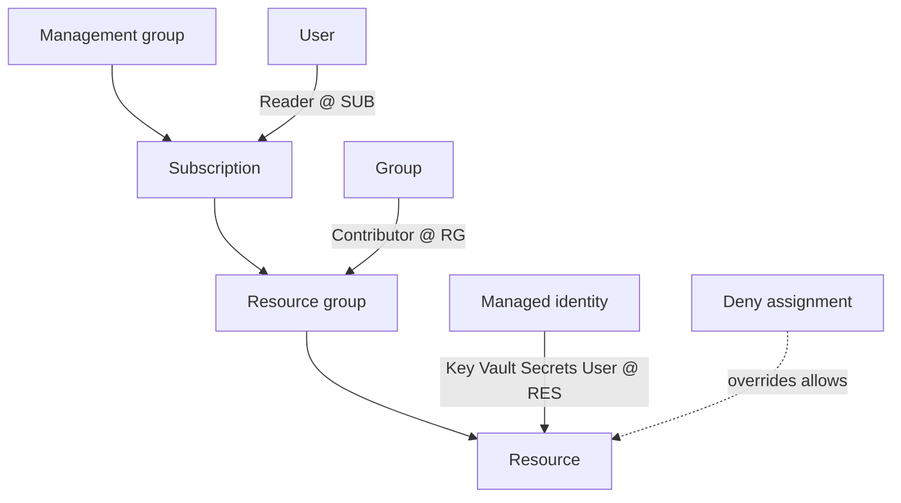

# Azure Entra ID Lab

Learn Microsoft Entra ID by granting access for real — principals, scopes, roles, then *prove* who can do
what — per [`AGENTS.md`](../../../AGENTS.md). The cross-cloud twins are
[aws-iam-lab](../aws-iam-lab/SKILL.md) and [gcp-iam-lab](../gcp-iam-lab/SKILL.md).

## When to use

- The learner needs a runnable identity exercise, not an org-chart diagram of Azure AD.
- They are confused by "I'm Global Administrator but I get 403 on a VM" — the two-role-systems trap.
- Reinforcing least privilege for a **cloud / security / platform** role-agent.

## Mental model

Azure has **two separate authorization systems** (Microsoft Learn, *Microsoft Entra roles and Azure roles*):
**Entra (directory) roles** govern the tenant — users, groups, app registrations. **Azure RBAC roles** govern
resources and are assigned at a **scope** that inherits downward. A role assignment is always the triple
**principal + role definition + scope**.



Inheritance means a **Reader at subscription scope is a Reader on every RG and resource inside it** — which
is exactly why people over-grant at the top and then cannot explain effective access.

## Choose the right principal

| Scenario | Principal | Credential to manage | Trade-off |
| --- | --- | --- | --- |
| A person signing in | **User** (in Entra ID) | Password + MFA | Never share user accounts between humans |
| Many people, same access | **Group** → role assigned to group | None | Access changes become membership changes |
| Azure resource calling Azure (VM, App Service, Function) | **System-assigned managed identity** | **None** — Azure rotates it | Dies with the resource; cannot be pre-created |
| Several resources sharing one identity | **User-assigned managed identity** | **None** | Survives resource deletion; extra object to govern |
| CI/CD or code **outside** Azure | **Service principal (app registration)** | Client secret or certificate — you rotate it | Prefer federated credentials (OIDC) over secrets |

**Rule of thumb:** if the caller runs *in* Azure, a managed identity beats a service principal — there is no
secret to leak, commit, or forget to rotate.

## Procedure

1. **Set context** (free-tier note: Entra ID Free covers users, groups, and Azure RBAC; **SSPR password
   *reset* for cloud-only users needs Microsoft 365 Business Standard/Premium or Entra ID P1/P2** — only
   password *change* is in Free, per Microsoft Learn, *Licensing requirements for SSPR*):
   ```bash
   az login && az account set --subscription <SUB_ID>
   az group create -n rg-identity-lab -l eastus
   ```
2. **Create a user and a group**, then assign the role to the **group**, never to the person:
   ```bash
   az ad user create --display-name "Lab Analyst" \
     --user-principal-name analyst@<tenant>.onmicrosoft.com --password "$LAB_PW"
   # set LAB_PW first:  read -rs LAB_PW   (keeps the literal password out of shell history)
   az ad group create --display-name "Lab Readers" --mail-nickname labreaders
   az ad group member add --group "Lab Readers" \
     --member-id $(az ad user show --id analyst@<tenant>.onmicrosoft.com --query id -o tsv)
   ```
3. **Assign a built-in role at RG scope** — start narrow and widen only if the task fails:
   ```bash
   az role assignment create --assignee-object-id <GROUP_OBJECT_ID> --assignee-principal-type Group \
     --role "Reader" --scope "/subscriptions/<SUB_ID>/resourceGroups/rg-identity-lab"
   ```
4. **Compare scopes deliberately.** Repeat step 3 at subscription scope, list both, and notice the
   inherited one applies everywhere:
   ```bash
   az role assignment list --assignee <GROUP_OBJECT_ID> --all -o table
   ```
5. **Create a managed identity and grant it data-plane access** — the passwordless pattern:
   ```bash
   az identity create -g rg-identity-lab -n uami-lab
   az role assignment create --assignee-object-id $(az identity show -g rg-identity-lab -n uami-lab --query principalId -o tsv) \
     --assignee-principal-type ServicePrincipal --role "Key Vault Secrets User" --scope <KEYVAULT_RESOURCE_ID>
   ```
6. **Verify effective access** (the step everyone skips):
   ```bash
   az role assignment list --scope "/subscriptions/<SUB_ID>/resourceGroups/rg-identity-lab" \
     --include-inherited -o table
   # --include-groups only takes effect together with --assignee (a user), so check group-derived access per user:
   az role assignment list --assignee analyst@<tenant>.onmicrosoft.com --all --include-groups -o table
   ```
   In the portal, use **Access control (IAM) → Check access** on the resource and read *why* the result is
   what it is: inherited vs. direct, group vs. user, allow vs. **deny assignment** (deny always wins).
7. **Turn on SSPR** in the portal (**Entra ID → Password reset**), scope it to the *group*, require two
   authentication methods, and enforce registration at sign-in. Verify by resetting from
   `aka.ms/sspr` as the test user.
8. ⚠ **Clean up** — orphaned role assignments outlive the resources they pointed at:
   ```bash
   az role assignment delete --assignee <GROUP_OBJECT_ID> --scope "/subscriptions/<SUB_ID>/resourceGroups/rg-identity-lab"
   az group delete -n rg-identity-lab --yes --no-wait
   az ad group delete --group "Lab Readers"
   az ad user delete --id analyst@<tenant>.onmicrosoft.com
   ```

## Output shape

```
Scenario: <who needs to do what>
Principal: <user | group | system MI | user MI | service principal>   Why: <in-Azure? human? CI/CD?>
Role: <built-in role name>   Scope: <MG | /subscriptions/... | .../resourceGroups/... | resource ID>
Assignment: principal + role + scope  (assigned to the GROUP, not the person)
Effective access: direct=<...> inherited-from=<scope> deny-assignment=<none|...>
Verify: az role assignment list --scope <rg> --include-inherited  +  --assignee <user> --all --include-groups | portal Check access -> <ALLOW|DENY>
SSPR: methods=<2> registration=<enforced> license-checked=<Free = change only; reset needs P1/P2 or M365 BP>
Cleanup: role assignment delete -> group delete -> rg delete  [⚠ removes standing access]
```

## Tips

- **"Global Administrator" is not an Azure RBAC role.** Directory admin ≠ resource access; a GA must
  elevate (*Access management for Azure resources*) or hold an Azure role to touch a VM.
- **Assign to groups, not to people.** Onboarding then becomes a membership change instead of an audit trail
  full of one-off assignments.
- **Scope down, not up.** Grant at resource or RG scope first; subscription-scope Contributor is how blast
  radius quietly becomes "everything".
- **Owner vs. Contributor vs. User Access Administrator:** Contributor can create anything but cannot grant
  access; UAA can grant access but not manage resources; Owner is both — hand it out sparingly.
- **Deny assignments and Azure Policy beat your role assignment.** If access is blocked despite a correct
  role, check those before re-granting.
- Role assignment changes can take a short time to propagate — re-check before concluding the grant failed.
- Same least-privilege muscle as [aws-iam-lab](../aws-iam-lab/SKILL.md) and
  [gcp-iam-lab](../gcp-iam-lab/SKILL.md); the vocabulary differs, the discipline does not.
- End with the **Learning Footer** (`AGENTS.md`) — one over-broad assignment to narrow + one secret to
  replace with a managed identity yourself.
