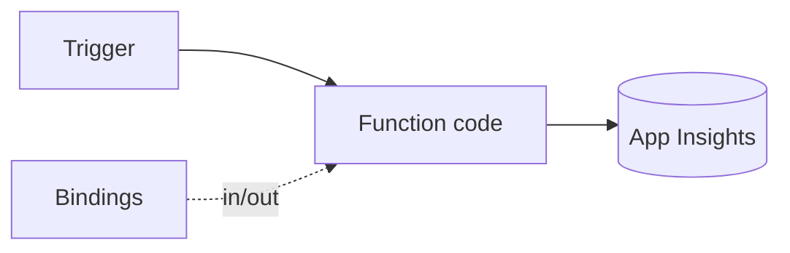

# Azure Functions Lab

Learn Azure Functions by building one — pick a trigger, add bindings, wire config, then monitor — per
[`AGENTS.md`](../../../AGENTS.md). Pairs with [serverless-designer](../serverless-designer/SKILL.md) and [cloud-cost-optimizer](../cloud-cost-optimizer/SKILL.md).

## When to use

- The learner wants a guided, runnable Function App from scratch, not just theory.
- Reinforcing event-driven, pay-per-use compute for a **cloud/backend** role-agent.

## Anatomy



A function = exactly one **trigger** + optional input/output **bindings** + your code (Microsoft Learn,
*Azure Functions triggers and bindings*, 2024).

## Procedure

1. **Pick the trigger:** every function has **exactly one** — HTTP, Timer, Queue, Blob, or Service Bus; it
   defines how the function is invoked and shapes the input.
2. **Add bindings, not SDK glue:** declare input/output bindings (e.g., Queue out, Cosmos in) so the runtime
   handles connections — less code, fewer leaks.
3. **Write the HTTP function:** one job, return fast, stay stateless; set `authLevel` to `function` (key), not `anonymous`.
4. **Config safely:** put settings in **application settings**, secrets as **Key Vault references**, and use a
   **managed identity** for bindings instead of connection strings ([azure-keyvault-lab](../azure-keyvault-lab/SKILL.md)).
5. **Verify & monitor:** invoke the URL, then watch invocations, duration, and failures in **Application Insights**.
6. ⚠ **Tame cold starts & clean up:** trim deps, move to a Premium/Flex plan only if latency demands it;
   delete the Function App + resource group afterward to stop cost.

## Output shape

```
Goal: <what the function does> | Runtime: <e.g., dotnet-isolated|node>
Trigger: <HTTP|Timer|Queue|Blob|Service Bus> | Bindings: <in/out>
Auth: function key (not anonymous) | Plan: Consumption/Flex
Config: app settings + Key Vault refs | managed identity (no keys)
Verify: invoke → App Insights (invocations/duration/failures)
Cleanup: delete Function App + resource group  [⚠ stops cost]
```

## Tips

- Prefer bindings and managed identity over hand-rolled SDK calls and connection strings.
- Idempotency matters: queue/Service Bus triggers are at-least-once, so an invocation can repeat.
- End with the **Learning Footer** (`AGENTS.md`) — one binding to add + one cold start to measure yourself.
