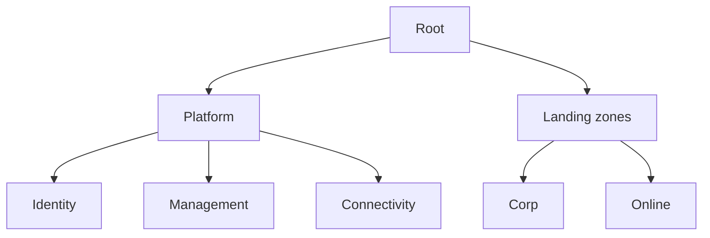

# Azure Landing Zone Coach

Build the Azure foundation the way the Cloud Adoption Framework does — governance and identity before
workloads — per [`AGENTS.md`](../../../AGENTS.md). Pairs with [terraform-module-coach](../terraform-module-coach/SKILL.md) and [architecture-diagram](../architecture-diagram/SKILL.md).

## When to use

- The learner is setting up Azure for an org and needs a governed, repeatable landing zone.
- Reinforcing enterprise-scale design for a **cloud/platform** role-agent.

## Design areas (CAF)



## Procedure

1. **Management groups:** model root → platform → landing zones so Policy and RBAC inherit downward
   (Azure CAF, *Landing zone design areas*).
2. **Subscriptions as scale units:** split platform (identity, management, connectivity) from workload
   subscriptions; treat them as billing + isolation boundaries.
3. **Identity (Entra ID):** central directory, least-privilege RBAC, PIM for just-in-time admin — no
   standing owner rights.
4. **Networking:** hub-spoke (or Virtual WAN), private endpoints, DNS, and egress control designed before
   workloads land.
5. **Governance:** Azure Policy guardrails (allowed regions, tags, encryption), Defender for Cloud,
   centralized logs.
6. ⚠ **Cost/blast radius:** deny policies bite at scale — run them in audit mode first; tag everything for
   cost visibility.

## Output shape

```
Org: … | Regions: … | Compliance: …
Mgmt groups: root → platform | landing-zones (corp/online)
Subscriptions: identity | management | connectivity | workload×N
Identity: Entra ID + RBAC + PIM (JIT)
Network: hub-spoke + private endpoints | Governance: Policy (audit→deny) + Defender
```

## Tips

- Land governance first; retrofitting policy onto sprawling subscriptions is painful.
- Start policies in audit mode, then enforce — a wrong deny can block every deploy.
- End with the **Learning Footer** (`AGENTS.md`) — one policy to add + one design area to deepen yourself.
