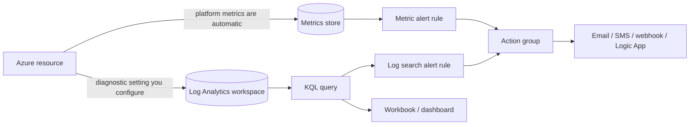

# Azure Monitor KQL Lab

Learn Azure Monitor by making one resource observable — pipe logs in, ask KQL a real question, alert on the
answer — per [`AGENTS.md`](../../../AGENTS.md). The open-source counterpart is
[prometheus-grafana-local-lab](../prometheus-grafana-local-lab/SKILL.md).

## When to use

- The learner has an Azure resource and no idea what it is doing.
- They can read a KQL sample but cannot yet *write* one, or their alert never fires (or never stops).
- Reinforcing observability and cost awareness for a **cloud / SRE / platform** role-agent.

## Mental model

**Nothing is in Log Analytics until you send it there.** Platform **metrics** are collected automatically
and are cheap, numeric, and near-real-time; **resource logs** only flow once you create a **diagnostic
setting** pointing at a workspace, land in **tables**, and are queried with **KQL** (Azure Monitor docs,
*Diagnostic settings* and *Log Analytics workspace overview*).



## Metric alert vs log search alert

| | **Metric alert** | **Log search alert** |
| --- | --- | --- |
| Source | Platform/custom **metrics** | A **KQL query** over workspace tables |
| Latency | Near-real-time | Query evaluation interval + ingestion lag |
| Expressiveness | One metric, dimensions, static or dynamic threshold | Anything KQL can express (joins, correlation, text) |
| Cost | Cheapest — metrics are collected anyway | Pays for ingestion **and** per rule evaluation |
| Best for | CPU, latency, availability, throttling | "5 failures from the same IP in 10 minutes" |
| Pitfall | Cannot express multi-signal logic | Fires late or floods if the window/frequency is wrong |

**Default to a metric alert.** Escalate to a log alert only when the condition genuinely needs query logic.

## Procedure

1. **Create a workspace and route logs in.** Cost note: Log Analytics bills mainly by **GB ingested** plus
   retention beyond the included period — check the official Azure Monitor pricing page first.
   ```bash
   az group create -n rg-obs-lab -l eastus
   az monitor log-analytics workspace create -g rg-obs-lab -n law-obs-lab
   az monitor diagnostic-settings create --name diag-to-law --resource <RESOURCE_ID> \
     --workspace $(az monitor log-analytics workspace show -g rg-obs-lab -n law-obs-lab --query id -o tsv) \
     --logs '[{"categoryGroup":"allLogs","enabled":true}]' --metrics '[{"category":"AllMetrics","enabled":true}]'
   ```
2. **Confirm data actually arrived** before writing anything clever — wait a few minutes, then:
   ```kusto
   union withsource=T *
   | where TimeGenerated > ago(1h)
   | summarize Rows = count() by T
   | order by Rows desc
   ```
3. **Learn the four operators that do 90% of the work** — filter early, aggregate late:
   ```kusto
   AzureDiagnostics
   | where TimeGenerated > ago(24h) and Category == "<Category>"
   | summarize Events = count() by bin(TimeGenerated, 15m), ResourceId
   | render timechart
   ```
   `where` (filter) → `summarize` (aggregate) → `bin()` (bucket time) → `render` (chart). Put `where` first:
   KQL scans a lot less when the filter precedes the aggregation.
4. **Join two tables** to answer a question one table cannot:
   ```kusto
   let failures = AppRequests | where Success == false | project OperationId, Name, TimeGenerated;
   failures
   | join kind=inner (AppExceptions | project OperationId, ExceptionType) on OperationId
   | summarize Count = count() by Name, ExceptionType
   | top 10 by Count desc
   ```
5. **Run it from the CLI** so the query is reproducible, not a browser tab:
   ```bash
   az monitor log-analytics query \
     --workspace $(az monitor log-analytics workspace show -g rg-obs-lab -n law-obs-lab --query customerId -o tsv) \
     --analytics-query "Heartbeat | summarize arg_max(TimeGenerated, *) by Computer" -o table
   ```
6. **Create the action group first**, then the alert — an alert with no action group is a log entry nobody
   reads:
   ```bash
   az monitor action-group create -g rg-obs-lab -n ag-oncall --short-name oncall \
     --action email primary <you@example.com>
   ```
7. **Add both alert kinds and compare.** A metric alert
   (`az monitor metrics alert create ... --condition "avg Percentage CPU > 80"`) versus a scheduled query
   rule over your KQL. **Verify** by forcing the condition (load the resource or generate failures) and
   confirming the notification arrives — an untested alert is a hope, not a control.
8. **Pin the query into a workbook** (*Monitor → Workbooks → New → Add query*) so the investigation becomes
   a reusable page instead of clipboard archaeology.
9. ⚠ **Tune cost and clean up.** Reduce noisy categories in the diagnostic setting, set table-level
   retention (Analytics retention up to 730 days; total retention up to 12 years / 4,383 days, per Microsoft
   Learn *Manage data retention in a Log Analytics workspace*), then `az group delete -n rg-obs-lab --yes`.

## Output shape

```
Question: <what you need to know about <resource>>
Pipeline: resource -> diagnostic setting (<categories>) -> law-obs-lab
Sanity check: union withsource=T * | summarize count() by T -> tables=<n>, rows=<n>
KQL: where <filter> | summarize <agg> by bin(TimeGenerated, <15m>) [| join ...] | render <timechart>
Alert: kind=<metric|log search>  Why: <threshold on a metric | needs query logic>
  condition=<...>  window/frequency=<...>  action group=<ag-oncall>
Verify: forced the condition -> notification received? <yes/no>  time-to-alert=<...>
Workbook: <pinned query name>
Cost: categories trimmed=<...>  retention=<days>  est. GB/day=<...>
Cleanup: az group delete -n rg-obs-lab  [⚠ stops ingestion charges]
```

## Tips

- **Filter before you aggregate.** `where` on `TimeGenerated` first is the single biggest KQL performance
  (and cost) win; every query should be time-bounded.
- **`bin()` is the shape of every time series.** No `bin()` means one row and no trend.
- **Ingestion is the bill.** `categoryGroup: allLogs` on a chatty resource is how a lab becomes an invoice —
  select only the categories that answer a question you actually ask.
- **Alert fatigue is an outage in disguise.** Tune the window and threshold until the alert is rare and
  always actionable; if it fires and nobody acts, delete it.
- **Log alerts lag by ingestion time.** For "is it up right now", use a metric alert or availability test.
- `arg_max(TimeGenerated, *)` is the idiomatic "latest row per key" — reach for it before `top ... by` joins.
- The concepts transfer: workspace ≈ Prometheus TSDB, KQL ≈ PromQL, workbook ≈ Grafana dashboard — see
  [prometheus-grafana-local-lab](../prometheus-grafana-local-lab/SKILL.md) to practise the same ideas free.
- End with the **Learning Footer** (`AGENTS.md`) — one query to time-bound + one noisy alert to tune yourself.
