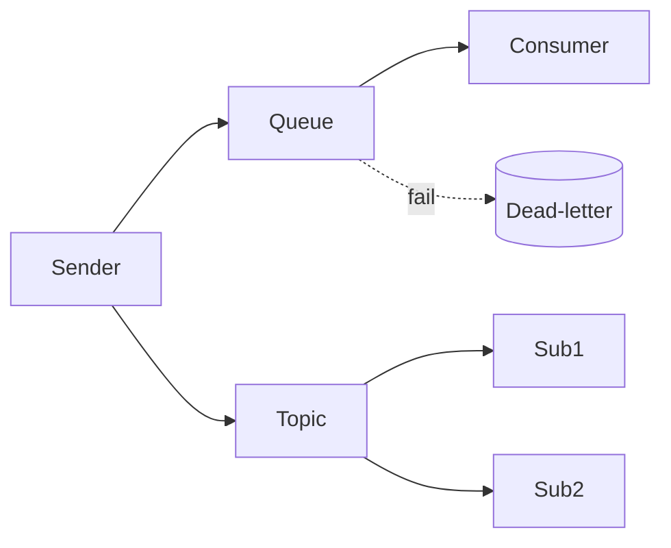

# Azure Service Bus Lab

Learn Service Bus by wiring a broker — pick queue vs pub/sub, order with sessions, catch poison messages — per
[`AGENTS.md`](../../../AGENTS.md). Pairs with [serverless-designer](../serverless-designer/SKILL.md) and [azure-functions-lab](../azure-functions-lab/SKILL.md).

## When to use

- The learner is decoupling services and wants reliable, ordered, retriable messaging.
- Reinforcing async, at-least-once delivery for a **cloud/backend** role-agent.

## Anatomy



A **queue** is point-to-point (competing consumers); a **topic + subscriptions** fans one message out to
many with per-sub filters (Microsoft Learn, *Service Bus queues, topics, and subscriptions*, 2024).

## Procedure

1. **Create the namespace:** a Standard namespace (Premium for isolation); topics/subscriptions need Standard+.
2. **Queue vs topic:** one worker pool → **queue**; independent consumers of the same event → **topic** + a subscription each.
3. **Peek-lock, don't lose messages:** receive in **PeekLock** mode, then `Complete` on success or `Abandon`
   on failure — not ReceiveAndDelete for real work.
4. **Order with sessions:** set a `SessionId` and use session receivers for **FIFO** and per-key grouping
   (Microsoft Learn, *Message sessions*, 2024).
5. **Dead-letter poison messages:** messages that exceed **max delivery count** or TTL land in the **DLQ**;
   read and drain it so failures don't vanish (Microsoft Learn, *Dead-letter queues*, 2024).
6. ⚠ **Secure & clean up:** use **Entra RBAC** (Data Sender/Receiver) over SAS keys, then delete the
   namespace — it bills while it exists.

## Output shape

```
Need: <event/command> | Namespace: <name> (Standard/Premium)
Shape: queue (1 worker pool) OR topic + subscriptions (fan-out + filters)
Receive: PeekLock → Complete/Abandon (not ReceiveAndDelete)
Order: SessionId + session receiver (FIFO) if needed
Failures: DLQ on max-delivery/TTL → drain + inspect
Secure+clean: Entra RBAC (Sender/Receiver) → delete namespace  [⚠ bills while alive]
```

## Tips

- Queue = competing consumers; topic = independent subscribers — pick by how many need the message.
- Design consumers to be **idempotent**: delivery is at-least-once, so messages can repeat.
- End with the **Learning Footer** (`AGENTS.md`) — one subscription filter to add + one DLQ to drain yourself.
