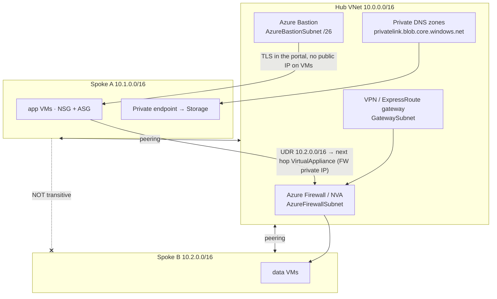

# Azure VNet Hub-Spoke Lab

Build the reference topology and then *trace a packet through it*: **peering → routes → NSG → Bastion →
private endpoint + DNS**, taught from fundamentals per [`AGENTS.md`](../../../AGENTS.md). Hub-spoke fails in
practice for two reasons only: non-transitive peering and private DNS.

## When to use

- The learner needs shared services (firewall, DNS, gateway) centralised while workloads stay isolated.
- Spoke-to-spoke traffic "should work" because both are peered to the hub — the transitivity lesson.
- A private endpoint was created and the app still resolves the resource to a public IP.
- **Don't** use it for a single small workload; one VNet with subnets is cheaper and simpler.

## First principles: peering is a 1-hop relationship

Azure VNet peering connects exactly two virtual networks over the Microsoft backbone with no gateway, no
encryption overhead, and **no transitivity** — spoke A peered to the hub and spoke B peered to the hub does
*not* make A reach B (Azure Virtual Network documentation, *Virtual network peering*). Spoke-to-spoke needs
either a direct peering, a routing appliance in the hub reached via a **user-defined route**, or Azure
Virtual WAN. Everything else in hub-spoke follows from that one property.



| Control | Scope | Stateful? | Decides | Classic mistake |
| --- | --- | --- | --- | --- |
| **NSG** | subnet and/or NIC | yes | allow/deny by 5-tuple, priority 100–4096 | forgetting the default `AllowVnetInBound` already permits spoke traffic |
| **ASG** | groups of NICs | n/a | a *name* usable as source/destination in NSG rules | using IP ranges that churn on every scale event |
| **UDR (route table)** | subnet | n/a | next hop: VirtualAppliance / VirtualNetworkGateway / Internet / None | omitting the return route in the other spoke |
| **Azure Firewall** | hub | yes | L3–L7 filtering, FQDN rules, threat intel | placing it outside the traffic path (no UDR) |
| **Private endpoint** | one PaaS resource | n/a | a private IP in your subnet for a PaaS service | leaving public DNS resolution in place |
| **Service endpoint** | subnet → service | n/a | keeps traffic on the backbone, still a **public IP** | assuming it is the same as a private endpoint |
| **Azure Bastion** | hub VNet | n/a | browser/native RDP+SSH with no public IP on the VM | a `/27` subnet — Bastion needs `/26` or larger |

Azure's **longest-prefix-match** route selection applies with a fixed tie-break: user-defined route > BGP
route > system route. That ordering is why a UDR for `0.0.0.0/0` pointed at the firewall wins over the
system default to the internet.

## Procedure

1. **Allocate non-overlapping address space.** Peering rejects overlaps outright: hub `10.0.0.0/16`,
   spokes `10.1.0.0/16`, `10.2.0.0/16`. Reserve hub subnets for the named services now:

   ```bash
   az group create -n rg-hubspoke -l westeurope
   az network vnet create -g rg-hubspoke -n vnet-hub --address-prefix 10.0.0.0/16 \
     --subnet-name AzureFirewallSubnet --subnet-prefix 10.0.0.0/26
   az network vnet subnet create -g rg-hubspoke --vnet-name vnet-hub -n AzureBastionSubnet --address-prefix 10.0.1.0/26
   az network vnet create -g rg-hubspoke -n vnet-spoke-a --address-prefix 10.1.0.0/16 \
     --subnet-name snet-app --subnet-prefix 10.1.0.0/24
   ```

   ⚠ `AzureFirewallSubnet`, `AzureBastionSubnet`, and `GatewaySubnet` are reserved names — the spelling is
   enforced, as are the minimum sizes `/26` (AzureFirewallSubnet) and `/26` (AzureBastionSubnet).
   `GatewaySubnet` technically accepts `/29`, but use `/27` or larger — smaller ranges block
   ExpressRoute/VPN coexistence and future gateway SKUs.
2. **Peer each spoke to the hub in both directions** — a peering is two objects, and one-sided peering shows
   as `Initiated` rather than `Connected`:

   ```bash
   az network vnet peering create -g rg-hubspoke -n hub-to-a --vnet-name vnet-hub \
     --remote-vnet vnet-spoke-a --allow-vnet-access --allow-forwarded-traffic
   az network vnet peering create -g rg-hubspoke -n a-to-hub --vnet-name vnet-spoke-a \
     --remote-vnet vnet-hub --allow-vnet-access --allow-forwarded-traffic
   ```

3. **Prove non-transitivity.** Deploy a VM in each spoke and ping A → B. It fails. That failure is the
   entire justification for the hub firewall — do not skip it.
4. **Route spoke traffic through the hub** with a UDR whose next hop is the firewall's private IP
   (`--next-hop-type VirtualAppliance`), and apply the mirror route in the other spoke. Asymmetric routing
   is the number-one cause of "the firewall drops my return traffic".
5. **Segment with ASGs, not IP lists.** Create `asg-web` and `asg-db`, attach NICs, then write NSG rules
   whose source and destination are the ASG names — the rule survives every scale-out.
6. **Deploy Azure Bastion** into the hub and remove every public IP from the VMs. ⚠ Bastion bills per hour
   plus outbound data; the Developer SKU is the cheapest way to run this lab — delete it afterwards.
7. **Add a private endpoint** for a PaaS resource in the spoke, and disable public network access on the
   resource so the private path is the only path.
8. **Fix DNS — this is the step everyone misses.** Create the private DNS zone with the exact
   `privatelink.<service>` name, link it to **every** VNet whose clients must resolve it, and attach a
   DNS zone group so the A record is created automatically:

   ```bash
   az network private-dns zone create -g rg-hubspoke -n privatelink.blob.core.windows.net
   az network private-dns link vnet create -g rg-hubspoke -z privatelink.blob.core.windows.net \
     -n link-spoke-a --virtual-network vnet-spoke-a --registration-enabled false
   ```

9. **Verify from inside,** not from your laptop: `nslookup stlab001.blob.core.windows.net` on a spoke VM
   must return a `10.x` address via the CNAME to `privatelink.…`; then confirm the path with Network
   Watcher: `az network watcher test-ip-flow` and `az network watcher show-next-hop`.
10. **Clean up:** `az group delete -n rg-hubspoke --yes --no-wait`. Azure Firewall, Bastion, and gateways
    are the expensive objects — delete them first if you are keeping anything.

## Output shape

```
Topology: hub <10.0.0.0/16> | spokes <10.1.0.0/16, 10.2.0.0/16>  (no overlaps)
Hub subnets: AzureFirewallSubnet /26 · AzureBastionSubnet /26 · GatewaySubnet /27
Peerings: hub↔A <Connected>, hub↔B <Connected> | allow-forwarded-traffic: on | transitive: NO
Spoke-to-spoke: <via UDR 10.2.0.0/16 → VirtualAppliance <fw-private-ip>, mirrored in B>
Routes: 0.0.0.0/0 → VirtualAppliance | selection: UDR > BGP > system (longest prefix first)
Segmentation: NSG <name> on <subnet> using ASGs <asg-web → asg-db:1433 allow, else deny>
Admin access: Azure Bastion (<SKU>) — public IPs on VMs: 0
Private endpoint: <resource> → <private IP> | public network access: disabled
DNS: zone privatelink.<service> linked to <VNets> | verified from spoke: nslookup → 10.x ✓
Verify: test-ip-flow <allow/deny by rule <name>> · show-next-hop <VirtualAppliance>
Cost: ⚠ Firewall + Bastion + gateway bill hourly — delete first
Next: <azure-landing-zone-coach | cloud-private-connectivity-coach | azure-app-service-lab>
Learning Footer
```

## Worked example — an ASG-based NSG rule and the UDR that makes the firewall real

```bash
# 1. Application security groups: names that follow the workload, not the IPs.
az network asg create -g rg-hubspoke -n asg-web -l westeurope
az network asg create -g rg-hubspoke -n asg-db  -l westeurope

# 2. Only web tier may reach SQL on the DB tier; everything else inside the VNet is denied.
az network nsg rule create -g rg-hubspoke --nsg-name nsg-spoke-a -n allow-web-to-db \
  --priority 100 --direction Inbound --access Allow --protocol Tcp \
  --source-asgs asg-web --destination-asgs asg-db --destination-port-ranges 1433
az network nsg rule create -g rg-hubspoke --nsg-name nsg-spoke-a -n deny-vnet-inbound \
  --priority 4000 --direction Inbound --access Deny --protocol '*' \
  --source-address-prefixes VirtualNetwork --destination-address-prefixes VirtualNetwork \
  --destination-port-ranges '*'

# 3. Force spoke A's traffic to spoke B through the hub firewall (and mirror it in spoke B).
az network route-table create -g rg-hubspoke -n rt-spoke-a
az network route-table route create -g rg-hubspoke --route-table-name rt-spoke-a -n to-spoke-b \
  --address-prefix 10.2.0.0/16 --next-hop-type VirtualAppliance --next-hop-ip-address 10.0.0.4
az network vnet subnet update -g rg-hubspoke --vnet-name vnet-spoke-a -n snet-app --route-table rt-spoke-a
```

The `deny-vnet-inbound` rule at priority 4000 is what makes the allow rule meaningful: without it, the
platform's default `AllowVnetInBound` (priority 65000) already permits every spoke-to-spoke flow the routing
layer delivers. Rules are evaluated lowest priority number first, and the first match wins.

## Tips

- Peering is **non-transitive** and address spaces must not overlap — those two facts explain most hub-spoke
  incidents. Test spoke-to-spoke *before* you add the firewall so the failure is memorable.
- `--allow-forwarded-traffic` is required on the peering when an NVA in the hub forwards packets it did not
  originate; without it the firewall silently blackholes traffic.
- Put UDRs on **both** spokes. A single-sided route produces asymmetric paths that a stateful firewall drops.
- A private endpoint without the matching `privatelink.*` private DNS zone linked to the *client's* VNet
  still resolves publicly — see [cloud-private-connectivity-coach](../cloud-private-connectivity-coach/SKILL.md).
- Bastion needs `AzureBastionSubnet` sized `/26` or larger; the subnet name is case-sensitive and reserved.
- Pair with [azure-landing-zone-coach](../azure-landing-zone-coach/SKILL.md),
  [azure-bicep-lab](../azure-bicep-lab/SKILL.md),
  [azure-app-service-lab](../azure-app-service-lab/SKILL.md),
  [az-104-exam-drill](../az-104-exam-drill/SKILL.md),
  [networking-fundamentals-coach](../networking-fundamentals-coach/SKILL.md), and
  [aws-vpc-lab](../aws-vpc-lab/SKILL.md).
  Close with the **Learning Footer** (`AGENTS.md`): one route to trace, one NSG rule to tighten.
