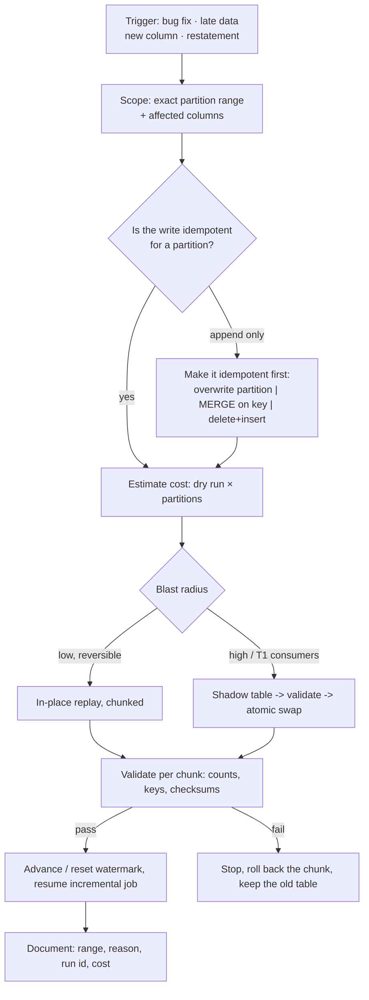

# Backfill and Reprocessing Coach

A backfill is a **production write against history** — the risky part is never the SQL, it is duplication,
partial completion, and an unbounded bill. Taught as a rehearsed procedure, in the verify-before-you-act
spirit of [`AGENTS.md`](../../../AGENTS.md).

## When to use

- A transformation bug, a late-arriving source, a restated upstream feed, or a new column means historical
  partitions must be recomputed.
- A previous backfill duplicated rows, half-completed, or scanned a fortune, and the learner needs a method.
- Watermarks, stream offsets, or orchestrator run states must be rewound safely.
- **Don't use it for** deciding *whether* the data is wrong — detect and triage first with
  [data-observability-coach](../data-observability-coach/SKILL.md).

## First principles: idempotency is the whole game

An operation is **idempotent** when applying it N times leaves the same state as applying it once. Backfills
retry, overlap, and get interrupted, so any non-idempotent write pattern will eventually duplicate data.



| Write pattern | Idempotent? | Cost profile | Use when |
| --- | --- | --- | --- |
| `INSERT` (append) | **No** — retries duplicate | cheapest | never, for backfills |
| `INSERT OVERWRITE` / partition replace | Yes, per partition | rewrites whole partition | partition-aligned recompute |
| `MERGE` on a stable business key | Yes | scans target — **must** be partition-scoped | row-level corrections |
| `DELETE` range + `INSERT` | Yes, if atomic/transactional | two passes | engines without partition overwrite |
| Shadow table + atomic swap | Yes | doubles storage temporarily | T1 tables, wide restatements |
| `--full-refresh` (whole table) | Yes | most expensive by far | small tables, or logic changed everywhere |

**Trade-off to say out loud:** in-place replay is cheap and fast but consumers see a half-rebuilt table
mid-run; shadow-table-plus-swap costs extra storage and a second pass but keeps readers on consistent data
until one atomic rename. Tier the table (T1 → shadow; T3 → in place).

| Trigger | Correct scope | Watermark action |
| --- | --- | --- |
| Transformation bug | all partitions since the bad deploy | none (source unchanged) |
| Late-arriving events | affected event-time partitions only | extend the lookback window instead of rewinding |
| New/renamed column | full history for that model | none |
| Upstream restatement | the restated range | rewind ingestion watermark to the range start |
| Corrupted load | the corrupted partitions | rewind ingestion watermark / stream offsets |

## Procedure

1. **Write the change ticket first**: what is wrong, since when, which partitions, who consumes them, and
   what "correct" will be measured by. No range → no backfill.
2. **Prove idempotency on one partition** in a scratch dataset: run it twice, assert identical row counts
   and key checksums. Do this *before* touching production.
3. **Pause the incremental job** (or the DAG's schedule) so the backfill and the regular run cannot race.
4. **Estimate the cost** for one partition, multiply by partition count, and set a hard cap
   (`--maximum_bytes_billed`, a dedicated pool/reservation, or a slot limit).
5. **Chunk the range** — one partition (or one week) per task, bounded concurrency. Chunking makes a
   failure resumable and keeps a runaway bill impossible.
6. **Run oldest → newest** so downstream incremental models can follow, and record every completed chunk in
   a control table.
7. **Validate per chunk**: row count vs. control, primary-key uniqueness, and a checksum of the corrected
   columns — not just "the job succeeded".
8. **Swap or commit**, then **reset the watermark / offsets** to the correct resume point — only after the
   incremental job is paused, never while it is running.
9. **Resume the schedule**, confirm the next normal run produces no gap and no overlap.
10. **Record the run** (range, reason, run id, bytes, duration) and add the monitor that would have caught
    it. Close with the **Learning Footer**.

## Output shape

```
Trigger: <bug | late data | new column | restatement | corruption>   Detected: <ts / how>
Scope: table=<...> partitions=[<start> .. <end>] columns=<...> consumers=<T1/T2 list>
Idempotency: pattern=<overwrite|merge|delete+insert|shadow-swap>  proven by <double-run test result>
Race control: incremental job paused=<yes> · schedule off=<yes> · lock/pool=<...>
Cost: per-partition=<bytes/slot_ms> × <n> partitions = <total>  cap=<--maximum_bytes_billed=...>
Execution: chunk=<1 day> concurrency=<n> order=<oldest->newest> resume state=<control table>
Validation per chunk: rows=<expected vs actual> · pk unique=<pass> · checksum=<...>
Watermark/offsets: old=<...> new=<...> reset AFTER pause=<yes>
Rollback: <keep old table until <date> | snapshot/time-travel version <n>>
Next: <data-observability-coach | airflow-dag-coach | dbt-model-coach>
Learning Footer
```

## Worked example — a 30-day restatement, chunked, capped, idempotent

**1 — dbt microbatch (dbt 1.9+) makes the model backfillable by construction.** `event_time` +
`batch_size` mean dbt runs one bounded batch per period instead of rebuilding the table:

```sql
{{ config(
    materialized='incremental',
    incremental_strategy='microbatch',
    event_time='event_ts',
    batch_size='day',
    begin='2026-01-01',
    lookback=2
) }}

select event_id, event_ts, customer_id, amount
from {{ ref('stg_events') }}
```

```bash
# Backfill exactly the restated window — not --full-refresh, which rebuilds all history.
dbt run --select fct_events \
        --event-time-start "2026-03-01" \
        --event-time-end   "2026-03-31"
```

**2 — Or hand-written, one partition at a time, idempotent and partition-scoped.** The partition predicate
in the `ON` clause is what stops the `MERGE` scanning the whole target table:

```sql
DECLARE run_date DATE DEFAULT DATE '2026-03-01';

MERGE `proj.analytics.fct_events` T
USING (
  SELECT event_id, event_ts, customer_id, amount
  FROM `proj.staging.events_restated`
  WHERE DATE(event_ts) = run_date
) S
ON  T.event_id = S.event_id
AND DATE(T.event_ts) = run_date        -- prunes the target to ONE partition
WHEN MATCHED THEN UPDATE SET amount = S.amount, customer_id = S.customer_id
WHEN NOT MATCHED THEN INSERT (event_id, event_ts, customer_id, amount)
     VALUES (S.event_id, S.event_ts, S.customer_id, S.amount);
```

Run it twice with the same `run_date`: the second run matches every row and updates them to identical
values — the row count does not move. That double-run test *is* the idempotency proof.

**3 — Cap the cost before running 30 of them.**

```bash
bq query --use_legacy_sql=false --dry_run \
  'SELECT event_id FROM `proj.staging.events_restated` WHERE DATE(event_ts) = "2026-03-01"'
# multiply the reported bytes by 30, then enforce a ceiling per chunk:
bq query --use_legacy_sql=false --maximum_bytes_billed=20000000000 "$SQL"
```

**4 — Rewind the watermark only after pausing the incremental job.**

```sql
UPDATE ops.ingest_watermark
SET watermark_ts = TIMESTAMP '2026-03-01 00:00:00',
    updated_at   = CURRENT_TIMESTAMP(),
    reason       = 'restatement INC-412'
WHERE stream_name = 'events';
```

For a streaming source the equivalent is a consumer-group offset reset, which Kafka only permits while the
group is **inactive** — stop the consumers first:

```bash
kafka-consumer-groups.sh --bootstrap-server broker:9092 \
  --group events-etl --topic events \
  --reset-offsets --to-datetime 2026-03-01T00:00:00.000 --execute
```

**5 — Orchestrator replay.** Clear and re-run the affected data intervals rather than hand-running tasks;
cap parallelism with a pool. Airflow's backfill CLI differs between 2.x (`airflow dags backfill -s <start>
-e <end> <dag_id>`) and 3.x (`airflow backfill create ...`) — check `airflow --help` for your version.

**6 — Validate before declaring done:**

```sql
SELECT DATE(event_ts) AS d, COUNT(*) AS rows_out,
       COUNT(DISTINCT event_id) AS distinct_keys,
       SUM(amount) AS checksum_amount
FROM `proj.analytics.fct_events`
WHERE DATE(event_ts) BETWEEN '2026-03-01' AND '2026-03-31'
GROUP BY d ORDER BY d;   -- rows_out must equal distinct_keys; compare checksum to the source
```

## Tips

- If `rows_out <> distinct_keys` after a backfill, your write was an append. Stop and fix the pattern.
- Never backfill while the incremental job is running — the race produces gaps *and* duplicates at the seam.
- `--full-refresh` is a cost decision, not a safety decision; prefer partition-scoped replay on big tables.
- Late-arriving data is usually a **lookback window** problem, not a backfill problem — widen the window.
- Chunk everything. An interrupted 30-day monolith leaves unknown state; an interrupted chunk sequence is
  resumable from the control table.
- Keep the old table (or a time-travel version) until consumers confirm; a backfill without a rollback path
  is a one-way door.
- Verify CLI flags against your tool's version docs before running against production (`AGENTS.md` §2).
- Pair with [data-observability-coach](../data-observability-coach/SKILL.md),
  [airflow-dag-coach](../airflow-dag-coach/SKILL.md),
  [dbt-model-coach](../dbt-model-coach/SKILL.md),
  [cdc-pipeline-coach](../cdc-pipeline-coach/SKILL.md),
  [bigquery-optimization-coach](../bigquery-optimization-coach/SKILL.md), and
  [incident-postmortem](../incident-postmortem/SKILL.md).
  End with the **Learning Footer** (`AGENTS.md`).
