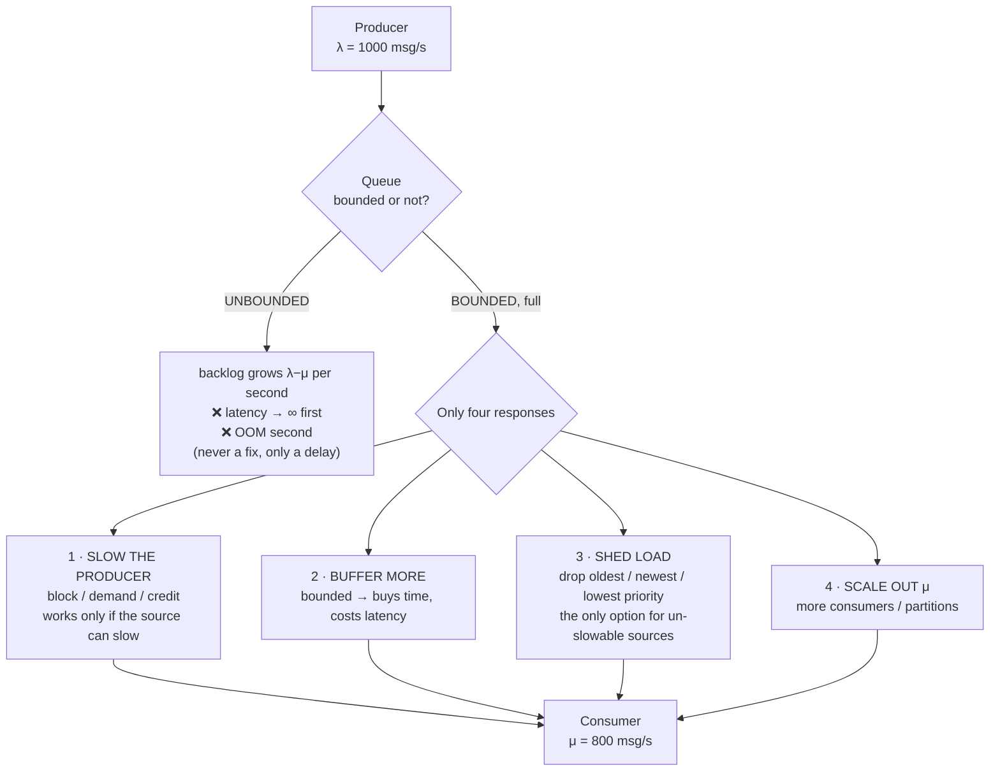
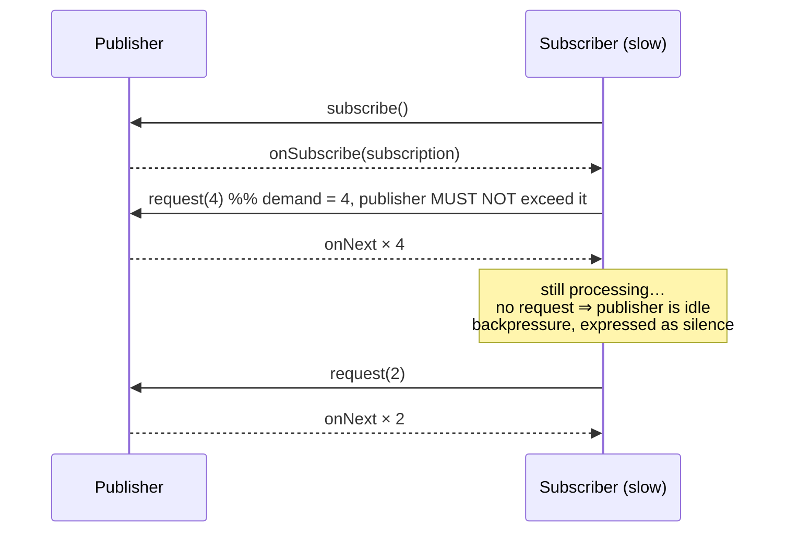

# Backpressure Coach

Backpressure is not a feature you add; it is the **admission that a consumer has a maximum rate**. This skill
derives what must happen when the producer exceeds it, proves that there are only four options, and shows how
each is expressed in real runtimes — reasoning from queueing theory first, per [`AGENTS.md`](../../../AGENTS.md).

## When to use

- A queue, channel, buffer or consumer lag grows monotonically under load.
- Choosing between blocking the producer, dropping messages, and scaling out consumers.
- Designing a streaming pipeline, an event consumer, a WebSocket fan-out, or a file/HTTP proxy.
- The service degrades catastrophically (rather than gracefully) at a load spike, or dies with OOM.
- **Don't use it for** limiting *clients* by policy/quota — that's
  [rate-limiter-designer](../rate-limiter-designer/SKILL.md); or for isolating a failing dependency —
  [circuit-breaker-coach](../circuit-breaker-coach/SKILL.md). They are complements, not substitutes.

## First principles: the queue is a measurement, not a solution

If the arrival rate $\lambda$ exceeds the service rate $\mu$, the backlog grows at $\lambda - \mu$ **forever**.
A queue does not fix that; it only decides *how the failure presents*. Little's Law gives the price
immediately, and standard M/M/1 queueing gives the shape:

$$L = \lambda W \quad\Rightarrow\quad W = \frac{L}{\lambda}
\qquad\qquad
\rho = \frac{\lambda}{\mu}, \qquad W_{M/M/1} = \frac{1}{\mu - \lambda}, \qquad L = \frac{\rho}{1-\rho}$$

The $\frac{1}{\mu-\lambda}$ term is the whole story: at $\rho = 0.9$ the mean time in system is 10× the service
time; at $\rho = 0.99$ it is 100×. **Latency does not degrade linearly with load — it degrades hyperbolically**,
which is why systems seem fine right up until they are not.



*There is no fifth option. Any design that claims "never drop, never block, bounded memory, unbounded input"
is claiming one of the four silently — usually option 3, at a moment nobody chose.*

### Credit / demand-based flow control, the mechanism behind all of them



*Reactive Streams (specification 1.0.4): the subscriber signals demand with `request(n)` and the publisher may
never emit more than the outstanding demand. Backpressure is the **absence** of a request.*

| Layer | Mechanism | Knob | What happens when the consumer stalls |
| --- | --- | --- | --- |
| TCP | receive-window advertisement (**flow control**, receiver-driven — distinct from *congestion* control, which is network-driven) | socket buffers | sender stops when the window reaches 0 |
| HTTP/2 & gRPC | credit-based `WINDOW_UPDATE` frames per stream **and** per connection (RFC 9113, June 2022; initial window 65 535 octets) | `SETTINGS_INITIAL_WINDOW_SIZE` | sender blocks per-stream, other streams continue |
| JVM reactive (Reactor, RxJava, Akka Streams) | Reactive Streams `request(n)`; `java.util.concurrent.Flow` since JDK 9 | operator buffer sizes, `onBackpressureBuffer/Drop/Latest` | demand stops; chosen overflow strategy applies |
| Node.js streams | `writable.write()` returns **false** ⇒ wait for `'drain'`; `pipeline()` wires it for you | `highWaterMark` | producer must pause; ignoring the return value is the classic memory leak |
| Python asyncio | `asyncio.Queue(maxsize=N)` — `await q.put()` suspends when full; `await writer.drain()` on streams | `maxsize` | the producing coroutine suspends |
| Go | bounded buffered channel blocks on send; `select` + `default` sheds instead | channel capacity | goroutine blocks (or drops, if you chose `default`) |
| Kafka | consumer **pull** model is backpressure by construction; the producer's accumulator blocks when full | `max.poll.records`, `fetch.max.bytes`, producer `buffer.memory` + `max.block.ms` | producer's `send()` blocks, then throws on timeout (verify current defaults) |

**Choosing a shedding policy is a product decision, not a technical one:** drop-oldest for live telemetry
(freshness matters), drop-newest for audit trails (completeness of the prefix matters), priority-drop for mixed
traffic. And shed **early**, at admission, where the request has cost you nothing yet.

## Procedure

1. **Measure $\lambda$ and $\mu$** separately — arrivals per second and the consumer's *actual* service rate
   under production conditions, not on an idle laptop. Compute $\rho = \lambda/\mu$ at peak.
2. **Bound every queue.** Search the codebase for unbounded constructs and give each one a size:
   `asyncio.Queue()` → `asyncio.Queue(maxsize=…)`, `make(chan T)` → `make(chan T, n)`,
   `LinkedBlockingQueue()` → `LinkedBlockingQueue(capacity)`, `Executors.newFixedThreadPool` (whose default
   queue is unbounded) → an explicit `ThreadPoolExecutor` with a bounded queue and a `RejectedExecutionHandler`.
3. **Size the bound from latency, not from memory**: the queue's job is to absorb *bursts*, so
   $\text{capacity} \approx \mu \times T_{\text{acceptable queueing delay}}$. A queue deeper than your deadline
   is a machine for producing responses nobody wants.
4. **Decide the overflow policy explicitly** and write it in the code, not in a wiki: block, drop-oldest,
   drop-newest, reject with `429`/`503` + `Retry-After`, or spill. Then test it.
5. **Propagate the pressure to a place that can act on it.** Blocking a thread is not backpressure if the
   thread pool is unbounded; the signal must reach an entity that can slow down (a pull-based reader, an HTTP
   client honouring `429`, a TCP sender) or be shed at the edge.
6. **Add deadline-aware shedding** — if a request has already waited longer than the client's timeout, doing the
   work is pure waste; drop it and free capacity:
   ```python
   item = await queue.get()
   if loop.time() - item.enqueued_at > item.deadline:
       metrics.shed_expired.inc()
       continue                      # the caller has already given up
   ```
7. **Kill the amplifiers.** Retries add load exactly when the system is overloaded; cap them with a retry budget
   plus jittered backoff and a circuit breaker
   ([retry-backoff-coach](../retry-backoff-coach/SKILL.md),
   [circuit-breaker-coach](../circuit-breaker-coach/SKILL.md)).
8. **Instrument the four signals**: queue depth, queue *wait time* (more useful than depth), shed count by
   reason, and $\rho$. Alert on wait time and shed rate, not on depth alone.
9. **Load-test past the knee**, not up to it — push $\lambda$ to 1.5 × $\mu$ and verify the system degrades the
   way you chose ([k6-load-test-lab](../k6-load-test-lab/SKILL.md),
   [locust-load-test-lab](../locust-load-test-lab/SKILL.md)).
10. Record the policy and the measured degradation curve, then close with the **Learning Footer**.

## Output shape

```
Path: <producer → queue → consumer>
Rates: λ_peak=<msg/s>  μ_measured=<msg/s>  ρ=λ/μ=<..>   Sustained deficit: <λ−μ = ..>/s
Queues found: <name: bounded? capacity | UNBOUNDED ❌> (list every one, including thread-pool queues)
Capacity rationale: μ × acceptable delay = <..> × <..s> = <n> items   (NOT "whatever fits in RAM")
Overflow policy: <block | drop-oldest | drop-newest | reject 429/503 | spill>  chosen because <product reason>
Pressure propagates to: <pull-based source | HTTP client honouring 429 | TCP sender | NOWHERE ❌>
Deadline shedding: <enabled — drop when queued > client timeout | none>
Amplifiers controlled: retries=<budget + jittered backoff>  breaker=<yes/no>
Signals: queue_wait_p99=<..> depth=<..> shed_rate=<..>/s ρ=<..>   Alerts on: <wait time, shed rate>
Overload test: λ = 1.5×μ ⇒ observed <graceful: sheds x%, p99 stable | collapse ❌>
Next: <rate-limiter-designer | message-queue-coach | capacity-planning-coach>
Learning Footer
```

## Worked example — recompute what an unbounded queue actually costs

An ingestion service receives **λ = 1000 events/s**; the consumer writes to a database at **μ = 800 events/s**.
Each event is ~1 KB. The queue is `asyncio.Queue()` — unbounded.

**Backlog growth:** $\lambda - \mu = 200$ events/s.

| Elapsed | Backlog $L$ | Memory (1 KB each) | Queueing delay $W = L/\mu$ |
| --- | --- | --- | --- |
| 1 min | 12 000 | 12 MB | 12 000 / 800 = **15 s** |
| 10 min | 120 000 | 120 MB | **150 s** (2.5 min) |
| 1 hour | 720 000 | 720 MB | 720 000 / 800 = **900 s** (15 min) |
| 7 hours | 5 040 000 | ≈ 5 GB | ≈ 105 min → **OOM** |

Read the last column before the third one. Memory is fine for hours, but **after one minute every event is
already 15 seconds stale**, and after an hour the pipeline is emitting quarter-hour-old data. If those events
drive alerts or user-visible state, the system has been *failing since minute one* while every dashboard says
"healthy — memory 720 MB". The OOM at hour seven is not the incident; it is the post-mortem.

**Now bound it.** Capacity from the latency budget rather than the heap: the product owner accepts 5 s of
queueing delay, so $\text{capacity} = \mu \times 5\,\text{s} = 800 \times 5 = 4000$ events (4 MB). The queue
fills in $4000 / 200 = 20$ s, and then the chosen policy takes over:

| Policy | Behaviour at steady overload | Fitness |
| --- | --- | --- |
| **Block the producer** (`await q.put()`) | producer slows to 800/s; if it reads from Kafka/a file, the lag simply moves upstream where it is visible and durable | ✅ best when the source is pull-based |
| **Drop-oldest** | 20 % of events lost, consumer always processes the freshest; delay pinned at ≤ 5 s | ✅ best for live telemetry |
| **Reject at admission** (`503` + `Retry-After`) | 20 % of callers told to back off; capacity spent only on work that will be delivered | ✅ best for synchronous APIs |
| **Scale consumers** | 2 consumers ⇒ μ = 1600 > λ; backlog drains at 600/s and the queue empties in ≈ 7 s | ✅ if the sink can take it |
| **Unbounded** | none of the above; you get drop-everything at OOM, chosen by the kernel | ❌ |

Verify the scale-out row: with backlog 4000 and net drain rate $1600 - 1000 = 600$/s, drain time
$= 4000/600 = 6.7$ s. ✓

**The trap in "just scale consumers":** if the real constraint is the database (connection pool, lock
contention, disk), doubling consumers does *not* double μ — it may lower it. Confirm the bottleneck first with
[connection-pooling-coach](../connection-pooling-coach/SKILL.md) and
[capacity-planning-coach](../capacity-planning-coach/SKILL.md); adding parallelism to a saturated resource is
how a slow system becomes a broken one.

**And check the retry amplifier.** Suppose rejected callers retry 3 times without backoff: the offered load
becomes $1000 + 3 \times 200 = 1600$/s against μ = 800 — the shedding you added to survive overload has
*doubled* the overload. Retry budgets are part of the backpressure design, not a separate topic.

## Tips

- Every unbounded queue is a deferred outage. Grep for them — including the hidden ones inside default thread
  pools and executor factories.
- Size queues by **acceptable delay × service rate**, never by available memory. A queue longer than the
  client's timeout produces work that will be thrown away.
- Alert on queue **wait time**, not depth. Depth without a service rate is a number with no units of meaning.
- Backpressure must reach something that can actually slow down. Blocking a thread in an unbounded pool just
  moves the unbounded queue into the scheduler.
- Shed at admission, cheaply, and prefer dropping *stale* work: a request past its deadline costs the same to
  serve and is worth nothing.
- Under sustained overload, LIFO ordering with expiry beats FIFO — FIFO guarantees you serve the requests whose
  clients already gave up.
- Pull-based transports (Kafka consumers, TCP, Reactive Streams) give backpressure for free; push-based ones
  (UDP, webhooks, fan-out sockets) never will — for those, shedding is the only honest option
  ([message-queue-coach](../message-queue-coach/SKILL.md),
  [kafka-consumer-lab](../kafka-consumer-lab/SKILL.md)).
- Practise the mechanics in your language of choice:
  [python-asyncio-lab](../python-asyncio-lab/SKILL.md), [go-channels-lab](../go-channels-lab/SKILL.md),
  [js-event-loop-lab](../js-event-loop-lab/SKILL.md),
  [concurrency-coach](../concurrency-coach/SKILL.md); design the pipeline with
  [streaming-pipeline-designer](../streaming-pipeline-designer/SKILL.md) and turn the degradation curve into a
  commitment with [slo-designer](../slo-designer/SKILL.md). End with the **Learning Footer** (`AGENTS.md`).
