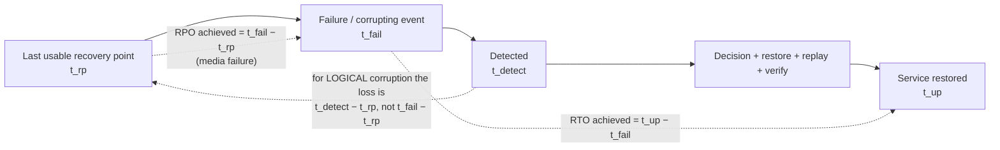

# Backup Recovery Drill

A backup is a **claim**; a restore is **evidence**. This skill converts the claim into evidence: it derives
RPO and RTO from a timeline you can defend, then makes you actually restore — in the measure-honestly,
verify-before-you-teach spirit of [`AGENTS.md`](../../../AGENTS.md).

## When to use

- The backup dashboard is green and nobody in the room has restored from it.
- An auditor, customer or incident asks "how much data would we lose, and how long would we be down?"
- Choosing a schedule and wanting the arithmetic behind full / incremental / differential.
- Ransomware, accidental `DROP TABLE`, or a bad migration made you discover your recovery path at 3 a.m.
- **Don't use it for** whole-region failover architecture and dependency ordering — that's
  [disaster-recovery-planner](../disaster-recovery-planner/SKILL.md); or for the attacker-resilience specifics
  of immutable, air-gapped copies — that's
  [ransomware-resilience-drill](../ransomware-resilience-drill/SKILL.md).

## First principles: two clocks, pointing in opposite directions

**RPO (Recovery Point Objective)** looks *backwards* from the failure: the maximum acceptable data loss,
measured in time. **RTO (Recovery Time Objective)** looks *forwards* from the failure: the maximum acceptable
time until service is restored. They are budgets you choose; what you actually get are the *achieved* values,
and only a drill reveals those.



*Two clocks: RPO is the gap on the left, RTO the span on the right. The dotted lower arrow is the trap —
logical corruption forces you to roll back past every good write made since it happened.*

| Backup type | Contains | Restore chain | Backup cost | Restore cost |
| --- | --- | --- | --- | --- |
| **Full** | everything | full only | highest | lowest |
| **Incremental** | changes since the **last backup of any type** | full **+ every** incremental since | lowest | highest (long chain; one bad link breaks it) |
| **Differential** | changes since the **last full** | full **+ the latest** differential only | grows until the next full | low (2 pieces) |
| **Continuous (WAL/binlog/redo)** | every change, as a stream | base backup + replay to a chosen time | steady | replay time ∝ distance from base |

Getting that direction backwards is the classic exam error: *incremental chains to the previous backup;
differential always chains to the last full.* Differential images grow each day; incrementals stay small but
make you depend on every file in the chain.

Continuous archiving is what makes **PITR** possible, and it sets your floor:

$$RPO_{\text{media failure}} \approx \text{WAL archive lag} \le \texttt{archive\_timeout} + t_{\text{ship}}
\qquad
RTO \approx t_{\text{detect}} + t_{\text{decide}} + \frac{S_{\text{base}}}{B_{\text{restore}}} + \frac{S_{\text{WAL}}}{B_{\text{replay}}} + t_{\text{verify}} + t_{\text{cutover}}$$

**3-2-1** (attributed to Peter Krogh, *The DAM Book*, 2005/2009, and repeated in CISA/US-CERT guidance):
**3** copies of the data, on **2** different media, with **1** offsite. Modern ransomware practice extends it
to **3-2-1-1-0**: one copy **immutable or offline**, and **0** errors after an automated verification pass.

## Procedure

1. **Write the targets down** with the business, per dataset: `RPO_target`, `RTO_target`, and the cost of
   missing each. Undifferentiated "everything is tier 1" makes the drill meaningless.
2. **Inventory what exists**: what is backed up, where, encrypted with which key, who can delete it, and the
   last time each was restored. Anything with "never" in that last column is the drill's first target.
3. **Turn on continuous archiving** (PostgreSQL example — read your engine's current docs for exact syntax):
   ```ini
   # postgresql.conf
   wal_level = replica
   archive_mode = on
   archive_command = 'test ! -f /wal/%f && cp %p /wal/%f'   # replace with an object-store uploader in prod
   archive_timeout = 300        # force a WAL segment switch every 5 min → bounds RPO for media failure
   ```
   ```bash
   pg_basebackup -h db -U replicator -D /backup/base-$(date +%F) -Ft -z -Xstream -c fast -P
   ```
4. **Schedule for the restore, not the backup.** Choose full-vs-differential/incremental cadence by the
   *restore chain length* you are willing to depend on, then compute expected restore time with the RTO
   formula above using measured throughput — not the vendor's brochure number.
5. **Drill it for real.** Restore into a *scratch* instance from the artefacts only, with production access
   revoked, and a stopwatch running:
   ```bash
   pg_verifybackup /backup/base-2026-06-01          # checks the backup_manifest checksums
   tar -xzf base.tar.gz -C /restore/data
   cat >> /restore/data/postgresql.conf <<'EOF'
   restore_command = 'cp /wal/%f %p'
   recovery_target_time = '2026-06-01 14:36:00+00'
   recovery_target_action = 'promote'
   EOF
   touch /restore/data/recovery.signal     # PostgreSQL 12+; recovery.conf no longer exists
   pg_ctl -D /restore/data start
   ```
   ⚠ `pg_verifybackup` verifies plain-format backups; tar-format verification arrived in a later major
   version — verify support for *your* PostgreSQL version on the current `pg_verifybackup` page.
6. **Verify the data, not just the process.** Row counts and a business checksum on the restored copy, then an
   application smoke test:
   ```sql
   SELECT count(*), sum(amount), max(created_at) FROM invoice;   -- compare against the pre-failure value
   SELECT pg_last_wal_replay_lsn(), pg_is_in_recovery();
   ```
7. **Record the *achieved* RPO and RTO** and every step's duration. Publish the gap against target; a drill
   that produces no number is a rehearsal, not a measurement.
8. **Attack your own backups**: can the same credential that runs the app delete the backups? Are the copies
   immutable (object lock / WORM), and is at least one offline? Rotate the restore *runner* so restoring is not
   one person's tribal knowledge ([runbook-writer](../runbook-writer/SKILL.md)).
9. **Fix the dominant term.** Usually it is detection or verification, not I/O — see the worked example — then
   re-drill on a schedule (quarterly is a common floor) and close with the **Learning Footer**.

## Output shape

```
Dataset: <name>   Size: <base GB> + <WAL GB/h>   Tier: <1|2|3>
Targets: RPO_target=<..>  RTO_target=<..>       Owner: <team>
Scheme: <full nightly + WAL continuous | full weekly + differential daily | ...>  Restore chain length: <n artefacts>
3-2-1-1-0: copies=<3?> media=<2?> offsite=<1?> immutable/offline=<1?> verified-error-free=<0 errors?>
Drill: date=<..> restored-from=<artefact ids> operator=<..> environment=<scratch, prod access revoked>
Timeline: detect=<..> decide=<..> restore=<..> replay=<..> verify=<..> cutover=<..>
ACHIEVED: RPO=<..> (media) / <..> (logical corruption)   RTO=<..>     Target met? <yes/no>
Verification: pg_verifybackup=<pass/fail> · row counts=<match?> · business checksum=<match?> · smoke test=<pass/fail>
Dominant RTO term: <detection | replay | verification | human decision>   Fix: <one change>
Next drill: <date>   Next: <disaster-recovery-planner | ransomware-resilience-drill | slo-designer>
Learning Footer
```

## Worked example — recompute RPO and RTO from a real timeline

**Setup.** 200 GB PostgreSQL. Nightly base backup at 01:00. WAL archived continuously with
`archive_timeout = 300` (5 min). WAL generation ≈ 3 GB/hour. Measured restore throughput 250 MB/s from object
storage; measured WAL replay 80 MB/s. Targets: RPO ≤ 15 min, RTO ≤ 60 min.

**The event.** A bad migration at **14:37** silently deletes rows. Monitoring notices anomalous counts at
**15:10**. The team decides by **15:20** to restore to just before the migration: recovery target **14:36**.

Compute each term:

| Term | Arithmetic | Value |
| --- | --- | --- |
| Detection | 15:10 − 14:37 | 33 min |
| Decision | 15:20 − 15:10 | 10 min |
| Base restore | 200 000 MB ÷ 250 MB/s = 800 s | 13.3 min |
| WAL replay | 01:00 → 14:36 = 13.6 h × 3 GB/h = 40.8 GB ÷ 80 MB/s = 510 s | 8.5 min |
| Verify | checksums + smoke test | 15 min |
| Cutover | DNS/connection string + app restart | 5 min |
| **RTO achieved** | 33 + 10 + 13.3 + 8.5 + 15 + 5 | **84.8 min** ❌ (target 60) |

Now the RPO, and this is the part that is usually reported wrongly:

- **If this had been a media failure** (disk lost at 14:37), the last archived WAL is at most
  `archive_timeout` old ⇒ **RPO ≈ 5 min** ✅ — comfortably inside the 15-minute target.
- **Because it is logical corruption**, you must roll back to 14:36, so *every legitimate write between 14:36
  and the moment you cut over* is discarded: 15:20 − 14:36 = **44 min of real business data lost** ❌.

Same backups, same infrastructure, an order of magnitude difference — because the RPO for logical corruption
is governed by **detection time**, not by archive interval. Any RPO statement that omits the failure class is
not a statement.

**Fixing the dominant terms** (note that I/O is only 22 of the 85 minutes):

| Change | Term affected | New value |
| --- | --- | --- |
| Row-count/anomaly alert on `invoice` within 5 min | detection 33 → 5 | −28 min |
| Base backup every 6 h instead of 24 h | replay 8.5 → max 6 h × 3 GB/h = 18 GB ÷ 80 MB/s = 3.75 min | −4.75 min |
| Scripted verification (checksum query + smoke test in CI) | verify 15 → 4 | −11 min |
| **New RTO** | 5 + 10 + 13.3 + 3.75 + 4 + 5 | **41 min** ✅ |

And add a **delayed standby** (`recovery_min_apply_delay = '1h'` on a replica): a replica held one hour behind
can be stopped *before* the bad transaction is applied and promoted in minutes, cutting both base restore and
replay out of the path entirely for corruption caught inside the delay window. That single setting is the
highest-leverage change on this list — and it costs one extra replica, not a new product.

## Tips

- "The backup succeeded" is a statement about the *writer*. Only a restore is a statement about the *reader* —
  drill on a calendar, with a named operator and a stopwatch.
- Always state RPO **per failure class**: media loss, logical corruption, ransomware, and region loss have
  different achievable numbers on identical backups.
- Incremental chains break as a unit — a single unreadable link invalidates everything after it. Differentials
  trade storage for a two-artefact restore; pick deliberately.
- The restore path must not depend on the thing that failed: backup credentials, KMS keys, DNS, and the runbook
  itself must all be reachable when production is not ([oncall-runbook-coach](../oncall-runbook-coach/SKILL.md)).
- Test the *whole* chain including decryption. A backup you cannot decrypt because the key lived only in the
  dead cluster is a very expensive tarball ([secrets-management-coach](../secrets-management-coach/SKILL.md)).
- Make one copy immutable and one offline; assume the attacker has your admin credentials
  ([ransomware-resilience-drill](../ransomware-resilience-drill/SKILL.md),
  [security-hardening-checklist](../security-hardening-checklist/SKILL.md)).
- Replication is **not** a backup: it replicates the `DELETE` faithfully and instantly. Keep both, and see
  [replication-topology-coach](../replication-topology-coach/SKILL.md).
- Practise offline on real files with [postgres-local-lab](../postgres-local-lab/SKILL.md), turn the findings
  into commitments with [slo-designer](../slo-designer/SKILL.md) and
  [disaster-recovery-planner](../disaster-recovery-planner/SKILL.md), and debrief with
  [incident-postmortem](../incident-postmortem/SKILL.md). End with the **Learning Footer** (`AGENTS.md`).
