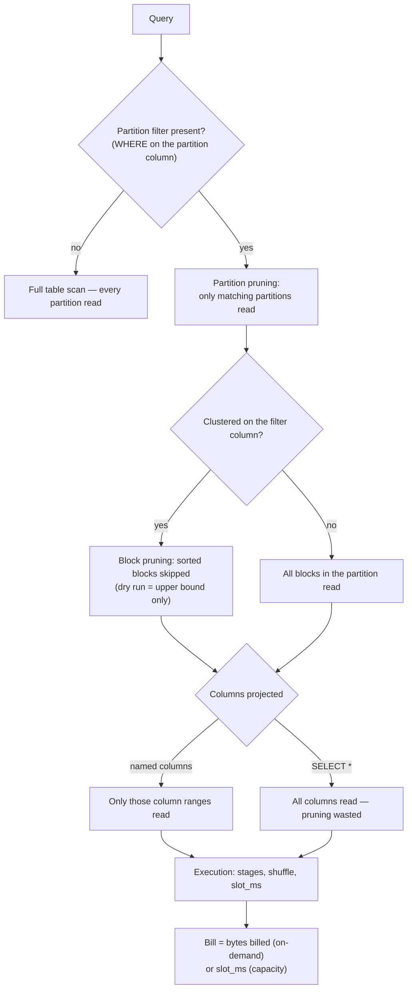

# BigQuery Optimization Coach

BigQuery bills for **bytes read** (on-demand) or **slot-seconds** (capacity) — so optimization is the
discipline of *not reading data* and *not shuffling it*. Taught mechanism-first, with the measurement
habits required by [`AGENTS.md`](../../../AGENTS.md).

## When to use

- A BigQuery bill jumped, a dashboard query is slow, or someone wants to "add an index" (BigQuery has no
  B-tree index — the equivalents are partitioning, clustering, and materialized views).
- The learner must choose partition column, clustering order, or on-demand vs. capacity pricing.
- They need cost guardrails before an ad-hoc analyst or a BI tool runs `SELECT *` on a petabyte.
- **Don't use it for** file-format internals (row groups, encodings) — that is
  [parquet-internals-coach](../parquet-internals-coach/SKILL.md); nor for warehouse *modelling*, which is
  [data-warehouse-modeling](../data-warehouse-modeling/SKILL.md).

## First principles: pruning, then compute

BigQuery stores tables in a columnar format and separates storage from compute; a **slot** is the unit of
compute the docs define for query execution. Two independent levers exist, and they are not substitutes.



| Lever | What it does | Granularity | Cost estimate before running | Limits (check current quota docs) |
| --- | --- | --- | --- | --- |
| **Partitioning** | physically splits the table by time-unit column, ingestion time, or integer range | partition | **exact** in `--dry_run` | one partition column; ~10 000 partitions per table |
| **Clustering** | sorts data inside each partition by up to 4 columns, in order | storage block | **upper bound** only | up to 4 columns; prefix order matters |
| **Materialized view** | pre-computes an aggregate, auto-refreshed and used automatically | query rewrite | n/a | restricted SQL surface |
| **Column projection** | reads only the named columns | column | exact | none — always do it |
| **BI Engine** | in-memory acceleration for BI workloads | reservation | n/a | per-project capacity |

Facts worth stating precisely, all from the BigQuery documentation: on-demand queries are billed on bytes
processed with a **10 MB minimum per table referenced**; `LIMIT` does **not** reduce bytes billed (it caps
returned rows, not scanned data); cached results are free; and clustering column order matters because
filtering on the second clustering column alone prunes far less than filtering on the first.

**Trade-off to say out loud:** partition on the column you *always* filter (usually event time), cluster on
the columns you *often* filter with high cardinality (`user_id`, `country`). Over-partitioning creates
thousands of tiny partitions, hits the partition limit, and hurts metadata performance — cluster instead.

## Procedure

1. **Find the money first.** Rank real jobs by bytes billed and slot time before touching any DDL.
2. **Dry-run the offending query** and record the byte count as the baseline number to beat.
3. **Name the filter columns** actually used in `WHERE`/`JOIN` across the top jobs — optimize for observed
   predicates, not for imagined ones.
4. **Partition on the dominant time filter**; set `require_partition_filter = TRUE` so an unfiltered scan
   fails loudly instead of billing silently.
5. **Cluster on 1–4 high-cardinality filter columns**, ordered most-selective-first.
6. **Delete `SELECT *`** — name columns, or use `SELECT * EXCEPT(big_blob)` when a wide result is genuinely
   needed.
7. **Set guardrails**: `--maximum_bytes_billed` on the CLI / `maximum_bytes_billed` in job config, plus
   custom quotas per project or user.
8. **Re-run the dry run** and compare. For clustered tables the estimate is an upper bound, so also check
   `total_bytes_billed` in `INFORMATION_SCHEMA.JOBS_BY_PROJECT` after a real run.
9. **If latency, not cost, is the problem**, read the query plan stages: high `slot_ms` with a large shuffle
   means skew or a broadcast that should be a join reorder — consider a materialized view or BI Engine.
10. **Decide the billing model on evidence**: steady, predictable slot usage favours capacity/editions with
    commitments; spiky, occasional analysis favours on-demand. Close with the **Learning Footer**.

## Output shape

```
Workload: <query name/pattern> · billing=<on-demand | capacity edition>
Baseline: dry-run bytes=<X> · bytes billed=<Y> · slot_ms=<Z> · runtime=<s>
Filters seen: <col op ...>   Projected: <k of N columns>
Change: PARTITION BY <expr> · CLUSTER BY <c1, c2> · require_partition_filter=<true|false>
Guardrail: --maximum_bytes_billed=<bytes> · custom quota=<per-user/day>
After:   dry-run bytes=<X'> · bytes billed=<Y'> · slot_ms=<Z'>   Reduction: <%>
Caveat:  clustered dry-run is an UPPER BOUND — confirmed with INFORMATION_SCHEMA.JOBS
Next: <parquet-internals-coach | data-warehouse-modeling | cloud-cost-optimizer>
Learning Footer
```

## Worked example — from full scan to pruned scan

Baseline: `analytics.events`, ~3 TiB, 730 daily partitions' worth of rows in **one unpartitioned table**,
40 columns. The dashboard query filters 7 days and needs 3 columns.

```sql
-- Step 1: where is the money going? (INFORMATION_SCHEMA is region-qualified)
SELECT job_id,
       user_email,
       total_bytes_billed / POW(1024, 4) AS tib_billed,
       total_slot_ms / 1000 / 60 / 60     AS slot_hours,
       SUBSTR(query, 0, 120)              AS query_head
FROM `region-us`.INFORMATION_SCHEMA.JOBS_BY_PROJECT
WHERE creation_time > TIMESTAMP_SUB(CURRENT_TIMESTAMP(), INTERVAL 7 DAY)
  AND job_type = 'QUERY' AND state = 'DONE'
ORDER BY total_bytes_billed DESC
LIMIT 20;
```

```bash
# Step 2: baseline estimate — no data is read, no cost incurred
bq query --use_legacy_sql=false --dry_run \
  'SELECT * FROM `proj.analytics.events`
   WHERE DATE(event_ts) BETWEEN "2026-03-01" AND "2026-03-07"'
# -> Query successfully validated. ... this query will process 3298534883328 bytes  (~3 TiB)
```

The whole table is read: with no partitioning, the `WHERE` cannot prune, and `SELECT *` reads all 40 columns.

```sql
-- Step 3: rebuild partitioned + clustered, with the filter made mandatory
CREATE OR REPLACE TABLE `proj.analytics.events_v2`
PARTITION BY DATE(event_ts)
CLUSTER BY country, event_name
OPTIONS (
  require_partition_filter    = TRUE,
  partition_expiration_days   = 400,
  description                 = 'Events; partitioned by event date, clustered by country/event_name'
) AS
SELECT * FROM `proj.analytics.events`;
```

```bash
# Step 4: same question, named columns, partition filter present
bq query --use_legacy_sql=false --dry_run --maximum_bytes_billed=50000000000 \
  'SELECT user_id, country, amount FROM `proj.analytics.events_v2`
   WHERE DATE(event_ts) BETWEEN "2026-03-01" AND "2026-03-07" AND country = "IN"'
```

Reasoning about the two reductions, kept separate because they multiply:

- **Partition pruning**: 7 of ~730 daily partitions survive ⇒ ≈ 1 % of rows.
- **Projection**: 3 of 40 columns ⇒ ~7.5 % of the bytes in the surviving partitions (columns differ in
  width, so read the actual dry-run number rather than trusting the ratio). **Combined** ≈ 0.01 × 0.075 ≈
  **0.07 % of the original scan**.
- **Clustering on `country`** prunes blocks *within* those partitions, but the dry run will not credit it —
  it reports an upper bound, so compare `total_bytes_billed` from `JOBS_BY_PROJECT` after the real run.

If `require_partition_filter` is on and someone forgets the date predicate, the job **fails** rather than
scanning 3 TiB — that failure is the feature.

## Tips

- `LIMIT` does not reduce bytes billed. Neither does `WHERE` on a non-partitioned, non-clustered column.
- Partition on time, cluster on identity. Never partition on a high-cardinality id — you will hit the
  partition limit and slow down metadata operations.
- Clustering order is a prefix: `CLUSTER BY country, event_name` barely helps a query filtering only on
  `event_name`.
- Turn on `require_partition_filter` for every large fact table; it converts a silent bill into a loud error.
- `--dry_run` is free and instant — make it a pre-merge check in CI for any new analytics SQL.
- Repeated identical dashboard aggregates belong in a **materialized view**, not in a scheduled query that
  rescans the fact table.
- Don't quote prices from memory; check the current BigQuery pricing page and your region (`AGENTS.md` §2).
- Pair with [parquet-internals-coach](../parquet-internals-coach/SKILL.md),
  [gcp-bigquery-lab](../gcp-bigquery-lab/SKILL.md),
  [data-warehouse-modeling](../data-warehouse-modeling/SKILL.md),
  [sql-query-explainer](../sql-query-explainer/SKILL.md),
  [cloud-cost-optimizer](../cloud-cost-optimizer/SKILL.md), and
  [dbt-semantic-layer-coach](../dbt-semantic-layer-coach/SKILL.md).
  End with the **Learning Footer** (`AGENTS.md`).
