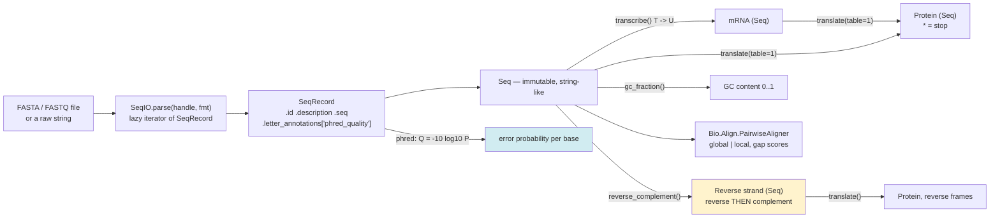

# Biopython Sequence Lab

Sequence bioinformatics taught from the molecule up — **read → represent → transform → measure** — following
the first-principles, verify-the-output approach of [`AGENTS.md`](../../../AGENTS.md). Every API below is in
the **Biopython Tutorial and Cookbook** and API reference at `biopython.org`; the project's canonical
citation is **Cock *et al.* (2009), *Bioinformatics* 25(11):1422–1423**, and the FASTQ variants are specified
in **Cock, Fields, Goto, Heuer & Rice (2010), *Nucleic Acids Research* 38(6):1767–1771**. Codon tables come
from the **NCBI Genetic Codes** table. Everything here runs locally, free, with no downloads.

## When to use

- The learner has a `.fasta` / `.fastq` file (or a raw string) and needs to do something real with it in
  Python instead of hand-rolling string slicing.
- They translated DNA and got a protein full of `*` or `X`, or the wrong reading frame.
- They need to reason about **read quality**: what Q30 actually means and why averaging Phred scores is
  wrong.
- They want a first alignment score without installing BLAST or a cluster.
- **Don't use it for** running production genomics workflows at scale — see
  [nextflow-nfcore-lab](../nextflow-nfcore-lab/SKILL.md) — for statistical analysis of results
  ([hypothesis-testing-coach](../hypothesis-testing-coach/SKILL.md)), or for tabular wrangling of the
  metadata around the sequences ([pandas-lab](../pandas-lab/SKILL.md)).

## First principles: a sequence is an ordered string with biological rules attached

A `Seq` behaves like an immutable Python string — slicing, `len()`, `in`, `.find()` all work — but it also
knows the operations that only make sense for nucleic acids. Three rules govern everything:

1. **DNA is double-stranded and antiparallel.** The reverse complement is not "the complement", and it is not
   "the reverse". It is both, in that order — which is why `reverse_complement()` exists as one method.
2. **Translation reads non-overlapping triplets in a frame.** A sequence has three forward reading frames and
   three reverse ones; getting the frame wrong yields plausible-looking nonsense, not an error.
3. **The genetic code is not universal.** NCBI table 1 is the standard code; table 2 is vertebrate
   mitochondrial, table 11 bacterial/plastid. Choose deliberately — `translate(table=...)`.



*Fig. 1 — the paths through Biopython's core objects. `SeqIO` produces `SeqRecord`s (identity + annotation),
each wrapping a `Seq` (the letters). Nearly every beginner bug is at one of the two highlighted boxes:
reverse-complementing in the wrong order, or treating a Phred score as if it were a linear quality.*

| Task | Call | Note |
| --- | --- | --- |
| Many records | `SeqIO.parse(handle, "fasta")` | a **lazy iterator** — you can only walk it once |
| Exactly one record | `SeqIO.read(handle, "fasta")` | raises if there is not exactly one |
| Random access by id | `SeqIO.index(path, "fasta")` | dict-like, doesn't load everything into RAM |
| Write | `SeqIO.write(records, handle, "fasta")` | returns the count written |
| Complement / reverse complement | `seq.complement()` / `seq.reverse_complement()` | RNA variants exist (`*_rna()`) |
| DNA → RNA | `seq.transcribe()` / `seq.back_transcribe()` | literally T ↔ U; no biology beyond that |
| Protein | `seq.translate(table=1, to_stop=True, cds=False)` | `cds=True` validates start/stop/length |
| GC content | `Bio.SeqUtils.gc_fraction(seq)` | returns a **fraction** 0–1 |
| Pairwise alignment | `Bio.Align.PairwiseAligner` | replaces the deprecated `Bio.pairwise2` |

### Phred scores are logarithmic — that is the entire point

A Sanger-encoded FASTQ quality character maps to $Q = \text{ord}(c) - 33$, and

$$ Q = -10 \log_{10} P \qquad \Longleftrightarrow \qquad P = 10^{-Q/10} $$

| Q | P(base is wrong) | Reads as |
| --- | --- | --- |
| 40 | 0.0001 | 1 error in 10 000 |
| 30 | 0.001 | 1 error in 1 000 — the usual "Q30" quality bar |
| 20 | 0.01 | 1 error in 100 |
| 10 | 0.1 | 1 error in 10 |
| 2 | ≈ 0.63 | Illumina's historical "do not use" marker |
| 0 | **1.0** | no information at all |

Because the scale is logarithmic, **the mean Phred score is not a meaningful summary**. The honest statistic
is the *expected number of errors* in the read, $E = \sum_i 10^{-Q_i/10}$ — the worked example below shows a
read with a respectable-looking mean Q of 27 that is expected to contain **more than one** wrong base.

⚠ Encoding offset is version/platform-volatile: Sanger/Illumina 1.8+ uses **+33** (`"fastq"` /
`"fastq-sanger"` in Biopython); older Illumina 1.3–1.7 used +64 (`"fastq-illumina"`), and Solexa used a
different formula entirely (`"fastq-solexa"`). Reading with the wrong one silently shifts every score by 31.

## Procedure

1. **Install into a clean environment** (see [python-venv-lab](../python-venv-lab/SKILL.md)):
   ```bash
   python -m venv .venv && . .venv/bin/activate     # Windows: .venv\Scripts\Activate.ps1
   python -m pip install biopython
   python -c "import Bio; print(Bio.__version__)"
   ```
2. **Identify the molecule and the format before parsing.** DNA, RNA or protein? FASTA (no qualities) or
   FASTQ (per-base qualities, and *which* encoding)? Guessing here is how the +33/+64 bug happens.
3. **Parse with the right function**: `SeqIO.parse` for many records, `SeqIO.read` when there must be exactly
   one, `SeqIO.index` for random access to a large file without loading it. Remember `parse` returns a
   generator: `list(...)` it if you need to iterate twice (cf.
   [python-generators-lab](../python-generators-lab/SKILL.md)).
4. **Inspect one record before trusting the file**: `record.id`, `record.description`, `len(record.seq)`,
   `record.seq[:60]`, and for FASTQ `record.letter_annotations["phred_quality"][:10]`.
5. **Sanity-check the alphabet.** Unexpected `N`, `-`, lowercase, or `U` in something you called DNA will
   propagate silently into translation. `set(str(record.seq))` is a two-second check.
6. **Choose the reading frame and the codon table explicitly.** For a coding sequence use
   `translate(table=<n>, cds=True)` so Biopython *validates* length‑multiple‑of‑3, a valid start codon, a
   terminal stop and no internal stops — a real error beats a silently wrong protein.
7. **Reverse-complement for the other strand**, then translate the three reverse frames if you are hunting
   ORFs. `seq[::-1]` is **not** the reverse complement, and `complement()` alone is not either.
8. **Quantify quality properly** for FASTQ: convert to probabilities, report expected errors, and only then
   filter/trim.
9. **Align with `PairwiseAligner`**: set `mode`, `match_score`/`mismatch_score` (or a substitution matrix for
   proteins), `open_gap_score` and `extend_gap_score` *before* aligning, since the score is meaningless
   without them. Use `.score(a, b)` when you only need the number — it is much cheaper than materialising
   alignments.
10. **Verify one result by hand** — translate three codons yourself, or reverse-complement a 10-mer on paper —
    before believing a whole pipeline. Close with the **Learning Footer**.

## Output shape

```
Task: <parse | translate | revcomp | FASTQ QC | pairwise align>
Input: <path or inline> · format <fasta|fastq(-sanger|-illumina|-solexa)|genbank> · records <n>
Molecule: <DNA|RNA|protein>   alphabet observed: <set of characters>   length(s): <...>
Record: id=<..> description=<..> len=<..>
Transformations applied:
  transcribe: <y/n>   frame: <+1|+2|+3|-1|-2|-3>   codon table: <1 Standard | 2 Vert.Mito | 11 Bacterial>
  translate(to_stop=<..>, cds=<..>) -> protein <..> aa, internal stops <n>
  reverse_complement: <input 5'->3'>  ->  <output 5'->3'>
Measures: GC fraction <0.xxxx> (= <..>%)   length <..> nt   ORF found: <y/n, coords>
FASTQ quality: Q per base <...>  mean Q <..> (NOT a valid summary)
  expected errors E = sum 10^(-Q/10) = <..>   bases below Q20: <n>   verdict: <keep|trim|drop>
Alignment: mode <global|local> match <..> mismatch <..> gap open <..> extend <..>
  score = <..>   co-optimal alignments: <n>   identity <..>%
Hand check: <the one value verified manually> -> expected <..>, got <..>
Pitfalls checked: parse-vs-read · generator consumed once · FASTQ offset · frame · revcomp order
Next: <nextflow-nfcore-lab | pandas-lab | data-viz-coach>
Learning Footer
```

## Worked example — one sequence, traced by hand end to end

No files needed; the FASTA and FASTQ are created in memory with `io.StringIO`, so this runs anywhere.

```python
import io
from Bio import SeqIO
from Bio.Seq import Seq
from Bio.SeqRecord import SeqRecord
from Bio.SeqUtils import gc_fraction
from Bio.Align import PairwiseAligner

# ---- 1. Parse FASTA from an in-memory handle ---------------------------------------
fasta_text = """>gene1 toy coding sequence
ATGGCCATTGTAATGGGCCGCTGA
>gene2 same gene, one base different
ATGGCCATTGTAATGGGCCGATGA
"""
records = list(SeqIO.parse(io.StringIO(fasta_text), "fasta"))   # list(): parse is lazy, one pass only
print(len(records), records[0].id, len(records[0].seq))         # 2 gene1 24

dna = records[0].seq
print(type(dna).__name__, dna)                                  # Seq ATGGCCATTGTAATGGGCCGCTGA
print(set(str(dna)))                                            # {'A','C','G','T'}  <- alphabet check

# ---- 2. Central dogma ---------------------------------------------------------------
mrna = dna.transcribe()
print(mrna)                       # AUGGCCAUUGUAAUGGGCCGCUGA        (T -> U, nothing more)

protein = dna.translate(table=1)                 # NCBI table 1 = Standard code
print(protein)                    # MAIVMGR*   ('*' marks the stop codon)
print(dna.translate(table=1, to_stop=True))      # MAIVMGR
print(dna.translate(table=1, cds=True))          # MAIVMGR  — and VALIDATES start/stop/length

# ---- 3. The other strand ------------------------------------------------------------
print(dna.complement())           # TACCGGTAACATTACCCGGCGACT       (NOT the reverse complement)
print(dna.reverse_complement())   # TCAGCGGCCCATTACAATGGCCAT
print(Seq(str(dna)[::-1]))        # AGTCGCCGGGTAATGTTACCGGTA       (NOT it either — reversed only)

# ---- 4. Composition ------------------------------------------------------------------
print(round(gc_fraction(dna), 4)) # 0.5417   -> 54.17% GC

# ---- 5. FASTQ: quality is a probability, not a grade ---------------------------------
fastq_text = """@read1 toy read
GATTACA
+
IIII5+!
"""
rec = SeqIO.read(io.StringIO(fastq_text), "fastq")     # "fastq" == Sanger, offset +33
q = rec.letter_annotations["phred_quality"]
print(q)                                               # [40, 40, 40, 40, 20, 10, 0]
print(round(sum(q) / len(q), 2))                       # 27.14   <- looks fine, and is misleading
expected_errors = sum(10 ** (-Q / 10) for Q in q)
print(round(expected_errors, 4))                       # 1.1104  <- >1 wrong base expected. Drop/trim it.
print([i for i, Q in enumerate(q) if Q < 20])          # [5, 6]  positions to trim

# ---- 6. Pairwise alignment ------------------------------------------------------------
aligner = PairwiseAligner()
aligner.mode = "global"
aligner.match_score = 1.0
aligner.mismatch_score = -1.0
aligner.open_gap_score = -2.0        # set the scoring BEFORE aligning; defaults are not neutral
aligner.extend_gap_score = -0.5

a, b = Seq("GATTACA"), Seq("GATTTACA")   # b has one extra T
print(aligner.score(a, b))               # 5.0
best = aligner.align(a, b)[0]
print(best)                              # visual alignment; exact layout varies by Biopython version
# For proteins, swap in a real matrix instead of match/mismatch:
#   from Bio.Align import substitution_matrices
#   aligner.substitution_matrix = substitution_matrices.load("BLOSUM62")

# ---- 7. Write results back out ---------------------------------------------------------
out = io.StringIO()
SeqIO.write([SeqRecord(protein, id="gene1_prot", description="translated, table 1")], out, "fasta")
print(out.getvalue().strip())
# >gene1_prot translated, table 1
# MAIVMGR*
```

**Now verify it by hand — every claim above is checkable on paper.**

- **Translation.** Split into codons: `ATG GCC ATT GTA ATG GGC CGC TGA` — 24 nt, exactly 8 codons. Standard
  code: ATG=**M**, GCC=**A**, ATT=**I**, GTA=**V**, ATG=**M**, GGC=**G**, CGC=**R**, TGA=**stop**. So
  `MAIVMGR*`, and with `to_stop=True`, `MAIVMGR`. `cds=True` succeeds here precisely because the length is a
  multiple of 3, it starts with ATG, ends in a stop, and has no internal stop.
- **GC content.** Count the G's (positions 3, 4, 10, 15, 16, 17, 20, 23 → 8) and the C's (5, 6, 18, 19, 21 →
  5): 13 of 24. $13/24 = 0.5417$, i.e. **54.17 %**. ✓
- **Reverse complement.** Reverse the sequence first — `AGTCGCCGGGTAATGTTACCGGTA` — then complement each
  base: `TCAGCGGCCCATTACAATGGCCAT`. Note the result *starts* with `TCA`, the reverse complement of the `TGA`
  stop codon that *ended* the forward strand. That symmetry is a free correctness check every time.
- **Quality.** `'I'` is ASCII 73, so $Q = 73 - 33 = 40$; `'5'` is 53 → Q20; `'+'` is 43 → Q10; `'!'` is 33 →
  **Q0**. Mean $= (4 \times 40 + 20 + 10 + 0)/7 = 190/7 = 27.14$, which sounds healthy. But the expected
  errors are $4(10^{-4}) + 10^{-2} + 10^{-1} + 10^{0} = 0.0004 + 0.01 + 0.1 + 1.0 = \mathbf{1.1104}$ — the
  single Q0 base contributes 1.0 on its own, because Q0 means *no information*. **This is why you never
  average Phred scores.**
- **Alignment score.** The optimal global alignment inserts one gap: `GATT-ACA` against `GATTTACA` gives 7
  matches and one gap of length 1, so $7 \times 1 + (-2) = \mathbf{5.0}$. ✓ Several co-optimal alignments
  exist because the gap can sit at any position inside the run of T's — a good reminder that "the" alignment
  is rarely unique.

## Tips

- `SeqIO.parse` returns a **generator**: iterating it twice yields nothing the second time. `list()` it, or
  use `SeqIO.index` for repeated random access without the memory cost.
- `SeqIO.read` is the right call when there must be exactly one record — it *raises* on zero or many, which
  is far better than silently processing the first.
- `reverse_complement()` ≠ `complement()` ≠ `[::-1]`. Check the result's first codon against the input's last
  codon; they must be complements.
- Always pass `table=` explicitly when the organism is not "standard", and prefer `cds=True` for real coding
  sequences so Biopython validates rather than guesses.
- `Seq` is **immutable** (like `str`). Use `MutableSeq` if you genuinely need in-place edits, but prefer
  building a new sequence — it is easier to reason about.
- Never average Phred scores; report **expected errors** and the count of bases below your threshold.
  Confirm the FASTQ encoding (`"fastq"` +33 vs `"fastq-illumina"` +64) before you believe any of them.
- Set the aligner's scoring parameters *before* aligning, and state them alongside any score you report — a
  raw alignment score without its scoring scheme is not interpretable.
- Version-volatile: `Bio.pairwise2` is deprecated in favour of `Bio.Align.PairwiseAligner`, `Bio.SeqUtils.GC`
  was replaced by `gc_fraction`, the `Alphabet` class was removed in Biopython 1.78, and the printed
  alignment layout has changed between releases. Verify signatures on the current Biopython API reference
  and record the version you tested with.
- Pair with [nextflow-nfcore-lab](../nextflow-nfcore-lab/SKILL.md) when this becomes a reproducible
  pipeline, [pandas-lab](../pandas-lab/SKILL.md) for the sample metadata,
  [numpy-lab](../numpy-lab/SKILL.md) for vectorised per-base statistics,
  [matplotlib-lab](../matplotlib-lab/SKILL.md) for per-position quality plots,
  [python-generators-lab](../python-generators-lab/SKILL.md) to understand why `parse` is lazy,
  [regex-explainer](../regex-explainer/SKILL.md) for motif searching, and
  [hypothesis-testing-coach](../hypothesis-testing-coach/SKILL.md) before you claim a difference is real.
  End with the **Learning Footer** (`AGENTS.md`).
