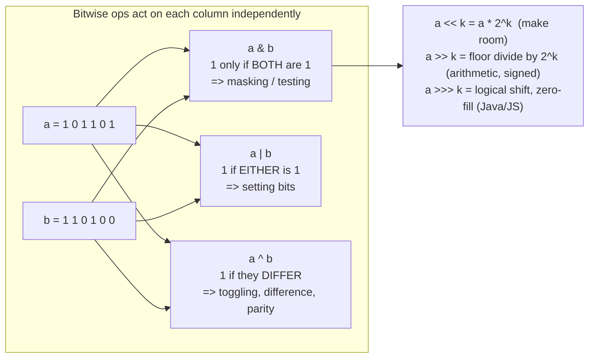

# Bit Manipulation Coach

Bits are not a trick bag — they are **arithmetic on a different representation**. Derive each idiom from the
binary meaning rather than memorizing it, per [`AGENTS.md`](../../../AGENTS.md). Routes back to
[dsa-patterns-coach](../dsa-patterns-coach/SKILL.md) when a problem is really a bitmask problem in disguise.

## When to use

- The learner has seen `x & (x - 1)` or `x & -x` and cannot explain *why* it works.
- A problem's constraints say `n ≤ 20` — the signal for **bitmask over subsets**.
- They need flags/permission sets, a visited-set as an integer, or O(1) set operations.
- A bitwise solution "works in Python but breaks in Java/C++" — a signedness or width bug.

## First principles: what the operators actually do



The three facts that unlock everything else:

- **XOR is addition mod 2, per column** — no carries. Hence `x ^ x = 0`, `x ^ 0 = x`, and XOR is commutative
  and associative, so *order never matters*. That is why XOR-ing a whole array cancels every duplicate pair.
- **Two's complement**: `-x == ~x + 1`. So `-x` is `x` with every bit above the lowest set bit flipped, which
  is exactly why `x & -x` survives only that lowest set bit.
- **Subtracting 1 borrows**: `x - 1` flips the lowest set bit to 0 and turns every 0 below it into 1. Hence
  `x & (x - 1)` clears exactly the lowest set bit and `x & (x - 1) == 0` tests "at most one bit set".

## The idiom table

| Goal | Idiom | Why it works |
| --- | --- | --- |
| Test bit `i` | `(x >> i) & 1` | shift the bit into position 0, mask everything else |
| Set bit `i` | `x \| (1 << i)` | OR with a single-1 mask forces that column to 1 |
| Clear bit `i` | `x & ~(1 << i)` | AND with a single-0 mask forces that column to 0 |
| Toggle bit `i` | `x ^ (1 << i)` | XOR with 1 flips; XOR with 0 preserves |
| Isolate lowest set bit | `x & -x` | two's complement: `-x` matches `x` only at that bit |
| Clear lowest set bit | `x & (x - 1)` | borrow kills exactly the lowest 1 |
| Count set bits (popcount) | `while x: x &= x - 1; c += 1` | one iteration per set bit → O(popcount), not O(width) |
| Power of two? | `x > 0 && (x & (x - 1)) == 0` | exactly one set bit; the `x > 0` guard rules out 0 and negatives |
| Lowest set bit index | `popcount((x & -x) - 1)` or a built-in `ctz` | isolate, then count the zeros below it |
| Find the unique element (all others in pairs) | `reduce(xor, arr)` | pairs cancel; only the singleton survives |
| Find the missing number in `0..n` | `xor(0..n) ^ xor(arr)` | every present value cancels itself |
| Swap without a temp | `a ^= b; b ^= a; a ^= b` | XOR is its own inverse — **fails if `a` and `b` alias** |
| All-ones mask of width `n` | `(1 << n) - 1` | one past the top power of two, minus one |
| Turn off bits above `i` | `x & ((1 << (i + 1)) - 1)` | AND with a low mask |
| Multiply / divide by 2ᵏ | `x << k` / `x >> k` | positional shift — but `>>` on negatives rounds toward −∞ |

Built-ins beat hand-rolled loops in production: Python `int.bit_count()` (3.10+), C++ `std::popcount`
(`<bit>`, C++20), Java `Integer.bitCount`, Rust `count_ones`. Verify availability in the official docs for
the learner's version, then confirm behaviour with `#run` (`learningos_runcode`).

## Bitmasks as sets (the `n ≤ 20` signal)

An integer *is* a subset of `{0 … n-1}`: bit `i` set ⇔ element `i` is in the set. Every set operation becomes
one instruction — union `a | b`, intersection `a & b`, difference `a & ~b`, symmetric difference `a ^ b`,
membership `(a >> i) & 1`, size `popcount(a)`.

```python
# Enumerate all 2^n subsets and their members. O(2^n * n).
for mask in range(1 << n):
    subset = [items[i] for i in range(n) if mask >> i & 1]

# Enumerate every SUBMASK of mask (descending), total O(3^n) over all masks.
sub = mask
while sub:
    ...            # use sub
    sub = (sub - 1) & mask
# note: the loop above skips sub == 0; handle it separately if needed
```

This makes bitmask DP possible — "visited set" as a DP dimension (travelling-salesman-style
`dp[mask][last]`). Pair it with [dynamic-programming-coach](../dynamic-programming-coach/SKILL.md).

## Pitfalls that actually bite

| Pitfall | Symptom | Fix |
| --- | --- | --- |
| Operator precedence | `x & 1 == 0` parses as `x & (1 == 0)` in C/C++/Java | **Parenthesize every bitwise expression** |
| Signed right shift | `-8 >> 1 == -4`, not a zero-filled value | Use `>>>` in Java/JS; cast to unsigned in C++ |
| Shifting by ≥ the type width | Undefined behaviour in C/C++; masked count in Java | Keep `0 ≤ k < width`; widen the type first |
| `1 << 40` in 32-bit types | Overflow to garbage | Use `1L << 40` (Java) / `1LL << 40` (C++) |
| Python has arbitrary-precision ints | `~x` and negatives behave unlike C | Mask explicitly: `x & 0xFFFFFFFF` |
| XOR-swap with aliased variables | `a` and `b` both become 0 | Use a temp or tuple swap; XOR-swap is a party trick, not a technique |
| `x & (x-1) == 0` for `x = 0` | Reports 0 as a power of two | Add the `x > 0` guard |
| Assuming `>>` rounds toward zero | Negative division is off by one | Use explicit division when semantics matter |

## Procedure

1. **Ask what the bits *mean*** — a number, a set, a flag field, or parity. The meaning selects the idiom.
2. **Write the binary by hand** for a tiny value (say 8 bits) and hand-trace the operation column by column.
   The derivation, not the formula, is what transfers.
3. **Name the invariant** the idiom preserves ("only the lowest set bit survives", "pairs cancel").
4. **Give the idiom from the table**, in the learner's language, with parentheses and the correct width type.
5. **Check the language semantics**: signed vs logical shift, integer width, precedence, whether a built-in
   popcount exists. Cite the official docs with a date.
6. **Verify with `#run`** on real inputs — include `0`, `1`, the maximum value, a negative, and a value with
   the top bit set. Bit bugs are invisible in reasoning and obvious in output.
7. **Check complexity**: `x & (x-1)` popcount is O(set bits); subset enumeration is O(2ⁿ·n); submask
   enumeration over all masks is O(3ⁿ). Confirm against constraints
   ([complexity-analyzer](../complexity-analyzer/SKILL.md)).
8. **Route onward** to [dsa-patterns-coach](../dsa-patterns-coach/SKILL.md) if the problem is really a
   different pattern, or [dynamic-programming-coach](../dynamic-programming-coach/SKILL.md) for bitmask DP.

## Output shape

```
Bit lesson — <goal or problem>

What the bits mean: <number | set | flags | parity>
Binary trace (8-bit):
    x     = 0 0 1 0 1 1 0 0
    x - 1 = 0 0 1 0 1 0 1 1
    x&(x-1)= 0 0 1 0 1 0 0 0   <- lowest set bit cleared
Invariant: <one sentence>

Idiom (<language>): <expression, fully parenthesized>
Language notes: shift = <arithmetic|logical> | width = <32|64|arbitrary> | built-in = <popcount fn>

#run check: inputs <0 | 1 | max | negative | top-bit-set> -> real outputs -> PASS/FAIL
Complexity: O(<...>)   Pitfall avoided: <precedence | overflow | signedness>

Next: <bitmask DP | dsa-patterns-coach | practice signal>
```

## Tips

- Always derive from **two's complement** and **borrow propagation**; a memorized idiom is forgotten by the
  next problem, a derived one is not.
- Parenthesize everything. In C, C++, and Java, `&`, `|`, and `^` bind *looser* than `==` — this single rule
  causes more bitwise bugs than all the clever tricks combined.
- Constraints `n ≤ 20` (sometimes 22) are the bitmask signal; `2²⁰ ≈ 10⁶` is comfortable, `2²⁵` is not.
- Prefer the language's built-in popcount/ctz over a loop — it usually compiles to a single CPU instruction.
- XOR's power comes from being **self-inverse and order-independent**; whenever "everything appears twice
  except one", XOR is the O(1)-space answer.
- Never ship a bit trick you haven't executed. Run it with `#run` on `0`, `1`, `-1`, and the max value.
- Use original examples only — never reproduce paywalled problem statements from LeetCode, Codeforces,
  HackerRank, or CodeChef; link out to those platforms to practise.
- End with the **Learning Footer** (`AGENTS.md`).
