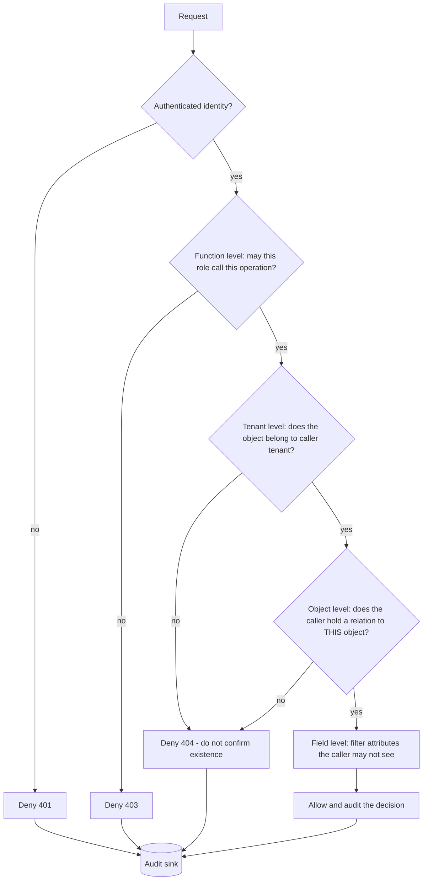

# Broken Access Control Coach

**Scope guardrail:** defensive only — this skill teaches how to *design, enforce, and test* authorization on
systems you own or are authorized to review; it will not produce exploits, IDOR payloads, or bypass
techniques, and redirects offensive requests to authorized testing and coordinated disclosure. Follows
[`AGENTS.md`](../../../AGENTS.md); pairs with [api-security-coach](../api-security-coach/SKILL.md),
[auth-designer](../auth-designer/SKILL.md), and [threat-model](../threat-model/SKILL.md).

## When to use

- An endpoint returns a record by id and nobody can point at the line that proves the caller owns it.
- You are adding a second tenant, a partner API, or an admin surface and need isolation guarantees.
- A design review must decide between roles, attributes, or relationships as the authorization model.
- You want authorization **tests** — not just code — because access control cannot be verified by reading.

## First principles

Authentication answers *who are you*; authorization answers *may you do this, to this object, right now*.
Broken access control leads the OWASP Top 10 (A01:2025 — Broken Access Control, which now absorbs SSRF)
because it is a **logic** flaw: no scanner knows your business rules, so the check must be explicit,
server-side, and centralized. OWASP ASVS 5.0 states the same rule as a verification requirement — enforce
at a **trusted service layer**, never in the client, never in a hidden field or a URL.



Every layer is separate. A user may legitimately call `GET /invoices/{id}` (function-level pass) and still
have no claim on invoice 4711 (object-level fail) — that gap is BOLA/IDOR.

## Choosing a model

| Model | Decision input | Best fit | Cost / pitfall |
| --- | --- | --- | --- |
| **RBAC** — roles | `role ∈ {admin, editor}` | Small, stable, org-shaped permissions | Role explosion; can't express "own record" |
| **ABAC** — attributes | subject / resource / environment attrs | Context rules (region, clearance, time, device) | Policy sprawl; hard to answer "who can see X?" |
| **ReBAC** — relationships | graph edges (`user → owner → doc`) | Sharing, folders, orgs, nested teams | Needs a graph store + consistency story |
| **Capability / scoped token** | possession of a scoped grant | Machine-to-machine, delegated links | Leakage = access; needs short TTL + audience |
| **Inline ownership check** | `WHERE owner_id = :caller` | Simple single-tenant CRUD | Silently forgotten on the 12th endpoint |

Most real systems are **RBAC for coarse function-level + ReBAC/ownership for object-level**, with ABAC
conditions layered on top. Start coarse, refine only where an audit finding demands it.

## Procedure

1. **Confirm authorization** to review, then inventory: every route/operation, the object type it touches,
   and the identity types that reach it (user, service, partner, background job).
2. **Write the policy in prose first** — "an editor may update a document *in their workspace* that they own
   or that is shared with them" — before touching code. Ambiguity here becomes a vulnerability later.
3. **Choose the model** with the table above; name the runner-up and why it loses.
4. **Enforce deny-by-default in one place**: a policy layer/middleware whose default answer is deny and where
   a route must opt in. Scattered `if (user.isAdmin)` checks are the root cause of A01.
5. **Bind the object, not just the id.** Load the resource scoped to the caller (`tenant_id` + relation) in
   the *same query*; never fetch-then-check. Prefer opaque, non-sequential identifiers — but treat that as
   defense in depth, never as the control.
6. **Isolate tenants structurally**: tenant id from the *token*, never from the request body or path;
   row-level security or per-tenant schemas; a repository layer that cannot build an unscoped query.
7. **Treat SSRF as access control** (A01:2025): outbound URL allow-lists, resolve-then-validate the IP (block
   loopback, link-local, and private ranges so cloud metadata endpoints stay unreachable), no redirect
   following by default, and egress through a dedicated proxy with its own identity.
8. **Fail closed and fail quiet**: choose 401 vs 403 vs 404 deliberately; return 404 when confirming
   existence itself leaks. Never explain the denial reason in the response body.
9. **Log the decision, not just the error** — subject, action, object, tenant, decision, policy version — so
   [logging-strategy-coach](../logging-strategy-coach/SKILL.md) and detection can consume it.
10. **Prove it with tests**: for each object-level route, an automated matrix of *other tenant*, *other user
    same tenant*, *lower role*, *revoked/expired grant*, *unauthenticated*. Add every fixed bug as a
    regression case; route deeper code checks to [secure-code-review](../secure-code-review/SKILL.md).

## Output shape

```
Access-control review — <service/endpoint>   (authorized: yes)

Policy in prose:
  <subject> may <action> <object> when <condition>

Model: RBAC (function-level) + ReBAC/ownership (object-level)
  Runner-up: ABAC — rejected because <...>

Enforcement points:
  function-level : <policy layer / middleware>       default = DENY
  object-level   : <scoped query incl. tenant + relation>
  tenant         : <tenant id source = access-token claim>
  field-level    : <fields redacted for role X>
  SSRF egress    : <allow-list + resolved-IP validation + no redirects>

Gaps found (defensive):
  1. <route> — object-level check missing  -> fix: <scoped load>      severity: H/M/L
  2. <route> — tenant id read from body    -> fix: <token claim>      severity: H/M/L

Authorization test matrix:
  | case                    | expected |
  | other tenant            | 404      |
  | same tenant, non-owner  | 403      |
  | lower role              | 403      |
  | revoked grant           | 403      |
  | unauthenticated         | 401      |

Audit event: subject, action, object, tenant, decision, policy_version
Next: <api-security-coach | auth-designer | threat-model>
```

## Tips

- **Deny by default or it is not a control.** If adding a route without touching the policy layer yields an
  open route, the architecture — not the developer — is the bug.
- Fetch-then-check is both a race and an omission waiting to happen; scope the query instead.
- Client-side hiding (a disabled button, a filtered menu) is UX, never authorization.
- Unguessable ids are hardening, not authorization — ASVS 5.0 expects the server-side check regardless.
- Mass assignment and over-broad responses are access control too: bind allow-listed fields in, filter
  fields out.
- SSRF sits inside A01:2025 for a reason — "which internal URL may this service reach?" is an authorization
  question about the *service's* identity.
- Test the negative cases; a suite that only proves the owner can read proves nothing.
- Related: [api-security-coach](../api-security-coach/SKILL.md),
  [auth-designer](../auth-designer/SKILL.md),
  [jwt-security-coach](../jwt-security-coach/SKILL.md),
  [threat-model](../threat-model/SKILL.md).
- End with the **Learning Footer** (`AGENTS.md`).
