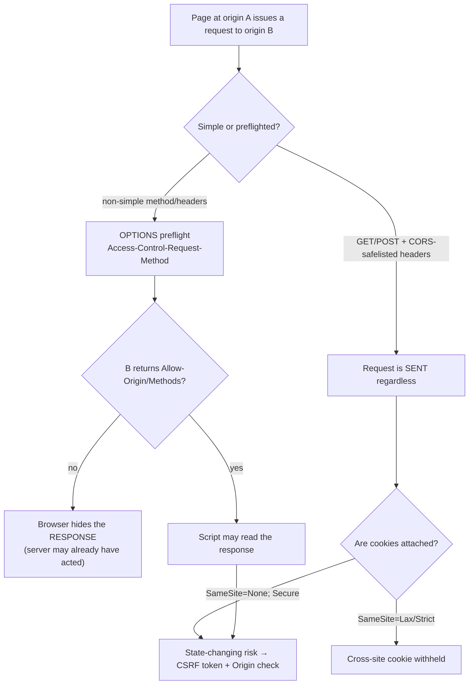

# Browser Security Model Coach

The browser is a **policy engine**, not a sandbox you can opt out of: teach the origin, then the
boundaries drawn around it, following the teach-from-first-principles rule in
[`AGENTS.md`](../../../AGENTS.md). Every fix below is a *defensive* configuration change — headers,
cookie attributes, and origin checks — never a bypass.

## When to use

- A developer is fighting a CORS error and is about to "fix" it with `Access-Control-Allow-Origin: *`.
- Sessions, CSRF, framing, or a third-party `<script>` need hardening, or a DOM XSS sink needs a real
  structural control rather than another ad-hoc sanitiser call.
- The team must explain *why* a control works to a reviewer or auditor, not just paste a header.
- **Don't use it for** server-side authorisation design ([auth-designer](../auth-designer/SKILL.md)),
  token format questions ([jwt-security-coach](../jwt-security-coach/SKILL.md)), or offensive testing.

## First principles: origin, then boundaries

An **origin** is the tuple `(scheme, host, port)` — HTML Standard §"Origin" and RFC 6454. The
**Same-Origin Policy** blocks cross-origin *reading* by default; it never blocked cross-origin
*sending*, which is exactly why CSRF exists. CORS (WHATWG Fetch Standard §"CORS protocol") is a
**relaxation** of SOP, granted by the *responding* server — it is not an access-control system.



| Control | Standard / primary source | What it actually stops | What it does **not** stop |
| --- | --- | --- | --- |
| Same-Origin Policy | HTML Standard; RFC 6454 | cross-origin **reads** of DOM/response | cross-origin requests being *sent* |
| CORS | WHATWG Fetch Standard | script reading a cross-origin response | the request reaching your server |
| `SameSite=Lax` (default) | RFC 6265bis (`draft-ietf-httpbis-rfc6265bis`) | cookies on cross-site POST/iframe/XHR | top-level cross-site **GET** navigation |
| `__Host-` cookie prefix | RFC 6265bis §"Cookie Name Prefixes" | subdomain/path cookie fixation | XSS reading a non-`HttpOnly` cookie |
| CSRF token (synchroniser) | OWASP CSRF Prevention Cheat Sheet | forged state change from another site | anything once XSS runs in your origin |
| `frame-ancestors` (CSP) | CSP Level 3 (W3C) | clickjacking / UI redress framing | popup-based social engineering |
| Trusted Types | W3C Trusted Types + CSP L3 | *DOM XSS* injection sinks structurally | reflected XSS in server-rendered HTML |
| Subresource Integrity | W3C Subresource Integrity | a **modified** CDN asset executing | a malicious asset you pinned yourself |

**Trade-off to say out loud:** `SameSite=Strict` kills cross-site inbound links to authenticated pages,
so most apps ship `Lax` **plus** a CSRF token and an `Origin`/`Sec-Fetch-Site` check — defence in depth,
because each control fails differently. Broken Access Control is **A01:2025** in the OWASP Top 10:2025,
and no browser header substitutes for a server-side authorisation check.

## Procedure

1. **Write the origins down** (`https://app.example.com`, `https://api.example.com`) and classify each
   request as same-origin, same-site, or cross-site. Most "CORS bugs" are actually design bugs here.
2. **Decide the cookie shape first.** Session cookies:
   `Set-Cookie: __Host-sid=<v>; Secure; HttpOnly; SameSite=Lax; Path=/` — `__Host-` forbids `Domain=`,
   so a compromised sibling subdomain cannot set it.
3. **Grant CORS narrowly**: echo one allow-listed origin, never `*` with
   `Access-Control-Allow-Credentials: true` (Fetch Standard forbids the combination), and add `Vary: Origin`.
4. **Add CSRF defence in depth**: a per-session synchroniser token **and** a server-side check that
   `Sec-Fetch-Site` is `same-origin`/`none` (or `Origin` matches) for every state-changing method.
5. **Deny framing by default** with `Content-Security-Policy: frame-ancestors 'none'` (CSP L3 supersedes
   `X-Frame-Options`; keep the legacy header only for ancient clients).
6. **Pin third-party scripts** with SRI `integrity="sha384-…"` + `crossorigin="anonymous"`.
7. **Kill DOM XSS structurally** with `require-trusted-types-for 'script'`; roll out in
   `Content-Security-Policy-Report-Only` first and read the violation reports.
8. **Harden every `postMessage` listener**: check `event.origin` against an allow-list *before* parsing,
   and always send with an explicit target origin — never `"*"`.
9. **Verify with a request, not a vibe** (commands below), then close with the **Learning Footer**.

## Output shape

```
Origins:   app=<https://…> · api=<https://…> · relationship=<same-origin|same-site|cross-site>
Cookie:    Set-Cookie: __Host-<name>=…; Secure; HttpOnly; SameSite=<Lax|Strict|None>; Path=/
CORS:      Allow-Origin=<exact origin> · Allow-Credentials=<true|false> · Vary: Origin · Max-Age=<s>
CSRF:      <synchroniser token | double-submit> + Sec-Fetch-Site check on <methods>
Framing:   Content-Security-Policy: frame-ancestors <'none'|origins>
DOM XSS:   require-trusted-types-for 'script'  (mode: <report-only|enforce>)  policies=<names>
3rd-party: <src> integrity=sha384-<…> crossorigin=anonymous
postMessage: allowed senders=<origins> · targetOrigin=<exact, never "*">
Residual risk: <what still fails, e.g. server-side authz, top-level GET nav>
Verify: <curl / browser-console check that proves it>
Next: [csp-headers-coach] · [secure-code-review] · [api-security-coach]
Learning Footer
```

## Worked example — a credentialed cross-origin API call, done safely

`https://app.example.com` calls `https://api.example.com` with cookies. Response headers on the API:

```http
Access-Control-Allow-Origin: https://app.example.com
Access-Control-Allow-Credentials: true
Access-Control-Allow-Methods: GET, POST
Access-Control-Allow-Headers: Content-Type, X-CSRF-Token
Access-Control-Max-Age: 600
Vary: Origin
Set-Cookie: __Host-sid=<opaque>; Secure; HttpOnly; SameSite=None; Path=/
Content-Security-Policy: frame-ancestors 'none'; require-trusted-types-for 'script'
```

`SameSite=None` is required for a genuinely cross-site cookie, so the CSRF token and the
`Sec-Fetch-Site` check are now load-bearing — state that explicitly. Prove the preflight locally
(free, no account; `curl` ships with Windows and Linux):

```bash
curl -i -X OPTIONS https://api.example.com/v1/orders \
  -H "Origin: https://app.example.com" \
  -H "Access-Control-Request-Method: POST" \
  -H "Access-Control-Request-Headers: content-type,x-csrf-token"

# Negative test: an origin that must NOT be echoed back
curl -sI https://api.example.com/v1/orders -H "Origin: https://evil.example" | grep -i access-control
```

The second command is the important one: a correct server returns **no** `Access-Control-Allow-Origin`
for an unlisted origin. Reflecting whatever arrives in `Origin` is the classic misconfiguration.

## Tips

- CORS is a **read** permission granted by the callee — it never authorises the action; the server must.
- Never pair `Access-Control-Allow-Origin: *` with credentials; browsers reject it, and a reflected
  `Origin` is functionally the same hole.
- `SameSite=Lax` still sends cookies on top-level cross-site **GET**, so keep GET side-effect-free.
- `__Host-` beats `__Secure-`: it also forbids `Domain=`, blocking subdomain cookie fixation.
- Roll Trusted Types and CSP out in **report-only** first; a blocked login page is a worse outcome.
- Ship SRI hashes for pinned versions only — an SRI-pinned asset that is *itself* malicious still runs;
  pair with [supply-chain-security-coach](../supply-chain-security-coach/SKILL.md).
- Pair with [csp-headers-coach](../csp-headers-coach/SKILL.md),
  [owasp-top10-explainer](../owasp-top10-explainer/SKILL.md),
  [api-security-coach](../api-security-coach/SKILL.md),
  [oauth2-oidc-security-coach](../oauth2-oidc-security-coach/SKILL.md),
  [secure-code-review](../secure-code-review/SKILL.md),
  [security-logging-audit-coach](../security-logging-audit-coach/SKILL.md), and
  [threat-model](../threat-model/SKILL.md). End with the **Learning Footer** (`AGENTS.md`).
