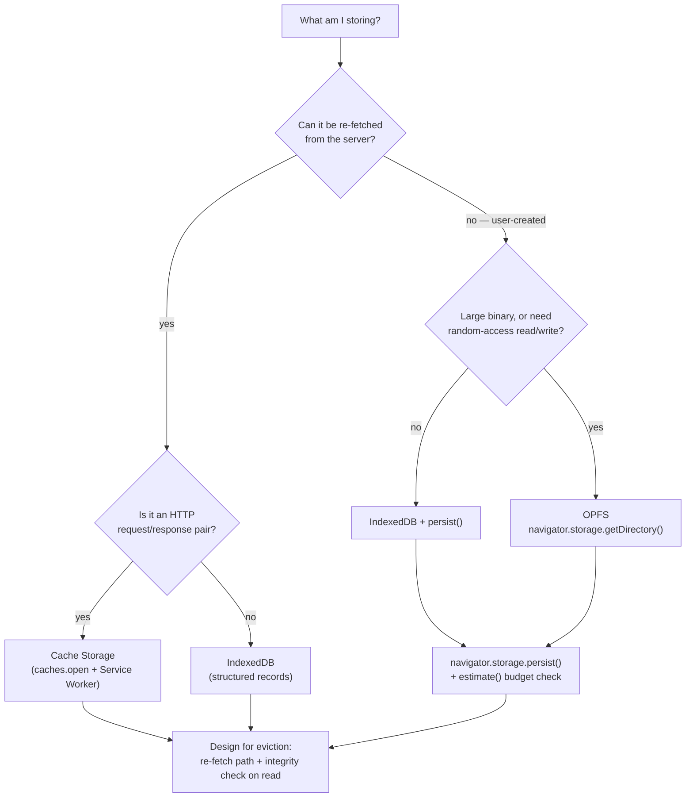

# Browser Storage Lab

A runnable lab on the four storage APIs a modern web app actually uses, taught in the order that matters:
**what can be lost → how much fits → which API → how to survive eviction**. Follows the source-discipline
and first-principles rules in [`AGENTS.md`](../../../AGENTS.md).

## When to use

- You need offline data and are choosing between IndexedDB, Cache Storage, OPFS and `localStorage`.
- You hit `QuotaExceededError`, or users report that offline data vanished after a few days.
- You are shipping a PWA and need `navigator.storage.persist()` plus a real eviction story.
- **Don't use it for** server-side caching, CDN or HTTP cache-control headers — that is
  [caching-strategy-coach](../caching-strategy-coach/SKILL.md).

## First principles: everything in the browser is evictable

Per the WHATWG Storage Standard, an origin owns a *storage bucket* whose mode is **best-effort** (the
default — the user agent may delete it under storage pressure) or **persistent** (granted via
`navigator.storage.persist()`, and then only cleared by the user). Quota is per-origin and derived from
free disk space, so it is a moving target: measure it, never hard-code it.



| API | Shape of data | Sync? | Typical limit | Survives eviction? | Best for |
| --- | --- | --- | --- | --- | --- |
| `localStorage` | string → string | **synchronous (blocks)** | ~5 MB per origin | no | tiny flags, last-route |
| Cookies | string, sent every request | sync | ~4 KB each | no | server-read session ids |
| **IndexedDB** | structured-clone objects, blobs | async, transactional | shares origin quota | only if `persist()` granted | app records, offline queue |
| **Cache Storage** | `Request` → `Response` | async (Promise) | shares origin quota | only if `persist()` granted | app shell, assets, API GETs |
| **OPFS** | real files/dirs, private | async; **sync handles in Workers** | shares origin quota | only if `persist()` granted | SQLite/WASM, large media, editors |
| `sessionStorage` | string → string | sync | ~5 MB per tab | no — dies with the tab | per-tab scratch state |

**Trade-offs to say out loud:** `localStorage` is the easiest and the worst — it is synchronous, so every
read blocks the main thread and directly inflates your INP. OPFS is the fastest (its
`createSyncAccessHandle()` gives near-native random access) but is Worker-only for sync handles and is
invisible to the user's file manager. Cache Storage is keyed by `Request`, so it is only a good fit when
your data genuinely *is* an HTTP response. Eviction policy differs per engine (Chromium evicts
least-recently-used origins under pressure; WebKit's ITP caps script-writable storage for sites the user
has not interacted with) — treat *all* of it as a cache and keep a re-fetch path.

## Procedure

1. **Classify the data** with the flowchart: re-fetchable vs user-created, HTTP-shaped vs record-shaped,
   small vs large. Write the answer down before choosing an API.
2. **Measure the budget first**: `const {usage, quota} = await navigator.storage.estimate()`. Log the ratio
   and pick a soft ceiling (e.g. stop writing above 80 % of quota) rather than waiting for the throw.
3. **Request persistence** with `await navigator.storage.persist()`. It returns a boolean and may be granted
   silently based on engagement heuristics (installed PWA, bookmarks, notification permission) — treat a
   `false` as normal, not an error.
4. **Write through a transaction.** In IndexedDB every read/write lives in a transaction that auto-commits
   when the microtask queue drains; never `await` an unrelated promise mid-transaction or it closes.
5. **Version your schema** in `onupgradeneeded` — the only place `createObjectStore`/`createIndex` are legal.
   Bump the integer version to migrate; write the migration as an explicit `switch` on `oldVersion`.
6. **Handle `QuotaExceededError`** explicitly: evict your own least-valuable rows, then retry once, then
   degrade to network-only. Never let it reject into an unhandled promise.
7. **Test eviction** by clearing site data in DevTools → Application → Storage, and confirm the app still
   boots and re-fetches. This is the step everyone skips and every incident report needs.
8. Close with the **Learning Footer**.

## Output shape

```
Data: <what>            Re-fetchable: <yes|no>     Size: <est. MB>     Shape: <records|responses|files>
API chosen: <IndexedDB | Cache Storage | OPFS | localStorage>   Rejected: <api> because <...>
Budget: usage=<..> / quota=<..> (<..>%)   Soft ceiling: <..>%   persist(): <granted|denied>
Schema/version: <store(s), keyPath, indexes, version N>   Migration: <oldVersion switch>
Eviction plan: <what we delete first> -> <re-fetch path> -> <integrity check on read>
Code: <runnable HTML/JS>
Verify: DevTools > Application > Clear site data, reload, confirm recovery
Next: <pwa-coach | mobile-offline-sync-coach | caching-strategy-coach>
Learning Footer
```

## Worked example — budget, persist, IndexedDB, Cache Storage and OPFS in one page

Save as `storage-lab.html` and open it over `http://localhost` (secure context required — `file://` will
not do). A one-liner server: `npx serve .` or `python -m http.server 8000`.

```html
<!doctype html>
<meta charset="utf-8"><title>Browser Storage Lab</title>
<button id="run">Run lab</button><pre id="out"></pre>
<script type="module">
const out = document.getElementById('out');
const log = (...a) => out.textContent += a.join(' ') + '\n';

// 1 — Budget. Quota is derived from free disk; never hard-code it.
async function budget() {
  const { usage = 0, quota = 0 } = await navigator.storage.estimate();
  log(`usage ${(usage/1e6).toFixed(2)} MB / quota ${(quota/1e6).toFixed(0)} MB` +
      ` (${quota ? (100*usage/quota).toFixed(1) : '?'}%)`);
  return { usage, quota };
}

// 2 — Durability. May be granted silently from engagement heuristics; false is NOT an error.
async function persist() {
  const already = await navigator.storage.persisted();
  const granted = already || await navigator.storage.persist();
  log(`persistent storage: ${granted} (was already: ${already})`);
}

// 3 — IndexedDB: schema in onupgradeneeded only; migrate on oldVersion.
const openDb = () => new Promise((res, rej) => {
  const req = indexedDB.open('lab', 2);
  req.onupgradeneeded = (e) => {
    const db = req.result;
    if (e.oldVersion < 1) {
      const s = db.createObjectStore('notes', { keyPath: 'id', autoIncrement: true });
      s.createIndex('byTag', 'tag', { unique: false });
    }
    if (e.oldVersion < 2) req.transaction.objectStore('notes')
      .createIndex('byUpdated', 'updatedAt');
  };
  req.onsuccess = () => res(req.result);
  req.onerror = () => rej(req.error);
});

async function idbWrite(db, note) {
  return new Promise((res, rej) => {
    const tx = db.transaction('notes', 'readwrite');      // auto-commits when microtasks drain
    tx.objectStore('notes').put({ ...note, updatedAt: Date.now() });
    tx.oncomplete = res;
    tx.onerror = () => rej(tx.error);                      // QuotaExceededError surfaces here
  });
}

// 4 — Cache Storage: keyed by Request, so only for genuine HTTP responses.
async function cacheDemo() {
  const cache = await caches.open('lab-v1');
  await cache.put('/api/config', new Response(JSON.stringify({ theme: 'dark' }),
    { headers: { 'content-type': 'application/json' } }));
  const hit = await cache.match('/api/config');
  log('cache hit:', await hit.text());
}

// 5 — OPFS: private, origin-scoped, real files. Sync access handles are Worker-only.
async function opfsDemo() {
  if (!navigator.storage?.getDirectory) return log('OPFS: not supported here');
  const root = await navigator.storage.getDirectory();
  const fh = await root.getFileHandle('journal.bin', { create: true });
  const w = await fh.createWritable();                     // async writer works on the main thread
  await w.write(new Uint8Array([1, 2, 3, 4]));
  await w.close();
  log('OPFS bytes:', (await fh.getFile()).size);
}

document.getElementById('run').onclick = async () => {
  out.textContent = '';
  const { usage, quota } = await budget();
  await persist();
  const db = await openDb();
  try {
    if (quota && usage / quota > 0.8) throw new DOMException('soft ceiling', 'QuotaExceededError');
    await idbWrite(db, { id: 1, tag: 'lab', body: 'hello' });
    log('idb: wrote note 1');
  } catch (err) {
    if (err.name === 'QuotaExceededError') { log('quota pressure -> evict oldest, then retry once'); }
    else throw err;
  }
  await cacheDemo();
  await opfsDemo();
  await budget();
};
</script>
```

Reason it through: `estimate()` runs *before* and *after* so the learner sees usage move; the soft-ceiling
check throws a synthetic `QuotaExceededError` so the recovery branch is exercised even on a machine with a
1 TB disk. Version 2 of the database adds `byUpdated` inside `onupgradeneeded` using
`req.transaction` — the only transaction in which `createIndex` is legal.

## Tips

- **Nothing is permanent.** Even with `persist()` granted the user can clear site data; always keep a
  re-fetch or re-import path and validate what you read back.
- `localStorage` is synchronous and therefore a main-thread stall — move it to IndexedDB before you tune
  anything else in [inp-optimization-lab](../inp-optimization-lab/SKILL.md).
- IndexedDB transactions close as soon as the microtask queue empties: never `await fetch()` in the middle
  of one. Do the network call first, then open the transaction.
- Store `Blob`s and `ArrayBuffer`s directly — IndexedDB uses the structured clone algorithm, so base64 just
  inflates your bytes by ~33 %.
- OPFS `createSyncAccessHandle()` is the fast path (it is what SQLite-WASM uses) but only exists inside a
  Worker; on the main thread use `createWritable()`.
- Never store tokens, keys or PII in any of these — they are readable by any script on the origin
  (`AGENTS.md` §9).
- Pair with [pwa-coach](../pwa-coach/SKILL.md) for the service-worker lifecycle,
  [mobile-offline-sync-coach](../mobile-offline-sync-coach/SKILL.md) for conflict resolution,
  [caching-strategy-coach](../caching-strategy-coach/SKILL.md) for the HTTP layer, and
  [debugging-coach](../debugging-coach/SKILL.md) when data "disappears". Verify limits against the WHATWG
  Storage Standard and MDN for your target engines (`AGENTS.md` §2), then end with the
  **Learning Footer** (`AGENTS.md`).
