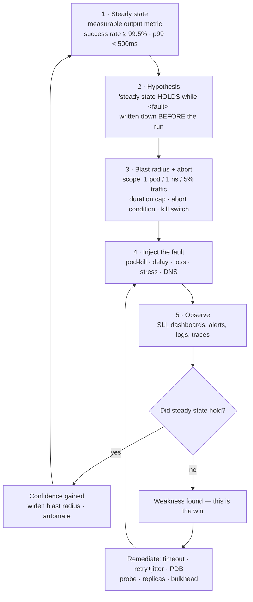

# Chaos Engineering Lab

Chaos engineering is **experimentation, not breakage**. You write down a belief about the system, you
disturb the system in a controlled way, and you find out whether the belief was true. Everything here runs
on a **free local cluster** (kind or k3d) so you can be wrong cheaply — in the verify-before-you-teach
spirit of [`AGENTS.md`](../../../AGENTS.md).

## When to use

- The team *believes* the service tolerates a lost replica, a slow dependency, or a full node — and has
  never once checked.
- Retries, timeouts, circuit breakers, PodDisruptionBudgets and readiness probes exist in YAML but have
  never been exercised against a real fault.
- You want to rehearse an incident (a **game day**) with the on-call rota, alerts and runbooks in the loop
  before production does it for you at 03:00.
- **Don't use it for** load testing (that is [k6-load-test-lab](../k6-load-test-lab/SKILL.md)), for
  breaking a production system you do not own or have written authorisation to disturb, or as a substitute
  for fixing known defects. Chaos engineering finds *unknown* weaknesses; a known bug just needs fixing.

## First principles: an experiment, with a hypothesis and a stop button

The discipline is defined by the **Principles of Chaos Engineering** (principlesofchaos.org; the
principles were published in 2015 and revised in 2018), which frame it as "the discipline of experimenting
on a system in order to build confidence in the system's capability to withstand turbulent conditions in
production". Five advanced principles follow, and each one is a design constraint on your experiment:

1. **Build a hypothesis around steady-state behaviour** — measure an *output* of the system (success
   rate, throughput, latency percentile), not an internal detail like CPU%.
2. **Vary real-world events** — kill instances, add latency, exhaust memory, fail DNS. Simulate what
   actually happens, not what is easy to script.
3. **Run experiments in production** — the aspiration, because only production has the real traffic, real
   data volumes and real dependency graph. Earn it by proving the method in a lab first (this skill).
4. **Automate experiments to run continuously** — a one-off experiment measures one day.
5. **Minimise blast radius** — the ethical and operational core: contain the harm, and be able to stop.



*Figure: the chaos experiment loop. The hypothesis and the abort condition are written **before** the
fault is injected, and a "failed" experiment — steady state broke — is the valuable outcome, not the bad
one.*

| Fault class | Real-world event it stands in for | Chaos Mesh kind / action | What it actually tests |
| --- | --- | --- | --- |
| Pod kill | node preemption, OOM kill, spot reclaim, rollout | `PodChaos` / `pod-kill` | replica count, PDB, readiness gates, restart storms |
| Pod failure | crash-looping or hung process | `PodChaos` / `pod-failure` | probe correctness, load-balancer eviction |
| Container kill | sidecar dies, app process dies | `PodChaos` / `container-kill` | restart policy, dependence on a sidecar |
| Network delay | slow dependency, cross-AZ hop | `NetworkChaos` / `delay` | client timeouts, connection pools, queue growth |
| Packet loss / partition | flaky link, split brain | `NetworkChaos` / `loss`, `partition` | retries, idempotency, quorum behaviour |
| CPU / memory stress | noisy neighbour, memory leak | `StressChaos` | requests/limits, HPA reaction, OOM behaviour |
| DNS failure | resolver outage | `DNSChaos` | DNS caching, startup ordering, retry on resolve |
| Clock skew | NTP drift | `TimeChaos` | token expiry, cert validity, leader leases |

| Guardrail | Concrete form | Failure mode if you skip it |
| --- | --- | --- |
| Scope | label selector matching **one** deployment in **one** namespace | you take down a shared dependency |
| Dose | `mode: one`, or `mode: fixed-percent` with `value: "20"` | you kill every replica at once — that is an outage, not an experiment |
| Duration | `duration: "60s"` on the chaos object | a forgotten experiment becomes an incident |
| Abort | `kubectl delete <chaos-kind>/<name>`; pre-agreed metric threshold | nobody knows who may stop it |
| Observability first | dashboard and SLI query open **before** injection | you inject blind and learn nothing |
| Announcement | who is told, and when | your own on-call pages for your experiment |

⚠ Tool versions move: Chaos Mesh chart versions, the CRD set, and whether a given fault type is still beta
all change between releases — check the version selector on chaos-mesh.org and run
`kubectl api-resources --api-group=chaos-mesh.org` on your own cluster rather than trusting a remembered
version.

## Procedure

1. **Create the cluster** (free, local): `kind create cluster --name chaos` (or
   `k3d cluster create chaos --agents 2`). Confirm with `kubectl get nodes`.
2. **Deploy a target with a real SLI** — a Deployment with ≥3 replicas, readiness/liveness probes,
   resource requests, and a Service. Anything with an HTTP endpoint you can measure.
3. **Establish steady state *first*.** Put load on it and record the baseline before injecting anything:
   `kubectl run -n chaos-demo hey --rm -it --image=ghcr.io/rakyll/hey:latest --restart=Never -- -z 60s -c 20 http://web.chaos-demo.svc.cluster.local:8080/`.
   Write down success rate, p50/p99 and RPS. **A hypothesis without a baseline is a guess.**
4. **Write the hypothesis and the guardrails before touching the cluster**, e.g. *"While one of three `web`
   pods is killed every 30s for 3 minutes, success rate stays ≥ 99.5% and p99 stays < 500ms. Blast radius:
   namespace `chaos-demo`, `mode: one`. Abort if success rate < 95% for 30s."*
5. **Install Chaos Mesh** (Chaos Mesh documentation, *Installation*, chaos-mesh.org — a CNCF incubating
   project). On kind the runtime is containerd, so the daemon socket must be set explicitly:
   ```bash
   helm repo add chaos-mesh https://charts.chaos-mesh.org && helm repo update
   helm install chaos-mesh chaos-mesh/chaos-mesh \
     -n chaos-mesh --create-namespace \
     --set chaosDaemon.runtime=containerd \
     --set chaosDaemon.socketPath=/run/containerd/containerd.sock
   kubectl -n chaos-mesh rollout status deploy/chaos-controller-manager
   kubectl api-resources --api-group=chaos-mesh.org      # confirm the CRDs actually landed
   ```
6. **Inject the smallest fault that could disprove the hypothesis** — start with `mode: one` and a short
   `duration`. Apply the `PodChaos` from the worked example, with `kubectl get pods -n chaos-demo -w` in
   one pane and the load generator in another.
7. **Observe against the hypothesis, not against vibes.** Record the SLI during the fault window. With
   [prometheus-grafana-local-lab](../prometheus-grafana-local-lab/SKILL.md) running, capture the panel;
   without it, the `hey` summary is enough for a first experiment.
8. **Practise the abort.** `kubectl delete podchaos kill-one-web -n chaos-demo` removes the fault
   immediately. A kill switch you have never pulled is a hope, not a control.
9. **Escalate one variable at a time**: `mode: one` → `fixed-percent: 50`; pod-kill → 300ms latency; then
   combine. Never change two variables in one run — you lose attribution.
10. **When the hypothesis breaks, that is the finding.** Remediate (raise replicas, add a
    PodDisruptionBudget, set a client timeout below the caller's, add jittered retry via
    [retry-backoff-coach](../retry-backoff-coach/SKILL.md)) and **re-run the identical experiment** to
    verify the fix. An unverified fix is a story.
11. **Run it as a game day**: the same experiment, but with the on-call engineer responding blind. Measure
    time-to-detect and time-to-diagnose, and check whether the alert and the runbook were any use.
12. **Clean up**: `kubectl delete -f chaos/ --ignore-not-found`, `helm uninstall chaos-mesh -n chaos-mesh`,
    `kind delete cluster --name chaos`. Then close with the **Learning Footer**.

## Output shape

```
Chaos experiment — <name>        Date: <YYYY-MM-DD>    Environment: <kind local | staging | prod>
Target: <deployment/ns>          Operator: <who>       Observers: <who>

Steady state (measured BEFORE): success <99.9%> · p50 <..ms> · p99 <..ms> · RPS <..>
Hypothesis: "Steady state HOLDS (success ≥ <X%>, p99 < <Y>ms) while <fault description>."
Blast radius: ns=<...> selector=<...> mode=<one|fixed|fixed-percent:N> duration=<Ns>
Abort condition: <metric + threshold + window>    Kill switch: kubectl delete <kind>/<name>
Announced to: <on-call / channel>                 Rollback plan: <...>

Fault injected: <kind>/<action> at <HH:MM:SS>  →  removed at <HH:MM:SS>
Observed: success <..%> · p99 <..ms> · errors <type/count> · alert fired <yes/no, after Ns>
Verdict: HYPOTHESIS <held | DISPROVED>
Weakness found: <e.g. "client timeout 30s > caller timeout 5s → queue backs up, no circuit break">
Blast radius stayed contained: <yes/no — evidence>
Remediation: <one change>   Owner: <who>   Re-run to verify: <date / result>
Next experiment (exactly one more variable): <...>
Learning Footer
```

## Worked example — "one dead replica is a non-event" (kind, free)

**Step 1 — a target that *should* survive a pod kill.** Namespace `chaos-demo`, three replicas, probes and
a PodDisruptionBudget. It is written to pass Pod Security Admission at `restricted`, so it applies whether
or not the namespace is enforced:

```yaml
apiVersion: v1
kind: Namespace
metadata:
  name: chaos-demo
  labels:
    pod-security.kubernetes.io/enforce: restricted
    pod-security.kubernetes.io/warn: restricted
---
apiVersion: apps/v1
kind: Deployment
metadata: {name: web, namespace: chaos-demo}
spec:
  replicas: 3
  selector:
    matchLabels: {app: web}
  template:
    metadata:
      labels: {app: web}
    spec:
      securityContext:
        runAsNonRoot: true
        runAsUser: 101                 # the nginx-unprivileged image's user
        runAsGroup: 101
        seccompProfile: {type: RuntimeDefault}
      terminationGracePeriodSeconds: 10
      containers:
        - name: web
          image: nginxinc/nginx-unprivileged:1.27-alpine   # listens on 8080 as non-root
          ports: [{containerPort: 8080}]
          readinessProbe:
            httpGet: {path: /, port: 8080}
            periodSeconds: 2
          livenessProbe:
            httpGet: {path: /, port: 8080}
            periodSeconds: 5
          resources:
            requests: {cpu: "50m", memory: "64Mi"}
            limits:   {cpu: "200m", memory: "128Mi"}
          securityContext:
            allowPrivilegeEscalation: false
            readOnlyRootFilesystem: true
            capabilities: {drop: ["ALL"]}
          volumeMounts:
            - {name: tmp, mountPath: /tmp}
            - {name: cache, mountPath: /var/cache/nginx}
            - {name: run, mountPath: /var/run}
      volumes:
        - {name: tmp, emptyDir: {}}
        - {name: cache, emptyDir: {}}
        - {name: run, emptyDir: {}}
---
apiVersion: v1
kind: Service
metadata: {name: web, namespace: chaos-demo}
spec:
  selector: {app: web}
  ports: [{port: 8080, targetPort: 8080}]
---
apiVersion: policy/v1
kind: PodDisruptionBudget
metadata: {name: web, namespace: chaos-demo}
spec:
  minAvailable: 2
  selector:
    matchLabels: {app: web}
```

Tracing the manifest so it genuinely applies: `runAsNonRoot` + `allowPrivilegeEscalation: false` +
`capabilities.drop: [ALL]` + `seccompProfile: RuntimeDefault` + `emptyDir`-only volumes is exactly the
`restricted` requirement set (Kubernetes documentation, *Pod Security Standards*, kubernetes.io). The
*unprivileged* nginx variant is used because the stock `nginx` image starts as root and would be rejected,
and the three `emptyDir` mounts exist because `readOnlyRootFilesystem: true` otherwise breaks nginx's
writes to `/tmp`, `/var/cache/nginx` and `/var/run`.

**Step 2 — baseline, then hypothesis.**

```bash
kubectl apply -f web.yaml && kubectl -n chaos-demo rollout status deploy/web
kubectl run -n chaos-demo hey --rm -it --image=ghcr.io/rakyll/hey:latest --restart=Never -- \
  -z 60s -c 20 http://web.chaos-demo.svc.cluster.local:8080/
# record requests/sec, p99 and the status-code distribution → this is steady state
```

**Step 3 — the smallest fault that could disprove it.** `mode: one` kills exactly one matching pod, and
`duration` bounds the experiment even if you walk away:

```yaml
apiVersion: chaos-mesh.org/v1alpha1
kind: PodChaos
metadata:
  name: kill-one-web
  namespace: chaos-demo          # namespace-scoped chaos = the blast-radius control
spec:
  action: pod-kill
  mode: one                      # NOT "all" — one pod, out of three
  duration: "180s"               # auto-expires, so forgetting to clean up cannot cause an outage
  selector:
    namespaces: [chaos-demo]
    labelSelectors:
      app: web
```

```bash
kubectl apply -f podchaos-kill-one.yaml
kubectl get pods -n chaos-demo -w      # one pod Terminating → new pod Pending → Running → Ready
kubectl describe podchaos kill-one-web -n chaos-demo | tail -20   # records each injection
kubectl delete podchaos kill-one-web -n chaos-demo                # ← the kill switch; rehearse it
```

**Reasoning through what you should see, and why.** With `minAvailable: 2` and three replicas the PDB
permits this disruption; the killed pod leaves the Service's EndpointSlice when it is deleted, and
`terminationGracePeriodSeconds: 10` gives in-flight requests time to drain. The honest prediction is
therefore: **a small number of in-flight connection resets** at the kill, then recovery within a readiness
period. If you see *zero* errors, check that your load generator is really reusing connections. If you see
a **sustained** error rate, you have found something real — usually a readiness probe with too high a
`periodSeconds`, an app that ignores SIGTERM, or replicas that were never actually independent.

**Step 4 — escalate one variable: make the dependency slow, not dead.** Latency is the fault that finds
missing timeouts, and it is far more common in production than a clean crash:

```yaml
apiVersion: chaos-mesh.org/v1alpha1
kind: NetworkChaos
metadata: {name: slow-web, namespace: chaos-demo}
spec:
  action: delay
  mode: all                      # every web pod — but still only in this namespace
  duration: "120s"
  selector:
    namespaces: [chaos-demo]
    labelSelectors:
      app: web
  delay:
    latency: "300ms"
    jitter: "100ms"
    correlation: "50"
  direction: to                  # delay traffic *to* the selected pods
```

If the caller has no timeout, a 300ms delay becomes an unbounded queue and the failure surfaces as memory
exhaustion three hops away — which is precisely the lesson. Fix it with an explicit client timeout plus
jittered retry, then **re-run this exact manifest** and confirm the SLI holds.

## Tips

- **Write the hypothesis before the fault, always.** Injecting first and rationalising after is
  "breaking things", and it teaches the organisation to distrust the practice.
- **The kill switch is part of the experiment design.** Always set `duration`, and delete the chaos CR by
  hand at least once — an unbounded experiment that outlives your attention is an incident you caused.
- Progress lab → staging with realistic traffic → production; and in production start at
  `fixed-percent: 1`, off-peak, announced, with the service owner watching.
- A disproved hypothesis is the return on investment. Teams that only ever report "held" are either very
  resilient or, far more often, injecting faults too small to matter.
- Chaos without observability is vandalism. Define the SLI with [slo-designer](../slo-designer/SKILL.md),
  stand up dashboards via [observability-plan](../observability-plan/SKILL.md) and
  [prometheus-grafana-local-lab](../prometheus-grafana-local-lab/SKILL.md) *before* the first injection.
- Game days test people and process, not only code — measure time-to-detect and whether the runbook was
  usable, then feed it into [incident-response-drill](../incident-response-drill/SKILL.md) and
  [incident-postmortem](../incident-postmortem/SKILL.md).
- Most weaknesses chaos finds are fixed by a handful of patterns: bounded timeouts and jittered retries
  ([retry-backoff-coach](../retry-backoff-coach/SKILL.md)), circuit breaking
  ([circuit-breaker-coach](../circuit-breaker-coach/SKILL.md)), correct probes and replica counts
  ([k8s-deployment-lab](../k8s-deployment-lab/SKILL.md)), autoscaling headroom
  ([k8s-autoscaling-lab](../k8s-autoscaling-lab/SKILL.md)), and safe rollouts
  ([progressive-delivery-lab](../progressive-delivery-lab/SKILL.md)).
- Related: [k8s-troubleshooting-lab](../k8s-troubleshooting-lab/SKILL.md),
  [k6-load-test-lab](../k6-load-test-lab/SKILL.md),
  [service-mesh-lab](../service-mesh-lab/SKILL.md) for injecting faults at L7 instead of L4, and
  [dora-metrics-coach](../dora-metrics-coach/SKILL.md) to check whether recovery time actually improved.
  End with the **Learning Footer** (`AGENTS.md`).
