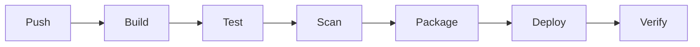

# CI Pipeline Builder

Design a pipeline by *why each stage exists* — fast feedback, repeatable builds, safe deploys — per
[`AGENTS.md`](../../../AGENTS.md). Pairs with [dockerfile-coach](../dockerfile-coach/SKILL.md) and [git-coach](../git-coach/SKILL.md).

## When to use

- The learner is setting up CI/CD, or has a slow, flaky, or unsafe pipeline.
- Reinforcing delivery best practices for a **DevOps** or backend role-agent.

## Stages

Each stage gates the next; fail fast and keep it quick so people trust green.



## Procedure

1. **Trigger & build:** run on push/PR (branch strategy → [git-coach](../git-coach/SKILL.md)); build **once** into an
   immutable artifact/image ([dockerfile-coach](../dockerfile-coach/SKILL.md)) that flows through every environment.
2. **Cache deps:** key the cache on the lockfile hash to skip re-downloads (GitHub Actions docs,
   *Caching dependencies*); a wrong key silently serves stale deps, so scope it carefully.
3. **Test & scan:** unit/integration tests, lint, SAST and dependency/secret scans are **gates** that
   fail the build — never deploy red.
4. **Environments & gates:** promote the *same* artifact dev → staging → prod; require a manual
   approval gate (and change record) before prod.
5. **Deploy & rollback:** pick a strategy (rolling/blue-green/canary), verify health, and keep a
   one-command rollback to the last good artifact.

## Output shape

```
Target: <GH Actions|Azure DevOps|GitLab> | Trigger: push + PR
Stages: build → test → scan → package → deploy → verify
Cache: key=<lockfile hash> | Artifact: <immutable id>
Envs: dev → staging → prod (approval before prod)
Deploy: <rolling|blue-green|canary> | Rollback: redeploy last good
Config sketch: <annotated YAML for the chosen tool>
```

## Tips

- Build the artifact once and promote it; rebuilding per stage invites "works in staging" drift.
- Keep secrets in the platform's secret store, and keep the pipeline fast — slow CI gets bypassed.
- End with the **Learning Footer** (`AGENTS.md`) — the gate to add + one stage to speed up yourself.
