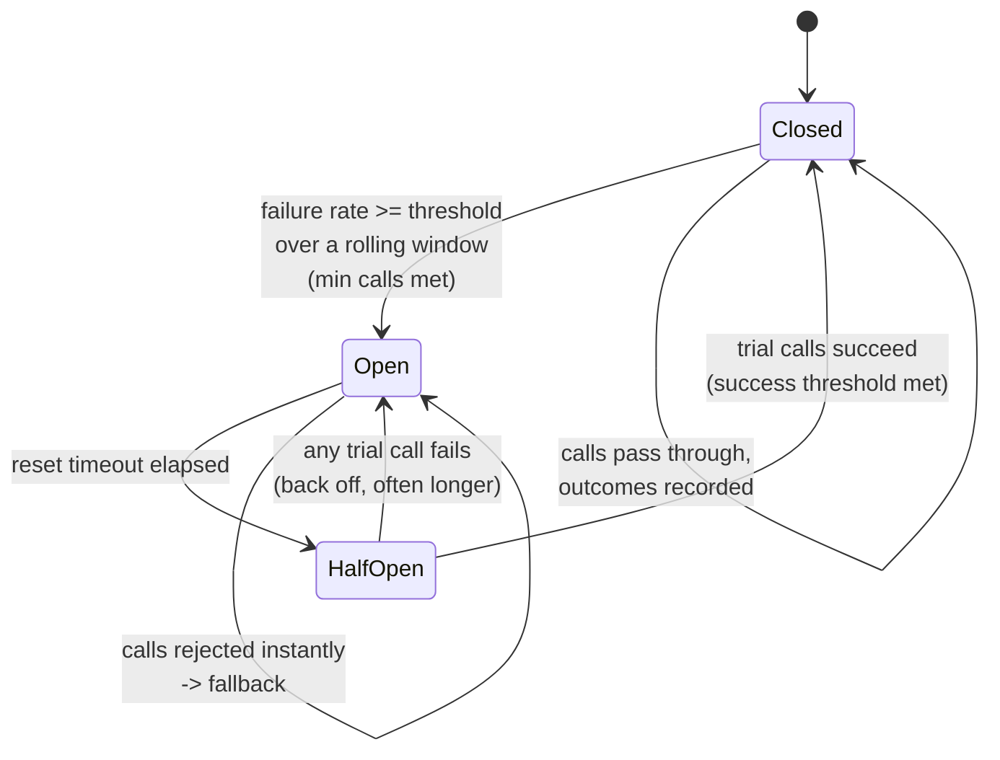
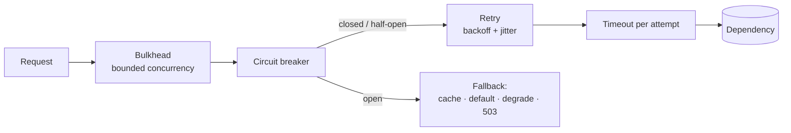

# Circuit Breaker Coach

Stop a slow dependency from taking down everything that depends on you — the state machine, the tuning,
and the patterns it must be combined with. Follows [`AGENTS.md`](../../../AGENTS.md).

## When to use

- One dependency gets slow and the whole service dies — threads/connections all parked on a hung call.
- Retries are making an outage worse instead of better (a retry storm).
- The learner has heard "add a circuit breaker" and needs to know where, with what thresholds, and why.
- Designing any **outbound** call over a network: HTTP, gRPC, database, cache, queue, third-party API.
- Related: [rate-limiter-designer](../rate-limiter-designer/SKILL.md) (protect *yourself* from callers),
  [load-balancing-coach](../load-balancing-coach/SKILL.md) (route away from bad instances),
  [saga-pattern-coach](../saga-pattern-coach/SKILL.md) (undo work when a step permanently fails).

## First principles: latency is the real killer

A failing dependency that returns errors *fast* is survivable. A dependency that is **slow** is lethal:
each in-flight request holds a thread, a connection, and memory, so the caller's pool saturates, its own
callers time out, and the failure climbs the call graph. That is **cascading failure**.

The breaker's insight: **when a dependency is clearly unhealthy, calling it again is negative-value work.**
Fail fast instead — cheaply, immediately, and with a fallback — and give the dependency room to recover.
(The pattern is popularized by Michael Nygard's *Release It!* and implemented by libraries such as
Resilience4j, Polly, and service-mesh outlier detection in Envoy/Istio.)

## The state machine



| State | Behaviour | Purpose |
| --- | --- | --- |
| **Closed** | All calls pass; outcomes recorded in a rolling window | Normal operation with measurement |
| **Open** | Calls rejected immediately, no network I/O; fallback runs | Protect the caller's resources **and** stop hammering the dependency |
| **Half-open** | A small number of trial calls allowed, rest rejected | Probe recovery **without** re-flooding a fragile service |

## Configuration knobs

| Knob | Typical starting point | Too low | Too high |
| --- | --- | --- | --- |
| Failure-rate threshold | 50 % over the window | Trips on noise | Never trips; you cascade anyway |
| Minimum calls before evaluating | 20–50 | 1 failure out of 1 opens it | Slow to react on low-traffic paths |
| Rolling window | 10–60 s, or last N calls | Jittery | Stale; reacts to an outage that ended |
| Reset timeout (open → half-open) | 5–30 s, ideally with jitter | Re-floods a recovering service | Users stay degraded needlessly |
| Half-open trial calls | 1–5 | Insufficient signal | Half-open becomes another flood |
| Slow-call threshold | p99 of healthy latency | Trips on normal spikes | Misses the "slow, not failing" case |

**Count slow calls as failures.** A breaker that only counts exceptions never opens for the exact failure
mode that hurts most.

## The resilience stack (order matters)



| Pattern | Solves | Without it |
| --- | --- | --- |
| **Timeout** | Unbounded waiting | Everything else is useless — the prerequisite |
| **Retry + backoff + jitter** | Transient blips | Retry storm; synchronized thundering herd |
| **Circuit breaker** | Persistent failure | You keep paying for calls that cannot succeed |
| **Bulkhead** | One dependency eating the whole pool | A single bad dependency starves unrelated traffic |
| **Fallback** | User-visible hard failure | Outage instead of degraded service |

Retries live **inside** the breaker: retries handle the blip, the breaker notices that the blip became a
trend and shuts the retries off. Inverting them (breaker inside retry) multiplies load exactly when the
dependency is weakest.

## Procedure

1. **Locate the boundary.** One breaker **per outbound dependency**, ideally per endpoint-with-distinct-
   failure-behaviour. Never one global breaker; never a breaker on your own inbound handler (that's
   rate limiting or load shedding).
2. **Set a timeout first.** Derive it from the healthy p99 plus headroom — not from a round number. Every
   attempt (not just the whole retry chain) needs one.
3. **Classify errors.** Only *dependency health* signals should count: 5xx, connection refused, timeouts,
   slow calls. **4xx from bad input must not open the breaker** — that's your bug, not theirs.
4. **Choose thresholds from data**, using current traffic volume and error baseline; start with the table
   above, then tune against a real incident replay or a load test.
5. **Design the fallback before the breaker.** Options, best first: serve stale cache → serve a
   safe default → degrade the feature → queue for later → fail fast with a clear error. If there is no
   acceptable fallback, say so explicitly — the breaker then converts a slow failure into a fast one,
   which is still a win.
6. **Add a bulkhead** (bounded concurrency / separate pool per dependency) so a saturating dependency
   cannot consume every thread before the breaker even trips.
7. **Make retries safe.** Only retry **idempotent** operations (or use an idempotency key), cap attempts
   at 2–3, use exponential backoff **with jitter**, and add a retry budget so retries can never exceed a
   small fraction of base traffic.
8. **Instrument it.** Emit state transitions as events, plus counters for calls allowed/rejected, failure
   rate, and fallback hits. Alert on `Open`, not on individual errors — link to the runbook
   ([oncall-runbook-coach](../oncall-runbook-coach/SKILL.md)) and to your error budget
   ([slo-designer](../slo-designer/SKILL.md)).
9. **Test the failure, not the happy path.** Inject latency and errors (fault injection / game day) and
   verify: breaker opens, fallback serves, half-open probes, breaker closes. Simulate the state machine
   with `#run` (`learningos_runcode`) to see thresholds behave before shipping.
10. **Review after every incident.** Did it trip? Too early, too late, or not at all? Tune one knob.

## Output shape

```
Circuit breaker design — <caller> -> <dependency>

Boundary: one breaker per <dependency/endpoint>  (isolated pool: yes/no)
Timeout: <ms> per attempt   (healthy p99 = <ms>, headroom <x>)

Counts as failure:      5xx, connect refused, timeout, slow call > <ms>
Does NOT count:         4xx client errors, validation failures, auth errors

Thresholds:
  failure rate >= <x%> over <window> with min <n> calls  -> OPEN
  reset timeout <s> (+ jitter)                           -> HALF-OPEN
  <n> trial calls, <n> successes                         -> CLOSED

Retry (inside the breaker): max <n> attempts, exponential backoff base <ms>, jitter, idempotent only
Bulkhead: max <n> concurrent calls / <n> queued -> reject fast
Fallback: <stale cache | default | degraded feature | 503 with message>

Observability: state-change events · rejected count · fallback rate · alert on OPEN > <s>
Verification: fault injection — latency <ms> => breaker OPEN in <s>, fallback served, recovered in <s>
Anti-patterns checked: retry-outside-breaker · no timeout · global breaker · 4xx counted
Next: <rate-limiter-designer | load-balancing-coach | saga-pattern-coach>
```

## Tips

- **A breaker without a timeout is decoration.** The timeout is what makes failure detectable at all.
- Count **slow** calls as failures — "up but slow" is the outage shape that kills services.
- Never let 4xx open the breaker; you will lock users out of a healthy dependency because of one bad
  request shape.
- Jitter everything — reset timeouts and retry backoff — or every instance will probe the recovering
  dependency at the same instant.
- Half-open must admit **few** calls. A half-open state that lets everything through just re-runs the
  outage.
- Breakers are per-process by default: with N instances, a recovering dependency sees N probe waves.
  Consider mesh-level outlier detection or a shared health signal for large fleets.
- Design the **fallback** first; a breaker that fails fast into nothing only changes the error message.
- Ship the dashboard and alert with the breaker, or nobody will know it has been open for a week.
- Route onward to [rate-limiter-designer](../rate-limiter-designer/SKILL.md),
  [load-balancing-coach](../load-balancing-coach/SKILL.md), or
  [saga-pattern-coach](../saga-pattern-coach/SKILL.md).
  End with the **Learning Footer** (`AGENTS.md`).
