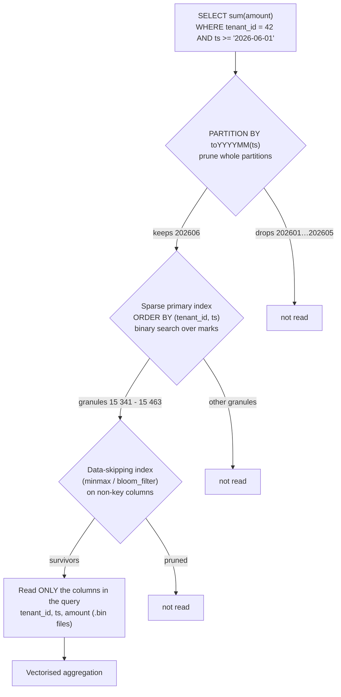

# ClickHouse Local Lab

ClickHouse is fast for one structural reason: it reads **columns**, in **sorted order**, and skips whole
blocks it can prove are irrelevant. This lab builds that intuition on your own machine with no account and no
cost, deriving each rule before applying it, as [`AGENTS.md`](../../../AGENTS.md) requires.

## When to use

- You need aggregate queries over hundreds of millions of rows and a row store is timing out.
- You have a ClickHouse table already and want to know why a query reads 4 billion rows for a 3-row answer.
- You are choosing `ORDER BY` / `PARTITION BY` / a materialized view and want the rule, not folklore.
- You want to try columnar analytics on a CSV/Parquet file without installing a server at all.
- **Don't use it for** transactional workloads, per-row updates, or point lookups by arbitrary key — that is
  [postgres-local-lab](../postgres-local-lab/SKILL.md); and for single-machine ad-hoc analytics over files,
  [duckdb-lab](../duckdb-lab/SKILL.md) is often the smaller tool.

## First principles: sparse index, sorted parts, granules

A `MergeTree` table is a set of immutable **parts**. Inside a part, each column lives in its own compressed
file, and rows are stored **sorted by the `ORDER BY` key**. ClickHouse does not index every row. It stores one
index entry per **granule** of `index_granularity` rows (default **8192**), producing a *sparse* primary index
small enough to stay in memory even for billions of rows:

$$\text{index entries} = \left\lceil \frac{N_{\text{rows}}}{\texttt{index\_granularity}} \right\rceil
\qquad
\text{rows read} = \texttt{index\_granularity} \times \text{granules not pruned}$$

That equation contains the entire performance model. You cannot read fewer than one granule, and you only
prune granules whose min/max of the sorted key prove they cannot match.



*Four filters in sequence — partition, sparse primary index, skip index, column selection. Each one is a
chance to not read data; a wrong `ORDER BY` disables the most important of them.*

| Clause | What it is for | Rule of thumb | Failure mode when misused |
| --- | --- | --- | --- |
| `ORDER BY` | physical sort order **and** the sparse primary index | put the column you *always* filter by first, then increasing cardinality; low-cardinality prefix compresses better | filtering on a non-prefix column ⇒ full scan |
| `PRIMARY KEY` | the index prefix (defaults to `ORDER BY`) | only set it to a **prefix** of `ORDER BY` when you want a smaller index | must be a prefix — otherwise DDL error |
| `PARTITION BY` | data *management*: `DROP PARTITION`, TTL, partition pruning | monthly (`toYYYYMM`) is the common safe choice | one partition per day/hour ⇒ thousands of parts, slow merges, "too many parts" |
| Data-skipping index | prune granules on **non-key** columns (`minmax`, `set`, `bloom_filter`) | only helps if the column correlates with the sort order | zero benefit on a randomly distributed column, plus write cost |
| `TTL` | expiry and tiering | `TTL ts + INTERVAL 90 DAY` | silently deleting data you needed |

**Materialized views in ClickHouse are insert triggers, not cached queries.** A MV fires on each newly
inserted block into the *source* table, transforms it, and inserts the result into a target table. It does not
see pre-existing rows (unless you use `POPULATE`, which races with concurrent inserts), and it does not react
to `ALTER … UPDATE/DELETE` mutations. This single fact explains most "my materialized view is missing data"
reports.

**When columnar wins** — few columns of very many rows, aggregation/filter/group-by, high compression from
sorted, homogeneous columns, vectorised execution. **When it loses** — point lookups by a non-prefix key,
single-row inserts (batch to thousands of rows per insert; the docs recommend large batches or async inserts),
frequent updates/deletes (mutations rewrite parts asynchronously), multi-statement transactions, and
foreign-key/constraint-driven models.

## Procedure

1. **Start with zero installation.** `clickhouse-local` is a single binary that runs the whole engine against
   files — no server, no data directory:
   ```bash
   curl https://clickhouse.com/ | sh            # downloads the ./clickhouse binary into the current dir
   ./clickhouse local -q "SELECT count(), avg(amount) FROM file('events.csv', CSVWithNames)"
   ./clickhouse local -q "DESCRIBE file('events.parquet', Parquet)"
   ```
2. **Or run a server in docker** when you want persistence and the system tables:
   ```bash
   docker run -d --name ch --ulimit nofile=262144:262144 \
     -p 8123:8123 -p 9000:9000 clickhouse/clickhouse-server:latest
   docker exec -it ch clickhouse-client
   ```
3. **Create the table with the sort key your queries actually use**:
   ```sql
   CREATE TABLE events
   (
       tenant_id  UInt32,
       ts         DateTime,
       event_type LowCardinality(String),
       user_id    UInt64,
       amount     Decimal(12, 2)
   )
   ENGINE = MergeTree
   PARTITION BY toYYYYMM(ts)
   ORDER BY (tenant_id, ts)
   SETTINGS index_granularity = 8192;
   ```
4. **Load enough data to make the numbers real** (generated locally, no download):
   ```sql
   INSERT INTO events
   SELECT (rand() % 500) + 1,
          toDateTime('2026-01-01 00:00:00') + (number % 15552000),
          ['view','click','purchase'][(rand() % 3) + 1],
          rand64() % 1000000,
          toDecimal64((rand() % 10000) / 100, 2)
   FROM numbers(100000000);
   ```
5. **Prove the pruning instead of believing it**:
   ```sql
   EXPLAIN indexes = 1
   SELECT sum(amount) FROM events
   WHERE tenant_id = 42 AND ts >= '2026-06-01' AND ts < '2026-07-01';
   ```
   The output lists each index (`MinMax` on the partition key, `Primary` on the sort key) with
   `Parts` and `Granules` selected / total. Then confirm with the real counters:
   ```sql
   SELECT read_rows, read_bytes, query_duration_ms, query
   FROM system.query_log
   WHERE type = 'QueryFinish' ORDER BY event_time DESC LIMIT 3;
   ```
6. **Add a data-skipping index only where the primary index cannot help**:
   ```sql
   ALTER TABLE events ADD INDEX idx_user user_id TYPE bloom_filter(0.01) GRANULARITY 4;
   ALTER TABLE events MATERIALIZE INDEX idx_user;      -- build it for existing parts
   ```
7. **Pre-aggregate with an incremental materialized view** when a dashboard hits the same rollup constantly:
   ```sql
   CREATE TABLE events_daily
   (
       tenant_id UInt32, day Date,
       events    AggregateFunction(count),
       revenue   AggregateFunction(sum, Decimal(12, 2))
   ) ENGINE = AggregatingMergeTree ORDER BY (tenant_id, day);

   CREATE MATERIALIZED VIEW events_daily_mv TO events_daily AS
   SELECT tenant_id, toDate(ts) AS day, countState() AS events, sumState(amount) AS revenue
   FROM events GROUP BY tenant_id, day;

   -- read it back with the matching -Merge combinator
   SELECT tenant_id, day, countMerge(events), sumMerge(revenue)
   FROM events_daily WHERE tenant_id = 42 GROUP BY tenant_id, day ORDER BY day;
   ```
8. **Watch the parts.** Merges are the engine's background housekeeping; too many parts means your insert
   batches are too small:
   ```sql
   SELECT table, partition, count() AS parts, sum(rows), formatReadableSize(sum(bytes_on_disk))
   FROM system.parts WHERE active GROUP BY table, partition ORDER BY parts DESC;
   ```
9. **Record before/after `read_rows` for each target query**, note which structural change caused which drop,
   and close with the **Learning Footer**.

## Output shape

```
Engine: MergeTree (<Replacing|Summing|Aggregating> if used)   Rows: <N>   Columns read by target query: <k of m>
ORDER BY: (<cols>)   justified by filter <col> present in <x/y> target queries
PRIMARY KEY: <prefix of ORDER BY | default>   PARTITION BY: <toYYYYMM(ts)>   partitions: <n> (parts/partition: <n>)
index_granularity: <8192>   marks: ceil(N/granularity) = <n>
Query: <sql>
  before: parts <a/b> granules <c/d> read_rows=<..> duration=<..ms>
  after:  parts <a/b> granules <c/d> read_rows=<..> duration=<..ms>   (change made: <ORDER BY | skip index | MV>)
Skip index: <type(col) GRANULARITY n | none>  correlates with sort order? <yes/no — else it prunes nothing>
Materialized view: <name → target engine>   Incremental (insert-trigger) semantics acknowledged: <yes>
Insert pattern: batch size <rows/insert>  parts growth: <system.parts count>
Verdict: columnar is <the right tool | overkill — use Postgres/DuckDB> because <reason>
Next: <duckdb-lab | parquet-internals-coach | timeseries-db-coach>
Learning Footer
```

## Worked example — count the granules, then break it on purpose

100 000 000 rows, `index_granularity = 8192`, `ORDER BY (tenant_id, ts)`, 500 tenants ⇒ ~200 000 rows each.

**Index size.** $\lceil 100{,}000{,}000 / 8192 \rceil = \lceil 12207.03 \rceil = 12\,208$ marks. Twelve
thousand entries index a hundred million rows — that is why the primary index is resident in RAM while a
B-tree over the same data would be gigabytes ([database-index-coach](../database-index-coach/SKILL.md)).

**Good query.** `WHERE tenant_id = 42 AND ts >= '2026-06-01' AND ts < '2026-07-01'`:

1. Partition pruning on `toYYYYMM(ts)` keeps only partition `202606` — 5 of 6 months dropped before any index
   is consulted.
2. Within that partition, `tenant_id` is the **first** `ORDER BY` column, so rows for tenant 42 are contiguous
   and a binary search over the marks finds their range directly.
3. Tenant 42 holds ≈ 200 000 rows in the whole table; in one month ≈ 33 000. Granules touched
   $= \lceil 33{,}000 / 8192 \rceil = 5$, so rows read $= 5 \times 8192 = 40\,960$ — the granule boundary
   rounding is why you read ~41 k rows for a 33 k-row answer. That is the price of a sparse index, and it is
   cheap: **40 960 rows read instead of 100 000 000, a 2 441× reduction**, touching only 3 of the 5 column
   files (`tenant_id`, `ts`, `amount`).

**Now break it deliberately.** Recreate the table as `ORDER BY (ts, tenant_id)` and run the same query:

- Partition pruning still works (still one month).
- But `tenant_id` is no longer a prefix, so tenant 42's rows are scattered across *every* granule of that
  month. The primary index can only narrow by `ts`, and the month filter is the partition already ⇒ ClickHouse
  reads the entire month: ≈ 16 700 000 rows instead of 40 960, a **~400×** regression from one clause.

The rescue, when both access patterns are genuinely needed, is not a "secondary index" in the B-tree sense —
it is either a **projection**/second table sorted the other way, or a skip index:

```sql
ALTER TABLE events ADD INDEX idx_tenant tenant_id TYPE minmax GRANULARITY 8;
```

⚠ Trace whether it can help before adding it: `minmax` prunes a granule only if the granule's
`[min(tenant_id), max(tenant_id)]` excludes 42. With `ORDER BY (ts, tenant_id)` and tenants arriving randomly,
almost every granule spans nearly the full tenant range, so the min/max test almost never excludes anything —
**the skip index costs write time and prunes nothing.** Skip indexes work when the column correlates with the
sort order (a monotonically increasing id, a status that changes over time), and are close to useless when it
does not. Sorting correctly beats indexing cleverly.

## Tips

- `ORDER BY` is the single most consequential decision; everything else is a rounding error next to it. Choose
  it from the filters in your top queries, not from the table's "natural" key.
- `PARTITION BY` is for lifecycle management, not for speed. Daily partitions on a busy table produce thousands
  of small parts and merge pressure — monthly is the safe default.
- Insert in large batches (thousands of rows), or use asynchronous inserts. Row-at-a-time inserts create a part
  per insert and the merge scheduler will punish you.
- `FINAL` and `OPTIMIZE … FINAL` are debugging tools, not a deduplication strategy; design for
  `ReplacingMergeTree` semantics (eventual, at merge time) instead of forcing them per query.
- Materialized views only see **new inserts**. Backfills are a separate, explicit job — plan them with
  [backfill-and-reprocessing-coach](../backfill-and-reprocessing-coach/SKILL.md).
- Compare honestly before adopting: [duckdb-lab](../duckdb-lab/SKILL.md) for single-node file analytics,
  [parquet-internals-coach](../parquet-internals-coach/SKILL.md) for the same row-group/statistics ideas in a
  file format, and [trino-local-lab](../trino-local-lab/SKILL.md) for federated queries.
- Feeding it from a stream? See [kafka-topics-partitions-lab](../kafka-topics-partitions-lab/SKILL.md) and
  [streaming-pipeline-designer](../streaming-pipeline-designer/SKILL.md); put a dashboard on top with
  [metabase-local-lab](../metabase-local-lab/SKILL.md).
- Time-series shaped data? Compare with [timeseries-db-coach](../timeseries-db-coach/SKILL.md) before
  committing, and read plans the same disciplined way as
  [query-plan-tuning-lab](../query-plan-tuning-lab/SKILL.md). End with the **Learning Footer** (`AGENTS.md`).
