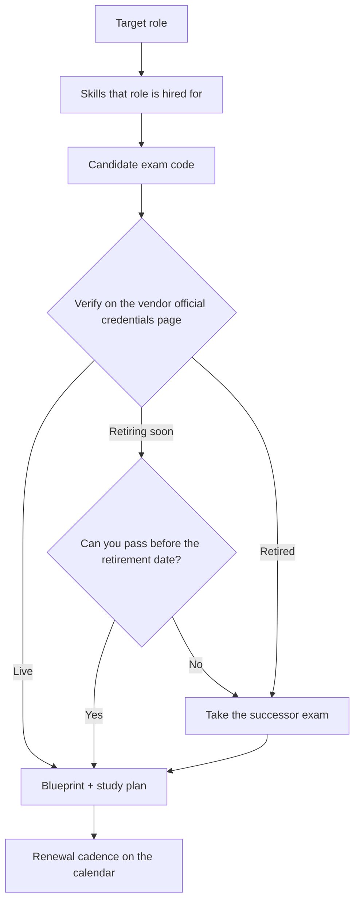

# Cloud Cert Roadmap Coach

Choose a **live** certification, in the **right order**, for a **real role** — verifying every exam code
before a single study hour is spent, per [`AGENTS.md`](../../../AGENTS.md). Hand off to
[exam-blueprint](../exam-blueprint/SKILL.md) for domain weights and
[exam-strategy-coach](../exam-strategy-coach/SKILL.md) for exam-day tactics.

## When to use

- The learner asks "which certification should I do next?" — or is about to study a **retired** exam.
- They are mid-plan and a vendor announcement just moved the target.
- Budgeting time and money across a 6–18 month certification sequence.

## Mental model

A certification is a **proxy for a role**, not a goal. Work backwards: role → the skills that role is hired
for → the *current* exam that measures them → the prerequisite that makes it passable. Codes are the
**least stable** part of the chain, so verification comes first, always.



## Step 0 — verify the code is live (non-negotiable)

**Never study from a course title or a forum post.** Open the vendor's official credentials/certification
page for the exact code and read the status and any retirement date:
Microsoft Learn Credentials · AWS Certification · Google Cloud Certification. Then record the URL and the
date you checked, exactly as [exam-blueprint](../exam-blueprint/SKILL.md) demands for weights.

**Known moves confirmed on Microsoft Learn (verify again on the day you plan):**

| Old code | Status | Take instead | Note |
| --- | --- | --- | --- |
| **AZ-204** Azure Developer Associate | **Retired** (retirement date 31 Jul 2026) | **AI-200** Azure AI Cloud Developer Associate | Successor named in the Microsoft Learn retirement announcement |
| **AI-102** Azure AI Engineer Associate | **Retired** | **AI-200** | Training AI-102T00 retired; AI-200 is the live developer/AI path |
| **DP-203** Data Engineering on Azure | **Retired** | **DP-700** Fabric Data Engineer Associate | Data engineering moved onto Microsoft Fabric |
| **AZ-500** Azure Security Engineer Associate | **Retiring 31 Aug 2026** | **SC-500** Cloud and AI Security Engineer Associate | Only start AZ-500 if you can sit it before the date |
| **SOA-C02** AWS SysOps Administrator – Associate | Superseded | **SOA-C03** AWS Certified CloudOps Engineer – Associate | Renamed track — confirm the active version on aws.amazon.com/certification |

An earned certification **stays valid for its normal term even after the exam retires** — retirement blocks
new sittings, it does not revoke your credential.

## Role → current certification

| Role you want | Azure | AWS | Google Cloud |
| --- | --- | --- | --- |
| First cloud job / non-engineer | AZ-900 | Cloud Practitioner (CLF-C02) | Cloud Digital Leader |
| Cloud administrator / ops | **AZ-104** | **SOA-C03** (CloudOps Associate) | Associate Cloud Engineer |
| Solutions architect | AZ-305 (**needs AZ-104**) | Solutions Architect – Associate (SAA-C03) → Professional | Professional Cloud Architect |
| Application developer | **AI-200** (AZ-204 retired) | Developer – Associate (DVA-C02) | Professional Cloud Developer |
| DevOps / platform | AZ-400 (needs AZ-104 **or** a developer associate) | DevOps Engineer – Professional (DOP-C02) | Professional Cloud DevOps Engineer |
| Data engineer | **DP-700** (Fabric) | Data Engineer – Associate (DEA-C01) | Professional Data Engineer |
| Security engineer | **SC-500** (AZ-500 retiring) | Security – Specialty (SCS-C02) | Professional Cloud Security Engineer |
| AI / ML engineer | **AI-200** | ML Engineer – Associate (MLA-C01) | Professional ML Engineer |

Codes and prerequisites change — this table is a **starting hypothesis to verify**, not a citation.

## Procedure

1. **Name the role and the evidence gap.** What job description are you answering, and what does the cert
   prove that your projects do not? If the answer is "nothing", build the project instead.
2. **Pick the cloud your market actually hires for** — check live job postings in the learner's city or
   remote market. One cloud, deeply, beats three shallowly.
3. **Draft the candidate code** from the role table above.
4. **Verify it (Step 0).** Open the official page, read status + retirement date, and record the URL and the
   date checked. If it is retiring inside your study window, take the successor.
5. **Walk the prerequisite chain.** Fundamentals are optional; associate-before-expert usually is not
   (AZ-104 → AZ-305; AZ-104 or a developer associate → AZ-400; AWS associate → professional). Skipping a
   layer is the most common reason for a failed first attempt.
6. **Budget honestly**: exam fee + retake risk + practice tests + hours. A realistic associate-level budget
   is **60–100 focused hours over 8–12 weeks**; expert/professional levels run higher. Convert that into
   hours-per-week and check it against the learner's actual calendar before committing to a date.
7. **Sequence 2–3 certs, not 8.** Order by role dependency, then by how quickly each one changes a
   conversation with a hiring manager. Put the volatile/AI-adjacent codes later — they move most.
8. **Put renewal on the calendar the day you pass.** Cadence differs by vendor (Microsoft role-based
   credentials renew annually via a free online assessment; AWS certifications run on a multi-year cycle;
   Google Cloud recertification is on its own cycle) — **read the vendor's renewal page and diarize the
   exact date**.
9. **Hand off:** domain weights → [exam-blueprint](../exam-blueprint/SKILL.md); scoring, pacing, and
   question triage → [exam-strategy-coach](../exam-strategy-coach/SKILL.md).

## Output shape

```
Role target: <role>   Cloud: <Azure | AWS | Google Cloud>   Deadline: <date | none>

Verification (Step 0)
| Code | Status | Retirement date | Successor | Source URL | Checked |
| <AI-200> | Live | — | — | <official page> | <YYYY-MM-DD> |
| <AZ-500> | Retiring | 2026-08-31 | SC-500 | <official page> | <YYYY-MM-DD> |

Sequence
  1) <code — name>   why now: <role gap it closes>   prereq: <none | code>
  2) <code — name>   why next: <...>
  3) <optional stretch>

Budget: fee <cur> + practice <cur> = <total> | <hrs>/week x <weeks> = <total hours>
Target sitting date: <YYYY-MM-DD>   Buffer for one retake: <yes/no>
Renewal: <cert> expires <date> -> renewal method <vendor page> -> reminder set <date - 60d>
Next: /exam-blueprint <code>  then  /exam-strategy-coach
```

## Tips

- **Verify before you study, every time.** The most expensive mistake in cloud certification is 80 hours
  spent on a retired code; the fix costs two minutes on the vendor's page.
- **Never quote a weight, price, or retirement date from memory** — including from this file. Cite the
  official page with the date you checked, per [exam-blueprint](../exam-blueprint/SKILL.md).
- **Retired ≠ worthless.** An already-earned credential remains valid for its term; you simply cannot sit
  the exam again. Plan the successor for the *next* cycle, not a panic re-take.
- **Prerequisites are real.** Architect and professional exams assume associate-level fluency; the exam will
  find the gap even when the registration page does not enforce it.
- **A certification without hands-on time is brittle.** Pair every study block with a lab —
  [azure-bicep-lab](../azure-bicep-lab/SKILL.md), [aws-iam-lab](../aws-iam-lab/SKILL.md),
  [gcp-cloud-run-lab](../gcp-cloud-run-lab/SKILL.md) — so the knowledge survives the exam.
- **Two certs a year, well chosen, beats five collected.** Depth is what interviews probe.
- **Diarize renewal on pass day.** Lapsed credentials quietly delete the value you paid for.
- End with the **Learning Footer** (`AGENTS.md`) — one code to verify + one renewal date to diarize yourself.
