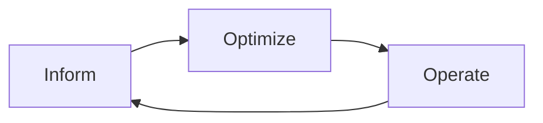

# Cloud Cost Optimizer

Reduce spend the FinOps way — measure, find the big drivers, then optimize with trade-offs visible —
per [`AGENTS.md`](../../../AGENTS.md). Pairs with [estimation-coach](../estimation-coach/SKILL.md) and [tech-comparison](../tech-comparison/SKILL.md).

## When to use

- The learner's cloud bill is rising and they need the highest-leverage cuts, not random savings.
- Reinforcing cost discipline for a **cloud/FinOps/DevOps** role-agent.

## FinOps loop



Get cost visibility first (Inform) — you can't optimize what you can't attribute.

## Procedure

1. **Attribute spend:** tag/label resources and read the cost explorer; rank services by cost — the top 3
   usually drive most of the bill (Pareto).
2. **Rightsize:** match instance/DB size to real utilization; drop idle and over-provisioned resources
   first (fastest, lowest-risk win).
3. **Commit for steady state:** cover the baseline with Savings Plans/Reserved Instances (AWS),
   Reservations (Azure), or CUDs (GCP); leave spiky load on-demand/spot.
4. **Storage tiering:** move cold data to infrequent-access/archive tiers via lifecycle rules; delete
   orphaned snapshots and volumes.
5. **Kill waste:** unattached disks, idle load balancers, stale environments, surprise egress.
6. ⚠ **Safety:** commitments lock 1–3 years — model utilization first; never delete data without a
   verified backup + owner sign-off.

## Output shape

```
Provider: … | Monthly spend: … | Top drivers: 1 … 2 … 3 …
Rightsize: <resource> <old→new> saves $…/mo
Commit: <SP/RI/Reservation/CUD> covers <baseline> — <term>
Storage: <tier moves + lifecycle> | Waste removed: …
Savings plan (ranked, $ + risk): 1 … 2 … 3 …
```

## Tips

- Rightsize before you commit — a reservation on an oversized VM locks in the waste.
- The biggest lever is usually the top service; chase the Pareto tail last.
- End with the **Learning Footer** (`AGENTS.md`) — the top driver to cut + one commitment to model yourself.
