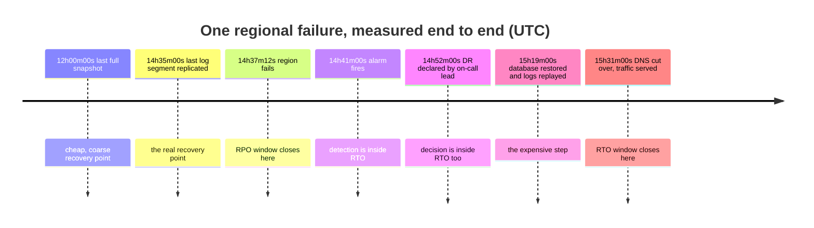

# Cloud DR Strategy Coach

Picking a DR rung is a **priced trade** between downtime, data loss and standing spend. This skill makes
that trade explicit, maps it to real cloud services, and then insists you measure the result from a timeline
rather than a hope — following the verify-before-you-teach rule in [`AGENTS.md`](../../../AGENTS.md).

## When to use

- You must choose a DR pattern for a specific cloud workload and defend the cost.
- Someone has promised an RTO/RPO and nobody has computed whether the architecture can deliver it.
- You need cross-region replication designed for a database/object store, not just switched on.
- You are planning a DR test/game day and want measured, not asserted, recovery numbers.
- Someone has proposed **multi-cloud DR** and you need the real trade-offs.
- **Don't use it for** the business-continuity groundwork — impact analysis, tiering, backup hygiene
  (3-2-1, immutability), failover runbooks and organisational readiness live in
  [disaster-recovery-planner](../disaster-recovery-planner/SKILL.md); this skill starts where the *cloud
  architecture* decision begins. Don't use it for routine HA within a region either — multi-AZ is
  availability design ([slo-designer](../slo-designer/SKILL.md)), not disaster recovery.

## First principles

**Two numbers, then everything else is engineering.** RPO = how much *data* you can lose (drives backup
frequency and replication mode). RTO = how long you can be *down* (drives automation and how much stack you
keep warm). Google Cloud's *Disaster recovery planning guide* (`cloud.google.com/architecture/dr-scenarios-planning-guide`,
last reviewed **2024-07-05**) defines both and starts from business impact analysis; Microsoft's
*What are Business Continuity, High Availability, and Disaster Recovery?* (Azure Reliability docs,
learn.microsoft.com) separates HA (survive a component failure) from DR (survive losing a region).

**The four rungs are an industry-standard ladder.** AWS's *Disaster Recovery of Workloads on AWS: Recovery
in the Cloud* whitepaper ("Disaster recovery options in the cloud") names exactly four: **backup & restore,
pilot light, warm standby, multi-site active/active**, and adds a rule worth memorising — *use only data
plane operations during failover*, because control planes have lower availability design goals than data
planes. Google's guide frames the same ladder as cold / warm / hot.

**Replication is not backup.** Both AWS and Google make this point explicitly: replication faithfully copies
your `DROP TABLE` and your ransomware. You need replication for *availability* and point-in-time backups for
*corruption*.

**RTO starts at failure, not at keyboard.** Detection and the decision to declare are inside the clock. This
is where most measured RTOs blow their target (see the worked example — 27.5% of it).



*Figure 1 — Timeline used for the arithmetic below. Everything between 14:37:12 and 15:31:00 counts toward RTO, including the 14m48s before anyone touched a keyboard.*

### The ladder, mapped to real services

| Rung | RTO | RPO | Standing cost | AWS | Azure | Google Cloud |
| --- | --- | --- | --- | --- | --- | --- |
| **Backup & restore** | hours–days | hours | ~storage only | AWS Backup, S3 cross-region replication, EBS/RDS snapshot copy + IaC (CloudFormation/CDK) | Azure Backup, GRS/RA-GRS storage, geo-restore + Bicep/ARM | Backup and DR Service, dual/multi-region Cloud Storage, snapshot copies + Terraform |
| **Pilot light** | 10s of min–hours | minutes | low | cross-Region read replica / Aurora Global Database, AMIs pre-baked, scale-out on declare | Azure SQL active geo-replication or Site Recovery, images pre-staged | Cloud SQL cross-region replica, instance templates ready |
| **Warm standby** | minutes | seconds–min | medium | full stack scaled down in region B + Route 53 health-checked failover | scaled-down stack + Azure Front Door / Traffic Manager | scaled-down stack + Cloud Load Balancing / Cloud DNS routing policies |
| **Multi-site active/active** | ~seconds | ~zero | highest | multi-Region active with Aurora Global / DynamoDB global tables | multi-region with Cosmos DB multi-region writes | multi-region with Spanner |

⚠ Service capabilities, replication modes and failover semantics change frequently — **verify each cell on
the current provider page** before you design against it. Names in this table are directionally correct as
of authoring, not a contract.

| Data store class | Cross-region mechanism | RPO you can honestly claim |
| --- | --- | --- |
| Object storage | asynchronous cross-region replication | minutes (per-object, no ordering guarantee) |
| Relational, async replica | log shipping / streaming replication | replication lag — **measure p95, don't quote the mean** |
| Relational, sync replica | synchronous commit | ~zero, but every write pays the inter-region round trip |
| Globally-distributed DB | multi-region writes with conflict handling | ~zero, at the price of consistency semantics you must understand |
| Queues / streams | often region-scoped | usually the **weakest link** — plan for in-flight message loss |

## Procedure

1. **Get RTO/RPO in writing from the business owner** per workload tier — one hour of downtime in currency
   or contractual penalty. Engineering preferences are not objectives.
2. **Draw the failure timeline you must survive** (Figure 1 shape): last recoverable point → failure →
   detect → declare → recover → verify → serve. You will compute against this, not against a diagram.
3. **Find the RPO floor first.** It is set by your slowest-replicating *stateful* component — usually a
   queue, a cache-of-record, or an object store with no ordering. The floor, not the average, is your RPO.
4. **Pick the rung** from the ladder table using the RTO you must hit, then check the cost model:
   `standing DR cost ≈ (replica compute × warm fraction) + full replicated storage + cross-region egress +
   the second control plane's operational toil`. Warm standby at 25–30% capacity is not 25–30% of the bill.
5. **Design failover on data-plane operations only.** Pre-create the region-B resources, pre-lower DNS TTLs,
   and prefer health-checked routing over a human editing DNS during an incident.
6. **Keep point-in-time backups in a separate account/subscription/project with separate credentials and
   immutability.** Replication does not protect you from deletion or ransomware
   ([disaster-recovery-planner](../disaster-recovery-planner/SKILL.md) has the 3-2-1 detail).
7. **Codify both regions in IaC** ([terraform-module-coach](../terraform-module-coach/SKILL.md)). A DR
   region built by hand cannot be rebuilt under time pressure — and drift between regions is the failure
   mode that only shows up on the day.
8. **Automate detection and, where you dare, declaration.** A documented auto-declare threshold routinely
   removes ten-plus minutes from RTO (proven below).
9. **Rehearse in three stages**: tabletop → timed restore drill (restore *and verify the data*) → controlled
   regional failover in a real window. Measure actual RTO/RPO each time
   ([oncall-runbook-coach](../oncall-runbook-coach/SKILL.md)).
10. **Recompute from the drill's timeline** and compare to target. Fix the largest segment, not the loudest
    one. Then close with the **Learning Footer**.

## Output shape

```
Workload: <name>   Tier: <0-3>   Primary: <cloud/region>   DR: <cloud/region>
Targets (signed off by <owner>, <date>): RTO <..>   RPO <..>   cost of 1h down: <..>

RPO floor set by: <component> — mechanism <..> · measured p95 lag <..> · in-flight loss <..>
Chosen rung: <backup&restore | pilot light | warm standby | active/active>
  because <RTO/RPO requirement>   ·   runner-up <rung> rejected because <cost | complexity | RPO>
Services: compute <..> · data <..> · traffic steering <..> · backup vault <separate account? y/n>

Cost model: replica compute <$/mo at X% capacity> + storage <$/mo> + egress <$/mo> + toil <eng-days/quarter>
            = <$/mo>  vs  expected annual loss avoided <$>

Measured from drill <date> (timeline attached):
  RPO = t_fail − t_last_durable_write = <..>        (design worst case: <cadence + p95 lag>)
  RTO = t_serving − t_fail            = <..>        target <..>  → <met | missed by ..>
     detect <..> + decide <..> + recover <..>   ← largest segment: <..>
Fix with the biggest payoff: <change> → predicted new RTO <..>
Next drill: <date>, type <tabletop | restore | full failover>
Next: <disaster-recovery-planner | oncall-runbook-coach | slo-designer>
Learning Footer
```

## Worked example — recompute RPO/RTO from the timeline, then buy the cheapest minute

**Setup.** Tier-1 order service, AWS `eu-west-1` primary / `eu-west-2` DR, warm standby at 30% capacity.
Full snapshot every 6h (00/06/12/18 UTC); transaction logs shipped cross-region every **5 minutes**;
measured p95 shipping lag 40s. Business targets: **RTO 60 min, RPO 15 min.**

Using the Figure 1 timeline:

| Quantity | Arithmetic | Result |
| --- | --- | --- |
| **RPO (actual)** | `14:37:12 − 14:35:00` (failure − last durable replicated write) | **2m12s** ✅ vs 15 min |
| RPO (design worst case) | 5m cadence + p95 lag 40s | **5m40s** ✅ still inside 15 min |
| Detect | `14:41:00 − 14:37:12` | 3m48s |
| Decide | `14:52:00 − 14:41:00` | 11m00s |
| Recover + verify + cut over | `15:31:00 − 14:52:00` | 39m00s |
| **RTO (actual)** | `15:31:00 − 14:37:12` = 3m48s + 11m00s + 39m00s | **53m48s** ✅ vs 60 min, margin **6m12s** |

Two lessons fall straight out of the arithmetic:

1. **Reporting only the recovery run (39m00s) understates the true RTO by 14m48s — 27.5% low.** If the
   target had been 45 minutes, the "39-minute" plan would have failed reality by nearly nine minutes while
   its dashboard showed green.
2. **The cheapest minute is bought before the keyboard.** 14m48s (27.5% of RTO) elapsed before recovery
   began. Adding an auto-declare rule — *"if the regional health check fails for 3 consecutive minutes,
   declare and start failover automatically"* — cuts the decide segment from 11m00s to ~2m00s:
   `3m48s + 2m00s + 39m00s =` **44m48s**, a 9-minute improvement for a config change and a rehearsal, versus
   paying to move from warm standby to active/active to shave the 39-minute recovery.

**Then attack the 39 minutes** with measurement, not intuition: if 26 of it is `14:53→15:19` database
restore + log replay, the lever is a continuously-replicating replica (pilot light → warm data tier), not
more application automation. **Do not** climb to active/active because it feels safer: the 6m12s margin says
the current rung meets the target, and the next rung roughly doubles standing spend while introducing
multi-region write semantics your application does not currently handle.

**Multi-cloud DR, honestly.** Running DR in a *second provider* sounds like the ultimate insurance and is
rarely the right buy: you pay data gravity and egress, you lose managed cross-region replication, your IaC
and IAM models fork, your team maintains two operational skill sets, and you design to the lowest common
denominator of both clouds. Multi-**region** in one cloud handles the overwhelming majority of real
disasters. Choose multi-cloud only for a concrete driver — regulatory requirement, contractual demand, or a
genuine provider-concentration risk you can articulate — and then keep it to the smallest possible surface
(e.g. backups replicated to a second provider's object store, not a whole standby stack).

## Tips

- **Compute RTO from failure, not from "when we started working."** Detection + decision is routinely a
  quarter of the total.
- The RPO you can claim is set by your **worst** replicating component — often a queue with in-flight
  messages nobody counted.
- Quote replication lag as **p95**, never the mean; DR happens on bad days, and bad days are the tail.
- Replication is not backup: it copies deletions and encryption-by-ransomware perfectly. Keep immutable
  point-in-time backups on separate credentials.
- Fail over using **data-plane** operations; control planes are exactly what degrades in a regional event.
- Lower DNS TTLs *before* the disaster; you cannot retroactively shorten a TTL already cached by clients.
- An untested rung is a slide, not a strategy. Timed restore drills are the only evidence that counts.
- Cost the rung honestly: warm standby at 30% capacity ≠ 30% of the bill once storage, egress and a second
  control plane's toil are counted ([cloud-cost-optimizer](../cloud-cost-optimizer/SKILL.md)).
- Related: [disaster-recovery-planner](../disaster-recovery-planner/SKILL.md),
  [oncall-runbook-coach](../oncall-runbook-coach/SKILL.md),
  [slo-designer](../slo-designer/SKILL.md),
  [capacity-planning-coach](../capacity-planning-coach/SKILL.md),
  [terraform-module-coach](../terraform-module-coach/SKILL.md),
  [aws-well-architected-review](../aws-well-architected-review/SKILL.md),
  [cloud-migration-planner](../cloud-migration-planner/SKILL.md),
  [ransomware-resilience-drill](../ransomware-resilience-drill/SKILL.md),
  [replication-topology-coach](../replication-topology-coach/SKILL.md).
  End with the **Learning Footer** (`AGENTS.md`).
