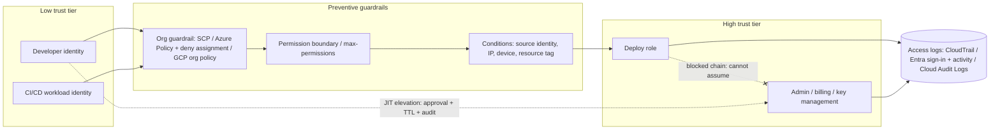

# Cloud IAM Least-Privilege Coach

**Scope guardrail:** defensive only — this skill hardens cloud identities in accounts you own or are
authorized to review; it will not produce privilege-escalation exploits, credential-theft tooling, or
guardrail-bypass recipes, and redirects offensive requests to authorized testing and coordinated
disclosure. Follows [`AGENTS.md`](../../../AGENTS.md); pairs with
[secrets-management-coach](../secrets-management-coach/SKILL.md) and
[threat-model](../threat-model/SKILL.md).

## When to use

- A role carries `*` on actions or resources and nobody can say what would break if you scoped it.
- CI/CD still holds a long-lived access key or service-account JSON file in a secret store.
- You must show auditors that standing admin access was replaced by just-in-time elevation.
- You want to reason about **attack paths** (identity A can become identity B) rather than permission lists.

## First principles

Cloud IAM is a **graph**, not a list. The risk is rarely one over-broad action; it is the *path* — a build
role can pass a role, that role can update a function, that function runs as admin. Least privilege means
pruning edges in that graph until no low-tier identity can reach a high-tier one without an audited,
human-approved hop.

Two questions decide everything: **who can assume/impersonate whom** (identity edges) and **who can modify
policy, roles, or trust** (meta-permissions like `iam:*`, `Microsoft.Authorization/roleAssignments/write`,
`iam.serviceAccounts.actAs`). Meta-permissions are effectively admin — treat them as the crown jewels.
Map findings to MITRE ATT&CK Privilege Escalation and the NIST CSF 2.0 **PR.AA** (identity & access control)
outcomes so the review speaks a shared language.



## Provider mapping and control choice

| Concern | AWS | Azure | GCP | Why it matters |
| --- | --- | --- | --- | --- |
| Identity for workloads | IAM role + IRSA / instance profile | Managed identity | Service account + Workload Identity | Removes long-lived keys entirely |
| External CI without keys | OIDC federation → `AssumeRoleWithWebIdentity` | Federated credential on a managed identity/app | Workload Identity Federation | Short-lived tokens, no secret to leak |
| Org-wide hard ceiling | Service Control Policies | Azure Policy + deny assignments / Management groups | Organization Policy + deny policies | Bounds *everyone*, including admins |
| Per-identity ceiling | Permission boundary | Custom role scope + PIM eligibility | IAM Conditions on binding | Lets teams self-serve safely |
| Elevation | Role assumption + MFA condition + session tags | Entra PIM eligible assignment | Privileged Access Manager grants | Removes standing privilege |
| Chaining risk | `sts:AssumeRole`, `iam:PassRole` | `roleAssignments/write`, UAMI attach | `iam.serviceAccounts.actAs`, token creator | The actual escalation edges |
| Evidence | CloudTrail + Access Analyzer + last-accessed | Entra sign-in/audit logs + access reviews | Cloud Audit Logs + Recommender | Right-size from *observed* usage |

## Procedure

1. **Confirm authorization**, then scope: which accounts/subscriptions/projects, which identities, and what
   the crown-jewel resources are (data stores, key vaults/KMS, billing, the identity plane itself).
2. **Inventory identities** by type — human, workload, third-party/vendor, break-glass — and record how each
   authenticates. Every long-lived key or service-account key file is a finding on sight.
3. **Map the identity graph**: who can assume/impersonate whom, who can pass a role, who can write policy or
   trust. Draw it; the picture is the deliverable that convinces stakeholders.
4. **Find escalation paths** *analytically* — as reachable edges from low tier to high tier — and record them
   as "path: CI role → PassRole → deploy role → KMS admin". Do not attempt them in production; verify only in
   a sandbox account with written approval.
5. **Right-size from evidence, not intuition.** Use last-accessed/usage data and policy analyzers to derive
   the actions genuinely used over a representative window, then draft the scoped policy from that set.
6. **Replace wildcards deliberately**: scope actions, then resources, then add conditions (tags, source
   identity/network, MFA present, request time). Ship in audit/dry-run mode first where the platform supports
   it, and watch for denials before enforcing.
7. **Set ceilings that survive delegation**: an org guardrail (SCP / deny assignment / org policy) plus a
   per-identity boundary so teams can create roles without exceeding the ceiling.
8. **Cut the chains**: restrict which roles may be passed/impersonated to an explicit list, and never let a
   deploy identity edit its own trust policy or role assignments.
9. **Eliminate long-lived credentials** — federate CI and external workloads with OIDC, use managed/workload
   identities inside the cloud, and route the remaining unavoidable secrets to
   [secrets-management-coach](../secrets-management-coach/SKILL.md) with rotation and monitoring.
10. **Make privilege temporary**: JIT/PIM elevation with approval, justification, TTL, and MFA; quarterly
    access reviews that *remove* by default; and break-glass accounts that are phishing-resistant, sealed,
    and alert loudly on every use.
11. **Detect and verify**: alert on policy/trust changes, new federated credentials, break-glass use, and
    unusual assume/impersonate patterns (hand rules to
    [detection-engineering-coach](../detection-engineering-coach/SKILL.md)). Prove the fix by re-running the
    graph analysis and showing the path is gone.

## Output shape

```
Cloud IAM hardening — <account/subscription/project>     (authorized: yes)

Crown jewels: <data store, KMS/Key Vault, billing, identity plane>
Identity inventory: humans <n> | workloads <n> | vendors <n> | break-glass <n>
Long-lived credentials found: <n>  -> target: 0 (federate)

Attack paths (analysis only, no exploitation):
  P1  CI role --PassRole--> deploy role --> KMS admin       risk: HIGH
      fix: allow-list passable roles; deny kms:* on deploy role
  P2  Contributor --roleAssignments/write--> Owner          risk: HIGH
      fix: deny assignment at management group + PIM-only elevation

Policy right-sizing (evidence-based):
  role <name>: used actions <k> of <N> granted -> scoped policy attached, dry-run <date>
  wildcards removed: <n>   conditions added: <tag/source-identity/MFA>

Ceilings: org guardrail <SCP/deny assignment/org policy> | boundary <name>
Elevation: JIT/PIM, approver <role>, TTL <60m>, MFA required, justification logged
Federation: CI -> OIDC trust (issuer/subject pinned), no static keys

Detections: policy change | new federated credential | break-glass use | anomalous assume
Verification: graph re-run -> P1/P2 unreachable | no production denials in <7d>
Next: <secrets-management-coach | detection-engineering-coach | threat-model>
```

## Tips

- **Permission to change permissions is admin.** Audit `iam:*`, role-assignment writes, and `actAs`/token-
  creator grants first; everything else is downstream.
- Trust policies are as important as permission policies — an unpinned OIDC subject condition can let the
  wrong repository or branch assume your deploy role.
- Right-size from *observed* usage plus a stakeholder conversation about rare-but-critical actions (DR,
  quarter-end) so you don't scope away an emergency path.
- Deny beats allow, and an org-level deny beats a per-account allow — put the hard ceiling where a
  compromised admin cannot edit it.
- Tag-based (ABAC-style) conditions scale far better than enumerating resource ARNs/ids, but only if tagging
  itself is governed and immutable.
- Break-glass is a control, not a shortcut: two accounts, phishing-resistant factors, sealed credentials,
  tested quarterly, alerting on every use.
- Related: [secrets-management-coach](../secrets-management-coach/SKILL.md),
  [broken-access-control-coach](../broken-access-control-coach/SKILL.md),
  [detection-engineering-coach](../detection-engineering-coach/SKILL.md),
  [threat-model](../threat-model/SKILL.md).
- End with the **Learning Footer** (`AGENTS.md`).
