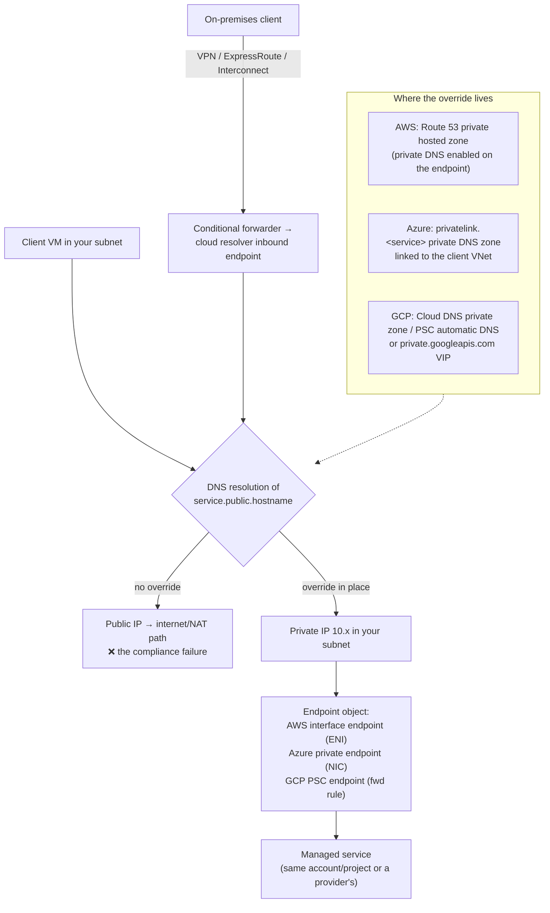

# Cloud Private Connectivity Coach

Three clouds, one pattern: a **private IP in your network that fronts a managed service**, plus a **DNS
override** that makes the public hostname resolve to it. Taught from first principles per
[`AGENTS.md`](../../../AGENTS.md) — because in practice the network is easy and DNS is where it breaks.

## When to use

- A compliance rule says traffic to a managed service must not traverse the public internet.
- A private endpoint exists but clients still resolve the public IP — the canonical failure.
- Designing hybrid access from on-premises over VPN/ExpressRoute/Interconnect to cloud PaaS.
- **Don't** reach for it to secure a *public* website; that is WAF, TLS, and authentication.

## First principles: an IP in your subnet plus a DNS lie

All three implementations do the same two things: place an interface/endpoint with an address from **your**
subnet in front of a service, and arrange for the service's public hostname to resolve to that address —
AWS PrivateLink (*AWS PrivateLink concepts*), Azure Private Link (*What is Azure Private Endpoint?* and
*Private Endpoint DNS configuration*), and Google Cloud Private Service Connect (*Private Service Connect
overview*). Keep the hostname; change the answer. That is why applications need no code changes.



| | AWS | Azure | Google Cloud |
| --- | --- | --- | --- |
| Primary mechanism | **Interface VPC endpoint** (PrivateLink, an ENI) | **Private Endpoint** (a NIC in your subnet) | **Private Service Connect endpoint** (a forwarding rule) |
| Cheap alternative for object/NoSQL storage | **Gateway endpoint** for S3 & DynamoDB — route-table based, **no hourly or data charge** | none — private endpoint or service endpoint | **Private Google Access** on the subnet (free) |
| "Backbone but still public IP" option | — | **Service endpoint** (subnet → service) | `private.googleapis.com` VIP `199.36.153.8/30` |
| DNS override | Route 53 private hosted zone auto-created when *private DNS* is enabled | `privatelink.<service>` private DNS zone **linked to the client VNet** | Cloud DNS private zone; PSC can create it automatically |
| Publish your own service | endpoint service behind an NLB/GWLB | Private Link Service behind a Standard LB | PSC service attachment behind an internal LB |
| Transitive by default? | endpoint is per-VPC (share via Route 53 rules) | endpoint is reachable across peering **if DNS is linked** | endpoint is regional; global access is a flag |
| Typical cost shape | per-AZ-hour + per-GB (gateway endpoints free) | per-hour + per-GB in/out | per-hour + per-GB |

| Failure symptom | Real cause | Fix |
| --- | --- | --- |
| `nslookup` returns a public IP from a VM | no private zone linked to *that* VNet/VPC | link the zone to the client network, not just the hub |
| Works in the hub, fails in a spoke | DNS zone linked to one VNet only | link the `privatelink.*` zone to every consuming VNet |
| Works in-cloud, fails from on-premises | on-prem resolver has no forwarder | conditional forwarder → inbound resolver endpoint |
| Resolves privately but connection times out | NSG/SG/firewall rule, or missing route | allow 443 from client subnet to the endpoint IP |
| Some clients private, some public | split-horizon partially applied; cached TTL | flush caches; verify the CNAME chain end to end |
| Endpoint works, service still refuses | public network access still enabled/required | disable public access on the resource, check its own ACL |

**Trade-off to say out loud:** an AWS **gateway endpoint** for S3 costs nothing and needs no DNS change, but
cannot be reached from on-premises over Direct Connect; an **interface endpoint** can, and bills per hour
and per GB. Choosing the interface endpoint "to be consistent" is a real, recurring waste of money.

## Procedure

1. **State the requirement precisely.** "No public internet" and "no public IP" are different rules — Azure
   service endpoints and Google's `private.googleapis.com` VIP satisfy the first, not the second.
2. **List every consumer:** in-VPC workloads, peered networks, other accounts/subscriptions/projects, and
   on-premises. Each one needs a resolution path, and each is where a design quietly fails.
3. **Pick the cheapest mechanism that satisfies the rule** using the table above — gateway endpoint or
   Private Google Access before a per-hour interface endpoint.
4. **Create the endpoint.**

   ```bash
   # AWS: free gateway endpoint for S3 (route-table based, no DNS change needed)
   aws ec2 create-vpc-endpoint --vpc-id vpc-0abc --service-name com.amazonaws.eu-west-1.s3 \
     --vpc-endpoint-type Gateway --route-table-ids rtb-0def

   # AWS: interface endpoint with private DNS (needed for on-prem reachability)
   aws ec2 create-vpc-endpoint --vpc-id vpc-0abc --vpc-endpoint-type Interface \
     --service-name com.amazonaws.eu-west-1.secretsmanager \
     --subnet-ids subnet-0a subnet-0b --security-group-ids sg-0ep --private-dns-enabled

   # Azure: private endpoint + DNS zone group (creates the A record for you)
   az network private-endpoint create -g rg-net -n pe-stlab --vnet-name vnet-spoke-a --subnet snet-pe \
     --private-connection-resource-id $(az storage account show -g rg-lab -n stlab001 --query id -o tsv) \
     --group-id blob --connection-name c1
   az network private-endpoint dns-zone-group create -g rg-net --endpoint-name pe-stlab \
     -n zg1 --private-dns-zone privatelink.blob.core.windows.net --zone-name blob

   # GCP: Private Google Access on a subnet (free) — no external IPs needed
   gcloud compute networks subnets update snet-app --region=europe-west1 --enable-private-ip-google-access
   ```

5. **Wire DNS deliberately.** Azure: link the `privatelink.<service>` zone to every consuming VNet. AWS:
   enable private DNS on the endpoint, and share resolution across VPCs with Route 53 Resolver rules.
   GCP: use PSC automatic DNS or a Cloud DNS private zone for `*.googleapis.com`.
6. **Extend to on-premises** with a conditional forwarder pointing at an inbound resolver (Route 53 Resolver
   inbound endpoint / Azure DNS Private Resolver / Cloud DNS inbound forwarding policy). Never copy A
   records into on-prem DNS by hand — endpoint IPs change.
7. **Close the public door** on the resource itself: `--public-network-access Disabled` (Azure), a bucket
   policy with `aws:SourceVpce` (AWS), VPC Service Controls (GCP). An endpoint that merely adds a path
   secures nothing.
8. **Verify from a real client**, not your laptop: `dig +short <service-host>` must return a private address
   and show the `privatelink`/PSC CNAME, then `curl -v https://<host>` to prove the TCP path.
9. **Document the resolution chain** in the design — hostname → CNAME → zone → private IP → endpoint →
   service. This is the artefact that survives the next incident.
10. **Cost-check:** count endpoints × AZs/zones × hourly rate + expected GB. Consolidating endpoints into a
    shared/hub network with cross-network DNS is usually cheaper than one per spoke.

## Output shape

```
Requirement: <no public internet | no public IP | on-prem must reach it too>
Cloud/service: <AWS S3 | Azure Blob | GCP API> | Consumers: <VPCs/VNets, accounts, on-prem>
Mechanism: <gateway endpoint (free) | interface endpoint | private endpoint | PSC endpoint | Private Google Access>
  Why this one: <cost / on-prem reachability / private IP required>
Endpoint: <id> → private IP <10.x.y.z> in subnet <...> | SG/NSG: allow 443 from <client subnet>
DNS chain: <host> → CNAME <privatelink host> → zone <zone name> → <10.x.y.z>
  Zone linked to: <every consuming VNet/VPC listed>
On-prem: conditional forwarder <domain> → inbound resolver <ip>  | <n/a>
Public door closed: <public network access disabled | policy condition aws:SourceVpce | VPC-SC perimeter>
Verified: dig from <client> → <private IP> ✓ · curl 200 ✓ · from on-prem → <result>
Cost: <n> endpoints × <n> zones × $<x>/h + $<y>/GB  (gateway endpoints: $0)
Next: <azure-vnet-hub-spoke-lab | gcp-vpc-networking-lab | aws-vpc-lab>
Learning Footer
```

## Worked example — the split-horizon chain that actually works (Azure Blob)

A VM in `vnet-spoke-a` must reach `stlab001.blob.core.windows.net` privately. Resolution must produce:

```text
stlab001.blob.core.windows.net
  → CNAME stlab001.privatelink.blob.core.windows.net       (public DNS returns this once a PE exists)
  → A     10.1.2.4                                          (from the linked private DNS zone)
```

```bash
az network private-dns zone create -g rg-net -n privatelink.blob.core.windows.net
az network private-dns link vnet create -g rg-net -z privatelink.blob.core.windows.net \
  -n link-spoke-a --virtual-network vnet-spoke-a --registration-enabled false
az storage account update -g rg-lab -n stlab001 --public-network-access Disabled
# Verify from the VM, not from your laptop:
#   dig +short stlab001.blob.core.windows.net   → stlab001.privatelink.blob.core.windows.net → 10.1.2.4
```

If the zone is linked only to the hub VNet, the spoke VM still gets the public A record — peering carries
packets, not DNS scope. Link the zone to **every** VNet with clients, or centralise resolution on an Azure
DNS Private Resolver in the hub and point the spokes' DNS servers at it. The identical mistake in AWS is
creating an interface endpoint without `--private-dns-enabled`; in GCP it is forgetting the Cloud DNS
private zone for `*.googleapis.com` while relying on `restricted.googleapis.com` (`199.36.153.4/30`).

## Tips

- Private connectivity is **90 % DNS**. If you debug anything first, debug resolution from the actual client.
- Adding an endpoint does not remove the public path — disable public access on the resource, or the audit
  finding stands.
- Endpoint IPs are not stable contracts; never hard-code them into on-prem zone files, use forwarders.
- Gateway endpoints (S3/DynamoDB) and Private Google Access are free — reach for them before per-hour
  interface endpoints, and note their on-premises limitation explicitly.
- Peering moves packets, not DNS scope: every consuming network needs its own zone link or resolver path.
- Pair with [azure-vnet-hub-spoke-lab](../azure-vnet-hub-spoke-lab/SKILL.md),
  [gcp-vpc-networking-lab](../gcp-vpc-networking-lab/SKILL.md),
  [aws-vpc-lab](../aws-vpc-lab/SKILL.md),
  [dns-coach](../dns-coach/SKILL.md),
  [cloud-iam-least-privilege-coach](../cloud-iam-least-privilege-coach/SKILL.md), and
  [threat-model](../threat-model/SKILL.md).
  End with the **Learning Footer** (`AGENTS.md`): one resolution chain to draw, one public door to close.
