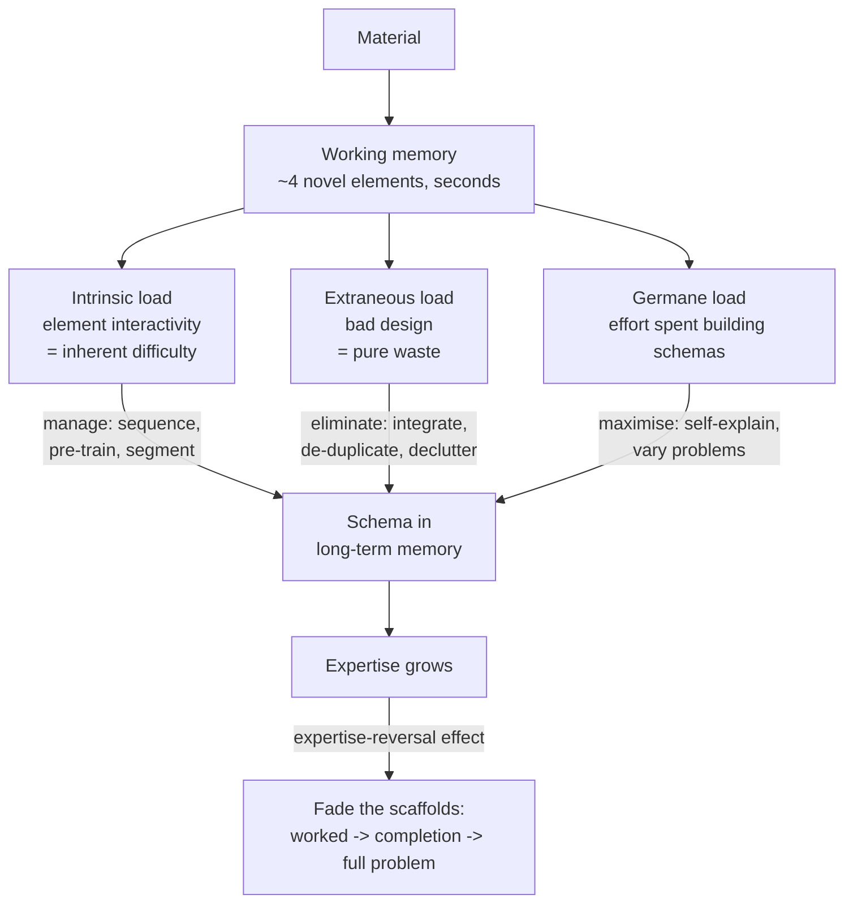

# Cognitive Load Coach

Confusion is usually a *design* defect, not a learner defect. This skill diagnoses which kind of load is
overflowing working memory and rebuilds the material to fit, in the visuals-first spirit of
[`AGENTS.md`](../../../AGENTS.md).

## When to use

- A tutorial, slide deck, or code walkthrough loses beginners even though every statement is correct.
- Learners can follow along but cannot reproduce the procedure alone — a scaffolding/fading problem.
- A diagram and its explanation live apart, or the narration repeats the on-screen text verbatim.
- Don't use it to make content *shorter* for its own sake — cutting intrinsic load means cutting the
  subject matter; use [concept-explainer](../concept-explainer/SKILL.md) to sequence it instead.

## First principles: three loads, one buffer

Sweller's Cognitive Load Theory (from 1988 onward; see Sweller, Ayres & Kalyuga, *Cognitive Load Theory*,
2011) rests on two facts: working memory holds only a few novel elements at once and decays in seconds,
while long-term memory is effectively unlimited. Learning = moving *schemas* into long-term memory. Any
material that spends the tiny buffer on something other than schema-building is wasting the buffer.



| Load type | Source | What to do | Symptom when it overflows |
| --- | --- | --- | --- |
| Intrinsic | element interactivity of the topic itself | sequence, pre-train vocabulary, segment | learner follows each step but loses the thread |
| Extraneous | presentation choices | remove — every unit is pure loss | "I got lost flipping between the figure and the text" |
| Germane | effort devoted to schema construction | protect and increase it | learner copies without understanding |

The classic extraneous-load effects, each with its fix:

| Effect | What goes wrong | Fix |
| --- | --- | --- |
| **Split attention** | diagram here, its explanation there; code in one pane, comments elsewhere | integrate text *into* the diagram; annotate the code inline |
| **Redundancy** | narration reads the slide word-for-word; a diagram fully re-described in prose | delete one channel — duplication costs, it doesn't reinforce |
| **Worked-example** | novices told to "just solve it" burn the buffer on search, not on schemas | study worked examples first, then completion problems |
| **Expertise reversal** | scaffolds that helped novices now *hurt* experts | fade support as competence rises |
| **Transient information** | video/animation vanishes before it can be processed | segment, add learner-paced controls, provide a static summary |
| **Modality** | all information forced through the visual channel | narrate the diagram instead of captioning it |

**Trade-off to say out loud:** removing *all* difficulty removes germane load too. The target is
"desirable difficulty" (Bjork) — hard *thinking about the content*, easy *finding the content*. See
[productive-failure-designer](../productive-failure-designer/SKILL.md) for the case where struggle first
is the point.

## Procedure

1. **Name the learner and the level** — novice, intermediate, or expert. Every judgement below is
   relative to prior knowledge; there is no context-free "simple".
2. **Count the interacting elements** a learner must hold at once to understand one step. Four or more
   novel, mutually-dependent elements = redesign, not rewording.
3. **Tag each load** in the existing material: mark spans as `I` (intrinsic), `E` (extraneous),
   `G` (germane).
4. **Delete every `E`** — merge split sources, cut narration that duplicates text, remove decorative
   images, drop unexplained jargon or pre-train it.
5. **Manage the `I`**: pre-train the vocabulary and components first, then segment into learner-paced
   chunks, then present the whole. This is the isolated-elements approach.
6. **Grow the `G`**: add self-explanation prompts and varied surface features — see
   [self-explanation-prompter](../self-explanation-prompter/SKILL.md).
7. **Build the fading ladder**: full worked example → completion problem (last steps removed) →
   backward-faded → independent problem. Advance only on demonstrated success.
8. **Re-test with one real learner**, measure where they stall, iterate, then close with the
   **Learning Footer**.

## Output shape

```
Learner: <novice | intermediate | expert>   Topic: <topic>
Element count: <n> interacting elements at the peak step  (>4 = redesign)
Load audit:
  Intrinsic  : <what is genuinely hard> -> manage by <pre-train | segment | isolate>
  Extraneous : <split-attention | redundancy | transient | search> -> DELETE via <fix>
  Germane    : <where schema-building happens> -> boost via <self-explanation | variability>
Redesign:
  1. Pre-train: <terms/components taught before the whole>
  2. Segment : <chunk 1> | <chunk 2> | <chunk 3>   (learner-paced)
  3. Integrate: <text moved into figure / comments moved inline>
Fading ladder: worked -> completion (<which steps removed>) -> independent
Check: <how you will detect the expertise-reversal point>
Next: <worked-example | self-explanation-prompter | lesson-plan-writer>
Learning Footer
```

## Worked example — redesigning a recursion lesson for novices

Original: one slide with a 30-line `mergeSort` implementation, a call-tree diagram on the *next* slide,
and a narrator reading the code aloud line by line.

| Element in the original | Load tag | Diagnosis | Redesign |
| --- | --- | --- | --- |
| 30 lines shown at once | I (inflated) | ~9 interacting elements: split, recurse, merge, indices, base case | segment into split / recurse / merge, three chunks |
| Code slide, tree on the next slide | E — split attention | learner must hold the tree in memory while reading code | overlay the call tree *on* the code, arrows to lines |
| Narration reads the code verbatim | E — redundancy | two channels, one message; costs, doesn't reinforce | narrate *why* each step exists; delete the read-aloud |
| Animated tree that auto-advances | E — transient info | frames vanish before processing | learner-paced steps + one static summary figure |
| "Now implement quicksort" straight after | E — search burden | novices problem-solve by weak search, not schema | worked example → completion problem → independent |
| No prompt to explain the base case | missing G | learner copies syntax without the invariant | add "why does this terminate?" self-explanation prompt |

Resulting fading ladder: (1) fully worked `mergeSort` with integrated annotations; (2) completion problem
— `merge()` body blanked; (3) backward fading — only the base case given; (4) independent `quickSort`.

## Tips

- Extraneous load is the only load you may cut freely; cutting intrinsic load cuts the curriculum.
- "Add a picture" is not a fix — an unintegrated picture *creates* split attention.
- Redundancy is counter-intuitive: saying the same thing twice in two channels measurably hurts novices.
- Expertise reversal is real — the scaffold you love will eventually slow your best learners down.
- Pair with [worked-example](../worked-example/SKILL.md) for example craft,
  [lesson-plan-writer](../lesson-plan-writer/SKILL.md) and
  [curriculum-designer](../curriculum-designer/SKILL.md) for sequencing,
  [visual-explainer](../visual-explainer/SKILL.md) for integrated figures, and
  [misconception-buster](../misconception-buster/SKILL.md) when the confusion is conceptual, not
  structural. End with the **Learning Footer** (`AGENTS.md`).
