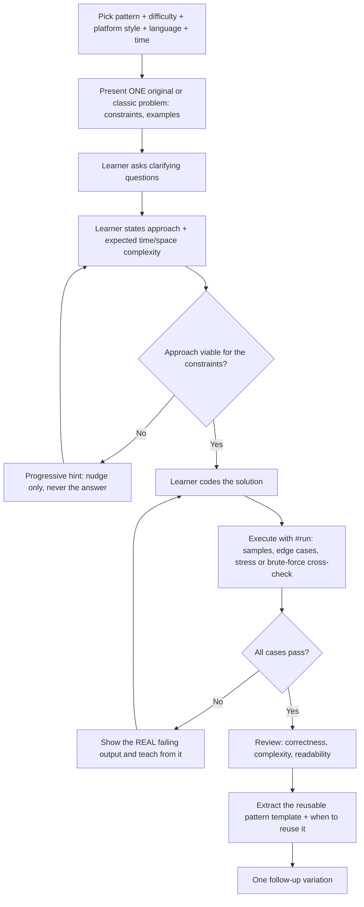

# Competitive Programming Drill

One rep of the CP loop — **pick a pattern → solve → run it for real → extract the reusable template** —
following [`AGENTS.md`](../../../AGENTS.md). The goal is *pattern mastery*, not one more solved problem.

## When to use

- The learner is grinding LeetCode / CodeChef / HackerRank / Codeforces and wants deliberate practice on
  a **specific pattern** instead of random problems.
- A solution "works on the sample" and they want it executed against edge and stress cases.
- They can solve a problem but can't yet *recognize* which pattern a new problem wants — pair with
  [dsa-patterns-coach](../dsa-patterns-coach/SKILL.md).

## The loop



## Pattern → signal → complexity

| Pattern | Signal that triggers it | Typical complexity |
| --- | --- | --- |
| Two pointers | Sorted array/string, pair or triplet sum, palindrome, partitioning in place | O(n) time, O(1) space |
| Sliding window | "Longest / shortest / count of subarray or substring satisfying …", contiguous | O(n) time, O(k) space |
| Binary search | Sorted (or monotonic) data, "find first/last position", search space is ordered | O(log n) time |
| Binary search on answer | "Minimize the maximum" / "maximize the minimum", feasibility check `can(x)` is monotonic | O(n log(range)) |
| Heap / priority queue | Top-K, "k largest/smallest", repeatedly pull the current best, scheduling | O(n log k) |
| Greedy | Local optimum provably global — sort by deadline/end-time/ratio, exchange argument holds | O(n log n) |
| Dynamic programming | Overlapping subproblems + optimal substructure; "count ways / min cost / max value" | O(states × transitions) |
| Graphs (BFS / DFS) | Nodes and edges, shortest path in an **unweighted** graph, connectivity, grid traversal | O(V + E) |
| Backtracking | Enumerate all permutations/combinations/subsets/placements with pruning | O(branch^depth) |
| Union-find (DSU) | Dynamic connectivity, merging groups, cycle detection in an undirected graph, Kruskal | ~O(α(n)) per op |
| Trie | Many strings sharing prefixes, prefix/autocomplete queries, XOR-max on bits | O(len) per op |
| Bit manipulation / bitmask | n ≤ ~20 subsets, parity/XOR tricks, "state as a set of flags" | O(2^n × n) for bitmask DP |
| Math / number theory | Primes, gcd/lcm, modular arithmetic, combinatorics, huge `n` with a closed form | O(√n) or O(log n) |

## Procedure

1. **Set the rep.** Confirm: **pattern** (from the table above), **difficulty**, **platform style**
   (LeetCode-style function signature · CodeChef/Codeforces-style stdin+stdout with multiple test cases ·
   HackerRank-style stub), **language**, and a **time budget** (20–40 min). If the learner is unsure which
   pattern to train, route to [dsa-patterns-coach](../dsa-patterns-coach/SKILL.md) first.
2. **Present ONE problem** — original or a well-known classic, written in your own words. Include: story,
   input/output format, **explicit constraints** (n range, value range, time limit), and 2 worked examples.
   No solution, no hints yet. State which platform the *style* imitates and link out for more reps.
3. **Invite clarifying questions** (input size, value ranges, duplicates, negative numbers, memory limit,
   multiple test cases per file). Answer only what is asked — that skill matters in contests too.
4. **Demand a plan before code.** The learner states the approach **and** expected time/space complexity,
   then sanity-checks it against the constraints (e.g., "n ≤ 2·10⁵ so O(n²) is ~4·10¹⁰ — too slow").
   Start the timer.
5. **Progressive hints on request only** — three levels: (a) restate the *signal* in the problem,
   (b) name the pattern or the invariant, (c) sketch the loop skeleton. Never reveal the full solution.
6. **Learner codes it.** They drive; you do not write the solution for them.
7. **Execute it for real with `#run` (`learningos_runcode`)** — this step is mandatory, not optional:
   - run the provided samples first;
   - then run the **edge cases**: empty/single element, all equal, all negative, max `n`, max value
     (overflow probe), duplicates, already-sorted and reverse-sorted, disconnected graph, k = 1 and k = n;
   - for optimization/counting problems, **stress-test**: run a tiny random generator plus a brute-force
     reference and diff the outputs until they disagree, then print the smallest failing input;
   - for performance, run the worst-case size and report the actual wall time vs. the stated limit.
   Show the **real output** — never describe what you "expect" it to print.
8. **Review from that output.** Correctness, the exact failing case and *why* it failed, off-by-one and
   overflow risks, readability. Verify the achieved complexity with
   [complexity-analyzer](../complexity-analyzer/SKILL.md).
9. **Extract the pattern template.** Distill the solution into a reusable skeleton (the loop shape, the
   invariant, the pointer/state updates) and state **when to reuse it** and **when it breaks**. This is the
   part that transfers to the next problem.
10. **Set one follow-up variation** that keeps the pattern but changes one axis (add duplicates, make it
    circular, ask for the count instead of the max, raise the constraint by 10×) — plus where to find
    similar reps: [LeetCode](https://leetcode.com/problemset/), [Codeforces](https://codeforces.com/problemset),
    [CodeChef](https://www.codechef.com/practice), [HackerRank](https://www.hackerrank.com/domains/algorithms).

## Output shape

```
Drill — <pattern> · <difficulty> · <platform style> · <language> · <time budget>

Problem: <original title>
  Story: <2-4 lines>
  Input / Output format: <...>
  Constraints: n <= <...>, |a[i]| <= <...>, time limit <...>
  Example 1: in -> out (why)
  Example 2: in -> out (why)

Clarifying Qs -> answers: <...>
Learner's plan: <approach> | claimed O(<time>) / O(<space>)
Constraint check: <n^2 = ... ops -> fits / too slow>
Hints given: 1) signal  2) pattern name  3) loop skeleton

--- #run execution ---
Samples:    <PASS/FAIL + real output>
Edge cases: <case -> real output -> PASS/FAIL>
Stress vs brute force: <smallest failing input, or "no mismatch in N trials">
Worst case timing: <actual ms vs limit>

--- Review ---
Correctness: <...>   Root cause of failures: <...>
Complexity: O(<time>) time / O(<space>) space  (verified)
Style / bugs: <overflow, off-by-one, unnecessary allocation>

Pattern template:
  <reusable skeleton in pseudocode>
  Invariant: <what stays true>
  Reuse when: <signal>   Breaks when: <counter-signal>

Follow-up variation: <one twist>   Practice more: <platform link>
```

## Tips

- One pattern per session. Ten random problems teach less than three problems on the same pattern
  followed by naming the template out loud.
- Always pressure-test the plan against the constraints **before** coding — most CP failures are a correct
  algorithm that is one complexity class too slow.
- `#run` is the teacher, not you: let the real stderr, wrong answer, or timing be the feedback. A stress
  test against a brute force finds bugs that reading the code never will.
- Keep a personal "wrong answer log": the pattern, the bug class, the fix. Re-read it before contests with
  [contest-prep-coach](../contest-prep-coach/SKILL.md).
- Use **original or well-known classic** problems only — never reproduce proprietary or paywalled problem
  statements from LeetCode, CodeChef, HackerRank, or Codeforces; link out to those platforms to practice
  instead.
- Go deeper with [dynamic-programming-coach](../dynamic-programming-coach/SKILL.md) and
  [graph-algorithms-coach](../graph-algorithms-coach/SKILL.md); for interview-style pacing use
  [coding-interview-drill](../coding-interview-drill/SKILL.md).
  End with the **Learning Footer** (`AGENTS.md`).
