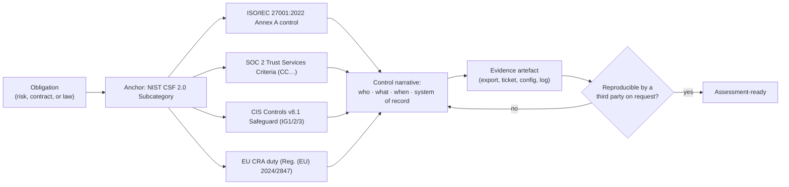

# Compliance Control Mapping Coach

One control, many vocabularies: anchor once, crosswalk deliberately, and produce **evidence** rather
than prose — applying the source-discipline rule in [`AGENTS.md`](../../../AGENTS.md). A mapping is a
claim about equivalence, so every row must name the framework identifier it came from.

## When to use

- The same control is being re-documented for ISO 27001, SOC 2, CIS, and a customer questionnaire.
- An auditor asked "show me the evidence" and the team only has a policy PDF.
- A product must reason about EU Cyber Resilience Act duties alongside existing certifications.
- **Don't use it for** legal advice, certification decisions, or asserting that a mapping is
  "audit-approved" — mappings are *proposals* your assessor confirms.

## First principles: anchor, crosswalk, evidence

Frameworks differ in **unit of measurement**, not usually in intent. Anchor on NIST CSF 2.0 (February
2024), whose six Functions — **GOVERN, IDENTIFY, PROTECT, DETECT, RESPOND, RECOVER** — decompose into
Categories and Subcategories, and which NIST publishes with official Informative References. Then
crosswalk outward.



| Framework | Current edition / primary source | Unit | Structure you must cite |
| --- | --- | --- | --- |
| NIST CSF 2.0 | NIST, February 2024 | Subcategory | 6 Functions → Categories → Subcategories (e.g. `PR.AA-03`) |
| ISO/IEC 27001:2022 | ISO/IEC, 2022 (+ Amd 1:2024) | Annex A control | 93 controls in 4 themes: Organizational, People, Physical, Technological |
| SOC 2 | AICPA Trust Services Criteria (2017, rev. 2022) | Criterion | Security (Common Criteria CC1–CC9) + Availability, Processing Integrity, Confidentiality, Privacy |
| CIS Controls | CIS v8.1, June 2024 | Safeguard | 18 Controls → Safeguards, tiered by Implementation Group IG1/IG2/IG3 |
| EU CRA | Regulation (EU) 2024/2847 | Essential requirement | Annex I requirements + vulnerability-handling duties; reporting from **11 Sep 2026**, full application **11 Dec 2027** |
| NIST SSDF | SP 800-218 v1.1, February 2022 | Practice/Task | Groups PO, PS, PW, RV — the software-development complement |

**Trade-off to say out loud:** a crosswalk is *many-to-many*. One CSF Subcategory may need three Annex A
controls, and one SOC 2 criterion may be satisfied by a control your CSF profile scores as partial.
Never claim "ISO 27001 A.8.5 == CC6.1"; claim "A.8.5 **contributes evidence toward** CC6.1", and let the
auditor draw the conclusion. Verify identifiers against the published standard before you assert them —
if you cannot open the source, state the check instead of guessing the number.

## Procedure

1. **State the obligation in one sentence** with a scope boundary ("MFA is enforced for all
   administrative access to production AWS accounts").
2. **Anchor to CSF 2.0** — pick the Function and Subcategory that describes the *outcome*, not the tool.
3. **Crosswalk outward** to each target framework, quoting the identifier **and** its published title.
   Where NIST or CIS publish an official mapping, cite that mapping rather than inventing one.
4. **Classify the match**: `equivalent` · `partial` · `broader` · `narrower` · `no-mapping`. A blank cell
   is information; a forced mapping is a future audit finding.
5. **Write the control narrative**: owner, trigger, frequency, system of record, and the exception path.
6. **Name the evidence artefact** and how it is produced — a config export, an IdP report, a change
   ticket, a pipeline log. Prefer machine-generated evidence over screenshots.
7. **Set the test**: population, sample, period, and the pass criterion the assessor will apply.
8. **Log gaps as risks** with an owner and a date; unmapped ≠ unmanaged only if it is *tracked*.
9. **Store the mapping as data**, not prose, so it can be diffed:

   ```bash
   pip install pandas
   python -c "import pandas as pd; d=pd.read_csv('controls.csv'); print(d.groupby(['framework','match']).size())"
   ```

10. Close with the **Learning Footer**.

## Output shape

```
Obligation: <one sentence, with scope boundary>
Anchor:     NIST CSF 2.0 <FUNCTION>.<Category>-<nn>  — "<published subcategory title>"
Crosswalk:
  ISO/IEC 27001:2022  A.<n>.<n> "<title>"        match=<equivalent|partial|broader|narrower|none>
  SOC 2 TSC           CC<n>.<n> "<criterion>"    match=<…>
  CIS Controls v8.1   <n>.<n>  (IG<1|2|3>)       match=<…>
  EU CRA              <Annex I / Art. <n> duty>  match=<…>   applies-from=<date>
Narrative: owner=<role> · trigger=<event/schedule> · frequency=<…> · system of record=<…> · exceptions=<path>
Evidence:  artefact=<export|ticket|log|config> · produced by=<automation> · retention=<period>
Test:      population=<…> · sample=<n> · period=<…> · pass criterion=<…>
Gaps:      <framework id> — <gap> — owner=<…> — due=<date>
Confidence: <high|medium|low> — <which identifiers were verified against the published standard>
Next: [security-hardening-checklist] · [secure-sdlc-maturity-coach] · [threat-model]
Learning Footer
```

## Worked example — MFA on administrative access

| Field | Value |
| --- | --- |
| Obligation | MFA enforced for all human administrative access to production cloud accounts |
| Anchor (CSF 2.0) | `PR.AA-03` — authentication of identities is performed and the risk is managed |
| ISO/IEC 27001:2022 | A.5.17 Authentication information · A.8.5 Secure authentication — **partial** each, **equivalent** combined |
| SOC 2 TSC | CC6.1 (logical access) with CC6.6 for external access — **partial**; CC6.1 is broader |
| CIS Controls v8.1 | Safeguard 6.5 "Require MFA for administrative access" (**IG1**) — **equivalent** |
| EU CRA | Annex I secure-by-default and access-control expectations — **broader**, product-scope only |
| Narrative | IdP conditional-access policy `admin-mfa` requires a phishing-resistant factor; owner = IAM lead; reviewed quarterly; exceptions via CAB ticket, max 30 days |
| Evidence | Weekly automated IdP export of admin accounts + enforced-factor type, retained 12 months |
| Test | Population = all accounts in `prod-admins`; sample = 100 %; period = FY; pass = 0 accounts without a phishing-resistant factor |

The CIS mapping is `equivalent` because the safeguard states the same testable outcome; SOC 2 is
`partial` because CC6.1 also covers provisioning and de-provisioning, which this control does not
address. Recording *why* a match is partial is what makes the crosswalk survive an assessor's challenge.

## Tips

- Anchor once and crosswalk outward — maintaining N independent control sets guarantees N drifts.
- Prefer **official** crosswalks (NIST Informative References, CIS mappings) over blog-post tables, and
  date every source you cite (`AGENTS.md` §2).
- Evidence beats policy: an auditor tests the artefact, not the intent. Automate the export.
- `no-mapping` is a legitimate, valuable cell — record it as a tracked risk with an owner.
- Frameworks version: ISO 27001:2022 renumbered the 2013 Annex A, and CIS v8.1 re-tiered safeguards.
  Never mix editions in one table without labelling them.
- CRA dates are staged — reporting obligations start **11 Sep 2026**, full application **11 Dec 2027**;
  confirm against the Official Journal text before committing to a plan.
- Pair with [security-hardening-checklist](../security-hardening-checklist/SKILL.md),
  [secure-sdlc-maturity-coach](../secure-sdlc-maturity-coach/SKILL.md),
  [supply-chain-security-coach](../supply-chain-security-coach/SKILL.md),
  [zero-trust-architecture-coach](../zero-trust-architecture-coach/SKILL.md),
  [security-logging-audit-coach](../security-logging-audit-coach/SKILL.md), and
  [threat-model](../threat-model/SKILL.md). End with the **Learning Footer** (`AGENTS.md`).
